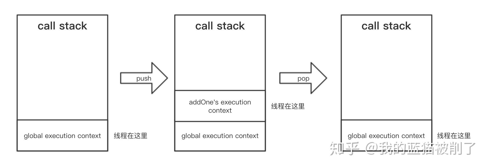

# 理解js执行上下文的工作流程

[原文链接](https://link.zhihu.com/?target=https%3A//github.com/JS-Hao/blog/issues/7)，欢迎关注我的博客

我相信很多前端初学者一开始都会被执行上下文这个概念弄晕，或者说似懂非懂。对于工作两年的我来说，说来实在惭愧，虽然知道它大概是什么，但总觉得没有一个更为清晰的认识（无法把它的工作过程描述清楚），因此最近特意温习了一遍，写下了这篇文章

### 执行上下文

要说清它的大体工作流程，需要提前说明三个基本概念，分别是`thread of exection(线程)`、`variable envirnoment(变量环境)`、`call Stack(调用栈)`，这些概念我们或多或少接触过，接下来我会通过一段示例代码，和一系列图片，进一步解释这三个概念在执行上下文的运作流程。

### 一段代码

```js
const num = 2;

function addOne(input) {
  const output = input + 1;
  return output;
}

const result = addOne(2);
```

### 这段代码做了什么

在运行上面这些代码前，js 引擎做的第一件是就是创建一个`global execution context`，也就是全局执行上下文：


先看图中的黑色箭头，它表示线程`thread`的执行顺序，众所周知 js 是单线程的，它会一行行、从上往下去执行代码；而右边的`global memory`，它用于存储当前上下文中的数据，由于线程目前处于全局上下文环境，故加了个`global`的前缀。

在这段代码中，第一行我们声明了一个名为`num`的不可变变量，并赋值为`4`, 因此`global memory`中就会分配内存，存储这个变量：


接着继续，当线程执行到第二行时，问题就来了：我们创建了一个`addOne`的变量，并把一个函数赋值于它，那在`global memory`里，到底存的是个啥？为了解答这个问题，我特意打印了一下：

```js
function addOne(input) {
  const output = input + 1;
  return output;
}
console.log(addOne);
```


看，我们竟然把函数里的内容完完整整打印出来了，很明显，它存的是一个函数内部的“文本信息”。

其实很容易理解，当执行第二行的时候，该函数并没有被调用，因此线程不会立刻解析里面的内容，而是把它内部的信息以“文本内容”的形式保存下来，当需要执行的时候，才去解析变量里的函数内容，这也很好地解析了为什么函数内的异常仅会在函数被调用时才抛出来。

因此这时`global execution context`长这样：


由于`addOne`里保存的是函数内容，目前对于线程而言它是未知的，因此我们这里特意用一个带有输入输出箭头的函数图标，代表它是一个未被解析的函数。

我们继续执行第三步：还是创建了一个变量`result`，但此时它被赋予`undefined`，因为线程暂时无法从`addOne`这个函数里获知它的返回值。


由于`addOne`函数被调用了，线程会从刚刚保存的`addOne`变量中取出内容，去解析、执行它。这时 js 就创建了一个新的执行上下文——`local execution context`，即当前的执行上下文，这是一个船新的上下文，因此我特意用一个新图片去描述它：


首先这个`memory`我加了个`local`前缀，表面当前存储的都是此上下文中的变量数据。无论是上述的`global memory`，亦或是现在、或未来的`local memory`，我们可以用一个更为专业的术语`variable envirnoment`去描述这种存储环境。

此外，这个黑箭头我特意画了个拐角，意味它是从全局上下文进来的，`local memory`首先会分配内存给变量`input`，它在调用时就被`2`赋值了，紧接着又创建了一个`output`标签并把计算结果`3`赋值给它。最后，当线程遇到离开上下文的标识——`return`，便离开上下文，并把`ouput`的结果一并返回出去。

此时，这个上下文就没用了（被执行完了），于是乎垃圾回收便盯上了它，选择一个恰当的时机把里面的`local memory`删光光。

这时候有同学会问道：你这个只是普通场景，那闭包怎么解释呢？

其实闭包是个比较大的话题，这里也可以简单描述下：**当`return`的是一个函数的话，它返回的不仅是函数本身，还会把`local memory`中被引用的变量作为此函数的附加属性一并返回出去**，这就好比印鱼喜欢吸附在鲨鱼身上一般，鳝鱼无论去哪都带着它，因此，无论这个函数在哪里被调用，它都能在它本身附带的`local memory`中找到那个变量。如果你把返回的函数`console.log`出来，也是能够找到它的，这里就不详说，关于闭包的更多概念（包括在函数式编程中的使用），有兴趣的童鞋可以看看这篇文章：[Partial & Curry - 函数式编程](https://link.zhihu.com/?target=https%3A//juejin.im/post/5cb841f7e51d456e5e035f23)

go on，回到了`global execution context`，`result`不再孤零零地`undefined`，而是拿到了可爱的`3`:


到这里，我们的线程就完成了所有工作，可以歇息了，等等.....好像漏了什么没讲.....对，就是`Call Stack`！

刚刚我们全篇在讲解`thread of exection`多么努力地一行行解析执行代码，`variable envirnoment`多么勤快地存储变量，那`call stack`干了什么？是在偷懒吗？

其实并不是，`call stack`起到了非常关键的作用：有了它，线程随时可以知道自己目前处于哪个上下文。

试想一下，我们在写代码的过程中往往喜欢在各种函数内穿插着各种子函数，比如递归，因此勤劳的线程就得不断地进入上下文、退出上下文、再进入、再进入、再退出、再进入，久而久之线程根本就不知道自己处于哪个上下文中，也不知道应该在哪个`memory`中取数据，全都乱套了，因此必须通过一种方式去跟踪、记录目前线程所处的环境。

而`call stack`就是一种数据结构，用于“存储”上下文，通过不断推入`push`、推出`pop`上下文的方式，跟踪线程目前所处的环境——**线程无需刻意记住自己身处何方，只要永远处于最顶层执行上下文，就是当前函数执行的正确位置**

程序一开始运行的时候，`call stack`先会`push`个`global execution context`:


接着我们在上述代码第三行调用了`addOne`，`call stack`立刻将`addOne`的上下文`push`进去，待执行到`return`标识后，再`pop`出来：




同样的，即使在复杂的情况，只要遵循`push`、`pop`以及时刻处于最顶层上下文的原则，线程就可以一直保持在正确的位置上：


值得一提的是，`call stack`层数是有上限的，因此稍加不注意，你写的递归可能会造成`栈溢出`了。

### 总结

简单来说，上下文就是个可以用于执行代码的环境，与它相关的有三个重要的概念：

- **thread of exection(执行线程)** 它的主要职责是，从上到下，一行一行地解析和执行代码，不会同时多处执行，也就是我们常挂在嘴边的“js 是单线程的啦”
- **variable envirnoment(变量环境)** 活跃的用于存储数据的内存
- **call stack(调用栈)** 一种用于存储上下文，跟踪当前线程所属的上下文位置的数据结构

发布于 2019-07-13