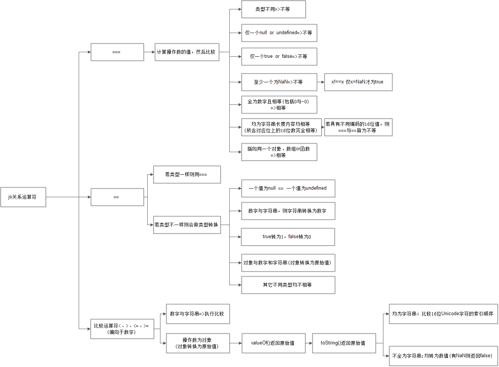

# 1. JS类型
## 原始类型
在 JS 中，存在着 7 种原始类型，分别是：

- `Boolean`
- `Null`
- `Undefined`
- `Number`
- `String`
- `Symbol`
- `BigInt`

原始类型存储的是值，没有函数可以调用。

那么有个问题，为什么`'1'.toString()`是正确的呢？

原因在于在这种情况下，`'1'`已经被强转成了`String`类型。

> 引用数据类型: 对象Object（包含普通对象-Object，数组对象-Array，正则对象-RegExp，日期对象-Date，数学函数-Math，函数对象-Function）

```js
function test(person) {
  person.age = 26
  person = {
    name: 'hzj',
    age: 18
  }
  return person
}
const p1 = {
  name: 'fyq',
  age: 19
}
const p2 = test(p1)
console.log(p1) // -> ?
console.log(p2) // -> ?
```

结果:

```
p1：{name: “fyq”, age: 26}
p2：{name: “hzj”, age: 18}
```

> 原因: 在函数传参的时候传递的是对象在堆中的内存地址值，test函数中的实参person是p1对象的内存地址，通过调用person.age = 26确实改变了p1的值，但随后person变成了另一块内存空间的地址，并且在最后将这另外一份内存空间的地址返回，赋给了p2。

### 对象类型

对象类型和原始类型不同的是，原始类型存储的是值，对象类型存储的是地址（指针）。

当你创建了一个对象类型的时候，计算机会在内存中帮我们开辟一个空间来存放值，但是我们需要找到这个空间，这个空间会拥有一个地址（指针）。

### 正确判断 null

```js
Object.prototype.toString.call(null) // "[object Null]" 
```

### typeof vs instanceof

`typeof` 对于原始类型来说，除了 `null` 都可以显示正确的类型

```js
typeof 1 // 'number'
typeof '1' // 'string'
typeof undefined // 'undefined'
typeof true // 'boolean'
typeof Symbol() // 'symbol'
```

`typeof` 对于对象来说，除了函数都会显示 `object`，所以说 `typeof` 并不能准确判断变量到底是什么类型.

```js
typeof [] // 'object'
typeof {} // 'object'
typeof console.log // 'function'
```

如果我们想判断一个对象的正确类型，这时候可以考虑使用 `instanceof`，因为内部机制是通过原型链来判断的。

```js
const Person = function() {}
const p1 = new Person()
p1 instanceof Person // true

var str = 'hello world'
str instanceof String // false

var str1 = new String('hello world')
str1 instanceof String // true
```

对于原始类型来说，你想直接通过 `instanceof` 来判断类型是不行的，当然我们还是有办法让 `instanceof` 判断原始类型的

```js
class PrimitiveString {
  static [Symbol.hasInstance](x) {
    return typeof x === 'string'
  }
}
console.log('hello world' instanceof PrimitiveString) // true
```

### 类型转换

在` js `中，只有三种类型转换

- 转换为布尔值
- 转换为数字
- 转换为字符串

### 转Boolean

在条件判断时，除了 `undefined`， `null`， `false`， `NaN`， `''`， `0`， `-0`，其他所有值都转为 `true`，包括所有对象。

### 对象转原始类型

一般非基础类型进行转换时会先调用 valueOf，如果 valueOf 无法返回基本类型值，就会调用 toString

对象在转换类型的时候，会调用内置的 `[[ToPrimitive]]` 函数，对于该函数来说，算法逻辑一般来说如下：

- 先检测该对象中是否存在 `valueOf` 方法，如果有并返回了原始类型，那么就使用该值进行强制类型转换；
- 如果 `valueOf` 没有返回原始类型，那么就使用 `toString` 方法的返回值；
- 如果 `vauleOf` 和 `toString` 两个方法都不返回基本类型值，便会触发一个 `TypeError` 的错误。

也可以重写 `Symbol.toPrimitive` ，该方法在转原始类型时调用优先级最高。

```js
let a = {
  valueOf() {
    return 0
  },
  toString() {
    return '1'
  },
  [Symbol.toPrimitive]() {
    return 2
  }
}
1 + a // => 3
```

### 四则运算符

加法运算符不同于其他几个运算符，它有以下几个特点：

- 运算中其中一方为字符串，那么就会把另一方也转换为字符串。
- 如果一方不是字符串或者数字，那么会将它转换为数字或者字符串

```js
1 + '1' // '11'
true + true // 2
4 + [1,2,3] // "41,2,3"
```

对于除了加法的运算符来说，只要其中一方是数字，那么另一方就会被转为数字

```js
4 * '3' // 12
4 * [] // 0
4 * [1, 2] // NaN
```

### 比较运算符

- 如果是对象，就通过 `toPrimitive` 转换对象
- 如果是字符串，就通过 `unicode` 字符索引来比较

```js
let a = {
  valueOf() {
    return 0
  },
  toString() {
    return '1'
  }
}
a > -1 // true
```

### == VS ===

对于 `==` 来说，如果对比双方的类型**不一样**的话，就会进行**类型转换**.

假如我们需要对比 `x` 和 `y` 是否相同，就会进行如下判断流程：

1. 首先会判断两者类型是否**相同**。相同的话就是比大小了
2. 类型不相同的话，那么就会进行类型转换
3. 会先判断是否在对比 `null` 和 `undefined`，是的话就会返回 `true`
4. 判断两者类型是否为 `string` 和 `number`，是的话就会将字符串转换为 `number`
5. 判断其中一方是否为 `boolean`，是的话就会把 `boolean` 转为 `number` 再进行判断
6. 判断其中一方是否为 `object` 且另一方为 `string`、`number` 或者 `symbol`，是的话就会把 `object` 转为原始类型再进行判断

对于 `===` 来说，就是判断两者类型和值是否相同

[] == ![] 为何是 true？

首先看右边，! 符号会将后面的变量强转为 boolean 值，由于 [] 转换为 boolean 是 true，故右边为 false，然后依照上方的第 5 条，将 false 转换为数字 0。

然后看左边，满足第六条的条件，调用 valueOf，由于空数组调用 valueOf 是转化为 0 ，故返回值是 true。

### 有图有真相



[参考](https://blog.csdn.net/tt_twilight/article/details/78043078)

## 一些面试题

### 0.1 + 0.2 === 0.3 嘛？为什么？

在两数相加时，会先转换成二进制，0.1 和 0.2 转换成二进制的时候尾数会发生无限循环，然后进行对阶运算，JS 引擎对二进制进行截断，所以造成精度丢失。

所以总结：**精度丢失可能出现在进制转换和对阶运算中**

### JS 整数是怎么表示的？

通过 Number 类型来表示，遵循 IEEE754 标准，通过 64 位来表示一个数字，（1 + 11 + 52）（1 位数符 + 11 位阶码 + 52 位尾数），最大安全数字是 Math.pow(2, 53) - 1。（符号位 + 指数位 + 小数部分有效位）

### `symbol` 有什么用处

可以用来表示一个独一无二的变量防止命名冲突。

可以利用 `symbol` 不会被常规的方法（除了 `Object.getOwnPropertySymbols` 外）遍历到，所以可以用来模拟私有变量。

主要用来提供遍历接口，布置了 `symbol.iterator` 的对象才可以使用 `for···of` 循环，可以统一处理数据结构。调用之后回返回一个遍历器对象，包含有一个 next 方法，使用 next 方法后有两个返回值 value 和 done 分别表示函数当前执行位置的值和是否遍历完毕。

Symbol.for() 可以在全局访问 symbol。

### {} + [] 和 [] + {} 的区别

```js
[] + {} // "[object Object]"
{} + [] // 0
```

看第一个，[] 会强转为 ""，{}强转为字符串为 `"[object Object]"`。两个字符串相加，得到最终结果。

第二个，编译器会把 {} 当作一个空代码块，可以理解为全局作用域下一个没有用的 {} 符号而已，可以把 `{} + []` 当作 `+ []`，而`+ []`是强制将`[]`转换为number ,转换的过程是 `+ []` --> `+""` -->`0` 最终的结果就是0。

但是我们执行`console.log({}+[])`和`console.log([]+{})`,结果是一样的，因为{}没有一个语句或者表达式的头部。

### Symbol 类型转换

- 不能被转换为数字
- 能被转换为布尔值（都是 true）
- 可以被转换成字符串 "Symbol(cool)"

### 假值列表

- undefined
- null
- false
- +0, -0, NaN
- ""

### NAN 以及 typeof NAN

NaN 指的是 Not a Number，表示非数字，typeof NaN = 'number'

# 9. js中\==和===区别

## 简单概要

简单来说： == 代表相同， ===代表严格相同, 为啥这么说呢， 

这么理解： 当进行双等号比较时候： 先检查两个操作数数据类型，如果相同， 则进行\=\==比较， 如果不同， 则愿意为你进行一次类型转换， 转换成相同类型后再进行比较， 而\=\==比较时， 如果类型不同，直接就是false.

操作数1 == 操作数2， 操作数1 === 操作数2

比较过程：

> 双等号==： 

```text
　　（1）如果两个值类型相同，再进行三个等号(===)的比较

　　（2）如果两个值类型不同，也有可能相等，需根据以下规则进行类型转换在比较：

　　　　1）如果一个是null，一个是undefined，那么相等

　　　　2）如果一个是字符串，一个是数值，把字符串转换成数值之后再进行比较
```

> 三等号===:

```text
　　（1）如果类型不同，就一定不相等

　　（2）如果两个都是数值，并且是同一个值，那么相等；如果其中至少一个是NaN，那么不相等。（判断一个值是否是NaN，只能使用isNaN( ) 来判断）

　　（3）如果两个都是字符串，每个位置的字符都一样，那么相等，否则不相等。

　　（4）如果两个值都是true，或是false，那么相等

　　（5）如果两个值都引用同一个对象或是函数，那么相等，否则不相等

　　（6）如果两个值都是null，或是undefined，那么相等.
```


<span class="bottom-bar-item" style="right:20px"><a href="#">回顶部↑</a></span>

