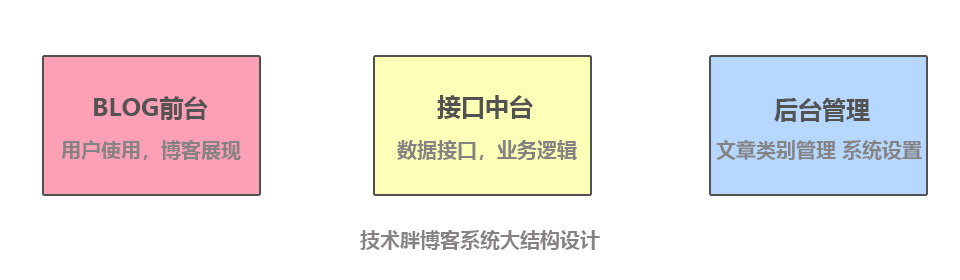
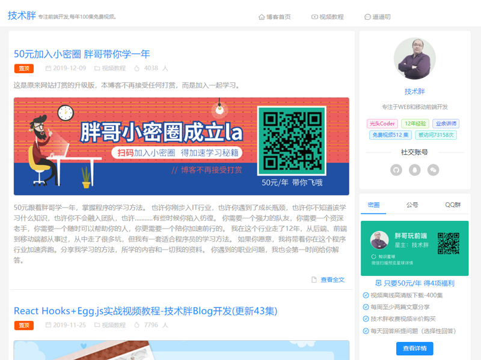
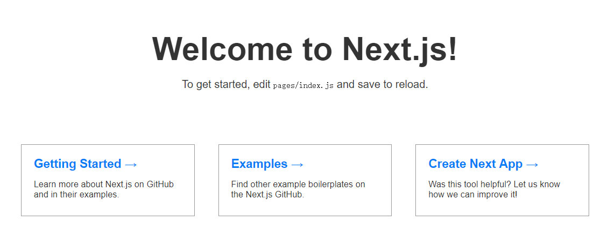

React的基础和全家桶都已经讲完了，是时候把所有知识都串联起来，作一个真实项目了。 项目要用到的技术栈会很多，而且是真实项目，开发完成后，我会把自己的博客替换成新开发的，并且会把代码进行开源。 项目前台会使用React服务端渲染，并且全部使用Hooks语法来完成。 项目后台可能会使用Koa+mysql,后台将使用Koa的上层框架egg.js。

本教程并没有课程大纲，一遍开发一遍讲述，但这样可以保证最真实的开发流程。如果你也想用React开发个人博客，那这个教程是你最好的选择。

## P01：博客实战的课程介绍

<iframe src="https://player.bilibili.com/player.html?aid=68325396&amp;cid=138913336&amp;page=1" scrolling="no" border="0" frameborder="no" framespacing="0" allowfullscreen="true" width="100%" style="box-sizing: border-box; height: 34rem; border: 1px solid rgb(204, 204, 204); border-radius: 8px;"></iframe>

[技术胖的自我介绍

我相信看这个文章的大部分人，都是我的老朋友，但是也会有一些新朋友加入，所以我有必要作一下自我介绍。我是一个有12年开发经验的程序员，目前专注于前端开发领域，以前做过Java和php的开发。我从两年前开始录制免费视频，目标是10年录制1000集免费视频，写这篇文章时已经录制371集免费前端视频。

视频每周都会更新3集左右，全部是下班回家后录制，所以没办法再快了。

[文章和视频的一些说明

注意：由于这套视频是实战视频，类似于开发全程的记录，所有代码都是手写，包括CSS代码和JSX代码，所以可能会显得甬长。这就类似一个有着丰富经验的程序前辈，手把手带着你作了一个完整项目。

整个项目会包括三个部分:



**更新频率**

这个文章和视频每周会更新三集左右，每集视频大概10-15分钟，太长了你看起来会比较累。最好的学习是方式是先看视频，然后跟着文章作一遍，这样可以保证你学习效率和质量。

**一起学习**

这套教程的文章和视频都是免费的，但不提供问题解答和讨论，如果你想参与，可以加入技术胖的小密圈。

[课程前置知识

你学习这套视频教程前，希望你把技术胖2019年录制的React全家桶视频先看一遍，这样可以更好的衔接本视频。

技术胖的React全家桶视频（共84集）:

[1.React16免费视频教程（共28集)](https://jspang.com/detailed?id=46)

[2.Redux免费视频教程（共24集）](https://jspang.com/detailed?id=48)

[3.React Router 免费文字视频教程（共9集）](https://jspang.com/detailed?id=49)

[4.React Hooks 免费视频教程(共11集)](https://jspang.com/detailed?id=50)

[5.React服务端渲染框架Next.js入门(共12集)](https://jspang.com/detailed?id=51)

如果你没学过这些视频，看这套教程，可能会看不懂，以前讲过的知识点我会直接写出结果，不会作态度的知识介绍。



## P02：项目前端基础开发环境搭建

这套视频会分三个大的模块来讲，先完成博客的前端界面的制作，也就是上图说的第一个部分。前端主要完成功能就是用户的访问，文章列表和文章详情页面。因为Blog的前台需要SEO操作，所以我们一定会选用`Next.js`框架来辅助我们开发。然后减少CSS和各种组件的重复开发，选用阿里的`Ant Desgin`来作为UI交互库。定下这两个目标后，就可以搭建开发环境了。

<iframe src="https://player.bilibili.com/player.html?aid=68325396&amp;cid=118845089&amp;page=2" scrolling="no" border="0" frameborder="no" framespacing="0" allowfullscreen="true" width="100%" style="box-sizing: border-box; height: 34rem; border: 1px solid rgb(204, 204, 204); border-radius: 8px;"></iframe>

[用`create-next-app`快速创建项目

`create-next-app`就是`Next.js`的脚手架工具，有了它可以直接一句命令就建立好项目目录和基本结构，省去了我们很多的麻烦。如果你没有使用过`create-next-app`,可以先进行全局安装，安装命令如下.

```
$ npm install -g create-next-app
```

先创建一个总的目录，因为我们的项目会分为三个大模块，所以需要一个顶层目录。 创建完成后，再进入目录。 安装完成后，进入你要建立项目的位置，使用`npx`来进行安装。

```
$ npx create-next-app blog
```

输入后按回车，就会自动给我们进行安装项目需要的依赖，Next相关的命令也会添加好。完成后可以使用`yarn dev`来测试一下。

在浏览器中输入`http://localhost:3000/`,看到下面的内容，说明项目生产成功。



基本的前台项目结构就建立好了。

[建立博客首页

用`create-next-app`建立好后，主页是默认的，所以我们要删除一下默认的文件和代码。把首页改成下面的代码。

```js
import React from 'react'
import Head from 'next/head'
const Home = () => (
  <>
    <Head>
      <title>Home</title>
    </Head>
 </>
)
export default Home
```

这样基本的前台结构就算搭建完成了，但是我们还要使用`Ant Desgin`轮子来写我们的UI部分。

[让`Next`支持CSS文件

先用`yarn`命令来安装`@zeit/next-css`包，它的主要功能就是让`Next.js`可以加载`CSS`文件，有了这个包才可以进行配置。

```
yarn add @zeit/next-css
```

包下载完成后，在`blog`根目录下，新建一个`next.config.js`文件。这个就是`Next.js`的总配置文件。写入下面的代码:

```js
const withCss = require('@zeit/next-css')

if(typeof require !== 'undefined'){
    require.extensions['.css']=file=>{}
}

module.exports = withCss({})
```

这样我们的`Next.js`就支持CSS文件了。

[按需加载`Ant Design`

接下来用yarn来安装`antd`，在命令行里输入：

```
yarn add antd 
```

然后再安装一下`babel-plugin-import`，命令如下：

```
yarn add babel-plugin-import
```

安装完成后，在项目根目录建立`.babelrc`文件，然后写入如下配置文件。

```json
{
    "presets":["next/babel"],  //Next.js的总配置文件，相当于继承了它本身的所有配置
    "plugins":[     //增加新的插件，这个插件就是让antd可以按需引入，包括CSS
        [
            "import",
            {
                "libraryName":"antd"
            }
        ]
    ]
}
```

在pages目录下，新建一个`_app.js`文件，然后把CSS进行全局引入.

```js
import App from 'next/app'

import 'antd/dist/antd.css'

export default App
```

这样`Ant Design`就可以按需引入了。现在`index.js`加入一个按钮，看看是否可以正常使用,代码如下。 如果能正常使用，我们的基本环境就已经建立完成了。

```js
import React from 'react'
import Head from 'next/head'
import {Button} from 'antd'
const Home = () => (
  <>
    <Head>
      <title>Home</title>
    </Head>
    <div><Button>我是按钮</Button></div>
 </>
)

export default Home
```

## P03：制作博客公用头部并形成组件

博客的头部每个页面都一样，所以可以制作成一个组件。这样就可以保持每个博客的页面头部都是统一的，而且易于上线后的维护。博客头部还要能支持适配大部分终端，比如PC、手机和平板。适配终端使用`Ant Design`提供的24格栅格化的技术进行布局。

<iframe src="https://player.bilibili.com/player.html?aid=68325396&amp;cid=119065643&amp;page=3" scrolling="no" border="0" frameborder="no" framespacing="0" allowfullscreen="true" width="100%" style="box-sizing: border-box; height: 34rem; border: 1px solid rgb(204, 204, 204); border-radius: 8px;"></iframe>

[通用CSS文件的编写

博客需要一个浅灰背景色，并且每个页面的背景色都是一样的，所以需要一个公共的`css`样式文件，在`/static`文件夹下新建一个`/style/`,在`/style`文件夹下新建两个文件夹`/pages`和`/components`，然后再`/pages`文件夹下新建立`comm.css`文件。以后只要每个页面都用到的CSS样式，都放入这个文件中。

建立文件后，写入下面的CSS样式，就是把背景设置成浅灰色。

```css
body{
  background-color: #f6f6f6;  
}
```

修改`/pages/_app.js`引入这个CSS，这个文件引入后，每个页面都会起作用。

```js
import App from 'next/app'
import 'antd/dist/antd.css'
import '../static/style/pages/comm.css'

export default App
```

注意引入时的目录层次，如果引入错了会直接报错。这部完成后，也买你的背景颜色就变成了灰色。

[Ant Design的24格栅格化系统

接下来就可以编写公用的头部了，遇到的第一个问题是如何让界面适配各种屏幕。如果自己编写还是挺麻烦的，幸运的是可以直接使用`Ant Design`的轮子来制作。

Ant Design做好了栅格化系统，可以适配多种屏幕，简单理解成把页面的分成均等的24列，然后进行布局。

需要对适配几个属性熟悉一下：

- xs: `<576px`响应式栅格。
- sm：`≥576px`响应式栅格.
- md: `≥768px`响应式栅格.
- lg: `≥992px`响应式栅格.
- xl: `≥1200px`响应式栅格.
- xxl: `≥1600px`响应式栅格.

先在`/blog/components/`目录下新建一个`Header.js`文件。 然后在`/static/style/components/header.css`,用来编写CSS文件。

Header.js文件

```js
import React from 'react'
import '../static/style/components/header.css'

import {Row,Col, Menu, Icon} from 'antd'
const Header = () => (
  <div className="header">
    <Row type="flex" justify="center">
        <Col  xs={24} sm={24} md={10} lg={10} xl={10}>
            <span className="header-logo">技术胖</span>
            <span className="header-txt">专注前端开发,每年100集免费视频。</span>
        </Col>

        <Col className="memu-div" xs={0} sm={0} md={14} lg={8} xl={6}>
            <Menu  mode="horizontal">
                <Menu.Item key="home">
                    <Icon type="home" />
                    首页
                </Menu.Item>
                <Menu.Item key="video">
                    <Icon type="youtube" />
                    视频
                </Menu.Item>
                <Menu.Item key="life">
                    <Icon type="smile" />
                    生活
                </Menu.Item>
            </Menu>
        </Col>
    </Row>
 </div>
)

export default Header
```

header.css文件

```css
.header{
    background-color: #fff;

    padding: .4rem;
    overflow: hidden;
    height: 2.8rem;
    border-bottom:1px solid #ccc;
}
.header-logo{
    color:#1e90ff;
    font-size: 1.4rem;
    text-align: left;

}
.header-txt{
    font-size: 0.6rem;
    color: #999;
    display: inline-block;
    padding-left: 0.3rem;
}
.ant-meu{
    line-height: 2.6rem;

}
.ant-menu-item{
    font-size:.7rem !important;
    padding-left:1rem;
    padding-right:1rem;

}
```

写完以后，可以把`/Header.js`文件引入到首页，看一下效果。

index.js

```js
import React from 'react'
import Head from 'next/head'
import {Button} from 'antd'
import Header from '../components/Header'
const Home = () => (
  <>
    <Head>
      <title>Home</title>
    </Head>
    <Header />
    <div><Button>我是按钮</Button></div>
 </>
)

export default Home
```

完成后，到浏览器中查看一下效果，根据实际情况进行微调就可以了。如果你有2K屏，可以自己试着适配一下2K屏幕。

## P04：完成首页主体的两栏布局

可以看到博客主体分为左右两栏布局，左边是主要的文章列表，右边是个人信息和一些广告的东西。并且也是在不同的终端中有不同的表现。这节课我们先制作出两栏布局。

<iframe src="https://player.bilibili.com/player.html?aid=68325396&amp;cid=119411752&amp;page=4" scrolling="no" border="0" frameborder="no" framespacing="0" allowfullscreen="true" width="100%" style="box-sizing: border-box; height: 34rem; border: 1px solid rgb(204, 204, 204); border-radius: 8px;"></iframe>

[对公用头部的微调

由于上节课录制的适配比较长，所以公用头部还是不那么好看，特别是在2K屏下，显得太小气了。所以先对公用头部的CSS进行调整。打开`header.css`文件，改成下面，代码的样式。

```css
.header{
    background-color: #fff;
    padding: .4rem;
    overflow: hidden;
    height: 3.2rem;
    border-bottom:1px solid #eee;
}
.header-logo{
    color:#1e90ff;
    font-size: 1.4rem;
    text-align: left;
}
.header-txt{
    font-size: 0.6rem;
    color: #999;
    display: inline-block;
    padding-left: 0.3rem;
}
.ant-meu{
    line-height: 2.8rem;
}
.ant-menu-item{
    font-size:1rem !important;
    padding-left:1rem;
    padding-right:1rem;
}
```

对屏幕的适配我们也作一下对应的调整，把适配参数配置成如下参数:

logo部分

```
 xs={24} sm={24} md={10} lg={15} xl={12}
```

Menu部分

```
xs={0} sm={0} md={14} lg={8} xl={6}
```

这样就好看多了，可以在浏览器预览一下效果。

[编写首页的左右两列布局

可以看到博客是分为左右两列布局的，而且也是适配各终端的，有了上节课的经验，我们得知，可以用`Row`和`Col`组件来完成。

index.js

```js
import React from 'react'
import Head from 'next/head'
import {Row, Col} from 'antd'
import Header from '../components/Header'
const Home = () => (
  <>
    <Head>
      <title>Home</title>
    </Head>
    <Header />
    <Row className="comm-main" type="flex" justify="center">
      <Col className="comm-left" xs={24} sm={24} md={16} lg={18} xl={14}  >
        左侧
      </Col>

      <Col className="comm-right" xs={0} sm={0} md={7} lg={5} xl={4}>
        右侧
      </Col>
    </Row>

 </>
)

export default Home
```

CSS样式写在公用的`comm.css`里，代码如下:

```css
body{
  background-color: #f6f6f6;  
}

.comm-left{
  background-color: #FFF;
  padding:.3rem;
  border-radius: .3rem;
  border-bottom:1px solid #eee;
}
.comm-right{
  background-color: #FFF;
  margin-left: .5rem;
  padding:.3rem;
  border-radius: .3rem;
  border-bottom:1px solid #eee;

}
.comm-main{
  margin-top: .5rem;
}
```

我相信你学到这里，CSS都是没有任何问题，所以在CSS部分，我就采用复制的方式了,不在反复的编写了。

[其他页面的大结构复制

因为博客的列表页、详细页都采用了这种页面的总体形式，所以我们在Pages目录新建`list.js`和`detailed.js`文件，然后把`index.js`代码复制到里边，并进行简单的修改。

list.js

```js
import React from 'react'
import Head from 'next/head'
import {Row, Col} from 'antd'
import Header from '../components/Header'
const List = () => (
  <>
    <Head>
      <title>List</title>
    </Head>
    <Header />
    <Row className="comm-main" type="flex" justify="center">
      <Col className="comm-left" xs={24} sm={24} md={16} lg={18} xl={14}  >
        左侧
      </Col>

      <Col className="comm-right" xs={0} sm={0} md={7} lg={5} xl={4}>
        右侧
      </Col>
    </Row>

 </>
)

export default List
```

detailed.js

```js
import React from 'react'
import Head from 'next/head'
import {Row, Col} from 'antd'
import Header from '../components/Header'
const Detailed = () => (
  <>
    <Head>
      <title>Detailed</title>
    </Head>
    <Header />
    <Row className="comm-main" type="flex" justify="center">
      <Col className="comm-left" xs={24} sm={24} md={16} lg={18} xl={14}  >
        左侧
      </Col>

      <Col className="comm-right" xs={0} sm={0} md={7} lg={5} xl={4}>
        右侧
      </Col>
    </Row>

 </>
)

export default Detailed
```

这样，我们就确定了博客的整体结构，并且是统一的。下节课我们继续把通用的博客底部做出来，当然也做成一个组件，其实React编写就是在不断的制作组件。

## P05：利用`List`组件 制作博客列表

左右两边的基本布局完成后，需要对列表的单元项进行制作，也就是首页列表中的每一项。这个制作起来涉及的内容不多，因为以后要解析`Markdown`代码，所以这里只是先模拟一下，把基本的样式完成。因为基础知识点我们都讲过了，所以这里就以实践为主了。

<iframe src="https://player.bilibili.com/player.html?aid=68325396&amp;cid=119584660&amp;page=5" scrolling="no" border="0" frameborder="no" framespacing="0" allowfullscreen="true" width="100%" style="box-sizing: border-box; height: 34rem; border: 1px solid rgb(204, 204, 204); border-radius: 8px;"></iframe>

[编写列表项的基本结构

由于`Ant Design`本身就有列表相关的组件，所以我们不用把这部分独立出去，而是使用`Ant Design`本身所有的List组件。

在使用时先引入`List`,代码如下:

```js
import {Row, Col , List ,Icon} from 'antd'
```

然后把`useState`也引入过来，以后要进行使用。

```js
import React,{useState} from 'react'
```

用useState,伪造一些假数据，然后在`jsx`中进行使用。

```js
const [ mylist , setMylist ] = useState(
    [
      {title:'50元加入小密圈 胖哥带你学一年',context:'50元跟着胖哥学一年，掌握程序人的学习方法。 也许你刚步入IT行业，也许你遇到了成长瓶颈，也许你不知道该学习什么知识，也许你不会融入团队，也许...........有些时候你陷入彷徨。 你需要一个强力的队友，你需要一个资深老手，你需要一个随时可以帮助你的人，你更需要一个陪你加速前行的。 我在这个行业走了12年，从后端、前端到移动端都从事过，从中走了很多坑，但我有一套适合程序员的学习方法。 如果你愿意，我将带着你在这个程序行业加速奔跑。分享我学习的方法，所学的内容和一切我的资料。 你遇到的职业问题，我也会第一时间给你解答。我需要先感谢一直帮助我的小伙伴，这个博客能产出300多集免费视频，其中有他们的鼎力支持，如果没有他们的支持和鼓励，我可能早都放弃了。 原来我博客只是录制免费视频，然后求30元的打赏。 每次打赏我都会觉得内疚，因为我并没有给你特殊的照顾，也没能从实质上帮助过你。 直到朋友给我介绍了知识星球，它可以专享加入，可以分享知识，可以解答问题，所以我如获珍宝，决定把打赏环节改为知识服务。我定价50元每年，为什么是50元每年？因为这是知识星球允许的最低收费了。'},
      {title:'React实战视频教程-技术胖Blog开发(更新04集)',context:'50元跟着胖哥学一年，掌握程序人的学习方法。 也许你刚步入IT行业，也许你遇到了成长瓶颈，也许你不知道该学习什么知识，也许你不会融入团队，也许...........有些时候你陷入彷徨。 你需要一个强力的队友，你需要一个资深老手，你需要一个随时可以帮助你的人，你更需要一个陪你加速前行的。 我在这个行业走了12年，从后端、前端到移动端都从事过，从中走了很多坑，但我有一套适合程序员的学习方法。 如果你愿意，我将带着你在这个程序行业加速奔跑。分享我学习的方法，所学的内容和一切我的资料。 你遇到的职业问题，我也会第一时间给你解答。我需要先感谢一直帮助我的小伙伴，这个博客能产出300多集免费视频，其中有他们的鼎力支持，如果没有他们的支持和鼓励，我可能早都放弃了。 原来我博客只是录制免费视频，然后求30元的打赏。 每次打赏我都会觉得内疚，因为我并没有给你特殊的照顾，也没能从实质上帮助过你。 直到朋友给我介绍了知识星球，它可以专享加入，可以分享知识，可以解答问题，所以我如获珍宝，决定把打赏环节改为知识服务。我定价50元每年，为什么是50元每年？因为这是知识星球允许的最低收费了。'},
      {title:'React服务端渲染框架Next.js入门(共12集)',context:'50元跟着胖哥学一年，掌握程序人的学习方法。 也许你刚步入IT行业，也许你遇到了成长瓶颈，也许你不知道该学习什么知识，也许你不会融入团队，也许...........有些时候你陷入彷徨。 你需要一个强力的队友，你需要一个资深老手，你需要一个随时可以帮助你的人，你更需要一个陪你加速前行的。 我在这个行业走了12年，从后端、前端到移动端都从事过，从中走了很多坑，但我有一套适合程序员的学习方法。 如果你愿意，我将带着你在这个程序行业加速奔跑。分享我学习的方法，所学的内容和一切我的资料。 你遇到的职业问题，我也会第一时间给你解答。我需要先感谢一直帮助我的小伙伴，这个博客能产出300多集免费视频，其中有他们的鼎力支持，如果没有他们的支持和鼓励，我可能早都放弃了。 原来我博客只是录制免费视频，然后求30元的打赏。 每次打赏我都会觉得内疚，因为我并没有给你特殊的照顾，也没能从实质上帮助过你。 直到朋友给我介绍了知识星球，它可以专享加入，可以分享知识，可以解答问题，所以我如获珍宝，决定把打赏环节改为知识服务。我定价50元每年，为什么是50元每年？因为这是知识星球允许的最低收费了。'},
      {title:'React Hooks 免费视频教程(共11集)',context:'50元跟着胖哥学一年，掌握程序人的学习方法。 也许你刚步入IT行业，也许你遇到了成长瓶颈，也许你不知道该学习什么知识，也许你不会融入团队，也许...........有些时候你陷入彷徨。 你需要一个强力的队友，你需要一个资深老手，你需要一个随时可以帮助你的人，你更需要一个陪你加速前行的。 我在这个行业走了12年，从后端、前端到移动端都从事过，从中走了很多坑，但我有一套适合程序员的学习方法。 如果你愿意，我将带着你在这个程序行业加速奔跑。分享我学习的方法，所学的内容和一切我的资料。 你遇到的职业问题，我也会第一时间给你解答。我需要先感谢一直帮助我的小伙伴，这个博客能产出300多集免费视频，其中有他们的鼎力支持，如果没有他们的支持和鼓励，我可能早都放弃了。 原来我博客只是录制免费视频，然后求30元的打赏。 每次打赏我都会觉得内疚，因为我并没有给你特殊的照顾，也没能从实质上帮助过你。 直到朋友给我介绍了知识星球，它可以专享加入，可以分享知识，可以解答问题，所以我如获珍宝，决定把打赏环节改为知识服务。我定价50元每年，为什么是50元每年？因为这是知识星球允许的最低收费了。'},
    ]
  )
```

有了数据后，我们就可以用这些数据来构建List布局了。代码如下：

```js
 <div>    
  <List
    header={<div>最新日志</div>}
    itemLayout="vertical"
    dataSource={mylist}
    renderItem={item => (
      <List.Item>
        <div className="list-title">{item.title}</div>
        <div className="list-icon">
          <span><Icon type="calendar" /> 2019-06-28</span>
          <span><Icon type="folder" /> 视频教程</span>
          <span><Icon type="fire" /> 5498人</span>
        </div>
        <div className="list-context">{item.context}</div>  
      </List.Item>
    )}
  />    
</div>
```

[列表页CSS样式的编写

在`/static/style/pages`文件夹下，新建立一个`index.css`文件。 CSS样式我们依然采用复制的方式，这里给出了CSS样式的代码。

```css
.list-title{
    font-size:1.3rem;
    color: #1e90ff;
    padding: 0 0.5rem;
}
.list-context{
    color:#777;
    padding:.5rem;
}
.list-icon{
    padding:.5rem 0;
    color:#AAA;
}
.list-icon span{
    display: inline-block;
    padding: 0 10px;
}
```

写完后记得引入到`index.js`里边。

```js
import '../static/style/pages/index.css'
```

这时候进行预览，应该就可以出现比较好看的列表样式效果了。

## P06：编写“博主介绍”组件

博客的文章列表有了，接下来开始完善博客右侧的功能，右侧的绝大部分都是需要在其他页面复用的，所以尽量制作成组件，减少以后的开发和维护成本。

<iframe src="https://player.bilibili.com/player.html?aid=68325396&amp;cid=119769293&amp;page=6" scrolling="no" border="0" frameborder="no" framespacing="0" allowfullscreen="true" width="100%" style="box-sizing: border-box; height: 34rem; border: 1px solid rgb(204, 204, 204); border-radius: 8px;"></iframe>

[编写Author组件

在`/components`文件夹下面，新建一个`Author.js`文件。这个组件里要包括头像、自我介绍和社交账号标识。

代码如下:

```js
import {Avatar,Divider} from 'antd'
import '../static/style/components/author.css'

const Author =()=>{

    return (
        <div className="author-div comm-box">
            <div> <Avatar size={100} src="http://blogimages.jspang.com/blogtouxiang1.jpg"  /></div>
            <div className="author-introduction">
                光头程序员，专注于WEB和移动前端开发。要录1000集免费前端视频的傻X。此地维权无门，此时无能为力，此心随波逐流。
                <Divider>社交账号</Divider>
                <Avatar size={28} icon="github" className="account"  />
                <Avatar size={28} icon="qq"  className="account" />
                <Avatar size={28} icon="wechat"  className="account"  />

            </div>
        </div>
    )

}

export default Author
```

这里的`Avatat`组件时`Ant Desgin`提供的，专门用来编辑头像的，通过这个可以制作原型或者方形的头像。 `Divider`是分割线组件，也是`Ant Desgin`提供的组件，特点是可以在分割线左、中、右，根据自己需要插入文字。

[CSS样式的编写

这里我提供出了对应的CSS样式，你可以直接复制到项目中使用，你也可以直接写一个自己喜欢的样式。

```css
.author-div{
    text-align: center;
    padding: 1rem;

}
.author-div div{
    margin-bottom: 1rem;

}
.author-introduction{
    font-size:.8rem;
    color: #999;
}
.account{
    background-color: #999;
    margin-left: .5rem;
    margin-right: .5rem;
}
```

我们也改写了`comm.css`，把里边的`comm-box`名称，改为了`comm-box`，这样只要到边框的时候，直接使用这个样式就可以了。

```css
body{
  background-color: #f6f6f6;  
}

.comm-left{
  background-color: #FFF;
  padding:.3rem;
  border-radius: .3rem;
  border:1px solid #eee;
}
.comm-box{
  background-color: #FFF;
  margin-left: .5rem;
  padding:.3rem;
  border-radius: .3rem;
  border:1px solid #eee;


}
.comm-main{
  margin-top: .5rem;
}
```

[把组件引入到首页查看效果

打开`index.js`文件，然后在文件头部先引入`Author`组件，代码如下：

```js
import Author from '../components/Author'
```

引入组件后，就可以在需要的位置进行使用了。使用完成，可以到浏览器中查看一下现在的效果了。如果一切正常，我们的自我介绍组件就编写完成了。

## P07：编写“通用广告”组件

和上节课编写博主介绍组件几乎一样，就是写写基本结构，然后形成组件，引入到主页里查看效果。但是这个广告组件和博主自我介绍组件我都准备用静态来作，就是没有后台配置。这样作的好处是节省掉每次和数据库的交互和后台的交互，提高博客性能。我的博客有时候并发是很大的，所以能节省的资源一定要节省。

<iframe src="https://player.bilibili.com/player.html?aid=68325396&amp;cid=119769293&amp;page=7" scrolling="no" border="0" frameborder="no" framespacing="0" allowfullscreen="true" width="100%" style="box-sizing: border-box; height: 34rem; border: 1px solid rgb(204, 204, 204); border-radius: 8px;"></iframe>

[编写`Advert.js`文件

在`/components`文件夹下新建立一个`Advert.js`文件，然后写入下面的代码:

```js
import '../static/style/components/advert.css'

 const Advert = ()=>{
    return (
        <div className="ad-div comm-box">
          <div></div>
          <div></div>
          <div></div>
          <div></div>
        </div>
    )
 }

 export default Advert
```

[编写`advert.css`文件

在`/static/components`文件夹下建立一个`advert.css`文件，写入下面的代码:

```css
.ad-div{
    margin-top: .5rem;
}
.ad-div div{
    border-radius: .3rem;
    margin-bottom: .2rem;
    overflow: hidden;
}
```

[引入首页查看样式

写完后在`index.js`中用`import`引入`Advert`组件，并使用就可以了。

```js
import Advert from '../components/Advert'
```

然后在`index.js`中使用

```js
<Col className="comm-right" xs={0} sm={0} md={7} lg={5} xl={4}>
  <Author />
  <Advert />
</Col>
```

引入后可以在浏览器中进行预览，根据查看效果，进行微调就可以了。实战就是很多东西都是重复的，也是一个从学到会的过程。

## P08：博客列表页面快速制作

这节我们先把博客底部(脚部)制作一下，然后在快速制作博客的列表页面，通过这个你就能感觉到React组件化开发的魅力，有了这些通用组件，能很快完成列表页的开发。

<iframe src="https://player.bilibili.com/player.html?aid=68325396&amp;cid=120176780&amp;page=8" scrolling="no" border="0" frameborder="no" framespacing="0" allowfullscreen="true" width="100%" style="box-sizing: border-box; height: 34rem; border: 1px solid rgb(204, 204, 204); border-radius: 8px;"></iframe>

[博客底部的制作

每个博客在底部都会放置一些类似版权，联系方式，友情连接的东西。并且每个页面也都是一样的，所以我们要作一个通用的博客底部组件（Footer.js）。

在`/components`目录下，新建立一个`Footer.js`的文件，然后写入下面代码.

```js
import '../static/style/components/footer.css'
const Footer = ()=>(
    <div className="footer-div">
        <div>系统由 React+Node+Ant Desgin驱动 </div>
        <div>JSPang.com</div>
    </div>
)

export default Footer
```

然后在`/static/style/components`文件夹下建立一个`footer.css`文件

```css
.footer-div{
    text-align: center;
    width: 100%;
    padding: 1rem;
    color:#888;
}
```

编写完成后引入到`index.js`里，就可以完成底部菜单的开发了，在预览后可以根据自己的喜好进行微调。

[博客列表页的制作

因为博客列表页和首页非常类似，只是列表页多了“面包屑导航”,我们先把首页的代码`index.js`，拷贝到`list.js`页面中，然后去掉`index.css`的引入。你会发现列表样式没有了。因为列表样式写在了`index.css`里边了，但现在要共用，所以我们这届把列表样式提到`comm.css`样式里边。

然后就可以写面包屑导航了，直接用`Ant Design`自带的`Breadcrumb`就可以，用法也是非常简单，先进行引入:

```js
import {Row, Col , List ,Icon ,Breadcrumb  } from 'antd'
<div className="bread-div">
  <Breadcrumb>
    <Breadcrumb.Item><a href="/">首页</a></Breadcrumb.Item>
    <Breadcrumb.Item>视频列表</Breadcrumb.Item>
  </Breadcrumb>
</div>
```

为了方便你的学习，这里给出全部代码。

list.js

```js
import React,{useState} from 'react'
import Head from 'next/head'
import {Row, Col , List ,Icon ,Breadcrumb  } from 'antd'
import Header from '../components/Header'
import Author from '../components/Author'
import Advert from '../components/Advert'
import Footer from '../components/Footer'
import '../static/style/pages/list.css'


const Home = () =>{

  const [ mylist , setMylist ] = useState(
    [
      {title:'50元加入小密圈 胖哥带你学一年',context:'50元跟着胖哥学一年，掌握程序人的学习方法。 也许你刚步入IT行业，也许你遇到了成长瓶颈，也许你不知道该学习什么知识，也许你不会融入团队，也许...........有些时候你陷入彷徨。 你需要一个强力的队友，你需要一个资深老手，你需要一个随时可以帮助你的人，你更需要一个陪你加速前行的。 我在这个行业走了12年，从后端、前端到移动端都从事过，从中走了很多坑，但我有一套适合程序员的学习方法。 如果你愿意，我将带着你在这个程序行业加速奔跑。分享我学习的方法，所学的内容和一切我的资料。 你遇到的职业问题，我也会第一时间给你解答。我需要先感谢一直帮助我的小伙伴，这个博客能产出300多集免费视频，其中有他们的鼎力支持，如果没有他们的支持和鼓励，我可能早都放弃了。 原来我博客只是录制免费视频，然后求30元的打赏。 每次打赏我都会觉得内疚，因为我并没有给你特殊的照顾，也没能从实质上帮助过你。 直到朋友给我介绍了知识星球，它可以专享加入，可以分享知识，可以解答问题，所以我如获珍宝，决定把打赏环节改为知识服务。我定价50元每年，为什么是50元每年？因为这是知识星球允许的最低收费了。'},
      {title:'React实战视频教程-技术胖Blog开发(更新04集)',context:'50元跟着胖哥学一年，掌握程序人的学习方法。 也许你刚步入IT行业，也许你遇到了成长瓶颈，也许你不知道该学习什么知识，也许你不会融入团队，也许...........有些时候你陷入彷徨。 你需要一个强力的队友，你需要一个资深老手，你需要一个随时可以帮助你的人，你更需要一个陪你加速前行的。 我在这个行业走了12年，从后端、前端到移动端都从事过，从中走了很多坑，但我有一套适合程序员的学习方法。 如果你愿意，我将带着你在这个程序行业加速奔跑。分享我学习的方法，所学的内容和一切我的资料。 你遇到的职业问题，我也会第一时间给你解答。我需要先感谢一直帮助我的小伙伴，这个博客能产出300多集免费视频，其中有他们的鼎力支持，如果没有他们的支持和鼓励，我可能早都放弃了。 原来我博客只是录制免费视频，然后求30元的打赏。 每次打赏我都会觉得内疚，因为我并没有给你特殊的照顾，也没能从实质上帮助过你。 直到朋友给我介绍了知识星球，它可以专享加入，可以分享知识，可以解答问题，所以我如获珍宝，决定把打赏环节改为知识服务。我定价50元每年，为什么是50元每年？因为这是知识星球允许的最低收费了。'},
      {title:'React服务端渲染框架Next.js入门(共12集)',context:'50元跟着胖哥学一年，掌握程序人的学习方法。 也许你刚步入IT行业，也许你遇到了成长瓶颈，也许你不知道该学习什么知识，也许你不会融入团队，也许...........有些时候你陷入彷徨。 你需要一个强力的队友，你需要一个资深老手，你需要一个随时可以帮助你的人，你更需要一个陪你加速前行的。 我在这个行业走了12年，从后端、前端到移动端都从事过，从中走了很多坑，但我有一套适合程序员的学习方法。 如果你愿意，我将带着你在这个程序行业加速奔跑。分享我学习的方法，所学的内容和一切我的资料。 你遇到的职业问题，我也会第一时间给你解答。我需要先感谢一直帮助我的小伙伴，这个博客能产出300多集免费视频，其中有他们的鼎力支持，如果没有他们的支持和鼓励，我可能早都放弃了。 原来我博客只是录制免费视频，然后求30元的打赏。 每次打赏我都会觉得内疚，因为我并没有给你特殊的照顾，也没能从实质上帮助过你。 直到朋友给我介绍了知识星球，它可以专享加入，可以分享知识，可以解答问题，所以我如获珍宝，决定把打赏环节改为知识服务。我定价50元每年，为什么是50元每年？因为这是知识星球允许的最低收费了。'},
      {title:'React Hooks 免费视频教程(共11集)',context:'50元跟着胖哥学一年，掌握程序人的学习方法。 也许你刚步入IT行业，也许你遇到了成长瓶颈，也许你不知道该学习什么知识，也许你不会融入团队，也许...........有些时候你陷入彷徨。 你需要一个强力的队友，你需要一个资深老手，你需要一个随时可以帮助你的人，你更需要一个陪你加速前行的。 我在这个行业走了12年，从后端、前端到移动端都从事过，从中走了很多坑，但我有一套适合程序员的学习方法。 如果你愿意，我将带着你在这个程序行业加速奔跑。分享我学习的方法，所学的内容和一切我的资料。 你遇到的职业问题，我也会第一时间给你解答。我需要先感谢一直帮助我的小伙伴，这个博客能产出300多集免费视频，其中有他们的鼎力支持，如果没有他们的支持和鼓励，我可能早都放弃了。 原来我博客只是录制免费视频，然后求30元的打赏。 每次打赏我都会觉得内疚，因为我并没有给你特殊的照顾，也没能从实质上帮助过你。 直到朋友给我介绍了知识星球，它可以专享加入，可以分享知识，可以解答问题，所以我如获珍宝，决定把打赏环节改为知识服务。我定价50元每年，为什么是50元每年？因为这是知识星球允许的最低收费了。'},
    ]
  );


  return (
    <>
      <Head>
        <title>Home</title>
      </Head>
      <Header />
      <Row className="comm-main" type="flex" justify="center">
        <Col className="comm-left" xs={24} sm={24} md={16} lg={18} xl={14}  >
            <div>
              <div className="bread-div">
                <Breadcrumb>
                  <Breadcrumb.Item><a href="/">首页</a></Breadcrumb.Item>
                  <Breadcrumb.Item>视频列表</Breadcrumb.Item>
                </Breadcrumb>
              </div>

              <List
                itemLayout="vertical"
                dataSource={mylist}
                renderItem={item => (
                  <List.Item>
                    <div className="list-title">{item.title}</div>
                    <div className="list-icon">
                      <span><Icon type="calendar" /> 2019-06-28</span>
                      <span><Icon type="folder" /> 视频教程</span>
                      <span><Icon type="fire" /> 5498人</span>
                    </div>
                    <div className="list-context">{item.context}</div>  
                  </List.Item>
                )}
              />  

            </div>
        </Col>

        <Col className="comm-right" xs={0} sm={0} md={7} lg={5} xl={4}>
          <Author />
          <Advert />
        </Col>
      </Row>
      <Footer/>

   </>
  )

} 

export default Home
```

comm.css

```css
body{
  background-color: #f6f6f6;  
}
.comm-left{
  background-color: #FFF;
  padding:.3rem;
  border-radius: .3rem;
  border:1px solid #eee;
}
.comm-box{
  background-color: #FFF;
  margin-left: .5rem;
  padding:.3rem;
  border-radius: .3rem;
  border:1px solid #eee;
}
.comm-main{
  margin-top: .5rem;
}
.list-title{
  font-size:1.3rem;
  color: #1e90ff;
  padding: 0 0.5rem;
}
.list-context{
  color:#777;
  padding:.5rem;
}
.list-icon{
  padding:.5rem 0;
  color:#AAA;
}
.list-icon span{
  display: inline-block;
  padding: 0 10px;
}
```

这节课就到这里，下节课我们再制作文章详细页，文章详细页完成我们的前台UI部分就算基本完成了。

## P09：博客详细页面制作1-编写基本页面结构

十一期间我一直在给老妈装修房子，所以没时间写博客，现在回归正常了，又可以写博客了。这节课我们主要作一下博客前台的详细页面。详细页做主要的一点是对`Markdown`语法的解析。

<iframe src="https://player.bilibili.com/player.html?aid=68325396&amp;cid=122085238&amp;page=9" scrolling="no" border="0" frameborder="no" framespacing="0" allowfullscreen="true" width="100%" style="box-sizing: border-box; height: 34rem; border: 1px solid rgb(204, 204, 204); border-radius: 8px;"></iframe>

[编写基本页面结构

在编写页面前，在`/static/style/pages`文件夹下建立一个`detailed.css`文件，代码如下：

```css
.bread-div{
    padding: .5rem;
    border-bottom:1px solid #eee;
    background-color: #e1f0ff;
}
.detailed-title{
    font-size: 1.8rem;
    text-align: center;
    padding: 1rem;
}
.center{
    text-align: center;
}
.detailed-content{
    padding: 1.3rem;
    font-size: 1rem;
}
code {
    display: block ;
     background-color:#f3f3f3;
     padding: .5rem !important;
     overflow-y: auto;
     font-weight: 300;
     font-family: Menlo, monospace;
     border-radius: .3rem;
}

.title-anchor{
    color:#888 !important;
    padding:4px !important;
    margin: 0rem !important;
    height: auto !important;
    line-height: 1.2rem !important;
    font-size: .9rem !important;
    border-bottom: 1px dashed #eee;
}
.active{
    color:rgb(30, 144, 255) !important;
}
.nav-title{
    text-align: center;
    color: #888;
    border-bottom: 1px solid rgb(30, 144, 255);

}
```

有了样式文件后,打开以前我们准备好的`detailed.js`，然后检查一下页面的引入:

```js
import React,{useState} from 'react'
import Head from 'next/head'
import {Row, Col , Icon ,Breadcrumb  } from 'antd'

import Header from '../components/Header'
import Author from '../components/Author'
import Advert from '../components/Advert'
import Footer from '../components/Footer'
import '../static/style/pages/detailed.css'
```

编写`return`部分的`jsx`代码，

```js
 return (
    <>
      <Head>
        <title>博客详细页</title>
      </Head>
      <Header />
      <Row className="comm-main" type="flex" justify="center">
        <Col className="comm-left" xs={24} sm={24} md={16} lg={18} xl={14}  >
            <div>
              <div className="bread-div">
                <Breadcrumb>
                  <Breadcrumb.Item><a href="/">首页</a></Breadcrumb.Item>
                  <Breadcrumb.Item>视频列表</Breadcrumb.Item>
                  <Breadcrumb.Item>xxxx</Breadcrumb.Item>
                </Breadcrumb>
              </div>

             <div>
                <div className="detailed-title">
                React实战视频教程-技术胖Blog开发(更新08集)
                </div>

                <div className="list-icon center">
                  <span><Icon type="calendar" /> 2019-06-28</span>
                  <span><Icon type="folder" /> 视频教程</span>
                  <span><Icon type="fire" /> 5498人</span>
                </div>

                <div className="detailed-content" >
                  详细内容，下节课编写
                </div>

             </div>

            </div>
        </Col>

        <Col className="comm-right" xs={0} sm={0} md={7} lg={5} xl={4}>
          <Author />
          <Advert />

        </Col>
      </Row>
      <Footer/>

   </>
  )
```

写完后看一下详细页的效果，然后进行微调。这节课的内容很简单，都是简单的布局，小伙伴只要跟着作就好了。下节课我们来解析`Markdown`。

## P10：博客详细页面制作2-解析Markdown语法

作为一个程序员的博客，一定是要使用`Markdown`来编写文章，所以对`Markdown`文件的解析也是前端必须要作的一件事。我这里使用了`react-markdown`.

<iframe src="https://player.bilibili.com/player.html?aid=68325396&amp;cid=122085238&amp;page=10" scrolling="no" border="0" frameborder="no" framespacing="0" allowfullscreen="true" width="100%" style="box-sizing: border-box; height: 34rem; border: 1px solid rgb(204, 204, 204); border-radius: 8px;"></iframe>

[认识`react-markdown`组件

`react-markdown`是react专用的markdown解析组件，目前来看是非常不错的.我公司用了`marked + highlight.js`，觉的还是不太好，所以博客中尝试使用`react-markdown`。先上一张图，说明它的强大。


它支持代码高亮，表格，而且解析的非常好。

> github网址：https://github.com/rexxars/react-markdown

目前已经有4000+多star了，算是比较好和火的React组件。

[`react-markdown`的安装和引入

可以直接使用`yarn add` 来进行安装，代码如下:

```
yarn add react-markdown
```

安装好后，使用`import`进行引入，代码如下:

```js
import ReactMarkdown from 'react-markdown'
```

[准备md相关数据

因为目前还没有后端程序，所以需要伪造一个md数据，让web页面可以渲染。

这里声明一个`markdown`变量,当然内容全部是我胡乱写的，为的就是可以顺利渲染出来。

```js
let markdown='# P01:课程介绍和环境搭建\n' +
  '[ **M** ] arkdown + E [ **ditor** ] = **Mditor**  \n' +
  '> Mditor 是一个简洁、易于集成、方便扩展、期望舒服的编写 markdown 的编辑器，仅此而已... \n\n' +
   '**这是加粗的文字**\n\n' +
  '*这是倾斜的文字*`\n\n' +
  '***这是斜体加粗的文字***\n\n' +
  '~~这是加删除线的文字~~ \n\n'+
  '\`console.log(111)\` \n\n'+
  '# p02:来个Hello World 初始Vue3.0\n' +
  '> aaaaaaaaa\n' +
  '>> bbbbbbbbb\n' +
  '>>> cccccccccc\n'+
  '***\n\n\n' +
  '# p03:Vue3.0基础知识讲解\n' +
  '> aaaaaaaaa\n' +
  '>> bbbbbbbbb\n' +
  '>>> cccccccccc\n\n'+
  '# p04:Vue3.0基础知识讲解\n' +
  '> aaaaaaaaa\n' +
  '>> bbbbbbbbb\n' +
  '>>> cccccccccc\n\n'+
  '#5 p05:Vue3.0基础知识讲解\n' +
  '> aaaaaaaaa\n' +
  '>> bbbbbbbbb\n' +
  '>>> cccccccccc\n\n'+
  '# p06:Vue3.0基础知识讲解\n' +
  '> aaaaaaaaa\n' +
  '>> bbbbbbbbb\n' +
  '>>> cccccccccc\n\n'+
  '# p07:Vue3.0基础知识讲解\n' +
  '> aaaaaaaaa\n' +
  '>> bbbbbbbbb\n' +
  '>>> cccccccccc\n\n'+
  '``` var a=11; ```'
```

[使用`react-markdown`渲染markdown

现在组件和markdown文件都准备好了，可以进行渲染了。代码如下:

```jsx
<div className="detailed-content" >
    <ReactMarkdown 
      source={markdown} 
      escapeHtml={false}  
    />
</div>
```

现在可以到浏览器中预览一下了，如果一切正常，应该可以正常接卸`markdown`语法了。

## P11：博客详细页面制作3-Markdown导航制作

我的博客文章都是长文章，所以需要一个类似书籍目录的东西，对文章进行导航。这个导航方便小伙伴们阅读，大大提升了博客的体验度。`React`有着极好的技术生态，基本你能想到的技术需求都可以找到对应的轮子，所以我们依然适应第三方组件`markdown-navbar`.

<iframe src="https://player.bilibili.com/player.html?aid=68325396&amp;cid=122450442&amp;page=11" scrolling="no" border="0" frameborder="no" framespacing="0" allowfullscreen="true" width="100%" style="box-sizing: border-box; height: 34rem; border: 1px solid rgb(204, 204, 204); border-radius: 8px;"></iframe>

[认识`markdown-navbar`组件

`markdown-navbar`组件是一款第三方提供的组件，因为这个是比较小众的需求，所以使用的人并不多。目前只有18star,这个是国人开发的，我用起来还不错，希望作者可以一直维护下去（目前开来是不进行维护了，但是用起来还是挺好用）。

`markdown-navbar`的基本属性：

- className： 可以为导航定义一个class名称，从而进行style样式的定义。
- source：要解析的内容，也就是你的Markdown内容。
- headingTopOffset:描点距离页面顶部的位置，默认值是0.
- ordered: 显示数字编码，默认是显示的，也就是true，设置为false就不显示了。

[`markdown-navbar`的安装和使用

用`npm install`进行安装，命令如下：

```
npm install --save markdown-navbar
```

用`yarn add`进行安装，命令如下：

```
yarn add markdown-navbar
```

安装完成后，直接在要使用的页面用`import`进行引入,需要注意的是你还需要引入`css`。

```js
import MarkNav from 'markdown-navbar';
import 'markdown-navbar/dist/navbar.css';
```

这样就引入成功了，现在就可以制作导航了，代码如下：

```js
<div className="detailed-nav comm-box">
  <div className="nav-title">文章目录</div>
  <MarkNav
    className="article-menu"
    source={markdown}
    ordered={false}
  />
</div>
```

在浏览器中预览一下，可以看到效果了。但现在有一个需求，就是这个导航要一直在页面的右侧。我们经常叫这个需求为`固钉`。`Ant Desgin`中提供了`Affix`.

先用import引入Affix组件。

```js
import {Row, Col ,Affix, Icon ,Breadcrumb  } from 'antd'
```

引入后在需要固钉的外层加上Affix组件就可以了。

```js
<Affix offsetTop={5}>
  <div className="detailed-nav comm-box">
    <div className="nav-title">文章目录</div>
    <MarkNav
      className="article-menu"
      source={markdown}

      ordered={false}
    />
  </div>
</Affix>
```

写完这段代码，到浏览器中预览一下，就可以实现固钉的效果了。这节课就到这里了，实现了详细页的文章导航效果，到目前为止，基本的用户前台部分就已经制作基本完成了，但是还有很多细节需要我们在中台和后台都开发完成后，再不断打磨。

## P12：中台搭建1-安装egg.js开发环境

博客系统的服务端（或者叫做中台），采用Koa的上层框架egg.js，所谓上层框架就是在Koa的基础上，封装的框架。他主要针对于企业级开发，所以性能和稳定性上都非常不错，而且在国内有很高的声望，由阿里技术团队支持。如果你没有Koa的基础，我建议你还是先停下这个视频，去补一下Koa的知识，也就是几个小时就能学会，技术胖也有免费的视频可以学习。

> 视频学习地址:[挑战全栈 Koa2免费视频教程 (共13集)](https://jspang.com/posts/2017/11/13/koa2.html)

<iframe src="https://player.bilibili.com/player.html?aid=68325396&amp;cid=122636064&amp;page=12" scrolling="no" border="0" frameborder="no" framespacing="0" allowfullscreen="true" width="100%" style="box-sizing: border-box; height: 34rem; border: 1px solid rgb(204, 204, 204); border-radius: 8px;"></iframe>

[认识egg.js框架

egg.js是由阿里开源的面向企业级开发的Node.js服务端框架，目的就是帮助团队和开发人员降低开发和维护成本。需要说的是他的底层是Koa2来搭建的。（这个框架完全可以开一节新课程讲一下，里边的内容还是非常多的，但是我们在个人博客这样简单的系统中，使用的并不是很多，所以我就用到那里给大家讲那里，不用的我就不讲了。）Koa2虽然已经很好了，但是它并没有任何约定和规范，这样在团队开发中，会出现混乱的现象。

> Github地址：https://github.com/eggjs/egg

目前项目由1.3万star，是非常火爆的开源项目，不过使用的大部分都是国人。框架主要是简化我们的开发流程。

[搭建开发环境

我们先进入到项目的根文件夹中，然后在根文件夹下，建立一个`service`的文件夹，这就是中台的文件夹了。

全局安装`egg.js`的脚手架工具`egg-init`：

```
npm i egg-init -g
```

因为npm的源还是比较慢的，所以需要多等一些时间。安装完成后，用cd命令进入service文件夹。 用脚手架自动生成项目的基本结构，在终端中直接输入下面的命令。

```
egg-init --type=simple
```

如果不成功，你需要多式几次，这多是网络不顺畅造成的，所以没有什么更好的办法来解决。等待顺利完成后，可以打开文件夹，看一下是否自动生成了很多文件和文件夹。但是现在还没有安装相关的依赖包，所以要使用命令安装egg项目所需要的所有依赖包。

```
npm install
```

安装完成后，就可以启动服务查看一下结果了。

```
npm run dev
```

然后在浏览器中打开网址:http://127.0.0.1:7001/

如果在页面中显示`hi.egg`说明我们环境搭建完成。这节课也就先到这里，下节课我们继续开发中台。

## P13：中台搭建2-egg.js目录结构和约定规范

上节课已经搭建好了egg.js开发环境，但是我没有讲过egg.js的基础知识，所以需要点时间，简单讲解一下egg.js的目录结构和约定规范。只有明白了这些，我们才能更好的进行开发。

<iframe src="https://player.bilibili.com/player.html?aid=68325396&amp;cid=123215513&amp;page=13" scrolling="no" border="0" frameborder="no" framespacing="0" allowfullscreen="true" width="100%" style="box-sizing: border-box; height: 34rem; border: 1px solid rgb(204, 204, 204); border-radius: 8px;"></iframe>

[egg.js目录结构介绍

这里我只介绍比较重要的文件，如果是开发中不太常用的我就不作过多介绍了，毕竟我们这是实战项目，讲解太多的基础知识会耽误大家时间。大家可以自己去看文档（文档全部中文，很好理解）。

- app文件夹:项目开发文件，程序员主要操作的文件，项目的大部分代码都会写在这里。
- config文件夹：这个是整个项目的配置目录，项目和服务端的配置都在这里边进行设置。
- logs文件夹：日志文件夹，正常情况下不用修改和查看里边内容。
- node_modules:项目所需要的模块文件，这个前端应该都非常了解，不多作介绍。
- run文件夹：运行项目时，生成的配置文件，基本不修改里边的文件。
- test文件夹：测试使用的配合文件，这个在测试时会使用。
- .autod.conf.js: egg.js自己生成的配置文件，不需要进行修改。
- eslinttrc和eslintignore：代码格式化的配置文件。
- gitgnore：git设置忽略管理的配置文件。
- package.json： 包管理和命令配置文件，这个文件经常进行配置。

这些就是egg.js项目比较重要的一些文件作用，这里只是简单的介绍了一下，在以后课程中如果开发用到，我们会详细讲解。比较重要的是app文件夹、config文件夹和package.json文件。

[Egg.js目录约定规范

上节课我说过Koa2框架虽然小巧好用，但是在团队开发中使用，是缺少规范的，所以不擅长企业级开发。Egg.js框架就是在Koa2的基础上规范了这些约定，所以也带来了一些文件目录的限制。

在app目录下，egg要求我们必须要有下面的文件：

- controller文件夹：控制器，渲染和简单的业务逻辑都会写道这个文件里。配置路由时也会用到（路由配置需要的文件都要写在控制器里）。
- public文件夹：公用文件夹，把一些公用资源都放在这个文件夹下。
- router.js: 项目的路由配置文件，当用户访问服务的时候，在没有中间件的情况下，会先访问router.js文件。
- service文件夹：这个是当我们的业务逻辑比较复杂或和数据库打交道时，会把业务逻辑放到这个文件中。
- view文件夹：模板文件夹，相当于表现层的专属文件夹，这个项目，我们使用接口的形式，所以不需要建立view文件夹。
- extend文件：当我们需要写一些模板中使用的扩展方法时，我们会放到这个文件夹里。
- middleware：中间件文件夹，用来写中间件的，比如最常用的路由首位。

当然我们现在有个最基础的，然后又需要再不断向文件夹里加文件就可以。

现在我们作一个小例子，在`/app/controller/home.js`文件中，加入一个list方法，然后再进行配置路由。

home.js

```js
async list() {
    const { ctx } = this;
    ctx.body = '<h1>jspang blog list</h1>';
  }
```

router.js

```js
'use strict';

/**
 * @param {Egg.Application} app - egg application
 */
module.exports = app => {
  const { router, controller } = app;
  router.get('/', controller.home.index);
  router.get('/list', controller.home.list);
};
```

这时候，你启动一下服务，然后访问一下,http://127.0.0.1:7001/list,可以看到我们的页面放生了变化。

这节课就到这里，大家只要理解egg.js目录结构和相应的约定规范就可以了。

## P14：中台搭建3-RESTful API设计简介和路由配置

我们的所有数据的获得和业务逻辑的操作都是通过中台实现的，也就是说中台只提供接口，这里的设计我们采用`RESTful`的规则，让egg为前端提供Api接口，实现中台主要的功能。

<iframe src="https://player.bilibili.com/player.html?aid=68325396&amp;cid=123518556&amp;page=14" scrolling="no" border="0" frameborder="no" framespacing="0" allowfullscreen="true" width="100%" style="box-sizing: border-box; height: 34rem; border: 1px solid rgb(204, 204, 204); border-radius: 8px;"></iframe>

[RESTful简介和约束方式

RESTful是目前最流行的网络应用程序设计风格和开发方式，大量使用在移动端App上和前后端分离的接口设计。这种形式更直观并且接口也有了一定的约束性。

约束的请求方式和对应的操作。

- **GET(SELECT)** ： 从服务端取出资源，可以同时取出一项或者多项。
- **POST(CREATE)** ：在服务器新建一个资源。
- **PUT(UPDATE)** ：在服务器更新资源（客户端提供改变后的完整资源）。
- **DELETE(DELETE)** ：从服务器删除资源。

还有一些不常用的请求方式，因为不常用或者说我们的博客中用不到，所以我就不作过多的介绍了。

[在egg.js中Api接口的路由配置

首先打开`service`根目录下的`controller`文件夹，在这个文件夹中新建两个文件夹admin（管理端使用的所有API接口）和default（客户端使用的所有API接口）文件夹。

目前我们只有客户端（前台）的页面，所以先在`default`目录下建立一个home.js文件，用于前台首页所需要的api接口。代码如下：

/service/app/controller/default/home.js

```js
'use strict';

const Controller = require('egg').Controller

class HomeController extends Controller{

    async index(){
        this.ctx.body="api接口"
    }
}

module.exports = HomeController
```

接口写好以后，我们需要配置一下路由。这里为了把路由也分成前后端分离的，所以在`app`文件夹下新建一个`router`文件夹。

在文件夹下新建两个文件`default.js`和`admin.js`。

default.js文件

```js
module.exports = app =>{
    const {router,controller} = app
    router.get('/default/index',controller.default.home.index)
}
```

router.js文件

```js
'use strict';

/**
 * @param {Egg.Application} app - egg application
 */
module.exports = app => {

  require('./router/default')(app)
};
```

编写好以后，我们使用`yarn dev`命令进行开启服务器，然后到浏览器中输入地址`http://127.0.0.1:7001/default/index`,如果能出现`api接口`字样，说明已经完成了基本的路由设置。

下节课我们学习egg.js如何连接数据库和实现相关的操作。

## P15：中台搭建4-Egg.js中连接mysql数据库

这节课讲解一下Egg.js中使用mysql数据库，那需要你的mysql数据有基础的了解，比如说一些常用的sql语句和安装。但是如果你说我真不会，也是可以跟着视频作下来的，但只是能做出效果，对于里边的为什么可能不太了解。还是需要你自己补齐一下mysql的基础知识啊。我还建议，如果你对mysql不熟悉，还是暂停学习一下，找一套相关的mysql最新教程学习一下，这样你接下来的学习才会更简单。

<iframe src="https://player.bilibili.com/player.html?aid=68325396&amp;cid=123768416&amp;page=15" scrolling="no" border="0" frameborder="no" framespacing="0" allowfullscreen="true" width="100%" style="box-sizing: border-box; height: 34rem; border: 1px solid rgb(204, 204, 204); border-radius: 8px;"></iframe>

[egg-mysql模块安装

如果要在egg.js中使用mysql数据库，那需要先进行安装`egg-mysql`模块，这个模块你可以使用npm或者yarn来进行安装。

npm安装命令如下:

```
npm i egg-mysql --save
```

yarn安装命令如下:

```
yarn add egg-mysql
```

这个的等待大概要1分钟，具体要根据你自己的网速确定，请耐心等待安装完成。安装完成可以到`package.json`中看一下，是否有这个文件。我安装的版本是3.0.0版本。你学的时候，这个版本可能所有变化。

[进行插件配置

在安装完成以后，还不能正常使用，egg.js要求我们对于外部模块在`plugin.js`中进行配置。配置方法如下：

文件/server/config/plugin.js

```js
exports.mysql = {
  enable: true,
  package: 'egg-mysql'
}
```

这个配置完，也就说明egg.js可以支持mysql数据库的使用和连接了。

全部代码如下:

```js
'use strict';

//配置插件
exports.mysql = {
  enable: true,
  package: 'egg-mysql'
}
```

以后还会多次配置这个文件，所以我们这里要对这个`config.js`有所印象，他的左右就是配置egg.js项目的。

[数据库连接配置

这个配置时，你要先确认你已经有一台安装mysql的服务器或者是主机，当然你也可以在自己的开发机上进行安装，因为我使用的`php Study`这个集成开发环境（作php用的）。所以我的机器上是安装的。

打开/config/config.default.js文件，作下面的配置（这段配置你可以在https://www.npmjs.com/ 网址中找到这个配置）

```js
exports.mysql = {
  // database configuration
  client: {
    // host
    host: 'mysql.com',
    // port
    port: '3306',
    // username
    user: 'test_user',
    // password
    password: 'test_password',
    // database
    database: 'test',    
  },
  // load into app, default is open
  app: true,
  // load into agent, default is close
  agent: false,
};
```

这时候你需要根据你的环境，修改对应的参数，主要的就是host、user、password和database（每个数据库配置不同，所以这个每个人都不同）。 我的是这样的，但是你不一定完全跟我一样。

```js
  config.mysql = {
    // database configuration
    client: {
      // host
      host: 'localhost',
      // port
      port: '3306',
      // username
      user: 'root',
      // password
      password: '12345678',
      // database
      database: 'react_blog',    
    },
    // load into app, default is open
    app: true,
    // load into agent, default is close
    agent: false,
  };
```

这个配置完成后，就可以连接到数据库了。

[创建数据库

现在我们还没有数据库，所以需要先建立数据库，直接使用`PhP Study`里的`SQL_Front5.3`来管理数据，如果你没有安装需要安装一下，安装完成后点后面的管理按钮，就可以管理了。（这个过程看视频吧）

1. 输入你数据库的用户名和密码，然后点击进入。
2. 进入后新建一个数据库`react_blog`，这个名字你可以自己起
3. 新建一个表`blog_content`,字段就是title、type、introduce和content
4. 随便写条数据进去，这个自由发挥吧

这样数据库的准备就写好了，接下来需要验证一下，数据库是否已经连接上了。

[使用get进行表的查询

打开上节课写的`/app/controller/defalut/home.js`文件，改写`index`方法。

```js
'use strict';

const Controller = require('egg').Controller

class HomeController extends Controller{

    async index(){
        //获取用户表的数据

        let result = await this.app.mysql.get("blog_content",{})
        console.log(result)
        this.ctx.body=result
    }


}

module.exports = HomeController
```

改写后，在浏览器中输入`http://127.0.0.1:7001/default/index`.如果能在控制台打印出结果和页面中显示结果，说明数据库已经连接成功了。这节课主要讲解了egg.js中mysql数据的连接方式，下节课我们简单的介绍一下数据库的增删改查操作。

## P16：中台搭建5-数据库设计和首页接口制作

现在已经可以连接数据库了，我们现在就要好好设计一下数据库结构，把文章的表和类别的表建立好，然后我们复制一些数据进去，形成一个列表，供首页调用。

<iframe src="https://player.bilibili.com/player.html?aid=68325396&amp;cid=123951645&amp;page=16" scrolling="no" border="0" frameborder="no" framespacing="0" allowfullscreen="true" width="100%" style="box-sizing: border-box; height: 34rem; border: 1px solid rgb(204, 204, 204); border-radius: 8px;"></iframe>

[数据库中的表建立

直接使用MySQL-front工具建立使用的表，建立两张表`type`和`article`表，表结构如下:

**type表（文章类型表）**

- id : 类型编号 int类型
- typeName: 文章类型名称 varchar类型
- orderNum: 类型排序编号 int类型

建立好表之后，我们再写入一条数据，编号为1，名称是视频教程，排列需要为1

**article表（文章内容表）**

- id : 文章编号 int类型
- type_id : 文章类型编号 int类型
- title : 文章标题，varchar类型
- article_cointent : 文章主体内容，text类型
- introduce： 文章简介，text类型
- addTime : 文章发布时间，int(11)类型
- view_count ：浏览次数， int类型

建立好之后，可以自己写一些对应的文章进去，记得点击发布才可以。

[前端首页文章列表接口

现在文章相关的数据表已经建立完成了，我们也简单的写入了一些数据，那现在就可以利用RESTful的规范，建立前端首页所需要的接口了。

在`/app/contoller/default/home.js`文件夹中，写一个`getArticleList`的方法，代码如下：

```js
async getArticleList(){

   let sql = 'SELECT article.id as id,'+
             'article.title as title,'+
             'article.introduce as introduce,'+
             'article.addTime as addTime,'+
             'article.view_count as view_count ,'+
             '.type.typeName as typeName '+
             'FROM article LEFT JOIN type ON article.type_id = type.Id'

    const results = await this.app.mysql.query(sql)

    this.ctx.body={
        data:results
    }
}
```

因为我到目前一共只写了20多篇文章，所有也不需要什么分页的东西,这里也就不作分页设置了。

写完之后还需要配置一下路由（router），打开`/app/router/default.js`,新建立一个get形式的路由配置，代码如下：

```js
module.exports = app =>{
    const {router,controller} = app
    router.get('/default/index',controller.default.home.index)
    router.get('/default/getArticleList',controller.default.home.getArticleList)
}
```

这个配置完成后，可以现在浏览器中预览一下结果，看看是否可以正确输出结果。访问地址：http://127.0.0.1:7001/default/getArticleList。如果能出现结果，说明我们已经完成了数据和接口的开发。

## P17：前中台结合1-前台读取首页文章列表接口

现在数据库、表和接口我们都已经完成了，这集可以试着从数据接口获得数据，然后现在在页面上了。实现这个需求，我们将使用Axios模块来实现。

<iframe src="https://player.bilibili.com/player.html?aid=68325396&amp;cid=124140226&amp;page=17" scrolling="no" border="0" frameborder="no" framespacing="0" allowfullscreen="true" width="100%" style="box-sizing: border-box; height: 34rem; border: 1px solid rgb(204, 204, 204); border-radius: 8px;"></iframe>

[安装Axios模块

先进入前台的文件夹，如果你和我写的文件名是一样的，应该是`blog`，引入后就可以使用yarn命令进行安装了，当然你用npm来进行安装也是完全可以的。

```
yarn add axios
```

安装完成后可以到`package.json`里看一下现在安装的结果，我目前安装的0.19.0版本，你们学习的时候可以跟我的不太一样。

[新建getInitialProps方法并获取数据

当`Axios`安装完成后，就可以从接口获取数据了。打开`/blog/pages/index.js`文件，在文件下方编写`getInitialProps`。

```js
Home.getInitialProps = async ()=>{
  const promise = new Promise((resolve)=>{
    axios('http://127.0.0.1:7001/default/getArticleList').then(
      (res)=>{
        //console.log('远程获取数据结果:',res.data.data)
        resolve(res.data)
      }
    )
  })

  return await promise
}
```

这里使用了经典的`async/await`的异步方法。我们可以在得到数据后在控制台打印一下，查看一下结果。

[把数据放入到界面中

当我们在`getInitialProps`方法里获得数据后，是可以直接传递到正式方法里，然后进行使用:

```js
const Home = (list) =>{

  console.log(list)
  //---------主要代码-------------start
  const [ mylist , setMylist ] = useState( list.data);
  //---------主要代码-------------end
  return (
    <>
      <Head>
        <title>Home</title>
      </Head>
      <Header />
      <Row className="comm-main" type="flex" justify="center">
        <Col className="comm-left" xs={24} sm={24} md={16} lg={18} xl={14}  >
            <div>

              <List
                header={<div>最新日志</div>}
                itemLayout="vertical"
                dataSource={mylist}
                renderItem={item => (
                  <List.Item>

                    <div className="list-title">{item.title}</div>
                    <div className="list-icon">
                      <span><Icon type="calendar" /> {item.addTime}</span>
                      <span><Icon type="folder" /> {item.typeName}</span>
                      <span><Icon type="fire" /> {item.view_count}人</span>
                    </div>
                    <div className="list-context">{item.introduce}</div>  
                  </List.Item>
                )}
              />  

            </div>
        </Col>

        <Col className="comm-right" xs={0} sm={0} md={7} lg={5} xl={4}>
          <Author />
          <Advert />
        </Col>
      </Row>
      <Footer/>

   </>
  )

} 
```

做完这步，我们的内容就应该正确的显示在页面上了，但是还是有点小问题，比如我们的日期格式还是不正确。

[修改时间戳为日期格式

其实这个有很多方法，有前端实现的方法，也有后端实现的方法，但是我觉的使用SQL语句来实现是最简单的一种方法。

打开`/service/app/controller/home.js`文件，找到拼凑SQL语句那部分代码，把代码修改成如下样式即可实现转换。

```js
let sql = 'SELECT article.id as id,'+
                 'article.title as title,'+
                 'article.introduce as introduce,'+
                 //主要代码----------start
                 "FROM_UNIXTIME(article.addTime,'%Y-%m-%d %H:%i:%s' ) as addTime,"+
                 //主要代码----------end
                 'article.view_count as view_count ,'+
                 '.type.typeName as typeName '+
                 'FROM article LEFT JOIN type ON article.type_id = type.Id'
```

现在去浏览器中预览一下，应该就实现了时间戳转换成时间日期格式了。这节课我们就到这里，主要讲解了前台读取接口后如何显示在页面上的一些知识。

## P18：前中台结合2-文章详细页面接口制作展示

首页的接口和展示已经差不多了，现在可以制作详细页的接口和内容。这节课主要目的是制作文章详细页面的接口，通过一个ID查找出详细的信息。

<iframe src="https://player.bilibili.com/player.html?aid=68325396&amp;cid=124949345&amp;page=18" scrolling="no" border="0" frameborder="no" framespacing="0" allowfullscreen="true" width="100%" style="box-sizing: border-box; height: 34rem; border: 1px solid rgb(204, 204, 204); border-radius: 8px;"></iframe>

[编写中台详细页面接口

先打开`/service/app/controller/default/home.js`文件，编写接口，代码如下。需要注意的是整个接口是需要接收文章ID，然后根据文章ID查出内容的。

home.js文件

```js
    async getArticleById(){
        //先配置路由的动态传值，然后再接收值
        let id = this.ctx.params.id

        let sql = 'SELECT article.id as id,'+
        'article.title as title,'+
        'article.introduce as introduce,'+
        'article.article_content as article_content,'+
        "FROM_UNIXTIME(article.addTime,'%Y-%m-%d %H:%i:%s' ) as addTime,"+
        'article.view_count as view_count ,'+
        'type.typeName as typeName ,'+
        'type.id as typeId '+
        'FROM article LEFT JOIN type ON article.type_id = type.Id '+
        'WHERE article.id='+id


        const result = await this.app.mysql.query(sql)


        this.ctx.body={data:result}

    }
```

编写完成后，这个接口就可以使用了，但是不要忘记，开启MySql服务和中台接口服务。

[编写前台链接导航

有了接口，先不着急编写详细页面，先把首页到详细页的链接做好。这个直接使用Next.js中的`<Link>`标签就可以了。找到首页中循环时文章的标题，在外边包括`<Link>`标签就可以了。

需要注意的是，这里

此段代码在`/blog/pages/index.js`

```js
 <div className="list-title">
    <Link href={{pathname:'/detailed',query:{id:item.id}}}>
      <a>{item.title}</a>
    </Link>
  </div>
```

[详细页从接口获取数据

当我们能通过链接跳转到详细页面之后，就可以编写`detailed.js`，通过`getInitialProps`来访问中台接口，并从中台接口获得数据。

detailed.js文件中的代码

```js
Detailed.getInitialProps = async(context)=>{

  console.log(context.query.id)
  let id =context.query.id
  const promise = new Promise((resolve)=>{

    axios('http://127.0.0.1:7001/default/getArticleById/'+id).then(
      (res)=>{
        console.log(title)
        resolve(res.data.data[0])
      }
    )
  })

  return await promise
}
```

写完之后我们访问一下代码，看看是不是可以拿到后台的数据（后台数据你可以尽量多准备一些）。如果预览可以拿到数据，证明我们的编写是没有问题的。这节课就到这里，下节课我们将重构一下详细页面的UI，使用`marked+highlight`形式编写。

## P19：解决egg.js的跨域问题

上节课的在最后预览时，我们遇到了跨域问题。这个是每个前后端分离的程序都会遇到的一个问题。这节课我们就一小点时间解决这个跨域问题。

<iframe src="https://player.bilibili.com/player.html?aid=68325396&amp;cid=125162486&amp;page=19" scrolling="no" border="0" frameborder="no" framespacing="0" allowfullscreen="true" width="100%" style="box-sizing: border-box; height: 34rem; border: 1px solid rgb(204, 204, 204); border-radius: 8px;"></iframe>

[安装egg-cors

`egg-cors`模块是专门用来解决`egg.js`跨域问题的，只要简单的配置就可以完成跨域的设置，但是跨域一定要谨慎设置，很多安全问题，都是通过跨域进行攻击的。

安装我们使用`yarn add``进行安装，命令如下：

```js
yarn add egg-cors
```

安装时间根据自己的网络状况不同，有所不同。我用了大概10秒钟左右。

[配置`config/plugin.js`文件

在安装完成后需要对`/service/config/plugin.js`文件进行修改，加入`egg-cors`模块即可。

```js
exports.cors: {
    enable: true,
    package: 'egg-cors'
}
```

[配置`config.default.js`

在配置完成`plugin.js`文件以后，还需要设置`config.default.js`文件。这个文件主要设置的是允许什么域名和请求方法可以进行跨域访问。配置代码如下。

```js
　　config.security = {
　　　　csrf: {
　　　　　　enable: false
　　　　},
　　　　domainWhiteList: [ '*' ]
　　};
 config.cors = {
    origin: '*',
    allowMethods: 'GET,HEAD,PUT,POST,DELETE,PATCH,OPTIONS'
};
```

如果你只想让`http://localhost:3000`来进行接口方案，就可以设置成下面的代码。

```js
  config.security = {
　　　　csrf: {enable: false},
　　　　domainWhiteList: [ '*' ]
　　};
  config.cors = {
    origin: 'http://localhost:3000', //只允许这个域进行访问接口
    credentials: true,   // 开启认证
    allowMethods: 'GET,HEAD,PUT,POST,DELETE,PATCH,OPTIONS'
    };
```

设置完成后，就可以在浏览器中进行预览了，如果能正常访问，说明跨域访问已经设置成功了。

## P20：重构前台博客详细页面1-marked+highlight

以前我们在博客文章详细页使用了`react-markdown`,但是这个插件的配置项还是太少了(当时也是想尝尝鲜，所以没作过多的技术判断和调研,在这里跟小伙伴们道歉了！！！)所以我决定转回我目前项目中使用的一套方案`marked+highlight.js`。这个方案是比较成熟的，目前公司的开发文档程序就是基于这个开发的。

<iframe src="https://player.bilibili.com/player.html?aid=68325396&amp;cid=125322585&amp;page=20" scrolling="no" border="0" frameborder="no" framespacing="0" allowfullscreen="true" width="100%" style="box-sizing: border-box; height: 34rem; border: 1px solid rgb(204, 204, 204); border-radius: 8px;"></iframe>

[安装`marked`和`highlight`

这两个模块需要先安装，这里我们就使用`yarn`来进行安装。打开终端，进入到`blog`目录下，然后使用下面命令进行安装。

```
yarn add marked
yarn add highlight
```

这个可能需要的时间多一点，我目前的版本是marked是0.7.0,highlight是9.15.10。如果版本有变化，导致代码没法运行，可自行查看API进行修改。

[重构`detailed.js`文件

这里的重构主要就是替换以前的`Markdown`解决方案。在代码顶部用`import`引入刚才安装的`marked`和`highlight.js`。

引入模块

```js
import marked from 'marked'
import hljs from "highlight.js";
import 'highlight.js/styles/monokai-sublime.css';
```

引入设置一下`marked.setOptions`，里边的属性比较多，我在这里详细的介绍一下。

```js
const renderer = new marked.Renderer();

marked.setOptions({
    renderer: renderer, 
    gfm: true,
    pedantic: false,
    sanitize: false,
    tables: true,
    breaks: false,
    smartLists: true,
    smartypants: false,
    highlight: function (code) {
            return hljs.highlightAuto(code).value;
    }
  }); 

    let html = marked(props.article_content) 
```

- renderer: 这个是必须填写的，你可以通过自定义的`Renderer`渲染出自定义的格式
- gfm：启动类似Github样式的Markdown,填写true或者false
- pedatic：只解析符合Markdown定义的，不修正Markdown的错误。填写true或者false
- sanitize: 原始输出，忽略HTML标签，这个作为一个开发人员，一定要写flase
- tables： 支持Github形式的表格，必须打开gfm选项
- breaks: 支持Github换行符，必须打开gfm选项，填写true或者false
- smartLists：优化列表输出，这个填写ture之后，你的样式会好看很多，所以建议设置成ture
- highlight: 高亮显示规则 ，这里我们将使用highlight.js来完成

** 增加Code的高亮显示 **

在设置`setOptions`属性时，可以直接设置高亮显示，代码如下：

```js
highlight: function (code) {
            return hljs.highlightAuto(code).value;
    }
```

设置完成后，你在浏览器检查代码时就可以出现hljs的样式，说明你的效果加成功了，实现了高亮显示代码。

[CSS样式的更换

都设置好以后，是不是又觉的现在样式也不是很好看，所以可以继续设置一下CSS样式。因为我们的视频中不讲解CSS样式部分，但是我给你提供了我`detailed.css`所有代码

```css
.bread-div{
    padding: .5rem;
    border-bottom:1px solid #eee;
    background-color: #e1f0ff;
}
.detailed-title{
    font-size: 1.8rem;
    text-align: center;
    padding: 1rem;
}
.center{
    text-align: center;
}
.detailed-content{
    padding: 1.3rem;
    font-size: 1rem;
}
pre{
    display: block;
    background-color:#f3f3f3;
     padding: .5rem !important;
     overflow-y: auto;
     font-weight: 300;
     font-family: Menlo, monospace;
     border-radius: .3rem;
}
pre{
    background-color: #283646 !important;
}
pre >code{
    border:0px !important;
    background-color: #283646 !important;
    color:#FFF;

}
code {
    display: inline-block ;
    background-color:#f3f3f3;
    border:1px solid #fdb9cc;
    border-radius:3px;
    font-size: 12px;
    padding-left: 5px;
    padding-right: 5px;
    color:#4f4f4f;
    margin: 0px 3px;

}

.title-anchor{
    color:#888 !important;
    padding:4px !important;
    margin: 0rem !important;
    height: auto !important;
    line-height: 1.2rem !important;
    font-size: .7rem !important;
    border-bottom: 1px dashed #eee;
    overflow: hidden;
    text-overflow:ellipsis;
    white-space: nowrap;
}
.active{
    color:rgb(30, 144, 255) !important;
}
.nav-title{
    text-align: center;
    color: #888;
    border-bottom: 1px solid rgb(30, 144, 255);

}
.article-menu{
    font-size:12px;
}
iframe{
    height: 34rem;
}
.detailed-content  img{
    width: 100%;
    border:1px solid #f3f3f3;
}
.title-level3{
    display: none !important;
}
.ant-anchor-link-title{
    font-size: 12px !important;
}
.ant-anchor-wrapper{
    padding: 5px !important;
}
```

样式复制完，我们再到浏览器中预览一下，应该就可以出现更漂亮的效果了。这节课就到这里，下节课我们把右侧的导航也重新完善一下，实现对文章章节的导航效果。学习是一定要跟着作，如果不作你也许什么都学不会。

## P21：重构前台博客详细页面2-实现文章导航

重构后前台详细页的文章导航部分出现了错误提示，这个主要是我们选择的`markdown-navbar`模块的坑，所以我也决定重新使用公司用的方案，这个插件是我同事写的，而且比较好用，为了尊重版权所有就不自己编写了，而是直接使用。

<iframe src="https://player.bilibili.com/player.html?aid=68325396&amp;cid=125915694&amp;page=21" scrolling="no" border="0" frameborder="no" framespacing="0" allowfullscreen="true" width="100%" style="box-sizing: border-box; height: 34rem; border: 1px solid rgb(204, 204, 204); border-radius: 8px;"></iframe>

[tocify.tsx文件简介

同事写的是一个`tocify.tsx`文件，用这个扩展名的含义是他使用了`typeScript`语法来编写`jsx`的部分，为了更好的和普通的是`jsx`文件区分，所以这里使用了`tsx`的扩展名。我们不需要对这个文件了解太多，只要会用就可以了，我同事正想把他开源出去，我在这里也算给他作一个小宣传了。

**使用这个文件的两个必要条件**

1. 你的程序员中使用了`Ant Design`UI库，因为它里边的导航部分，使用了`antd`的`Anchor`组件
2. 安装`lodash`模块，这个可以直接使用`yarn add lodash`来安装

上面两个条件满足后，你可以把文件`tocify.tsx`拷贝到你的项目里了，我这里放到了`/blog/components`文件夹下了，把它视为一种自定义组件。

tocify.tsx文件

```js
import React from 'react';
import { Anchor } from 'antd';
import { last } from 'lodash';

const { Link } = Anchor;

export interface TocItem {
  anchor: string;
  level: number;
  text: string;
  children?: TocItem[];
}

export type TocItems = TocItem[]; // TOC目录树结构

export default class Tocify {
  tocItems: TocItems = [];

  index: number = 0;

  constructor() {
    this.tocItems = [];
    this.index = 0;
  }

  add(text: string, level: number) {
    const anchor = `toc${level}${++this.index}`;
    const item = { anchor, level, text };
    const items = this.tocItems;

    if (items.length === 0) { // 第一个 item 直接 push
      items.push(item);
    } else {
      let lastItem = last(items) as TocItem; // 最后一个 item

      if (item.level > lastItem.level) { // item 是 lastItem 的 children
        for (let i = lastItem.level + 1; i <= 2; i++) {
          const { children } = lastItem;
          if (!children) { // 如果 children 不存在
            lastItem.children = [item];
            break;
          }

          lastItem = last(children) as TocItem; // 重置 lastItem 为 children 的最后一个 item

          if (item.level <= lastItem.level) { // item level 小于或等于 lastItem level 都视为与 children 同级
            children.push(item);
            break;
          }
        }
      } else { // 置于最顶级
        items.push(item);
      }
    }

    return anchor;
  }

  reset = () => {
    this.tocItems = [];
    this.index = 0;
  };

  renderToc(items: TocItem[]) { // 递归 render
    return items.map(item => (
      <Link key={item.anchor} href={`#${item.anchor}`} title={item.text}>
        {item.children && this.renderToc(item.children)}
      </Link>
    ));
  }

  render() {
    return (
      <Anchor affix showInkInFixed>
         {this.renderToc(this.tocItems)}
      </Anchor>
    );
  }
}
```

其实这个文件也很简单，如果JavaScript基础没问题是完全可以看明白的。

[使用`tocify.tsx`生成文章目录

接下来就可以利用`tocify.tsx`文件生成目录了，在`/blog/pages/detailed.js`引入。

```js
import Tocify from '../components/tocify.tsx'
```

引入后，需要对`marked`的渲染进行自定义，这时候需要设置`renderer.heading`，就是写一个方法们重新定义对`#`这种标签的解析。代码如下：

```js
const tocify = new Tocify()
renderer.heading = function(text, level, raw) {
      const anchor = tocify.add(text, level);
      return `<a id="${anchor}" href="#${anchor}" class="anchor-fix"><h${level}>${text}</h${level}></a>\n`;
    };
```

最后在需要显示文章导航的地方，写下面的代码:

```js
<div className="toc-list">
  {tocify && tocify.render()}
</div>
```

这里为了你方便学习，给出`detailed.js`全部代码。

```js
import React,{useState} from 'react'
import Head from 'next/head'
import {Row, Col ,Affix, Icon ,Breadcrumb  } from 'antd'

import Header from '../components/Header'
import Author from '../components/Author'
import Advert from '../components/Advert'
import Footer from '../components/Footer'
import '../static/style/pages/detailed.css'
import MarkNav from 'markdown-navbar';
import 'markdown-navbar/dist/navbar.css';
import axios from 'axios'
import marked from 'marked'
import hljs from "highlight.js";
import 'highlight.js/styles/monokai-sublime.css';
import Tocify from '../components/tocify.tsx'


const Detailed = (props) =>{

  let articleContent=props.article_content

  const tocify = new Tocify()
  const renderer = new marked.Renderer();
    renderer.heading = function(text, level, raw) {
      const anchor = tocify.add(text, level);
      return `<a id="${anchor}" href="#${anchor}" class="anchor-fix"><h${level}>${text}</h${level}></a>\n`;
    };

  marked.setOptions({

    renderer: renderer,

    gfm: true,
    pedantic: false,
    sanitize: false,
    tables: true,
    breaks: false,
    smartLists: true,
    smartypants: false,

    highlight: function (code) {
            return hljs.highlightAuto(code).value;
    }

  }); 


    let html = marked(props.article_content) 


  return (
    <>
      <Head>
        <title>博客详细页</title>
      </Head>
      <Header />
      <Row className="comm-main" type="flex" justify="center">
        <Col className="comm-left" xs={24} sm={24} md={16} lg={18} xl={14}  >
            <div>
              <div className="bread-div">
                <Breadcrumb>
                  <Breadcrumb.Item><a href="/">首页</a></Breadcrumb.Item>
                  <Breadcrumb.Item>{props.typeName}</Breadcrumb.Item>
                  <Breadcrumb.Item> {props.title}</Breadcrumb.Item>
                </Breadcrumb>
              </div>

             <div>
                <div className="detailed-title">
                {props.title}
                </div>

                <div className="list-icon center">
                  <span><Icon type="calendar" /> {props.addTime}</span>
                  <span><Icon type="folder" /> {props.typeName}</span>
                  <span><Icon type="fire" /> {props.view_count}</span>
                </div>

                <div className="detailed-content"  
                  dangerouslySetInnerHTML = {{__html:html}}   >


                </div>

             </div>

            </div>
        </Col>

        <Col className="comm-right" xs={0} sm={0} md={7} lg={5} xl={4}>
          <Author />
          <Advert />
          <Affix offsetTop={5}>
            <div className="detailed-nav comm-box">
              <div className="nav-title">文章目录</div>
              <div className="toc-list">
                {tocify && tocify.render()}
              </div>

            </div>
          </Affix>

        </Col>
      </Row>
      <Footer/>

   </>
  )

} 

Detailed.getInitialProps = async(context)=>{

  console.log(context.query.id)
  let id =context.query.id
  const promise = new Promise((resolve)=>{

    axios('http://127.0.0.1:7001/default/getArticleById/'+id).then(
      (res)=>{
        // console.log(title)
        resolve(res.data.data[0])
      }
    )
  })

  return await promise
}

export default Detailed
```

这样就完成了前端详细文章页面的文章导航，可以预览一下效果。

## P22：前台文章列表页的制作1-接口模块化和读取文章分类

从这节课开始，要制作一下文章列表页的前中台结合。由于接口越来越多，现在这样零散的管理非常不利于日后的维护，所以需要单独一个文件，专门用于前台和中台的接口管理。这样在以后部署和更换服务器时都非常简单。

<iframe src="https://player.bilibili.com/player.html?aid=68325396&amp;cid=126313292&amp;page=22" scrolling="no" border="0" frameborder="no" framespacing="0" allowfullscreen="true" width="100%" style="box-sizing: border-box; height: 34rem; border: 1px solid rgb(204, 204, 204); border-radius: 8px;"></iframe>

[编写统一中台API配置文件

在`blog`的根目录下，新建一个`config`文件夹，然后再文件夹下简历一个`apiUrl.js`文件，写入下面的代码。

```js
let ipUrl = 'http://127.0.0.1:7001/default/' 

let servicePath = {
    getArticleList:ipUrl + 'getArticleList' ,  //  首页文章列表接口
    getArticleById:ipUrl + 'getArticleById/',  // 文章详细页内容接口 ,需要接收参数

}
export default servicePath;
```

完成后，可以去`pages/index.js`文件中，修改以前的接口路由，在修改前，需要先进行引入。

```js
import  servicePath  from '../config/apiUrl'
```

引入后，直接进行更换

```js
Home.getInitialProps = async ()=>{
  const promise = new Promise((resolve)=>{
    axios(servicePath.getArticleList).then(
      (res)=>{
        resolve(res.data)
      }
    )
  })

  return await promise
}
```

首页更换完成，再去`pages/detailed.js`（详细页）文件中进行更换。

```js
//先进行引入
import  servicePath  from '../config/apiUrl'

//引入后进行修改
Detailed.getInitialProps = async(context)=>{

  console.log(context.query.id)
  let id =context.query.id
  const promise = new Promise((resolve)=>{

    axios(servicePath.getArticleById+id).then(
      (res)=>{
        // console.log(title)
        resolve(res.data.data[0])
      }
    )
  })

  return await promise
}
```

这样我们就形成了一个统一的接口管理文件，以后在维护上会方便很多。

[修改首页接口 读取文章类别信息

我们希望每个页面只读取一次接口，然后服务端渲染好后展示给我们，这时候就需要在首页的`getArticleList`接口中进行修改了。

文件位置`/service/app/default/home.js`

修改的代码如下:

```js
  //得到类别名称和编号
  async getTypeInfo(){

      const result = await this.app.mysql.select('type')
      this.ctx.body = {data:result}

  }
```

接口编写完成，就可以在`<Header/>`组件中使用了。

[修改数据库

因为我们设计的是有Icon的，但是这个数据缺少一个图标选项，现在把图标也存入数据库中。

我们打开mysql的管理，然后在里边加入`icon`字段。

- 视频教程加上`youtube`
- 大胖逼逼叨加上`message`
- 快乐生活加上`smile`

这时候我们就有了图标字段并且有了值，再次修改`<Header>`组件的代码，加入图标的部分，并且把博客首页也加上去。

[修改Header组件

以前我们的Header组件是静态的，也就是写死的，现在我们需要利用`useEffect()`方法来从接口中获取动态数据。

需要先引入`useState`和`useEffect`,然后由于还要进行跳转，所以还要引入`Router`和`Link`,由于还要访问接口，所以还要引入`axios`和`servicePath`.

```js
import React ,{useState,useEffect} from 'react'
import Router from 'next/router'
import Link from 'next/link'
import axios from 'axios'
import  servicePath  from '../config/apiUrl'
```

引入后用`useState`声明`navArray`和使用`useEffect()`获取远程数据

```js
    const [navArray , setNavArray] = useState([])
    useEffect(()=>{

        const fetchData = async ()=>{
           const result= await axios(servicePath.getTypeInfo).then(
                (res)=>{
                    setNavArray(res.data.data)
                    return res.data.data
                }
              )
           setNavArray(result)
        }
        fetchData()


    },[])
```

`useEffect()`写完后，可以获得博客的分类信息了，要想让分类信息可以跳转，可以写一个方法`handleClick`。

```js
//跳转到列表页
  const handleClick = (e)=>{
      if(e.key==0){
          Router.push('/index')
      }else{
          Router.push('/list?id='+e.key)
      }


  }
```

这些都准备好以后，就可以写我们的JSX语法，修改`<Menu>`组件部分了，代码如下：

```js
  <Col className="memu-div" xs={0} sm={0} md={14} lg={10} xl={7}>
      <Menu  
        mode="horizontal"
        onClick={handleClick}
      >
          <Menu.Item key="0">
              <Icon type="home" />
              博客首页
          </Menu.Item>
          {
              navArray.map((item)=>{
              return(
                  <Menu.Item key={item.Id}>
                      <Icon type={item.icon} />
                      {item.typeName}
                  </Menu.Item>
              )
              }) 
          }
      </Menu>
  </Col>
```

为了方便你学习，我这里给出全部的`Header.js`代码。

```js
import React ,{useState,useEffect} from 'react'
import Router from 'next/router'
import Link from 'next/link'
import '../static/style/components/header.css'
import {Row,Col, Menu, Icon} from 'antd'
import axios from 'axios'
import  servicePath  from '../config/apiUrl'

const Header = () => {


    const [navArray , setNavArray] = useState([])
    useEffect(()=>{

        const fetchData = async ()=>{
           const result= await axios(servicePath.getTypeInfo).then(
                (res)=>{
                    setNavArray(res.data.data)
                    return res.data.data
                }
              )
           setNavArray(result)
        }
        fetchData()


    },[])
    //跳转到列表页
    const handleClick = (e)=>{
        if(e.key==0){
            Router.push('/index')
        }else{
            Router.push('/list?id='+e.key)
        }


    }

    return (
        <div className="header">
            <Row type="flex" justify="center">
                <Col  xs={24} sm={24} md={10} lg={13} xl={11}>
                    <span className="header-logo">
                        <Link href={{pathname:'/index'}}>
                            <a> 技术胖</a>
                        </Link>

                    </span>
                    <span className="header-txt">专注前端开发,每年100集免费视频。</span>
                </Col>

                <Col className="memu-div" xs={0} sm={0} md={14} lg={10} xl={7}>
                    <Menu  
                      mode="horizontal"
                      onClick={handleClick}
                    >
                        <Menu.Item key="0">
                            <Icon type="home" />
                            博客首页
                        </Menu.Item>
                        {
                           navArray.map((item)=>{
                            return(
                                <Menu.Item key={item.Id}>
                                    <Icon type={item.icon} />
                                    {item.typeName}
                                </Menu.Item>
                            )
                           }) 
                        }
                    </Menu>
                </Col>
            </Row>
        </div>
    )
}

export default Header
```

这时候就在首页读取到了类别信息，可以到浏览器中预览一下了。如果出现了想要的界面，说明我们已经制作成功了。

## P23：前台文章列表页的制作2-根据类别读取文章列表

现在已经可以进入到文章列表页，但是列表页的内容现在还是静态的。我们的意愿是根据文章类别来展现不同的内容，比如视频列表就全部都是视频，大胖逼逼叨就全是我的唠嗑内容。要实现这个效果，我们还是需要制作一个接口的。

<iframe src="https://player.bilibili.com/player.html?aid=68325396&amp;cid=126491773&amp;page=23" scrolling="no" border="0" frameborder="no" framespacing="0" allowfullscreen="true" width="100%" style="box-sizing: border-box; height: 34rem; border: 1px solid rgb(204, 204, 204); border-radius: 8px;"></iframe>

[编写根据类别ID获取文章列表接口

打开`/service/app/default/home.js`,编写对应的接口，因为这里需要转换时间，所以只能使用`query`这种形式。

```js
//根据类别ID获得文章列表
async getListById(){
    let id = this.ctx.params.id
    let sql = 'SELECT article.id as id,'+
    'article.title as title,'+
    'article.introduce as introduce,'+
    "FROM_UNIXTIME(article.addTime,'%Y-%m-%d %H:%i:%s' ) as addTime,"+
    'article.view_count as view_count ,'+
    'type.typeName as typeName '+
    'FROM article LEFT JOIN type ON article.type_id = type.Id '+
    'WHERE type_id='+id
    const result = await this.app.mysql.query(sql)
    this.ctx.body={data:result}

}
```

[路由和接口管理文件

有了接口后，需要中台为其配置路由，才能让前台可以访问到。

打开`/service/router/default.js`文件，然后在下方增加代码。

```js
 router.get('/default/getListById',controller.default.home.getListById)
```

这样就配置好了路由，接下里去前台的接口管理文件`/config/apiUrl.js`

```js
let ipUrl = 'http://127.0.0.1:7001/default/' 

let servicePath = {
    getArticleList:ipUrl + 'getArticleList' ,  //  首页文章列表接口
    getArticleById:ipUrl + 'getArticleById/',  // 文章详细页内容接口 ,需要接收参数
    getTypeInfo:ipUrl + 'getTypeInfo',         // 文章分类信息
    getListById:ipUrl + 'getListById',         // 根据类别ID获得文章列表  
}
export default servicePath;
```

这样就可以在前台使用路径访问到中台提供的数据了。

[编写前台UI界面

因为要进行`Axios`请求，所以需要用import进行引入。

```js
import React,{useState,useEffect} from 'react'
import axios from 'axios'
import  servicePath  from '../config/apiUrl'
import Link from 'next/link'
```

引入完成后，可以直接使用`getInitialProps`从接口中获取数据，代码如下。

```js
ArticleList.getInitialProps = async (context)=>{

  let id =context.query.id
  const promise = new Promise((resolve)=>{
    axios(servicePath.getListById+id).then(
      (res)=>resolve(res.data)
    )
  })
  return await promise
}
```

当`getInitialProps`写完后，就可以编写JSX部分了，这里主要是循环部分`<List>`组件的代码。

```js
 const [ mylist , setMylist ] = useState(list.data);

 <List
    itemLayout="vertical"
    dataSource={mylist}
    renderItem={item => (
      <List.Item>
        <div className="list-title">
            <Link href={{pathname:'/detailed',query:{id:item.id}}}>
            <a>{item.title}</a>
          </Link>
        </div>
        <div className="list-icon">
          <span><Icon type="calendar" />{item.addTime}</span>
          <span><Icon type="folder" /> {item.typeName}</span>
          <span><Icon type="fire" />  {item.view_count}人</span>
        </div>
        <div className="list-context">{item.introduce}</div>  
      </List.Item>
    )}
  />  
```

编写完成后，去浏览器预览，发现这时候切换类别不变，因为我们没必要每个列别都去服务器重新请求，而是通过中台得到数据，就可以实现变化。如果你像每次重新请求也很简单，只要使用`<Link>`标签就可以了。

如果是不请求，直接写一个`useEffect`就可以解决不刷新的问题。

```js
useEffect(()=>{
  setMylist(list.data)
 })
```

现在一切就都正常了，可以到浏览器中访问一下。可以实现类别的切换和跳转了。这节课二就先到这里，下节课接续制作。

## P24：让前台所有页面支持Markdown解析

目前我们对博客文章的主要功能已经开发完了，并且你也可以看到文章详细页面也支持了`Markdown`的解析，但是现在我还希望在首页和列表页都可以支持`Markdown`的解析，这样就可以实现简介也使用Markdown格式来进行编写了。还可以加入图片。这节课就来完善一下首页和列表页`Markdown`的解析。

[首页对Markdown语法的解析

打开`/blog/pages/index.js`文件，然后在文件顶部先引入下面的模块。

```js
import marked from 'marked'
import hljs from "highlight.js";
import 'highlight.js/styles/monokai-sublime.css';
```

这些都是解析`Markdown`必须的模块和CSS样式。

之后可以对marked进行`setOptions`设置，代码如下：

```js
  const renderer = new marked.Renderer();
  marked.setOptions({
    renderer: renderer,
    gfm: true,
    pedantic: false,
    sanitize: false,
    tables: true,
    breaks: false,
    smartLists: true,
    smartypants: false,
    sanitize:false,
    xhtml: false,
    highlight: function (code) {
            return hljs.highlightAuto(code).value;
    }

  }); 
```

设置完成后，在JSX部分的`<List>`组件中进行修改，主要修改的代码如下。

```js
<div className="list-context"
      dangerouslySetInnerHTML={{__html:marked(item.introduce)}}
>
```

最后需要找到`index.js`对应的CSS样式文件，增加markdown的解析样式`/static/pages/index.css`。把下面这段CSS样式拷贝过去就剋了。

```css
pre{
    display: block;
    background-color: #283646 !important;
     padding: .5rem !important;
     overflow-y: auto;
     font-weight: 300;
     font-family: Menlo, monospace;
     border-radius: .3rem;
}

pre >code{
    border:0px !important;
    background-color: #283646 !important;
    color:#FFF;

}
code {
    display: inline-block ;
    background-color:#f3f3f3;
    border:1px solid #fdb9cc;
    border-radius:3px;
    font-size: 12px;
    padding-left: 5px;
    padding-right: 5px;
    color:#4f4f4f;
    margin: 0px 3px;

}

.list-context img{
   width:100% ;
   border-radius:5px;
   border:1px solid #f0f0f0;
   max-width:1000px !important;
   display: block;
   margin:8px  auto ;

}
```

然后到浏览器中看一下效果，应该就可以对Markdown的格式作了一些解析。我相信小伙伴现在自己可以修改列表页的markdown解析了，自己动手实验一下。

## P25：后台开发01-开发环境搭建

前台的主要功能我们已经开发完成了，接下来我们开始制作后台博客的管理界面。后台将采用`React Hooks + Ant Design`,我们主要会对博客文章的管理和登录系统进行讲解。本节课主要是搭建后端开发环境。

<iframe src="https://player.bilibili.com/player.html?aid=68325396&amp;cid=128897348&amp;page=25" scrolling="no" border="0" frameborder="no" framespacing="0" allowfullscreen="true" width="100%" style="box-sizing: border-box; height: 34rem; border: 1px solid rgb(204, 204, 204); border-radius: 8px;"></iframe>

[用脚手架生成项目

进入项目目录，然后直接使用`create-react-app` 生成目录，记得生成的目录要全部小写。

```
create-react-app admin
```

这个过程要根据你的网络情况，我公司的时间大概30秒，家里大概15分钟，我也不知道为什么，只能说是网络差异吧。建立好以后，我会把项目进行最小化设置（删除/src下的大部分代码和文件）.

只留下`/src/index.js`文件，然后把里边的代码删减成下面的样子。

```js
import React from 'react';
import ReactDOM from 'react-dom';

ReactDOM.render(<App />, document.getElementById('root'));
```

这时候项目就是引入完成了。

[安装和引入Ant Design

进入`/admin`文件夹，然后用yarn进行安装。

```
yarn add antd
```

也可以使用npm来进行安装。

```
npm install antd --save
```

安装完成后，可以在要使用的组件中进行引入代码如下。

```js
import { Button } from 'antd';
import 'antd/dist/antd.css';
```

然后编写一个代码,如果能正常展示，说明我们完成了设置。

```js
import React from 'react';
import 'antd/dist/antd.css';
import { Button } from 'antd';
function Login(){
    return (
        <div>
            <Button type="primary">Hello World</Button>
        </div>
    )
}
export default Login
```

这时候我们到浏览器中，预览一下结果，如果能成功出现按钮，说明我们的搭建成功了。下一集我们来配置后台的路由。

## P26：后台开发02-页面路由配置

开发环境搭建好以后，接下来就可以设置路由了。路由的设置相当简单，所以这节课的时间也不会太长。（如果你还不熟悉React-router相关知识，可以到我的博客中看一下Router基础9节课）

<iframe src="https://player.bilibili.com/player.html?aid=68325396&amp;cid=129076407&amp;page=26" scrolling="no" border="0" frameborder="no" framespacing="0" allowfullscreen="true" width="100%" style="box-sizing: border-box; height: 34rem; border: 1px solid rgb(204, 204, 204); border-radius: 8px;"></iframe>

[安装 react-router-dom

进入`admin`文件夹，在文件夹下，直接使用`yarn`或者`npm`来进行安装。我这里就使用`yarn`来进行安装了。

```
yarn add react-router-dom
```

安装完成后可以到`package.json`中查看一下版本，我的版本是`5.1.2`，你学的时候可能版本有所变化。

[使用Router

安装完成后，可以进行使用了。我们这里新建立一个Pages文件夹，并在Pages中建立一个`Main.js`文件，这个文件就是配置路由的，代码如下：

```js
import React from 'react';
import { BrowserRouter as Router, Route} from "react-router-dom";
import Login from './Login'
function Main(){
    return (
        <Router>      
            <Route path="/login/" exact component={Login} />
        </Router>
    )
}
export default Main
```

然后再建立一个最简单的Login页面（这个页面下节课要详细制作），这节课能实现路由可以使用就可以。

```js
import React , {useState} from 'react';
function Login(){
    return (
        <div>
           我是登录页面 
        </div>
    )
}
export default Login
```

这部完成后就可以到浏览器中看一下是否可以访问到登录页面了吗？如果可以访问，说明路由已经起作用了，下节课就可以开始制作登录页面了。

## P27：后台管理系统开发03-编写登录界面

现在可以编写界面了，我们第一个界面就是登录，因为后台管理的一切都要求我们登录后才可以操作。如果没登录会跳转到登录。

<iframe src="https://player.bilibili.com/player.html?aid=68325396&amp;cid=129339315&amp;page=27" scrolling="no" border="0" frameborder="no" framespacing="0" allowfullscreen="true" width="100%" style="box-sizing: border-box; height: 34rem; border: 1px solid rgb(204, 204, 204); border-radius: 8px;"></iframe>

[引入需要使用的组件

进入`Login.js`文件后，先要引入一些需要的组件，这也算是你对这个编写文件最初的思考。这里我们需要引入React、antd。

```js
import React , {useState} from 'react';
import 'antd/dist/antd.css';
import { Card, Input, Icon,Button ,Spin } from 'antd';
```

这样就引入好了，引入完成后，就可以编写UI部分了。

[编写UI部分

引入后我们就可以编写UI样式，需要注意的是这里的`className`你需要跟我一样，否则你的CSS样式会不起作用。

再编写之前可以使用`React Hooks`特性里的`useState`来定义一些变量和改变变量的方法。

```js
const [userName , setUserName] = useState('')
const ## Password , setPassword] = useState('')
const [isLoading, setIsLoading] = useState(false)
```

`isLoading`主要用于控制`Spin`组件是否进入加载状态，进入加载状态可以有效防止重复提交。

```js
return (
        <div className="login-div">

            <Spin tip="Loading..." spinning={isLoading}>
                <Card title="JSPang Blog  System" bordered={true} style={{ width: 400 }} >
                    <Input
                        id="userName"
                        size="large"
                        placeholder="Enter your userName"
                        prefix={<Icon type="user" style={{color:'rgba(0,0,0,.25)'}} />}
                        onChange={(e)=>{setUserName(e.target.value)}}
                    /> 
                    <br/><br/>
                    <Input.Password
                        id="password"
                        size="large"
                        placeholder="Enter your password"
                        prefix={<Icon type="key" style={{color:'rgba(0,0,0,.25)'}} />}
                        onChange={(e)=>{setPassword(e.target.value)}}
                    />     
                    <br/><br/>
                    <Button type="primary" size="large" block onClick={checkLogin} > Login in </Button>
                </Card>
            </Spin>
        </div>
    )
```

UI写好了，需要编写一个`checkLogin`的方法，以后可以实现去后台验证的判断，这里我们只做一个UI状态的变化操作。剩下的操作以后再进行操作。

```js
   const checkLogin = ()=>{
        setIsLoading(true)
        setTimeout(()=>{
            setIsLoading(false)
        },1000)
    }
```

[编写CSS文件

到目前位置，我们还没有CSS样式，可以在`/src`目录下建立一个`static`的目录,当然名字你也可以完全自己取。然后在`/static`目录下再建立一个`css`目录，然后创建`Login.css`文件

```css
.login-div{
    margin: 150px auto;
    width: 400px;
}
body{
    background-color: #f0f0f0;
}
```

因为我们这里多用的是`Ant Desgin`的组件，所以CSS样式非常好。写好后需要在`Login.js`中用`import`引入。

```js
import '../static/css/Login.css';
```

到这里可以去浏览器中预览一下效果，再根据效果进行微调，调成自己喜欢的样子就可以了。这节课就先到这里，下节课我们继续学习。

## P28：后台开发04-UI框架搭建

登录页面的UI制作完成了，当登录成功后，我们会跳转到博客的后台管理页面，这个页面依然是用`Ant Desgin`制作的。这里直接用官方提供的案例来作。

<iframe src="https://player.bilibili.com/player.html?aid=68325396&amp;cid=129431645&amp;page=28" scrolling="no" border="0" frameborder="no" framespacing="0" allowfullscreen="true" width="100%" style="box-sizing: border-box; height: 34rem; border: 1px solid rgb(204, 204, 204); border-radius: 8px;"></iframe>

[Layout布局

`antd`提供了协助进行页面级整体布局组件`<Layout>`。在这个组件的API文档里提供了很多已经写好的案例，既然已经写好了，就直接复制就可以了。

> API地址：https://ant.design/components/layout-cn/

我们这里选左右布局的页面，你也可以自己灵活选择自己喜欢的，复制代码。

```js
import { Layout, Menu, Breadcrumb, Icon } from 'antd';

const { Header, Content, Footer, Sider } = Layout;
const { SubMenu } = Menu;

class SiderDemo extends React.Component {
  state = {
    collapsed: false,
  };

  onCollapse = collapsed => {
    console.log(collapsed);
    this.setState({ collapsed });
  };

  render() {
    return (
      <Layout style={{ minHeight: '100vh' }}>
        <Sider collapsible collapsed={this.state.collapsed} onCollapse={this.onCollapse}>
          <div className="logo" />
          <Menu theme="dark" defaultSelectedKeys={['1']} mode="inline">
            <Menu.Item key="1">
              <Icon type="pie-chart" />
              <span>Option 1</span>
            </Menu.Item>
            <Menu.Item key="2">
              <Icon type="desktop" />
              <span>Option 2</span>
            </Menu.Item>
            <SubMenu
              key="sub1"
              title={
                <span>
                  <Icon type="user" />
                  <span>User</span>
                </span>
              }
            >
              <Menu.Item key="3">Tom</Menu.Item>
              <Menu.Item key="4">Bill</Menu.Item>
              <Menu.Item key="5">Alex</Menu.Item>
            </SubMenu>
            <SubMenu
              key="sub2"
              title={
                <span>
                  <Icon type="team" />
                  <span>Team</span>
                </span>
              }
            >
              <Menu.Item key="6">Team 1</Menu.Item>
              <Menu.Item key="8">Team 2</Menu.Item>
            </SubMenu>
            <Menu.Item key="9">
              <Icon type="file" />
              <span>File</span>
            </Menu.Item>
          </Menu>
        </Sider>
        <Layout>
          <Header style={{ background: '#fff', padding: 0 }} />
          <Content style={{ margin: '0 16px' }}>
            <Breadcrumb style={{ margin: '16px 0' }}>
              <Breadcrumb.Item>User</Breadcrumb.Item>
              <Breadcrumb.Item>Bill</Breadcrumb.Item>
            </Breadcrumb>
            <div style={{ padding: 24, background: '#fff', minHeight: 360 }}>Bill is a cat.</div>
          </Content>
          <Footer style={{ textAlign: 'center' }}>Ant Design ©2018 Created by Ant UED</Footer>
        </Layout>
      </Layout>
    );
  }
}

ReactDOM.render(<SiderDemo />, mountNode);
```

这步完成后，还需要在`/src/static/css`文件夹下建立一个`AdminIndex.css`文件，复制下面的代码。

```css
.logo {
    height: 32px;
    background: rgba(255, 255, 255, 0.2);
    margin: 16px;
  }
```

[把Class形式改为Hooks形式

我们复制的代码是`Class`形式的，现在需要改成`React Hooks`形式的，也就是function组件。这里给出全部修改后的代码。

```js
import React,{useState} from 'react';
import { Layout, Menu, Breadcrumb, Icon } from 'antd';
import '../static/css/AdminIndex.css'

const { Header, Content, Footer, Sider } = Layout;
const { SubMenu } = Menu;


function AdminIndex(){

  const [collapsed,setCollapsed] = useState(false)

  const onCollapse = collapsed => {
    setCollapsed(collapsed)
  };

    return (
      <Layout style={{ minHeight: '100vh' }}>
        <Sider  collapsible collapsed={collapsed} onCollapse={onCollapse}>
          <div className="logo" />
          <Menu theme="dark" defaultSelectedKeys={['1']} mode="inline">
            <Menu.Item key="1">
              <Icon type="pie-chart" />
              <span>工作台</span>
            </Menu.Item>
            <Menu.Item key="2">
              <Icon type="desktop" />
              <span>添加文章</span>
            </Menu.Item>
            <SubMenu
              key="sub1"
              title={
                <span>
                  <Icon type="user" />
                  <span>文章管理</span>
                </span>
              }
            >
              <Menu.Item key="3">添加文章</Menu.Item>
              <Menu.Item key="4">文章列表</Menu.Item>

            </SubMenu>

            <Menu.Item key="9">
              <Icon type="file" />
              <span>留言管理</span>
            </Menu.Item>
          </Menu>
        </Sider>
        <Layout>
          <Header style={{ background: '#fff', padding: 0 }} />
          <Content style={{ margin: '0 16px' }}>
            <Breadcrumb style={{ margin: '16px 0' }}>
              <Breadcrumb.Item>后台管理</Breadcrumb.Item>
              <Breadcrumb.Item>工作台</Breadcrumb.Item>
            </Breadcrumb>
            <div style={{ padding: 24, background: '#fff', minHeight: 360 }}>博客工作台.</div>
          </Content>
          <Footer style={{ textAlign: 'center' }}>JSPang.com</Footer>
        </Layout>
      </Layout>
    )

}

export default AdminIndex
```

这步完成后，你还要去`Main.js`里去配置一下路由，然后就可以访问到这个页面了。

```js
import React from 'react';
import { BrowserRouter as Router, Route} from "react-router-dom";
import Login from './Login'
import AdminIndex from './AdminIndex'
function Main(){
    return (
        <Router>      
            <Route path="/login/" exact component={Login} />
            <Route path="/index/" exact component={AdminIndex} />
        </Router>
    )
}
export default Main
```

路由配置完成后就可以，就可以通过浏览器进行预览，有不合适的地方可以自行微调一下。

## P29：后台开发05-添加文章页面制作1

大体的UI架构确定下来以后，就可以制作里边的业务逻辑页面了，第一个要作的页面是添加博客文章，这是本套视频最难的一部分，所以要分成几节课来讲。这节课我们先做出标题和内容部分。

<iframe src="https://player.bilibili.com/player.html?aid=68325396&amp;cid=130668850&amp;page=29" scrolling="no" border="0" frameborder="no" framespacing="0" allowfullscreen="true" width="100%" style="box-sizing: border-box; height: 34rem; border: 1px solid rgb(204, 204, 204); border-radius: 8px;"></iframe>

我们要制作的增加文章页面图片。


[创建增加文章页面

在`/src/pages`目录下面，新建一个`AddArticle.js`的文件。建立完成后用`import`引入下面需要使用的组件

```js
import React,{useState} from 'react';
import marked from 'marked'
import '../static/css/AddArticle.css'
import { Row, Col ,Input, Select ,Button ,DatePicker } from 'antd'

const { Option } = Select;
const { TextArea } = Input
```

可以看到这里我们有一个`AddArticle.css`文件是不存在的，这个是样式文件，我们可以在`/src/static/css`文件夹下建立`AddArticle.css`文件，然后把下面的CSS样式拷贝进去。（本视频不讲解CSS样式代码）

```css
.markdown-content{
    font-size:16px !important;
    max-height: 745px;
}
.show-html{
    padding:10px;
    border:1px solid #ddd;
    border-radius: 5px;
    font-size:16px;
    height: 745px;
    background-color: #f0f0f0;
    overflow: auto;
}

.show-html h1{
    font-size:30px;
}

.show-html h2{
    font-size:28px;
    border-bottom: 1px solid #cbcbcb;
}
.show-html h3{
    font-size:24px;
}

.show-html pre{
    display: block;
    background-color: #f0f0f0;
    padding: 5px;
    border-radius: 5px;
}
.show-html pre>code{
    color: #000;
    background-color: #f0f0f0;
}
.show-html code {
    background-color: #fff5f5;
    padding: 5px 10px;
    border-radius: 5px;
    margin: 0px 3px; 
    color: #ff502c; 
}
.show-html blockquote{
    border-left:4px solid #cbcbcb ;
    padding: 10px 10px 10px 30px; 
    background-color: #f8f8f8;
}
.introduce-html{
    padding:10px;
    border:1px solid #ddd;
    border-radius: 5px;
    font-size:16px;

    background-color: #f0f0f0;
}


.introduce-html h1{
    font-size:30px;
}

.introduce-html h2{
    font-size:28px;
    border-bottom: 1px solid #cbcbcb;
}
.introduce-html h3{
    font-size:24px;
}

.introduce-html pre{
    display: block;
    background-color: #f0f0f0;
    padding: 5px;
    border-radius: 5px;
}
.introduce-html pre>code{
    color: #000;
    background-color: #f0f0f0;
}
.introduce-html code {
    background-color: #fff5f5;
    padding: 5px 10px;
    border-radius: 5px;
    margin: 0px 3px; 
    color: #ff502c; 
}
.introduce-html blockquote{
    border-left:4px solid #cbcbcb ;
    padding: 10px 10px 10px 30px; 
    background-color: #f8f8f8;
}
.date-select{
    margin-top:10px;
}
```

然后你就可以编写UI部分的代码了，这部分我们依然使用`Ant Desgin`的代码,先编写一个最基本的架构。

```js
function AddArticle(){
    return (
      <div>我是添加文章</div>
    )
}
export default AddArticle
```

写完简单的这个，可以到`AdminIndex.js`中去配置路由，新引入路由模块，然后再引入对应的JS文件。

```js
import { Route } from "react-router-dom";
import AddArticle from './AddArticle'
```

然后在主界面的操作内容区域加入下面的路由代码。

```html
 <div style={{ padding: 24, background: '#fff', minHeight: 360 }}> 
    <div>
      <Route path="/index/" exact  component={AddArticle} />
    </div>
</div>
```

做完这步可以到浏览器中预览看一下，是不是可以访问到添加文章页面，如果访问不到，可以到`Main.js`文件中，删除`exact`（精确匹配），应该就可以访问到了。

[编写标题和文章内容区域

路由调通后，就可以编写基本的UI样式了，我们先根据图片把标题和UI部分做好。先把大体架构制作完成，也就是大体分区。

```js
<div>
  <Row gutter={5}>
      <Col span={18}>
      </Col>
      <Col span={6}>
      </Col>
  </Row>
</div>
```

这时我们把也买你分成了两栏，我们先来晚上左边的部分,也就是标题和文章内容。

```js
<div>
<Row gutter={5}>
    <Col span={18}>
            <Row gutter={10} >
                <Col span={20}>
                    <Input 
                          placeholder="博客标题" 
                          size="large" />
                </Col>
                <Col span={4}>
                    &nbsp;
                    <Select defaultValue="Sign Up" size="large">
                        <Option value="Sign Up">视频教程</Option>
                    </Select>
                </Col>
            </Row>
            <br/>
            <Row gutter={10} >
                <Col span={12}>
                    <TextArea 
                        className="markdown-content" 
                        rows={35}  
                        placeholder="文章内容"
                        />
                </Col>
                <Col span={12}>
                    <div 
                        className="show-html">

                    </div>

                </Col>
            </Row>  

    </Col>

    <Col span={6}>


    </Col>
</Row>
</div>
```

这步完成可以到浏览器中预览一下啊，看看是否是我们想要的效果，然后根据个人喜好进行微调。这节课就先到这里。下节课我们来完善Markdown代码的编写和预览功能的实现。

## P30：后台开发06-添加文章页面制作2

这节课继续上节课完成界面制作，那我们就话不多说，直接写代码了。

<iframe src="https://player.bilibili.com/player.html?aid=68325396&amp;cid=130938427&amp;page=30" scrolling="no" border="0" frameborder="no" framespacing="0" allowfullscreen="true" width="100%" style="box-sizing: border-box; height: 34rem; border: 1px solid rgb(204, 204, 204); border-radius: 8px;"></iframe>

[暂存按钮和发布按钮

先来制作右侧最顶部的两个按钮，这个两个按钮一个是暂存，就是你可以把文章存一下，但是不发布，一个是直接发布。（如果你感觉比较麻烦，可以先不做暂存功能，只做一个发布功能）。

```js
<Col span={6}>
  <Row>
      <Col span={24}>
              <Button  size="large">暂存文章</Button>&nbsp;
              <Button type="primary" size="large" onClick={}>发布文章</Button>
              <br/>
      </Col>
  </Row>
</Col>
```

[编写文章简介部分

这部分我们也采用`<TextArea>`组件，预览部分直接使用`<div>`标签就可以实现。下节课我们会解析`Markdown`。

```js
<Col span={24}>
    <br/>
    <TextArea 
        rows={4} 
        placeholder="文章简介"
    />
    <br/><br/>
    <div  className="introduce-html"></div>
</Col>
```

这个编写完成以后，就剩下最后一部，就是编写发布时间。

[编写发布时间界面

目前我们只用一个编写时间，最后修改时间我们可以以后再添加，目前没有什么用处。所以只写一个日期选择框就可以了。

```js
<Col span={12}>
    <div className="date-select">
        <DatePicker
            placeholder="发布日期"
            size="large"  
        />
      </div>
</Col>
```

这样我们整个后台添加文章的界面就编写完成了。可以到浏览器中预览一下结果了。如果界面不满意，你可以自己调整一下。这节课就到这里，下节课我们主要把Markdown解析和预览的交互效果做一下。

## P31：后台管理系统开发07-Markdown编辑器制作

界面制作好以后，我们可以自己制作一个Markdown编辑器，我们作的也没内那么麻烦，只要支持Markdown语法的编写，并且能实时预览就可以。

<iframe src="https://player.bilibili.com/player.html?aid=68325396&amp;cid=131504961&amp;page=31" scrolling="no" border="0" frameborder="no" framespacing="0" allowfullscreen="true" width="100%" style="box-sizing: border-box; height: 34rem; border: 1px solid rgb(204, 204, 204); border-radius: 8px;"></iframe>

[声明对应的useState

在`function`的头部直接声明对应的`useState`,代码如下(为了以后方便，我们在这里把所有的useState都声明出来)：

```js
   const [articleId,setArticleId] = useState(0)  // 文章的ID，如果是0说明是新增加，如果不是0，说明是修改
   const [articleTitle,setArticleTitle] = useState('')   //文章标题
   const [articleContent , setArticleContent] = useState('')  //markdown的编辑内容
   const [markdownContent, setMarkdownContent] = useState('预览内容') //html内容
   const [introducemd,setIntroducemd] = useState()            //简介的markdown内容
   const [introducehtml,setIntroducehtml] = useState('等待编辑') //简介的html内容
   const [showDate,setShowDate] = useState()   //发布日期
   const [updateDate,setUpdateDate] = useState() //修改日志的日期
   const [typeInfo ,setTypeInfo] = useState([]) // 文章类别信息
   const [selectedType,setSelectType] = useState(1) //选择的文章类别
```

[设置marked

声明完成后需要对marked进行基本的设置，这些设置我已经都讲过，这里就直接给出代码了。

```js
   marked.setOptions({
    renderer: marked.Renderer(),
    gfm: true,
    pedantic: false,
    sanitize: false,
    tables: true,
    breaks: false,
    smartLists: true,
    smartypants: false,
  }); 
```

[编写实时预览对应的方法

实现实时预览非常简单，作两个对应的方法，在onChange事件触发时执行就可以。方法体也只是用`marked`进行简单的转换，当然对应的CSS是我们对应好的。

```js
   const changeContent = (e)=>{
       setArticleContent(e.target.value)
       let html=marked(e.target.value)
       setMarkdownContent(html)
   }

   const changeIntroduce = (e)=>{
        setIntroducemd(e.target.value)
        let html=marked(e.target.value)
        setIntroducehtml(html)
    }
```

[编写onChange相应事件

```js
 <TextArea
    value={articleContent} 
  className="markdown-content" 
  rows={35}  
  onChange={changeContent} 
  onPressEnter={changeContent}
  placeholder="文章内容"
  />
  <div 
      className="show-html"
      dangerouslySetInnerHTML = {{__html:markdownContent}} >

  </div>
<TextArea 
      rows={4} 
      value={introducemd}  
      onChange={changeIntroduce} 
      onPressEnter={changeIntroduce}
      placeholder="文章简介"
  />
<div 
    className="introduce-html"
    dangerouslySetInnerHTML = {{__html:'文章简介：'+introducehtml}} >
</div>
```

这样就完成了`Markdown`编辑器的编写，可以到浏览器中预览一下结果了。

## P32：后台开发08-编写service登录接口

现在我们已经有了连个最基础的后台页面，可以作登录的业务逻辑制作了。这节课就制作一下中台的登录接口。

<iframe src="https://player.bilibili.com/player.html?aid=68325396&amp;cid=131702481&amp;page=32" scrolling="no" border="0" frameborder="no" framespacing="0" allowfullscreen="true" width="100%" style="box-sizing: border-box; height: 34rem; border: 1px solid rgb(204, 204, 204); border-radius: 8px;"></iframe>

[新建main.js文件

在`/service/controller/admin`文件夹下新建一个`main.js`文件，后台用的接口我们就都写在这个文件里了，当然你也可以写多个文件，进一步详细划分。

建立好文件后，我们编写下面代码:

```js
'use strict';

const Controller = require('egg').Controller

class MainController extends Controller{

    async index(){
        //首页的文章列表数据
        this.ctx.body='hi api'
    }

}

module.exports = MainController
```

有了文件主体，下一步可以制作对应的路由了。

[中台路由的制作

在`/service/router`文件夹下，新建立一个`admin.js`文件，用于配置后台接口文件的路由。 路由的代码如下：

```js
module.exports = app =>{
    const {router,controller} = app
    router.get('/admin/index',adminauth ,controller.admin.main.index)
}
```

路由配置好以后还需要再总的`router.js`利进行配置，代码如下:

```js
'use strict';
/**
 * @param {Egg.Application} app - egg application
 */
module.exports = app => {

  require('./router/default')(app)
  require('./router/admin')(app)
};
```

这时候路由就起作用了，然后我们再服务端打开服务，到浏览器预览一下，如果可以顺利在页面输出`hi api`,说明一切正常了。

路径为：`http://localhost:7001/admin/index/`

[登录方法的编写

然后我们在`/service/controller/admin/main.js`文件里编写验证登录的方法，代码如下:

```js
 //判断用户名密码是否正确
  async checkLogin(){
      let userName = this.ctx.request.body.userName
      let password = this.ctx.request.body.password
      const sql = " SELECT userName FROM admin_user WHERE userName = '"+userName +
                  "' AND password = '"+password+"'"

      const res = await this.app.mysql.query(sql)
      if(res.length>0){
          //登录成功,进行session缓存
          let openId=new Date().getTime()
          this.ctx.session.openId={ 'openId':openId }
          this.ctx.body={'data':'登录成功','openId':openId}

      }else{
          this.ctx.body={data:'登录失败'}
      } 
  }
```

具体的代码解释我会在视频中解读，如果你对代码有什么不理解，可以直接看视频。这节课就到这里，下节课我们结合前台实现管理员登录的操作。

## P33：后台开发09-实现前台登录操作

上节课已经把后台的登录接口和数据库制作好了，这节课就主要实现前台和后台的对接。当然这也不是登录的全部，登录全部我们还要作登录守卫，这个我们可以放在下节课来学习。

<iframe src="https://player.bilibili.com/player.html?aid=68325396&amp;cid=132182312&amp;page=33" scrolling="no" border="0" frameborder="no" framespacing="0" allowfullscreen="true" width="100%" style="box-sizing: border-box; height: 34rem; border: 1px solid rgb(204, 204, 204); border-radius: 8px;"></iframe>

[设置路由

当中台接口制作完成后，需要先进行路由的设置，打开`/service/app/router`文件夹下的`admin.js`文件。

```js
router.post('/admin/checkOpenId',controller.admin.main.checkLogin)
```

中台路由配置好以后，还要去后台进行配置，打开`/admin/config/apiUrl.js`文件。加入下面的代码。

```js
checkLogin:ipUrl + 'checkLogin' ,  //  检查用户名密码是否正确
```

这样路由模块就设置完成了，也就是说前台可以访问到这个中台接口了。

[后台登录方法编写checkLogin

当我们点击登录按钮后，就要去后台请求接口，验证输入的用户名和密码是否正确，如果正确跳到博客管理界面，如果不正确在登录页面进行提示。

代码如下：

```js
 const checkLogin = ()=>{
        setIsLoading(true)

        if(!userName){
            message.error('用户名不能为空')
            return false
        }else if(!password){
            message.error('密码不能为空')
            return false
        }
        let dataProps = {
            'userName':userName,
            'password':password
        }
        axios({
            method:'post',
            url:servicePath.checkLogin,
            data:dataProps,
            withCredentials: true
        }).then(
           res=>{
                setIsLoading(false)
                if(res.data.data=='登录成功'){
                    localStorage.setItem('openId',res.data.openId)
                    props.history.push('/index')
                }else{
                    message.error('用户名密码错误')
                }
           }
        )

        setTimeout(()=>{
            setIsLoading(false)
        },1000)
    }
```

代码的详细解释，我会在视频中进行讲解，你可以看一下视频中的讲解。

[增加相应事件

有了登录方法后，后台就可以通过按钮调用这个方法，代码如下：

```js
<Button type="primary" size="large" block onClick={checkLogin} > Login in </Button>
```

如果出现跨域问题，可以到`config.default.js`里进行设置配置。

```js
 config.security = {
　　　　csrf: {enable: false},
　　　　domainWhiteList: [ '*' ]
　　};
  config.cors = {
    origin: 'http://localhost:3000',
    credentials: true,  //允许Cook可以跨域
    allowMethods: 'GET,HEAD,PUT,POST,DELETE,PATCH,OPTIONS'
    };
```

这个配置后，就应该可以解决了。

为了方便你的学习,我这里给出整个页面的代码，方便你出错时自行查找。

```js
import React , {useState,useEffect,createContext} from 'react';
import 'antd/dist/antd.css';
import '../static/css/Login.css';
import { Card, Input, Icon,Button ,Spin,message } from 'antd';
import axios from 'axios'
import  servicePath  from '../config/apiUrl'

const openIdContext = createContext()

function Login(props){

    const [userName , setUserName] = useState('')
    const ## Password , setPassword] = useState('')
    const [isLoading, setIsLoading] = useState(false)

    useEffect(()=>{

    },[])

    const checkLogin = ()=>{
        setIsLoading(true)

        if(!userName){
            message.error('用户名不能为空')
            return false
        }else if(!password){
            message.error('密码不能为空')
            return false
        }
        let dataProps = {
            'userName':userName,
            'password':password
        }
        axios({
            method:'post',
            url:servicePath.checkLogin,
            data:dataProps,
            withCredentials: true
        }).then(
           res=>{
                console.log(res.data)
                setIsLoading(false)
                if(res.data.data=='登录成功'){
                    localStorage.setItem('openId',res.data.openId)
                    props.history.push('/index')
                }else{
                    message.error('用户名密码错误')
                }


           }
        )

        setTimeout(()=>{
            setIsLoading(false)
        },1000)
    }

    return (
        <div className="login-div">

            <Spin tip="Loading..." spinning={isLoading}>
                <Card title="JSPang Blog  System" bordered={true} style={{ width: 400 }} >
                    <Input
                        id="userName"
                        size="large"
                        placeholder="Enter your userName"
                        prefix={<Icon type="user" style={{color:'rgba(0,0,0,.25)'}} />}
                        onChange={(e)=>{setUserName(e.target.value)}}
                    /> 
                    <br/><br/>
                    <Input.Password
                        id="password"
                        size="large"
                        placeholder="Enter your password"
                        prefix={<Icon type="key" style={{color:'rgba(0,0,0,.25)'}} />}
                        onChange={(e)=>{setPassword(e.target.value)}}
                    />     
                    <br/><br/>
                    <Button type="primary" size="large" block onClick={checkLogin} > Login in </Button>
                </Card>
            </Spin>
        </div>
    )
}

export default Login
```

这步完成后，可以到浏览器中预览一下结果，如果一切正常，下节课我们就可以制作中台的路由守卫了。

## P34：后台开发10-中台路由守卫制作

现在我们的博客系统已经可以登录了，并且登录后，我们生成了session，通过后台是不是存在对应的session，作一个中台的路由守卫。如果没有登录，是不允许访问后台对应的接口，也没办法作对应的操作。这样就实现了接口的安全。

<iframe src="https://player.bilibili.com/player.html?aid=68325396&amp;cid=132947253&amp;page=34" scrolling="no" border="0" frameborder="no" framespacing="0" allowfullscreen="true" width="100%" style="box-sizing: border-box; height: 34rem; border: 1px solid rgb(204, 204, 204); border-radius: 8px;"></iframe>

[编写守卫方法

其实守卫方法是通过`egg.js`中间件来实现的`middleware`，所以我们需要先建立一个`middleware`文件夹。在`/service/app/`文件夹下面，建立一个`mindleware`文件夹，然后在文件夹下面建立一个`adminauth.js`文件。

```js
module.exports = options =>{
    return async function adminauth(ctx,next){
        console.log(ctx.session.openId)
        if(ctx.session.openId){
            await next()
        }else{
            ctx.body={data:'没有登录'}
        }
    }
}
```

可以看到路由守卫是一个异步的方法，如果验证`session`成功，就会用`await netx()` 向下执行。也就是说可以正常向下走流程，如果验证失败，就直接返回“没有登录。

[前后台分离共享session的方法

在正常情况下前后台是不能共享`session`的，但是只要在egg端的`/config/config.default.js`里增加`credentials:true`就可以了。

```js
config.cors = {
    origin: 'http://localhost:3000',
    credentials: true,  //允许Cook可以跨域
    allowMethods: 'GET,HEAD,PUT,POST,DELETE,PATCH,OPTIONS'
    };
```

然后在后台使用`axios`请求时，也带上这个参数就可以了。我们先做好中间件，等到使用时在详细讲解。

[使用中间件实现路由守卫

中间件制作好了，我们可以制作在路由界面进行配置，打开`/service/app/router/admin.js`文件，先声明并引入中间件。

```js
 const {router,controller} = app
 var adminauth = app.middleware.adminauth()
```

然后使用的时候，直接放在第二个参数里，就可以了。这节课就到这里，下节课我们讲编写添加文章的方法，然后添加问政的接口中会加入路由守卫。那我们下节课见了。

## P35：后台开发11-读取添加文章页面的类别信息

上节课我们把后台添加文章的UI和守卫都已经作好了，那这节课制作从后台开一个读取文章类别的接口，然后从接口中获得数据，展现在添加文章页面上，方便以后选择文章类别，重点是联系如何通过路由守卫守护接口的。

<iframe src="https://player.bilibili.com/player.html?aid=68325396&amp;cid=135179587&amp;page=35" scrolling="no" border="0" frameborder="no" framespacing="0" allowfullscreen="true" width="100%" style="box-sizing: border-box; height: 34rem; border: 1px solid rgb(204, 204, 204); border-radius: 8px;"></iframe>

[编写获取文章类别的接口

打开service文件夹，然后进入`/app/controller/admin/main.js`文件，然后编写`getTypeInfo（）`方法，这里直接使用`egg-mysql`提供的API就可以得到。

代码如下：

```js
//后台文章分类信息
async getTypeInfo(){
    const resType = await this.app.mysql.select('type')
    this.ctx.body={data:resType}
}
```

[编写中台路由

当方法写完后，还不能直接使用，需要到`/app/router/admin/admin.js`中进行配置，这个接口我们就添加了路由守卫，也就是说你不登录，去访问这个接口是无效的，会返回让你去登录的。

```js
module.exports = app =>{
    const {router,controller} = app
    var adminauth = app.middleware.adminauth()
    router.get('/admin/index',controller.admin.main.index)
    router.get('/admin/getTypeInfo',adminauth ,controller.admin.main.getTypeInfo)
}
```

这样编程完成后，后台就可以访问到这个接口了。

[后台apiUrl.js的设置

当我们的接口都写完了之后，我们需要到后台作一下访问的统一管理文件，我经常使用`apiUrl.js`这个名字来命名文件，这个文件其实就是一个对象，里边是后台用到的所有接口，前面的课程中，我也有提到过。

```js
let ipUrl = 'http://127.0.0.1:7001/admin/' 

let servicePath = {
    getTypeInfo:ipUrl + 'getTypeInfo' ,  //  获得文章类别信息
    checkLogin:ipUrl + 'checkLogin' ,  //  检查用户名密码是否正确
}

export default servicePath;
```

这样设置代码的好处是以后我们更换正式环境的时候非常简单，直接修改`ipUrl`变量的值就可以了。

[在添加文章页面显示出类别

先引入`Select`、`axios`和`servicePath`，代码如下。

```
import { Row, Col ,Input, Select ,Button ,DatePicker ,message } from 'antd'
import axios from 'axios'
import  servicePath  from '../config/apiUrl'
```

用React hooks增加`useState`参数和方法，在组件头部增加代码如下：

```js
   const [typeInfo ,setTypeInfo] = useState([]) // 文章类别信息
```

引入后编写`getTypeInfo`方法，代码如下：

```js
 //从中台得到文章类别信息
  const getTypeInfo =()=>{

        axios({
            method:'get',
            url:servicePath.getTypeInfo,
            header:{ 'Access-Control-Allow-Origin':'*' },
            withCredentials: true
        }).then(
           res=>{
               if(res.data.data=="没有登录"){
                 localStorage.removeItem('openId')
                 props.history.push('/')  
               }else{
                setTypeInfo(res.data.data)
               }

            }
        )
  }js
```

方法写好后，直接在`useEffect`里进行使用就可以了

```js
  useEffect(()=>{
    getTypeInfo() 
   },[])
```

最后编写JSX部分代码就可以了，这里用`map`进行了循环，代码如下：

```jsx
<Col span={4}>
    &nbsp;
    <Select defaultValue={selectedType} size="large" onChange={selectTypeHandler}>
        {
            typeInfo.map((item,index)=>{
                return (<Option key={index} value={item.Id}>{item.typeName}</Option>)
            })
        }


    </Select>
</Col>
```

如果一切正常，这时候就可以显示出对应的文章信息列表了。这节课就到这里，主要讲解了如何使用路由守卫和中台接口的配合，读出对应的文章类别信息。代码虽然不多，但是还是希望多多练习一下。

[P36：后台开发12-添加文章的方法(上)

这节的目的就是把文章中的内容添加到数据库中，内容虽然比较多，但是很多知识我们已经熟悉，都是利用`axios`对数据库进行操作。

<iframe src="https://player.bilibili.com/player.html?aid=68325396&amp;cid=135478154&amp;page=36" scrolling="no" border="0" frameborder="no" framespacing="0" allowfullscreen="true" width="100%" style="box-sizing: border-box; height: 34rem; border: 1px solid rgb(204, 204, 204); border-radius: 8px;"></iframe>

[选择类别后调用方法

现在选择文章类别后，前台还没办法根据选择的内容进行改变，这是我们使用了React Hooks的后遗症，必须使用对应set方法才可以改变state的值。

先编写`selectTypeHangdler`方法，代码如下：

```js
   //选择类别后的便哈
    const selectTypeHandler =(value)=>{
        setSelectType(value)
    }
```

然后再`<Select>`组件上的`onChange`事件上进行调用，代码如下：

```js
 <Select defaultValue={selectedType} size="large" onChange={selectTypeHandler}>
    {
        typeInfo.map((item,index)=>{
            return (<Option key={index} value={item.Id}>{item.typeName}</Option>)
        })
    }
</Select>
```

然后进行调试修改，对`selectedType`初始值进行初始化设置。

[对发布时间文本框修改

选择文章可用后，修改发布日期对应的文本框，增加相应方法，让选择日期文本框也变的可用，代码如下:

```js
<Col span={12}>
    <div className="date-select">
        <DatePicker
            onChange={(date,dateString)=>setShowDate(dateString)} 
            placeholder="发布日期"
            size="large"

        />
        </div>
</Col>
```

[再对文章标题文本框进行修改

标题对应的文本框也要进行对相应的操作，代码如下:

```js
<Col span={16}>
    <Input 
            value={articleTitle}
            placeholder="博客标题" 
            onChange={e=>{

            setArticleTitle(e.target.value)
            }}
            size="large" />
</Col>
```

[编写文章保存方法

这些基本的操作都完成后，我们可以编写文章的保存方法，这节课我们只先作为空的验证，先不向数据库里插入数据，下节课在编写玩中台接口后，我们再进行插入。

```js
    const saveArticle = ()=>{
        if(!selectedType){
            message.error('必须选择文章类别')
            return false
        }else if(!articleTitle){
            message.error('文章名称不能为空')
            return false
        }else if(!articleContent){
            message.error('文章内容不能为空')
            return false
        }else if(!introducemd){
            message.error('简介不能为空')
            return false
        }else if(!showDate){
            message.error('发布日期不能为空')
            return false
        }
        message.success('检验通过')
    }
```

然后在保存按钮的部分添加上onClick事件，代码如下：

```js
<Col span={24}>
        <Button  size="large">暂存文章</Button>&nbsp;
        <Button type="primary" size="large" onClick={saveArticle}>发布文章</Button>
        <br/>
</Col>
```

然后就可以点击预览了，看看是否可以操作，进行调试。

[P37：后台开发13-添加文章的方法(中)

接着上节课的内容继续完成添加文章的方法，这节课主要是完善中台接口和后台的`saveArticle`方法。

<iframe src="https://player.bilibili.com/player.html?aid=68325396&amp;cid=135478154&amp;page=37" scrolling="no" border="0" frameborder="no" framespacing="0" allowfullscreen="true" width="100%" style="box-sizing: border-box; height: 34rem; border: 1px solid rgb(204, 204, 204); border-radius: 8px;"></iframe>

[编写中台的addArticle接口

到`service`文件夹下面的`/app/controller/admin/main.js`文件里，新编写一个添加文章的方法`addArticle()`。代码如下:

```js
//添加文章
async addArticle(){

    let tmpArticle= this.ctx.request.body
    // tmpArticle.
    const result = await this.app.mysql.insert('article',tmpArticle)
    const insertSuccess = result.affectedRows === 1
    const insertId = result.insertId

    this.ctx.body={
        isScuccess:insertSuccess,
        insertId:insertId
    }
}
```

[编写对应的路由

方法写完了还需要配置路由，才能让后台管理系统访问，所以这里添加需要到`/app/router/admin.js`里进行配置，代码如下：

```js
module.exports = app =>{
    const {router,controller} = app
    var adminauth = app.middleware.adminauth()
    router.get('/admin/index',controller.admin.main.index)
    router.get('/admin/getTypeInfo',adminauth ,controller.admin.main.getTypeInfo)
    router.post('/admin/addArticle',adminauth,controller.admin.main.addArticle)

}
```

注意，这里我们也使用了中间件，只要不登录是没办法操作这个接口的。

[配置apiUrl.js文件

中台的接口配置完成后，还是按照惯例到`/admin/src/config/apiUrl.js`中配置接口的路径，代码如下:

```js
let ipUrl = 'http://127.0.0.1:7001/admin/' 

let servicePath = {
    getTypeInfo:ipUrl + 'getTypeInfo' ,  //  获得文章类别信息
    addArticle:ipUrl + 'addArticle' ,  //  添加文章
    checkLogin:ipUrl + 'checkLogin' ,  //  检查用户名密码是否正确
}

export default servicePath;
```

[编写saveArticle方法

现在可以利用axios来向数据库里添加文章信息了，代码如下（详细解释会在视频中讲解）.

```js
//保存文章的方法
const saveArticle = ()=>{

    markedContent()  //先进行转换


    if(!selectedType){
        message.error('必须选择文章类别')
        return false
    }else if(!articleTitle){
        message.error('文章名称不能为空')
        return false
    }else if(!articleContent){
        message.error('文章内容不能为空')
        return false
    }else if(!introducemd){
        message.error('简介不能为空')
        return false
    }else if(!showDate){
        message.error('发布日期不能为空')
        return false
    }

    let dataProps={}   //传递到接口的参数
    dataProps.type_id = selectedType 
    dataProps.title = articleTitle
    dataProps.article_content =articleContent
    dataProps.introduce =introducemd
    let datetext= showDate.replace('-','/') //把字符串转换成时间戳
    dataProps.addTime =(new Date(datetext).getTime())/1000


    if(articleId==0){
        console.log('articleId=:'+articleId)
        dataProps.view_count =Math.ceil(Math.random()*100)+1000
        axios({
            method:'post',
            url:servicePath.addArticle,
            data:dataProps,
            withCredentials: true
        }).then(
            res=>{
                setArticleId(res.data.insertId)
                if(res.data.isScuccess){
                    message.success('文章保存成功')
                }else{
                    message.error('文章保存失败');
                }

            }
        )
    }


 } 
```

这个方法编写完成后，可以到浏览器中进行微调，如果保存成功，说明我们的编写没有错误，下节课可以继续作修改相关的操作，引文我们写博客的时候是经常需要保存的。所以只添加是不行的，还要保存。

[P38：后台开发14-添加文章的方法(下)

这节继续晚上后台文章的添加，上节课已经实现了加入数据库，但加入后如果我们再改动，再点击保存按钮就会又新增加一条记录，这并不是我们想要的，这时候应该是修改，而不是从新增加一条新的数据。我们这节就主要实现这个功能。

<iframe src="https://player.bilibili.com/player.html?aid=68325396&amp;cid=135831442&amp;page=38" scrolling="no" border="0" frameborder="no" framespacing="0" allowfullscreen="true" width="100%" style="box-sizing: border-box; height: 34rem; border: 1px solid rgb(204, 204, 204); border-radius: 8px;"></iframe>

[编写中台接口方法

那要修改数据库里的记录，一定是通过中台接口来实现的，这时候我们需要在`/service/app/controller/admin/main.js`文件中，重新写一个方法`updateArticle`方法。

代码如下:

```js
//修改文章
async updateArticle(){
    let tmpArticle= this.ctx.request.body

    const result = await this.app.mysql.update('article', tmpArticle);
    const updateSuccess = result.affectedRows === 1;
    console.log(updateSuccess)
    this.ctx.body={
        isScuccess:updateSuccess
    }
}  
```

编写完成后记得配置对应的路由，到`/service/app/router/admin.js`中修改代码。

```js
module.exports = app =>{
    const {router,controller} = app
    var adminauth = app.middleware.adminauth()
    router.get('/admin/index',controller.admin.main.index)
    router.get('/admin/getTypeInfo',adminauth ,controller.admin.main.getTypeInfo)
    router.post('/admin/addArticle',adminauth,controller.admin.main.addArticle)
    router.post('/admin/updateArticle',adminauth,controller.admin.main.updateArticle)
}
```

记得加上中间件的守护，这样才能保证不被恶意调用。这样中台部分就编写完成了。

[后台apiUrl.js的配置

中台配置完成后，需要到后台里管理对应的请求路径文件，也就是`/admin/src/config/apiUrl.js`文件。

```js
let ipUrl = 'http://127.0.0.1:7001/admin/' 

let servicePath = {
    getTypeInfo:ipUrl + 'getTypeInfo' ,  //  获得文章类别信息
    addArticle:ipUrl + 'addArticle' ,  //  添加文章
    updateArticle:ipUrl + 'updateArticle' ,  //  修改文章第api地址
    checkLogin:ipUrl + 'checkLogin' ,  //  检查用户名密码是否正确
}

export default servicePath;
```

这步完成后，后台管理页面就可以调用接口，修改数据库里的数据了。

[后台保存方法的修改

上节课我们在保存时，使用了判断，`if(articleId===0)`,如果等于0说明时新添加，如果不等于0，说明时修改，那这时候只要修改`else`里的代码就可以完成修改操作了。

新添加的代码，也就是`else`中的代码:

```js
else{

    dataProps.id = articleId 
    axios({
        method:'post',
        url:servicePath.updateArticle,
        header:{ 'Access-Control-Allow-Origin':'*' },
        data:dataProps,
        withCredentials: true
    }).then(
        res=>{

        if(res.data.isScuccess){
            message.success('文章保存成功')
        }else{
            message.error('保存失败');
        }


        }
    )
}
```

为了方便你学习，我这里给出全部代码，你可以直接复制实现效果。

```js
    //保存文章的方法
    const saveArticle = ()=>{

        markedContent()  //先进行转换


        if(!selectedType){
            message.error('必须选择文章类别')
            return false
        }else if(!articleTitle){
            message.error('文章名称不能为空')
            return false
        }else if(!articleContent){
            message.error('文章内容不能为空')
            return false
        }else if(!introducemd){
            message.error('简介不能为空')
            return false
        }else if(!showDate){
            message.error('发布日期不能为空')
            return false
        }


        let dataProps={}
        console.log(selectedType)
        dataProps.type_id = selectedType 
        dataProps.title = articleTitle
        dataProps.article_content =articleContent
        dataProps.introduce =introducemd
        let datetext= showDate.replace('-','/') //把字符串转换成时间戳
        dataProps.addTime =(new Date(datetext).getTime())/1000
        dataProps.part_count = partCount
        dataProps.article_content_html = markdownContent
        dataProps.introduce_html = introducehtml

        if(articleId==0){
            console.log('articleId=:'+articleId)
            dataProps.view_count =Math.ceil(Math.random()*100)+1000
            axios({
                method:'post',
                url:servicePath.addArticle,
                header:{ 'Access-Control-Allow-Origin':'*' },
                data:dataProps,
                 withCredentials: true
            }).then(
               res=>{
                setArticleId(res.data.insertId)
                if(res.data.isScuccess){
                    message.success('文章发布成功')
                }else{
                    message.error('文章发布失败');
                }

               }
            )
        }else{
            console.log('articleId:'+articleId)
            dataProps.id = articleId 
            axios({
                method:'post',
                url:servicePath.updateArticle,
                header:{ 'Access-Control-Allow-Origin':'*' },
                data:dataProps,
                withCredentials: true
            }).then(
               res=>{

                if(res.data.isScuccess){
                    message.success('文章保存成功')
                }else{
                    message.error('保存失败');
                }


               }
            )
        }


    } 
```

这步完成，就可以实现修改文章的操作了，你可以到浏览器中去测试一下，再进行必要的微调操作。如果一切正常，这节课就到这里了，下节课我们开始制作后台的文章列表页面。

[P39：后台开发15-文章列表制作(上)

目前已经可以添加博客文章了，然后我们需要作一个文章列表，方便我们后续的删除和修改操作。我们先把接口和页面布局做好。

<iframe src="https://player.bilibili.com/player.html?aid=68325396&amp;cid=136075961&amp;page=39" scrolling="no" border="0" frameborder="no" framespacing="0" allowfullscreen="true" width="100%" style="box-sizing: border-box; height: 34rem; border: 1px solid rgb(204, 204, 204); border-radius: 8px;"></iframe>

[建立ArticleList.js文件

我们在`/admin/src/pages`文件夹下新建立一个`ArticleList.js`文件。

然后先`import`引入一些必须要使用的包。

```js
import React,{useState,useEffect} from 'react';
import '../static/css/ArticleList.css'
import { List ,Row ,Col , Modal ,message ,Button,Switch} from 'antd';
import axios from 'axios'
import  servicePath  from '../config/apiUrl'
const { confirm } = Modal;
```

上面这些都是我们需要用到的包，所以就一次性的都引入进来了，以后如果再增加，可以再次引入。 然后编写一下基本的结构，让页面基本可用。

```js
function ArticleList(props){

    const [list,setList]=useState([])
    return (
        <div>
             <List
                header={
                    <Row className="list-div">
                        <Col span={8}>
                            <b>标题</b>
                        </Col>
                        <Col span={3}>
                            <b>类别</b>
                        </Col>
                        <Col span={3}>
                            <b>发布时间</b>
                        </Col>
                        <Col span={3}>
                            <b>集数</b>
                        </Col>
                        <Col span={3}>
                            <b>浏览量</b>
                        </Col>

                        <Col span={4}>
                            <b>操作</b>
                        </Col>
                    </Row>

                }
                bordered
                dataSource={list}
                renderItem={item => (
                    <List.Item>
                        <Row className="list-div">
                            <Col span={8}>
                                {item.title}
                            </Col>
                            <Col span={3}>
                             {item.typeName}
                            </Col>
                            <Col span={3}>
                                {item.addTime}
                            </Col>
                            <Col span={3}>
                                共<span>{item.part_count}</span>集
                            </Col>
                            <Col span={3}>
                              {item.view_count}
                            </Col>

                            <Col span={4}>
                              <Button type="primary" >修改</Button>&nbsp;

                              <Button >删除 </Button>
                            </Col>
                        </Row>

                    </List.Item>
                )}
                />

        </div>
    )

}

export default ArticleList
```

[编写对应的路由

当页面编写完成后，你需要编写路由，只有路由配置正常，你次能正常访问到这个页面。进入`AdminIndex.js`文件，然后主操作区添加路由。

~~~js
 <div>
    <Route path="/index/" exact  component={AddArticle} />
    <Route path="/index/add/" exact   component={AddArticle} />
    <Route path="/index/add/:id"  exact   component={AddArticle} />
    <Route path="/index/list/"   component={ArticleList} />

</div>

···

然后找到文章管理，文章列表的部分，修改代码如下：

```js
<SubMenu
    key="sub1"
    onClick={handleClickArticle}
    title={
    <span>
        <Icon type="desktop" />
        <span>文章管理</span>
    </span>
    }
>
    <Menu.Item key="addArticle">添加文章</Menu.Item>
    <Menu.Item key="articleList">文章列表</Menu.Item>

</SubMenu>
~~~

引入`ArticleList.js`页面

```js
import ArticleList from './ArticleList'
```

然后编写`HandleClickArticle()`方法，代码如下：

```js
  const handleClickArticle = e=>{
    console.log(e.item.props)
    if(e.key=='addArticle'){
      props.history.push('/index/add')
    }else{
      props.history.push('/index/list')
    }

  }
```

然后到浏览器中预览一下，应该可以打开页面了，只是没有数据，但是页面是正常可以打开的。

如果你觉的页面不好看，可以加入一下CSS样式，但是记得单独在`static/css`文件夹下新建立一个`ArticleList.css`文件。

这节课就写到这里，下节课我们再进一步写中台的接口。

[P40：后台开发16-文章列表制作(中)

这节的主要内容就是编写中台的列表方法，然后通过方法读取数据并显示再页面上，有了博客前台读取首页列表数据的经验后，你做起来应该不算什么难事了。

<iframe src="https://player.bilibili.com/player.html?aid=68325396&amp;cid=137758922&amp;page=40" scrolling="no" border="0" frameborder="no" framespacing="0" allowfullscreen="true" width="100%" style="box-sizing: border-box; height: 34rem; border: 1px solid rgb(204, 204, 204); border-radius: 8px;"></iframe>

[编写中台获取文章列表接口

直接进入`/service/app/controller/admin`文件夹下的`main.js`文件，然后编写一个新的`getArticleList`方法，代码如下:

```js
//获得文章列表
async getArticleList(){

    let sql = 'SELECT article.id as id,'+
                'article.title as title,'+
                'article.introduce as introduce,'+
                "FROM_UNIXTIME(article.addTime,'%Y-%m-%d' ) as addTime,"+
                'type.typeName as typeName '+
                'FROM article LEFT JOIN type ON article.type_id = type.Id '+
                'ORDER BY article.id DESC '

        const resList = await this.app.mysql.query(sql)
        this.ctx.body={list:resList}

}
```

编写完方法后记得要配置路由，打开`/router`文件夹的`admin.js`文件。

```js
module.exports = app =>{
    const {router,controller} = app
    var adminauth = app.middleware.adminauth()
    router.get('/admin/index',controller.admin.main.index)
    router.get('/admin/getTypeInfo',adminauth ,controller.admin.main.getTypeInfo)
    router.post('/admin/addArticle',adminauth,controller.admin.main.addArticle)
    router.post('/admin/updateArticle',adminauth,controller.admin.main.updateArticle)
    router.get('/admin/getArticleList',adminauth,controller.admin.main.getArticleList)
}
```

其实只要添加最后一行代码就可以完成路由的设置。

[配置apiUrl.js文件

后台配置完成，再到`admin`文件夹加下的`/src/config/apiUrl.js`文件，配置中台对应的路径。

```js
let ipUrl = 'http://127.0.0.1:7001/admin/' 

let servicePath = {
    getTypeInfo:ipUrl + 'getTypeInfo' ,  //  获得文章类别信息
    addArticle:ipUrl + 'addArticle' ,  //  添加文章
    updateArticle:ipUrl + 'updateArticle' ,  //  添加文章
    getArticleList:ipUrl + 'getArticleList' ,  //  文章列表 
}

export default servicePath;
```

这时候后台就可以使用`Axios`来配置获得文章列表数据了。

[后台Axios获取文章列表

我们再`ArticleList.js`文件里，写一个`getList`方法，代码如下:

```js
//得到文章列表
const getList = ()=>{
    axios({
            method:'get',
            url: servicePath.getArticleList,
            withCredentials: true,
            header:{ 'Access-Control-Allow-Origin':'*' }
        }).then(
        res=>{
            setList(res.data.list)  

            }
        )
} 
```

当我们进入页面的使用，就希望可以获得博客文章的列表，所以要使用`useEffect()`方法来进行操作。

```js
useEffect(()=>{
        getList()
    },[])
```

这就就可以进入页面就显示所有的文章列表了，这节课也就先到这里了。下节课我们就来编写列表页的相关操作。

[P41：后台开发17-删除文章

列表上节课已经完成了，但是列表就是为了更方便的管理博客文章，这节我们就一起来完成文章的删除操作。删除操作需要注意的是要防止误删，就是不小心删错了，所以在删除前我们需要再次向用户询问是否删除。

<iframe src="https://player.bilibili.com/player.html?aid=68325396&amp;cid=126313292&amp;page=22" scrolling="no" border="0" frameborder="no" framespacing="0" allowfullscreen="true" width="100%" style="box-sizing: border-box; height: 34rem; border: 1px solid rgb(204, 204, 204); border-radius: 8px;"></iframe>

[删除文章中台方法编写

我们还是从中台开始编写，先把操作数据库的方法编写好，然后再来编写管理UI部分。

这个方法写在`/servie/app/controller/admin/main.js`文件里，我们起名叫做`delArticle()`,代码如下：

```js
//删除文章
async delArticle(){
    let id = this.ctx.params.id
    const res = await this.app.mysql.delete('article',{'id':id})
    this.ctx.body={data:res}
}
```

写好方法后，还是需要到`/router/admin.js`文件中进行路由的配置。

```js
module.exports = app =>{
    const {router,controller} = app
    var adminauth = app.middleware.adminauth()
    router.get('/admin/index',controller.admin.main.index)
    router.get('/admin/getTypeInfo',adminauth ,controller.admin.main.getTypeInfo)
    router.post('/admin/addArticle',adminauth,controller.admin.main.addArticle)
    router.post('/admin/updateArticle',adminauth,controller.admin.main.updateArticle)
    router.get('/admin/getArticleList',adminauth,controller.admin.main.getArticleList)
    router.get('/admin/delArticle/:id',adminauth,controller.admin.main.delArticle)
}
```

这个其实要写的就是最后一句，其他都是我们以前增加的路由。

[编写apiUrl.js文件

到`/admin/src/config/apiUrl.js`里面，把这个路径添加上就可以了。

```js
let ipUrl = 'http://127.0.0.1:7001/admin/' 

let servicePath = {
    getTypeInfo:ipUrl + 'getTypeInfo' ,  //  获得文章类别信息
    addArticle:ipUrl + 'addArticle' ,  //  添加文章
    updateArticle:ipUrl + 'updateArticle' ,  //  添加文章
    getArticleList:ipUrl + 'getArticleList' ,  //  文章列表 
    delArticle:ipUrl + 'delArticle/' ,  //  删除文章
}

export default servicePath;
```

这步做完就可以写前台的业务逻辑了。

[管理页面删除方法编写

到`/admin/src/pages/ArticleList`文件中编写一个`delArticle`方法，在这个方法里我们要再次向用户确认是否删除这篇文章，如果用户统一才会确认删除。

```js
//删除文章的方法
const delArticle = (id)=>{
    confirm({
        title: '确定要删除这篇博客文章吗?',
        content: '如果你点击OK按钮，文章将会永远被删除，无法恢复。',
        onOk() {
            axios(servicePath.delArticle+id,{ withCredentials: true}).then(
                res=>{ 
                    message.success('文章删除成功')
                    getList()
                    }
                )
        },
        onCancel() {
            message.success('没有任何改变')
        },
     });

}
```

在删除之后，我们又进行了一次数据库查询方法，虽然这不太环保，但是对于这样小概率事件是完全无所谓的。方法写完之后，就可以给按钮添加触发事件了。

```js
<Button onClick={()=>{delArticle(item.id)}} >删除 </Button>
```

这样就可以实现删除了，我们可以到浏览器中进行测试一下，对不满意的地方进行微调。

[P42：后台开发18-修改文章（上）

这节课我们的业务需求就是能修改文章，熟悉我的小伙伴都知道，我的文章一般都非常的长，需要1-3个月才能写完，因为我希望这是一个连贯的知识架构。所以修改文章每天都会发生，也尤为重要。 其实做到这里，你完全已经知道我们开发的流程和基本结构了，你也可以停下阅读，自己先做做试试，如果做不出来，你可以再回来看这个文章。

<iframe src="https://player.bilibili.com/player.html?aid=68325396&amp;cid=138202665&amp;page=42" scrolling="no" border="0" frameborder="no" framespacing="0" allowfullscreen="true" width="100%" style="box-sizing: border-box; height: 34rem; border: 1px solid rgb(204, 204, 204); border-radius: 8px;"></iframe>

[编写中台接口方法

到`/service/app/controller/admin/main.js`文件中，新增加一个根据文章ID得到文章详情的方法`getArticleById()`,代码如下:

```js
//根据文章ID得到文章详情，用于修改文章
async getArticleById(){
    let id = this.ctx.params.id

    let sql = 'SELECT article.id as id,'+
    'article.title as title,'+
    'article.introduce as introduce,'+
    'article.article_content as article_content,'+
    "FROM_UNIXTIME(article.addTime,'%Y-%m-%d' ) as addTime,"+
    'article.view_count as view_count ,'+
    'type.typeName as typeName ,'+
    'type.id as typeId '+
    'FROM article LEFT JOIN type ON article.type_id = type.Id '+
    'WHERE article.id='+id
    const result = await this.app.mysql.query(sql)
    this.ctx.body={data:result}
}
```

写完方法后，设置到`/router/admin.js`中进行设置，代码如下：

```js
module.exports = app =>{
    const {router,controller} = app
    var adminauth = app.middleware.adminauth()
    router.get('/admin/index',controller.admin.main.index)
    router.get('/admin/getTypeInfo',adminauth ,controller.admin.main.getTypeInfo)
    router.post('/admin/addArticle',adminauth,controller.admin.main.addArticle)
    router.post('/admin/updateArticle',adminauth,controller.admin.main.updateArticle)
    router.get('/admin/getArticleList',adminauth,controller.admin.main.getArticleList)
    router.get('/admin/getArticleById/:id',adminauth,controller.admin.main.getArticleById)
}
```

这个也只是添加了最后一行代码，也用中间件进行了守护。

[修改apiUrl.js文件

打开`/admin/src/config/apiUrl.js`文件，编写接口路径。

```js
let ipUrl = 'http://127.0.0.1:7001/admin/' 

let servicePath = {
    getTypeInfo:ipUrl + 'getTypeInfo' ,  //  获得文章类别信息
    addArticle:ipUrl + 'addArticle' ,  //  添加文章
    updateArticle:ipUrl + 'updateArticle' ,  //  添加文章
    getArticleList:ipUrl + 'getArticleList' ,  //  文章列表 
    delArticle:ipUrl + 'delArticle/' ,  //  删除文章
    getArticleById:ipUrl + 'getArticleById/' ,  //  根据ID获得文章详情
}

export default servicePath;
```

[updateArticle方法编写

到`/admin/src/pages/ArticleList.js`文件中，编写用于跳转到添加页面的方法，只不过这个跳转需要带一个文章`id`过去，代码如下：

```js
//修改文章
const updateArticle = (id,checked)=>{

    props.history.push('/index/add/'+id)

}
```

其实这个只是一个跳转的方法，剩下的业务逻辑部分会放到`AddArticle.js`中进行，由于篇幅和时间关系，剩下的部分下节课再继续做，这节你只知道这里就可以了。

[P43：后台开发19-修改文章（下）

继续上节课作博客后台文章的修改，上节课已经可以跳转到添加页面了，这节课的主要内容就是把从接口中得到的数据，显示在页面上，然后进行修改。

<iframe src="https://player.bilibili.com/player.html?aid=68325396&amp;cid=138526571&amp;page=43" scrolling="no" border="0" frameborder="no" framespacing="0" allowfullscreen="true" width="100%" style="box-sizing: border-box; height: 34rem; border: 1px solid rgb(204, 204, 204); border-radius: 8px;"></iframe>

[getArticleById方法的编写

我们打开`/admin/src/pages/AddArticle.js`文件，然后在里边也添加一个`getArticleById()`方法，其实这个方法就是调用中台接口获得数据。

代码如下：

```js
const getArticleById = (id)=>{
    axios(servicePath.getArticleById+id,{ 
        withCredentials: true,
        header:{ 'Access-Control-Allow-Origin':'*' }
    }).then(
        res=>{
            //let articleInfo= res.data.data[0]
            setArticleTitle(res.data.data[0].title)
            setArticleContent(res.data.data[0].article_content)
            let html=marked(res.data.data[0].article_content)
            setMarkdownContent(html)
            setIntroducemd(res.data.data[0].introduce)
            let tmpInt = marked(res.data.data[0].introduce)
            setIntroducehtml(tmpInt)
            setShowDate(res.data.data[0].addTime)
            setSelectType(res.data.data[0].typeId)

        }
    )
}
```

这样我们就完成了对页面上内容的赋值，现在只需要找个合适的机会调用这个方法就可以了。调用这个方法依然选择在`useEffect`方法中进行。

[useEffect()方法的编写

其实我们原来已经多次使用过useEffect方法了，这里我们先获得ID，如果可以获得到值，说明就是修改，这时候我们再调用刚才写的`getArticleById()`方法。

代码如下：

```js
useEffect(()=>{
    getTypeInfo()
    //获得文章ID
    let tmpId = props.match.params.id
    if(tmpId){
        setArticleId(tmpId)
        getArticleById(tmpId)
    } 
},[])
```

这样就可以通过传递过来的ID，获得对应的文章详细信息，并进行修改。做完这一步就可以到浏览器中测试一下，看看有什么Bug进行调试就可以了。

这节课是接着上节课讲的，所以内容不多，但是到目前为止，我们已经完成了博客文章增、删、改、查的所有后台管理操作。当然一个博客还会有很多其它不同内容，但是你学知识应该是一通百通的。

我相信小伙伴们接下来一定可以根据自己的需要做出更好的博客系统。那代码部分的课程就到这里了，下节课我会介绍一下如何把这套博客布置到公网上去，让所有人进行访问。

[P44：博客部署介绍和演示

部署这套博客有很多种方法，也可以自动化部署。但你如果想学会部署，并且不花什么钱的的话，你至少要会以下这些知识。

<iframe src="https://player.bilibili.com/player.html?aid=68325396&amp;cid=138913188&amp;page=44" scrolling="no" border="0" frameborder="no" framespacing="0" allowfullscreen="true" width="100%" style="box-sizing: border-box; height: 34rem; border: 1px solid rgb(204, 204, 204); border-radius: 8px;"></iframe>

- Liunx相关操作，比如最简单的基础操作。
- Linux下搭建MySql和Nginx。
- Linux下进行内网穿透。
- PM2的相关使用。
- Linux相关安全设置，比如开端口，关端口，自动监控这些。

但是这些知识每一个都可以出一套教程来讲，所以不能完全给大家讲这些。但是我还要详细讲一下跟前端相关的操作

[Blog前台部署

你需要把前台的相关代码拷贝到服务器上，然后使用PM2 来进行守护，当然你的Linux下安装了node、npm和PM2.

然后进入到前台代码的文件夹下，直接使用下面的命令进行开启。

```shell
pm2 start npm -- run start
```

这样你前台就可以开启成功了，但是你这时候并不能正常访问。因为我们需要开启中台，中台是提供给我们接口的。

[中台的开启

中台我们使用了`egg.js`,它的开启非常简单，只要使用下面的命令.

```shell
npm run start
```

注意:egg是自带守护进程的，所以你没必要再用PM2守护，直接使用就可以了。

这时候前台就可以正常访问了。

[后台管理的启用

其实我们的后台管理就是一个单页应用（SPA），也就是说可以完全生成静态的站点。

你直接在开发机上，使用`npm run build`就可以进行打包成静态页面。

然后直接把打好的包放到服务器种，利用nginx设置一个静态站点可以进行使用了。

[写在最后

这套视频到本节就已经全部结束了，我相信小伙伴们对这个项目的知识点一定都有所了解，但是你们需要一点点敲出这个程序，还需要费一些功夫，希望小伙伴们继续努力。那2019年的视频就录制到这里了，我们2020年再见。