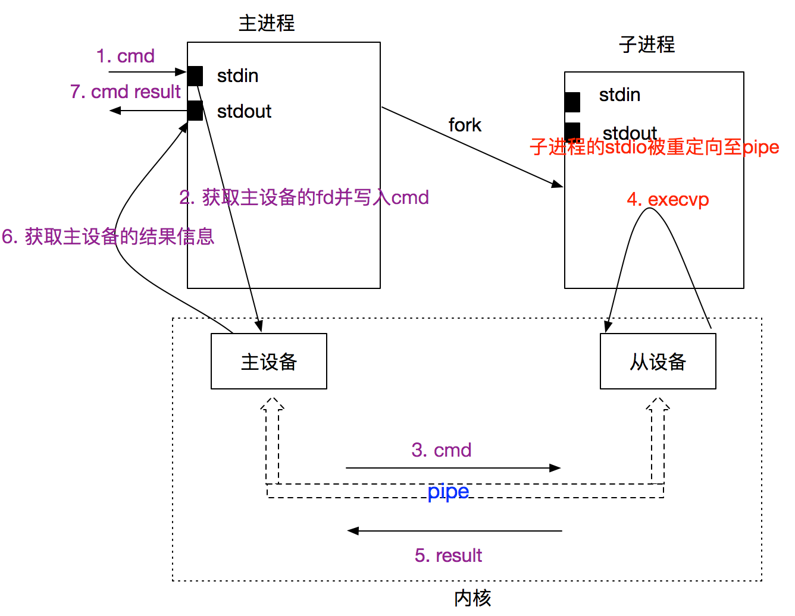
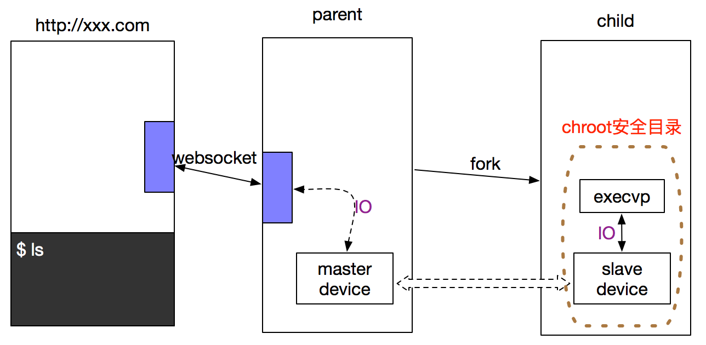
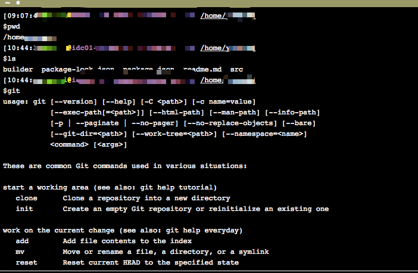

# [支持多用户web终端实现及安全保障（nodejs）](https://www.cnblogs.com/accordion/p/7918992.html)

**阅读目录**

- [背景](https://www.cnblogs.com/accordion/p/7918992.html#_label0)
- [调研](https://www.cnblogs.com/accordion/p/7918992.html#_label1)
- [伪终端实现思路](https://www.cnblogs.com/accordion/p/7918992.html#_label2)
- [web终端安全性保证](https://www.cnblogs.com/accordion/p/7918992.html#_label3)
- [结尾](https://www.cnblogs.com/accordion/p/7918992.html#_label4)
- [参考文献](https://www.cnblogs.com/accordion/p/7918992.html#_label5)

## 背景

terminal（命令行）作为本地IDE普遍拥有的功能，对项目的git操作以及文件操作有着非常强大的支持。对于WebIDE，在没有web伪终端的情况下，仅仅提供封装的命令行接口是完全不能满足开发者使用，因此为了更好的用户体验，web伪终端的开发也就提上日程。

> 关于终端（tty）与伪终端（pty）的区别，大家可以参考[What do pty and tty mean?](https://stackoverflow.com/questions/4426280/what-do-pty-and-tty-mean)

## 调研

终端，在我们认知范围内略同于命令行工具，通俗点说就是可以执行shell的进程。每次在命令行中输入一串命令，敲入回车，终端进程都会fork一个子进程，用来执行输入的命令，终端进程通过系统调用wait4()监听子进程退出，同时通过暴露的stdout输出子进程执行信息。

如果在web端实现一个类似于本地化的终端功能，需要做的可能会更多：网络时延及可靠性保证、shell用户体验尽量接近本地化、web终端UI宽高与输出信息适配、安全准入控制与权限管理等。在具体实现web终端之前，需要评估这些功能那些是最核心的，很明确：**shell的功能实现及用户体验、安全性**（web终端是在线上服务器中提供的一个功能，因此安全性是必须要保证的）。只有在保证这两个功能的前提下，web伪终端才可以正式上线。

下面首先针对这两个功能考虑下技术实现（服务端技术采用nodejs）：

- node原生模块提供了repl模块，它可以用来实现交互式输入并执行输出，同时提供tab补全功能，自定义输出样式等功能，可是它只能执行node相关命令，因此无法达到我们想要执行系统shell的目的
- node原生模块child_porcess，它提供了spawn这种封装了底层libuv的uv_spawn函数，底层执行系统调用fork和execvp，执行shell命令。但是它未提供伪终端的其它特点，如tab自动补全、方向键显示历史命令等操作

因此，服务端采用node的原生模块是无法实现一个伪终端的，需要继续探索伪终端的原理和node端的实现方向。

### 伪终端

伪终端不是真正的终端，而是内核提供的一个“服务”。终端服务通常包括三层：

- 最顶层提供给字符设备的输入输出接口
- 中间层的线路规程（line discipline）
- 底层的硬件驱动

其中，最顶层的接口往往通过系统调用函数实现，如（read，write）；而底层的硬件驱动程序则负责伪终端的主从设备通信，它由内核提供；线路规程看起来则比较抽象，但是实际上从功能上说它负责输入输出信息的“加工”，如处理输入过程中的中断字符（ctrl + c）以及一些回退字符（backspace 和 delete）等，同时转换输出的换行符\n为\r\n等。

一个伪终端分为两部分：主设备和从设备，他们底层通过实现默认线路规程的双向管道连接（硬件驱动）。伪终端主设备的任何输入都会反映到从设备上，反之亦然。从设备的输出信息也通过管道发送给主设备，这样可以在伪终端的从设备中执行shell，完成终端的功能。

伪终端的从设备中，可以真实的模拟终端的tab补全和其他的shell特殊命令，因此在node原生模块不能满足需求的前提下，我们需要把目光放到底层，看看OS提供了什么功能。目前，glibc库提供了posix_openpt接口，不过流程有些繁琐：

1. 使用posix_openpt打开一个伪终端主设备
2. grantpt设置从设备的权限
3. unlockpt解锁对应的从设备
4. 获取从设备名称（类似 /dev/pts/123）
5. 主（从）设备读写，执行操作

因此出现了封装更好的pty库，仅仅通过一个forkpty函数便可以实现上述所有功能。通过编写一个node的c++扩展模块，搭配pty库实现一个在伪终端从设备执行命令行的terminal。

关于伪终端安全性的问题，我们在文章的最后在进行讨论。

## 伪终端实现思路

根据伪终端的主从设备的特性，我们在主设备所在的父进程中管理伪终端的生命周期及其资源，在从设备所在的子进程中执行shell，执行过程中的信息及结果通过双向管道传输给主设备，由主设备所在的进程向外提供stdout。


在此处借鉴pty.js的实现思路：

```
  pid_t pid = pty_forkpty(&master, name, NULL, &winp);

  switch (pid) {
    case -1:
      return Nan::ThrowError("forkpty(3) failed.");
    case 0:
      if (strlen(cwd)) chdir(cwd);

      if (uid != -1 && gid != -1) {
        if (setgid(gid) == -1) {
          perror("setgid(2) failed.");
          _exit(1);
        }
        if (setuid(uid) == -1) {
          perror("setuid(2) failed.");
          _exit(1);
        }
      }

      pty_execvpe(argv[0], argv, env);

      perror("execvp(3) failed.");
      _exit(1);
    default:
      if (pty_nonblock(master) == -1) {
        return Nan::ThrowError("Could not set master fd to nonblocking.");
      }

      Local<Object> obj = Nan::New<Object>();
      Nan::Set(obj,
        Nan::New<String>("fd").ToLocalChecked(),
        Nan::New<Number>(master));
      Nan::Set(obj,
        Nan::New<String>("pid").ToLocalChecked(),
        Nan::New<Number>(pid));
      Nan::Set(obj,
        Nan::New<String>("pty").ToLocalChecked(),
        Nan::New<String>(name).ToLocalChecked());

      pty_baton *baton = new pty_baton();
      baton->exit_code = 0;
      baton->signal_code = 0;
      baton->cb.Reset(Local<Function>::Cast(info[8]));
      baton->pid = pid;
      baton->async.data = baton;

      uv_async_init(uv_default_loop(), &baton->async, pty_after_waitpid);

      uv_thread_create(&baton->tid, pty_waitpid, static_cast<void*>(baton));

      return info.GetReturnValue().Set(obj);
  }
```

首先通过pty_forkpty（forkpty的posix实现，兼容 sunOS和 unix等系统）创建主从设备，然后在子进程中设置权限之后（setuid、setgid），执行系统调用pty_execvpe（execvpe的封装），此后主设备的输入信息都会在此得到执行（子进程执行的文件为**sh**，会侦听stdin）；

父进程则向node层暴露相关对象，如主设备的fd（通过该fd可以创建net.Socket对象进行数据双向传输），同时注册libuv的消息队列**&baton->async**，当子进程退出时触发**&baton->async**消息，执行pty_after_waitpid函数；
最后父进程通过调用uv_thread_create创建一个子进程，用于侦听上一个子进程的退出消息（通过执行系统调用wait4，阻塞侦听特定pid的进程，退出信息存放在第三个参数中），pty_waitpid函数封装了wait4函数，同时在函数末尾执行**uv_async_send(&baton->async)**触发消息。

在底层实现pty模型后，在node层需要做一些stdio的操作。由于伪终端主设备是在父进程中执行系统调用的创建的，而且主设备的文件描述符通过fd暴露给node层，那么伪终端的输入输出也就通过读写根据fd创建对应的文件类型如PIPE、FILE来完成。其实，在OS层面就是把伪终端主设备看为一个PIPE，双向通信。在node层通过net.Socket(fd)创建一个套接字实现数据流的双向IO，伪终端的从设备也有着主设备相同的输入，从而在子进程中执行对应的命令，子进程的输出也会通PIPE反应在主设备中，进而触发node层Socket对象的data事件。

> 此处关于父进程、主设备、子进程、从设备的输入输出描述有些让人迷惑，在此解释。父进程与主设备的关系是：父进程通过系统调用创建主设备（可看做是一个PIPE），并获取主设备的fd。父进程通过创建该fd的connect socket实现向子进程（从设备）的输入输出。 而子进程通过forkpty 创建后执行login_tty操作，重置了子进程的stdin、stderr和stderr，全部复制为从设备的fd（PIPE的另一端）。因此子进程输入输出都是与从设备的fd相关联的，子进程输出数据走的是PIPE，并从PIPE中读入父进程的命令。**详情请看参考文献之forkpty实现**

另外，pty库提供了伪终端的大小设置，因此我们通过参数可以调整伪终端输出信息的布局信息，因此这也提供了在web端调整命令行宽高的功能，只需在pty层设置伪终端窗口大小即可，该窗口是以字符为单位。

## web终端安全性保证

基于glibc提供的pty库实现伪终端后台，是没有任何安全性保证的。我们想通过web终端直接操作服务端的某个目录，但是通过伪终端后台可以直接获取root权限，这对服务而言是不可容忍的，因为它直接影响着服务器的安全，所有需要实现一个：**可多用户同时在线、可配置每个用户访问权限、可访问特定目录的、可选择配置bash命令、用户间相互隔离、用户无感知当前环境且环境简单易部署的“系统”**。

最为适合的技术选型是docker，作为一种内核层面的隔离，它可以充分利用硬件资源，且十分方便映射宿主机的相关文件。但是docker并不是万能的，如果程序运行在docker容器中，那么为每个用户再分配一个容器就会变得复杂得多，而且不受运维人员掌控，这就是所谓的DooD（docker out of docker）-- 通过volume “/usr/local/bin/docker”等二进制文件，使用宿主机的docker命令，开启兄弟镜像运行构建服务。而采用业界经常讨论的docker-in-docker模式会存在诸多缺点，特别是文件系统层面的，这在参考文献中可以找到。因此，docker技术并不适合已经运行在容器中的服务解决用户访问安全问题。

接下来需要考虑单机上的解决方案。目前笔者只想到两种方案：

- 命令ACL，通过命令白名单的方式实现
- restricted bash
- chroot，针对每个用户创建一个系统用户，监禁用户访问范围

首先，命令白名单的方式是最应该排除的，首先无法保证不同release的linux的bash是相同的；其次无法有效穷举所有的命令；最后由于伪终端提供的tab命令补全功能以及特殊字符如delete的存在，无法有效匹配当前输入的命令。因此白名单方式漏洞太多，放弃。

restricted bash，通过**/bin/bash -r**触发，可以限制使用者显式“cd directory”，但有这诸多缺点：

1. 不足以允许执行完全不受信任的软件。
2. 当一个被发现是shell脚本的命令被执行时，rbash会关闭在shell中生成的任何限制来执行脚本。
3. 当用户从rbash运行bash或dash，那么他们获得了无限制的shell。
4. 有很多方法来打破受限制的bash shell，这是不容易预测的。

最后，貌似只有一个解决方案了，即chroot。chroot修改了用户的根目录，在制定的根目录下运行指令。在指定根目录下无法跳出该目录，因此无法访问原系统的所有目录；同时chroot会创建一个与原系统隔离的系统目录结构，因此原系统的各种命令无法在“新系统”中使用，因为它是全新的、空的；最后，多个用户使用时他们是隔离的、透明的，完全满足我们的需求。

因此，我们最终选择chroot作为web终端的安全性解决方案。但是，使用chroot需要做非常多的额外处理，不仅包括新用户的创建，还包括命令的初始化。上文也提到“新系统”是空的，所有可执行二进制文件都没有，如“ls，pmd”等，因此初始化“新系统”是必须的。可是许多二进制文件不仅仅静态链接了许多库，还在运行时依赖动态链接库（dll），为此还需要找到每个命令依赖的诸多dll，异常繁琐。为了帮助使用者从这种无趣的过程中解脱出来，jailkit应运而生。

### jailkit，真好用

jailkit，顾名思义用来监禁用户。jailkit内部使用chroot实现创建用户根目录，同时提供了一系列指令来初始化、拷贝二进制文件及其所有的dll，而这些功能都可以通过配置文件进行操作。因此，在实际开发中采用jailkit搭配初始化shell脚本来实现文件系统隔离。

此处的初始化shell指的是预处理脚本，由于chroot需要针对每个用户设置根目录，因此在shell中为每个开通命令行权限的使用者创建对应的user，并通过jailkit配置文件拷贝基本的二进制文件及其dll，如基本的shell指令、git、vim、ruby等；最后再针对某些命令做额外的处理，以及权限重置。

在处理“新系统”与原系统的文件映射过程中，还是需要一些技巧。笔者曾经将chroot设定的用户根目录之外的其他目录通过软链接的形式建立映射，可是在jail监狱中访问软链接时仍会报错，找不到该文件，这还是由于chroot的特性导致的，没有权限访问根目录之外的文件系统；如果通过硬链接建立映射，则针对chroot设定的用户根目录中的硬链接文件做修改是可以的，但是涉及到删除、创建等操作是无法正确映射到原系统的目录的，而且硬链接无法连接目录，因此硬链接不满足需求；**最后通过mount --bind**实现，如** mount --bind /home/ttt/abc /usr/local/abc**它通过屏蔽被挂载的目录(/usr/local/abc)的目录信息（block），并在内存中维护被挂载目录与挂载目录的映射关系，对/usr/local/abc的访问都会通过传内存的映射表查询/home/ttt/abc的block，然后进行操作，实现目录的映射。

最后，初始化“新系统”完毕后，就需要通过伪终端执行jail相关命令：

**sudo jk_chrootlaunch -j /usr/local/jailuser/creater−ucreater−u{creater} -x /bin/bash\r**

开启bash程序之后便通过PIPE与主设备接收到的web终端输入（通过websocket）进行通信即可。

## 结尾

总体的设计示意图（只列出单机单个服务进程的处理图，并忽略服务器前端节点）：


线上展示：



## 参考文献

[forkpty实现](https://code.woboq.org/userspace/glibc/login/forkpty.c.html)

[What do pty and tty mean?](https://stackoverflow.com/questions/4426280/what-do-pty-and-tty-mean)

[line discipline](https://en.wikipedia.org/wiki/Line_discipline)

[使用 Docker-in-Docker 来运行 CI 或集成测试环境？三思！](https://zhuanlan.zhihu.com/p/27208085)

[mount --bind和硬连接的区别](http://blog.csdn.net/shengxia1999/article/details/52060354)