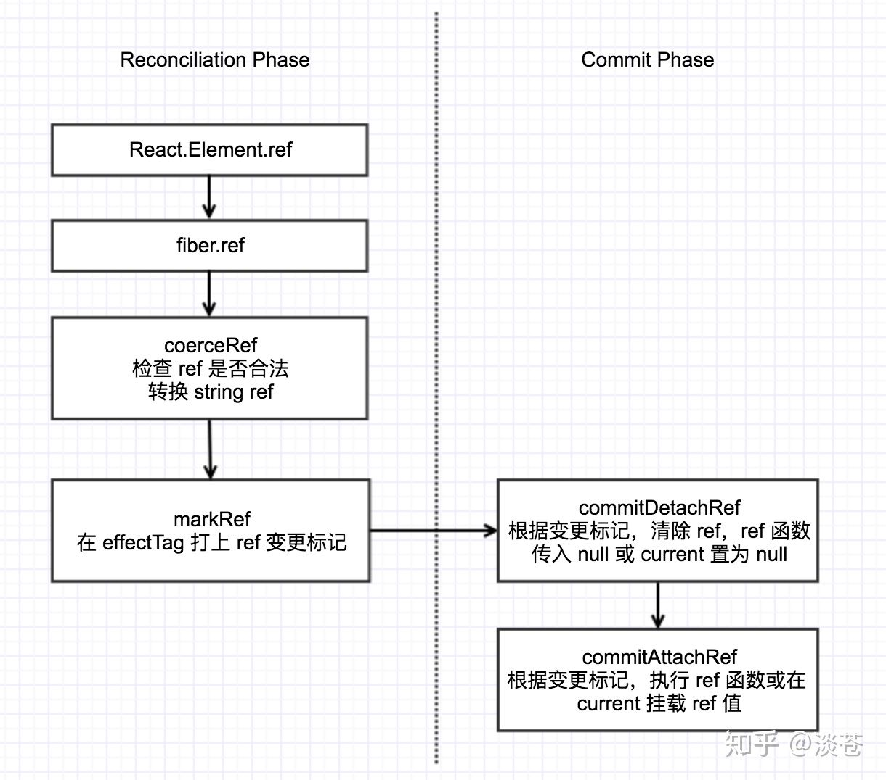

# React ref 的前世今生

众所周知，React 通过声明式的渲染机制把复杂的 DOM 操作抽象成为简单的 state 与 props 操作，一时圈粉无数，一夜间将前端工程师从面条式的 DOM 操作中拯救出来。尽管我们一再强调在 React 开发中尽量避免 DOM 操作，但在一些场景中仍然无法避免。当然 React 并没有把路堵死，它提供了 ref 用于访问在 render 方法中创建的 DOM 元素或者是 React 组件实例。

## **ref 的三驾马车**

在 React v16.3 之前，ref 通过字符串（string ref）或者回调函数（callback ref）的形式进行获取，在 v16.3 中，经 [0017-new-create-ref](https://link.zhihu.com/?target=https%3A//github.com/reactjs/rfcs/blob/master/text/0017-new-create-ref.md) 提案引入了新的 React.createRef API。

注意：本文以下代码示例以及源码均基于或来源于 React v16.3.2 release 版本。

```js
// string ref
class MyComponent extends React.Component {
  componentDidMount() {
    this.refs.myRef.focus();
  }
  render() {
    return <input ref="myRef" />;
  }
}

// callback ref
class MyComponent extends React.Component {
  componentDidMount() {
    this.myRef.focus();
  }
  render() {
    return <input ref={(ele) => {
      this.myRef = ele;
    }} />;
  }
}

// React.createRef
class MyComponent extends React.Component {
  constructor(props) {
    super(props);
    this.myRef = React.createRef();
  }
  componentDidMount() {
    this.myRef.current.focus();
  }
  render() {
    return <input ref={this.myRef} />;
  }
}
```

## **string ref 之殇**

在 React.createRef 出现之前，string ref 就已被诟病已久，React 官方文档直接提出 string ref 将会在未来版本被移出，建议用户使用 callback ref 来代替，为何需要这么做呢？主要原因集中于以下几点：

- 当 ref 定义为 string 时，需要 React 追踪当前正在渲染的组件，在 reconciliation 阶段，React Element 创建和更新的过程中，ref 会被封装为一个闭包函数，等待 commit 阶段被执行，这会对 React 的性能产生一些影响。

```js
function coerceRef(
  returnFiber: Fiber,
  current: Fiber | null,
  element: ReactElement,
) {
  ...
  const stringRef = '' + element.ref;
  // 从 fiber 中得到实例
  let inst = ownerFiber.stateNode;
  
  // ref 闭包函数
  const ref = function(value) {
    const refs = inst.refs === emptyObject ? (inst.refs = {}) : inst.refs;
    if (value === null) {
      delete refs[stringRef];
    } else {
      refs[stringRef] = value;
    }
  };
  ref._stringRef = stringRef;
  return ref;
  ...
}
```

- 当使用 render callback 模式时，使用 string ref 会造成 ref 挂载位置产生歧义。

```js
class MyComponent extends Component {
  renderRow = (index) => {
    // string ref 会挂载在 DataTable this 上
    return <input ref={'input-' + index} />;

    // callback ref 会挂载在 MyComponent this 上
    return <input ref={input => this['input-' + index] = input} />;
  }
 
  render() {
    return <DataTable data={this.props.data} renderRow={this.renderRow} />
  }
}
```

- string ref 无法被组合，例如一个第三方库的父组件已经给子组件传递了 ref，那么我们就无法再在子组件上添加 ref 了，而 callback ref 可完美解决此问题。

```js
/** string ref **/
class Parent extends React.Component {
  componentDidMount() {
    // 可获取到 this.refs.childRef
    console.log(this.refs);
  }
  render() {
    const { children } = this.props;
    return React.cloneElement(children, {
      ref: 'childRef',
    });
  }
}

class App extends React.Component {
  componentDidMount() {
    // this.refs.child 无法获取到
    console.log(this.refs);
  }
  render() {
    return (
      <Parent>
        <Child ref="child" />
      </Parent>
    );
  }
}

/** callback ref **/
class Parent extends React.Component {
  componentDidMount() {
    // 可以获取到 child ref
    console.log(this.childRef);
  }
  render() {
    const { children } = this.props;
    return React.cloneElement(children, {
      ref: (child) => {
        this.childRef = child;
        children.ref && children.ref(child);
      }
    });
  }
}

class App extends React.Component {
  componentDidMount() {
    // 可以获取到 child ref
    console.log(this.child);
  }
  render() {
    return (
      <Parent>
        <Child ref={(child) => {
          this.child = child;
        }} />
      </Parent>
    );
  }
}
```

- 在根组件上使用无法生效。

```js
ReactDOM.render(<App ref="app" />, document.getElementById('main')); 
```

- 对于静态类型较不友好，当使用 string ref 时，必须显式声明 refs 的类型，无法完成自动推导。
- 编译器无法将 string ref 与其 refs 上对应的属性进行混淆，而使用 callback ref，可被混淆。

```js
/** string ref，无法混淆 */
this.refs.myRef
<div ref="myRef"></div>

/** callback ref, 可以混淆 */
this.myRef
<div ref={(dom) => { this.myRef = dom; }}></div>

this.r
<div ref={(e) => { this.r = e; }}></div>
```

## **createRef vs callback ref**

对比新的 createRef 与 callback ref，并没有压倒性的优势，只是希望成为一个便捷的特性，在性能上会会有微小的优势，callback ref 采用了组件 render 过程中在闭包函数中分配 ref 的模式，而 createRef 则采用了 object ref。

createRef 显得更加直观，类似于 string ref，避免了 callback ref 的一些理解问题，对于 callback ref 我们通常会使用内联函数的形式，那么每次渲染都会重新创建，由于 react 会清理旧的 ref 然后设置新的（见下图，commitDetachRef -> commitAttachRef），因此更新期间会调用两次，第一次为 null，如果在 callback 中带有业务逻辑的话，可能会出错，当然可以通过将 callback 定义成类成员函数并进行绑定的方式避免。

```js
class App extends React.Component {
  state = {
    a: 1,
  };
  
  componentDidMount() {
    this.setState({
      a: 2,
    });
  }
  
  render() {
    return (
      <div ref={(dom) => {
        // 输出 3 次
        // <div data-reactroot></div>
        // null
        // <div data-reactroot></div>
        console.log(dom);
      }}></div>
    );
  }
}

class App extends React.Component {
  state = {
    a: 1,
  };

  constructor(props) {
    super(props);
    this.refCallback = this.refCallback.bind(this);
  }
  
  componentDidMount() {
    this.setState({
      a: 2,
    });
  }

  refCallback(dom) {
    // 只输出 1 次
    // <div data-reactroot></div>
    console.log(dom);
  }
  
  render() {
    return (
      <div ref={this.refCallback}></div>
    );
  }
}
```

不过不得不承认，createRef 在能力上仍逊色于 callback ref，例如上一节提到的组合问题，createRef 也是无能为力的。在 React v16.3 中，string ref/callback ref 与 createRef 的处理略有差别，让我们来看一下 ref 整个构建流程。



```js
// markRef 前会进行新旧 ref 的引用比较
if (current.ref !== workInProgress.ref) {
  markRef(workInProgress);
}

// effectTag 基于位操作，其中有 ref 的变更标志位
function markRef(workInProgress: Fiber) {
  workInProgress.effectTag |= Ref;
}
  
// effectTag 与 Ref 的 & 操作表示当前 fiber 有 ref 变更
if (effectTag & Ref) {
  commitAttachRef(nextEffect);
}

function commitAttachRef(finishedWork: Fiber) {
  const ref = finishedWork.ref;
  if (ref !== null) {
    const instance = finishedWork.stateNode;
    let instanceToUse;
    switch (finishedWork.tag) {
      // 当前 Host 环境为 DOM 环境，HostComponent 即为 DOM 元素，需要借助实例获取原生 DOM 元素
      case HostComponent:
        instanceToUse = getPublicInstance(instance);
        break;
      // 对于 ClassComponent 等而言，直接返回实例即可
      default:
        instanceToUse = instance;
    }
    // string ref 与 callback 都会去执行 ref 闭包函数
    // createRef 会直接挂在 object ref 的 current 上
    if (typeof ref === 'function') {
      ref(instanceToUse);
    } else {
      ref.current = instanceToUse;
    }
  }
}
```

以上会涉及 react fiber 的一些概念与细节，比如：fiber 对象含义，fiber tree 构建更新过程，effectTag 的含义与收集过程等等，如果读者对上述细节不熟悉，可暂时跳过此段内容，不影响对于 ref 的掌握与理解。

## **穿云箭 React.forwardRef**

除了 createRef 以外，React16 还另外提供了一个关于 ref 的 API React.forwardRef，主要用于穿过父元素直接获取子元素的 ref。在提到 forwardRef 的使用场景之前，我们先来回顾一下，HOC（higher-order component）在 ref 使用上的问题，HOC 的 ref 是无法通过 props 进行传递的，因此无法直接获取被包裹组件（WrappedComponent），需要进行中转。

```js
function HOCProps(WrappedComponent) {
  class HOCComponent extends React.Component {
    constructor(props) {
      super(props);
      this.setWrappedInstance = this.setWrappedInstance.bind(this);
    }
    
    getWrappedInstance() {
      return this.wrappedInstance;
    }

    // 实现 ref 的访问
    setWrappedInstance(ref) {
      this.wrappedInstance = ref;
    }
    
    render() {
      return <WrappedComponent ref={this.setWrappedInstance} {...this.props} />;
    }
  }

  return HOCComponent;
}

const App = HOCProps(Wrap);

<App ref={(dom) => {
  // 只能获取到 HOCComponent
  console.log(dom);
  // 通过中转后可以获取到 WrappedComponent
  console.log(dom.getWrappedInstance());
}} />
```

在拥有 forwardRef 之后，就不需要再通过 getWrappedInstance 了，利用 forwardRef 能直接穿透 HOCComponent 获取到 WrappedComponent。

```js
function HOCProps(WrappedComponent) {
  class HOCComponent extends React.Component {
    render() {
      const { forwardedRef, ...rest } = this.props;
      return <WrappedComponent ref={forwardedRef} {...rest} />;
    }
  }

  return React.forwardRef((props, ref) => {
    return <HOCComponent forwardedRef={ref} {...props}  />;
  });
}

const App = HOCProps(Wrap);

<App ref={(dom) => {
  // 可以直接获取 WrappedComponent
  console.log(dom);
}} />
```

React.forwardRef 的原理其实非常简单，forwardRef 会生成 react 内部一种较为特殊的 Component。当进行创建更新操作时，会将 forwardRef 组件上的 props 与 ref 直接传递给提前注入的 render 函数，来生成 children。

```js
const nextChildren = render(workInProgress.pendingProps, workInProgress.ref);
```

React refs 到此就全部介绍完了，在 React16 新版本中，新引入了 React.createRef 与 React.forwardRef 两个 API，有计划移除老的 string ref，使 ref 的使用更加便捷与明确。如果你的应用已经升级到 React16.3+ 版本，那就放心大胆使用 React.createRef 吧，如果暂时没有的话，建议使用 callback ref 来代替 string ref。

我们团队目前正在深入研究 React16，欢迎社区小伙伴和我们一起探讨与前行，如果想加入我们，欢迎私聊或投递简历到 [dancang.hj@alibaba-inc.com](mailto:dancang.hj@alibaba-inc.com)。

编辑于 2018-07-24