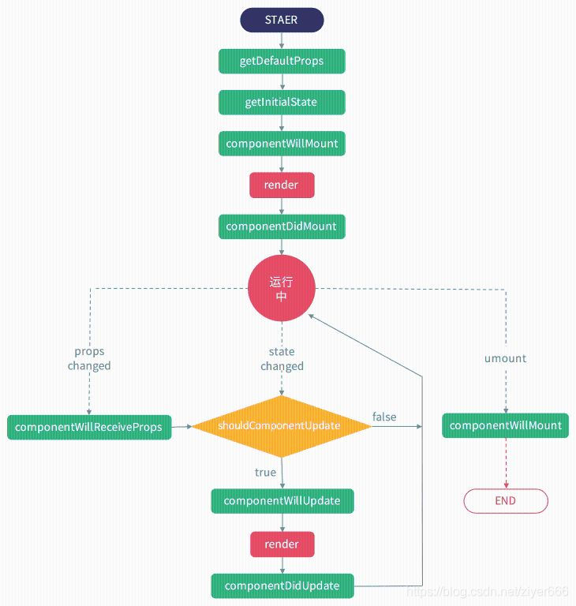
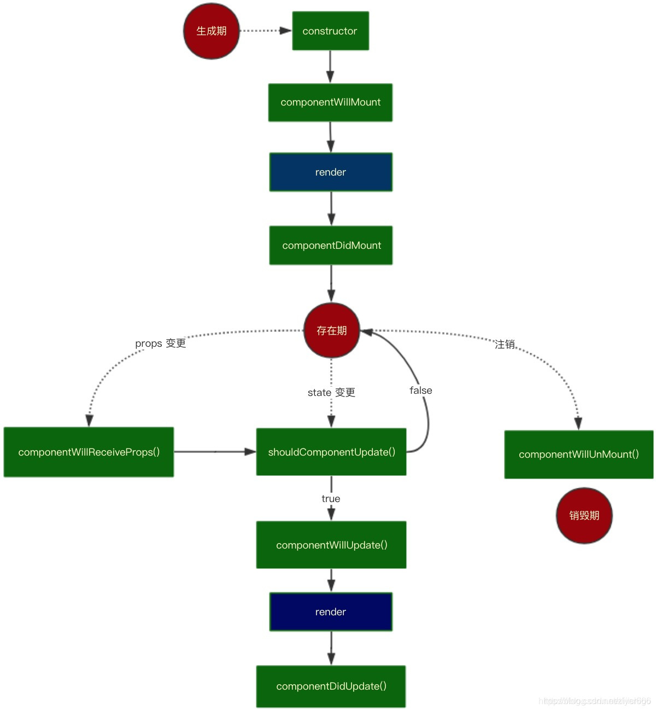
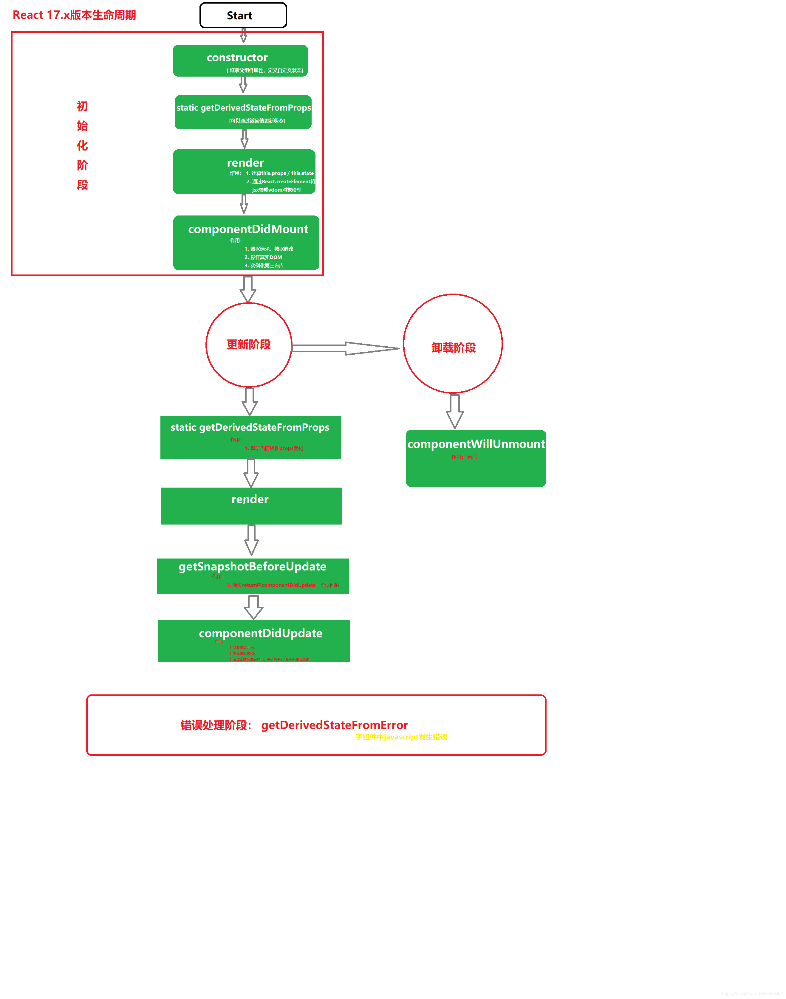

# react的生命周期函数

### react的生命周期函数有哪些：

#### life hooks
组件将要挂载时触发的函数：componentWillMount
组件挂载完成时触发的函数：componentDidMount
是否要更新数据时触发的函数：shouldComponentUpdate
将要更新数据时触发的函数：componentWillUpdate
数据更新完成时触发的函数：componentDidUpdate
组件将要销毁时触发的函数：componentWillUnmount
父组件中改变了props传值时触发的函数：componentWillReceiveProps
下面来上代码详细说明一下
#### 演示demo
```html
<!DOCTYPE html>
<html lang="en">
<head>
	<meta charset="UTF-8">
	<title>2_react生命周期(旧)</title>
</head>
<body>
	<!-- 准备好一个“容器” -->
	<div id="test"></div>
</body>
</html>
```

jsx部分
```jsx
	<!-- 引入react核心库 -->
	<script type="text/javascript" src="../js/react.development.js"></script>
	<!-- 引入react-dom，用于支持react操作DOM -->
	<script type="text/javascript" src="../js/react-dom.development.js"></script>
	<!-- 引入babel，用于将jsx转为js -->
	<script type="text/javascript" src="../js/babel.min.js"></script>

	<script type="text/babel">
		/* 
				1. 初始化阶段: 由ReactDOM.render()触发---初次渲染
									1.	constructor()
									2.	componentWillMount()
									3.	render()
									4.	componentDidMount() =====> 常用
												  一般在这个钩子中做一些初始化的事，例如：开启定时器、发送网络请求、订阅消息
				2. 更新阶段: 由组件内部this.setSate()或父组件render触发
									1.	shouldComponentUpdate()
									2.	componentWillUpdate()
									3.	render() =====> 必须使用的一个
									4.	componentDidUpdate()
				3. 卸载组件: 由ReactDOM.unmountComponentAtNode()触发
									1.	componentWillUnmount()  =====> 常用
													一般在这个钩子中做一些收尾的事，例如：关闭定时器、取消订阅消息
		*/
		//创建组件
		class Count extends React.Component{

			//构造器
			constructor(props){console.log('Count---constructor');
				super(props)
				//初始化状态
				this.state = {count:0}
			}

			//加1按钮的回调
			add = ()=>{
				//获取原状态
				const {count} = this.state
				//更新状态
				this.setState({count:count+1})
			}

			//卸载组件按钮的回调
			death = ()=>{
				ReactDOM.unmountComponentAtNode(document.getElementById('test'))
			}

			//强制更新按钮的回调
			force = ()=>{
				this.forceUpdate()
			}

			//组件将要挂载的钩子
			componentWillMount(){console.log('Count---componentWillMount');}

			//组件挂载完毕的钩子
			componentDidMount(){console.log('Count---componentDidMount');}

			//组件将要卸载的钩子
			componentWillUnmount(){console.log('Count---componentWillUnmount');}

			//控制组件更新的“阀门” 必须返回一个布尔值
			shouldComponentUpdate(){
        console.log('Count---shouldComponentUpdate');return true
      }

			//组件将要更新的钩子
			componentWillUpdate(){console.log('Count---componentWillUpdate');}

			//组件更新完毕的钩子
			componentDidUpdate(){console.log('Count---componentDidUpdate');}

			render(){
				console.log('Count---render');
				const {count} = this.state
				return(
					<div>
						<h2>当前求和为：{count}</h2>
						<button onClick={this.add}>点我+1</button>
						<button onClick={this.death}>卸载组件</button>
						<button onClick={this.force}>不更改任何状态中的数据，强制更新一下</button>
					</div>
				)
			}
		}
		
		//父组件A
		class A extends React.Component{
			//初始化状态
			state = {carName:'奔驰'}
			changeCar = ()=>{this.setState({carName:'奥拓'})}

			render(){
				return(
					<div>
						<div>我是A组件</div>
						<button onClick={this.changeCar}>换车</button>
						<B carName={this.state.carName}/>
					</div>
				)
			}
		}
		
		//子组件B
		class B extends React.Component{
			//组件将要接收新的props的钩子
			componentWillReceiveProps(props){
				console.log('B---componentWillReceiveProps',props);
			}

			//控制组件更新的“阀门”
			shouldComponentUpdate(){
				console.log('B---shouldComponentUpdate');return true
			}
			//组件将要更新的钩子
			componentWillUpdate(){console.log('B---componentWillUpdate');}

			//组件更新完毕的钩子
			componentDidUpdate(){console.log('B---componentDidUpdate');}

			render(){
				console.log('B---render');
				return(
					<div>我是B组件，接收到的车是:{this.props.carName}</div>
				)
			}
		}
		//渲染组件
		ReactDOM.render(<Count/>,document.getElementById('test'))
	</script>
```


### 主要四个步骤

#### 一.挂载部分
根据官方生命周期图我们可以看到，一个组件的加载渲染，首先是defaultProps和propsTypes，（这两个是什么下一篇会单独说，这里也不是重点）
然后就是constructor及this.state里的初始数据，所以到这里是第一步。接着就是componentWillMount 组件将要开始挂载了，这是第二步。然后组件挂载，render解析渲染，所以第三步呼之欲出，就是render数据都渲染完成，最后componentDidMount
组件挂载完成。

子组件代码，父组件内引入渲染即可（这里先不上代码）
```jsx
import React ,{Component} from 'react'

class Hsq extends Component{
	constructor(props){
		console.log('01构造函数')		
		super(props)
		this.state={
			

		}
	}
	//组件将要挂载时候触发的生命周期函数
	componentWillMount(){
		console.log('02组件将要挂载')
	}
	//组件挂载完成时候触发的生命周期函数
	componentDidMount(){
		console.log('04组件将要挂载')
	}
	render(){
		console.log('03数据渲染render')
		return(
			<div>
				生命周期函数演示
			</div>
		) 
	}
	}
	export default Hsq
```

#### 二.数据更新部分
数据更新的话第一步是shouldComponentUpdate确认是否要更新数据，当这个函数返回的是true的时候才会进行更新，并且这个函数可以声明两个参数nextProps和nextState，
nextProps是父组件传给子组件的值，nextState是数据更新之后值，这两个值可以在这个函数中获取到。第二步当确认更新数据之后componentWillUpdate将要更新数据，第三步依旧是render，数据发生改变render重新进行了渲染。第四步是componentDidUpdate数据更新完成。

代码的话子组件在上一部分的基础上，在this.state中定义一个初始数据，render中绑定一下这个数据，之后再增加一个按钮声明一个onClick事件去改变这个数据。这样可以看到数据更新部分的效果，我这里把第一部分的代码删掉了，看着不那么乱。
```jsx
import React ,{Component} from 'react'

class Hsq extends Component{
	constructor(props){
		super(props)
		this.state={
			msg:'我是一个msg数据'
		}
	}
	//是否要更新数据，如果返回true才会更新数据
	shouldComponentUpdate(nextProps,nextState){
		console.log('01是否要更新数据')
		console.log(nextProps)		//父组件传给子组件的值，这里没有会显示空
		console.log(nextState)		//数据更新后的值
		return true;				//返回true，确认更新
	}
	//将要更新数据的时候触发的
	componentWillUpdate(){
		console.log('02组件将要更新')
	}
	//更新数据时候触发的生命周期函数
	componentDidUpdate(){
		console.log('04组件更新完成')
	}
	//更新数据
	setMsg(){
		this.setState({
			msg:'我是改变后的msg数据'
		})
	}
	render(){
		console.log('03数据渲染render')
		return(
			<div>
				{this.state.msg}
				<br/>
				<hr/>
				<button onClick={()=>this.setMsg()}>更新msg的数据</button>
			</div>
		) 
	}
}
export default Hsq
```

#### 三.单独说一下componentWillReceiveProps，父组件中改变了props传值时触发的函数
这个函数也就是当我们父组件给子组件传值的时候改变了props的值时触发的函数，刚才在第二部分中也说到shouldComponentUpdate这个函数可以携带两个参数，nextProps就是父组件传给子组件的值
在父组件中定义一个初始title数据，写一个按钮声明一个onClick事件去改变这个title

#### 四.componentWillUnmount组件将要销毁时的函数
在父组件中定义一个flag为true的状态值，添加一个按钮声明一个onClick事件去
更改这个flag实现销毁组件。

### 从React15到React17–钩子变化

#### 一、15版本的钩子
getDefaultProps() （16版本已弃用）
getInitialState() （16版本已弃用）
componentWillMount()
render()
componentDidMount()
componentWillReceiveProps()
shouldComponentUpdate()
componentWillUpdate()
componentDidUpdate()
componentWillMount()
流程详见下图：



#### 二、16版本的钩子
constructor() （较15版本新增）
componentWillMount() （17版本已弃用）
render()
componentDidMount()
componentWillReceiveProps() （17版本已弃用）
shouldComponentUpdate()
componentWillUpdate() （17版本已弃用）
componentDidUpdate()
componentWillUnMount()
componentDidCatch()
流程详见下图：



#### 三、17版本（未来）的钩子
constructor()
static getDerivedStateFromProps() （较16版本新增）
render()
componentDidMount()
shouldComponentUpdate()
getSnapshotBeforeUpdate() （较16版本新增）
componentDidUpdate()
componentWillUnmount()
getDerivedStateFromError()
流程详见下图：



#### 四、各生命周期钩子详解
1、constructor(props)

用来做属性的继承、状态的定义。（继承父组件外部传递来的属性，然后绑定在当前组件的props属性上）
官方建议不要在constructor引入任何具有副作用和订阅功能的代码，这些应当使用componentDidMount()
2、static getDerivedStateFromProps(nextProps, prevState)

在组件实例化后，和接受新的props后被调用
必须返回一个对象来更新状态，或者返回null表示新的props不需要任何state的更新
3、componentWillMount()

官方都建议使用componentDidMount()代替
4、render()

将JSX转换为虚拟对象模型
解析this.props和this.state
5、componentDidMount()

做数据修改、数据请求
可在这个钩子里初始化第三方的DOM库（只有到这里才能获取真实的DOM）
6、componentWillReceiveProps()

官方建议使用getDerivedStateFromProps函数代替
当组件挂载后，接收到新的props后会被调用
如果需要更新state来响应props的更改，则可以进行this.props和nextProps的比较，并在此钩子中使用this.setState
用来做监听
7、shouldComponentUpdate(nextProps, nextState)

决定组件是否更新渲染
默认返回true，即更新
返回false不会阻止子组件在state更改时重新渲染
是React性能优化的一种方案
8、componentWillUpdate()

组件更新前的准备工作，即生成虚拟DOM
不能在这里使用this.setState()，会造成栈溢出
9、getSnapshotBeforeUpdate()

在render()后的输出被渲染到DOM之前被调用
使组件能够在它们被潜在更改之前捕获当前值（如滚动位置）
返回的任何值都将作为参数传递给componentDidUpdate()
10、componentDidUpdate(prevProps, prevState, snapshot)

组件更新结束，可以做DOM操作
如果组件实现getSnapshotBeforeUpdate()生命周期，则它返回的值将作为第三个“快照”参数传递过去。否则，这个参数是undefined。
不能在这里使用this.setState()，会造成栈溢出
11、componentWillUnmount()

在此方法中执行任何必要的清理，例如使定时器无效，或清理在componentDidMount中创建的任何监听
内部销毁用ReactDOM.unmountComponentAtNode()，会销毁全部组件
外部销毁用开关来控制组件的创建与销毁
12、componentDidCatch(error, info)

可以在其子组件树中的任何位置捕获JavaScript错误
记录这些错误并显示回退UI，而不是崩溃的组件树

#### 添加了context后会多一个钩子componentWillReact () {}

原文链接：https://blog.csdn.net/ziyer666/article/details/100940882/


