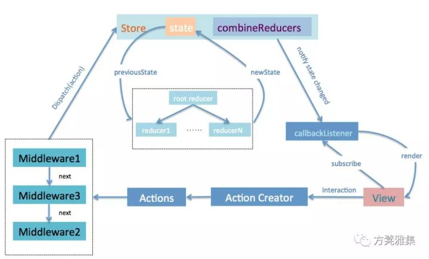
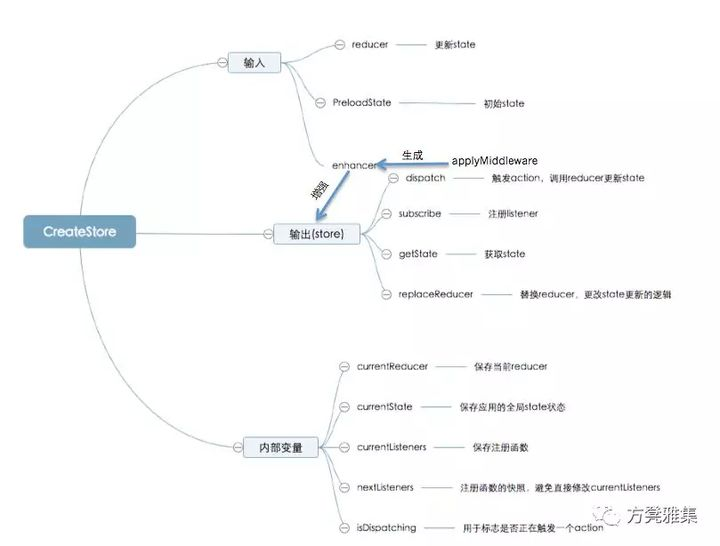
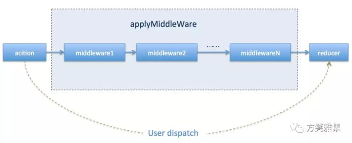
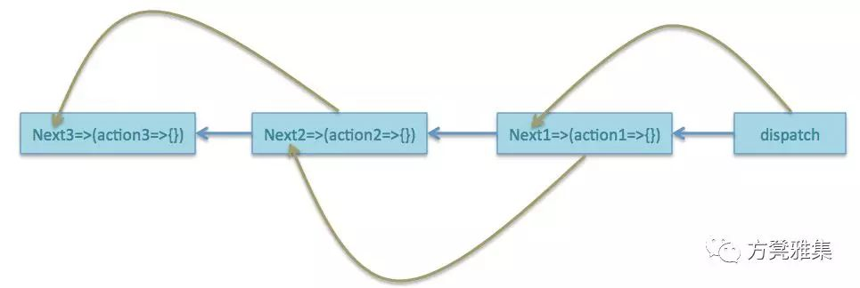
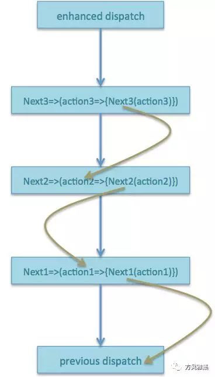

# [深入浅出Redux原理](https://zhuanlan.zhihu.com/p/50247513)

## **作者**

花名：卓汐

部门：1688 CBU技术部-体验技术-营销&工程

职位：前端工程师

**注：本专栏的文章将首先在微信同名公众号发布，所以想要关注我们文章的同学，可以关注一下我们的微信公众号——方凳雅集。**

相信大部分熟悉react的同学一定对redux很熟悉了，本文将详细解析redux内部原理，相信阅读完后，对redux会有更加深刻的认识。

## **预备知识**

先提出个疑问：我们为什么需要状态管理？

对于SPA应用来说，前端所需要管理的状态越来越多，需要查询、更新、传递的状态也越来越多，如果让每个组件都存储自身相关的状态，理论上来讲不会影响应用的运行，但在开发及后续维护阶段，我们将花费大量精力去查询状态的变化过程，在多组合组件通信或客户端与服务端有较多交互过程中，我们往往需要去更新、维护并监听每一个组件的状态，在这种情况下，如果有一种可以对状态做集中管理的地方是不是会更好呢？状态管理好比是一个集中在一处的配置箱，当需要更新状态的时候，我们仅对这个黑箱进行输入，而不用去关心状态是如何分发到每一个组件内部的，这可以让开发者将精力更好的放在业务逻辑上。

但状态管理并不是必需品，当你的UI层比较简单、没有较多的交互去改变状态的场景下，使用状态管理方式反倒会让你的项目变的复杂。例如Redux的发明者Dan Abramov 就说过这样一句话：“只有遇到 React 实在解决不了的问题，你才需要Redux”。

一般来讲，在以下场景下你或许需要使用状态管理机制去维护应用：

1. 用户操作较为繁琐，导致组件间需要有状态依赖关系，如根据多筛选条件来控制其他组件的功能。
2. 客户端权限较多且有不同的使用方式，如管理层、普通层级等。
3. 客户端与服务端有大量交互，例如请求信息实时性要求较高导致需要保证鲜活度。
4. 前端数据缓存部分较多，如记录用户对表单的提交前操作、分页控制等。


另外，本篇文章更关注业务模型层的数据流，业务模型是指所处领域的业务数据、规则、流程的集合。即使抛开所有展示层，这一层也可以不依赖于展示层而独立运行，这里要强调一点，Redux之类的状态管理库充当了一个应用的业务模型层，并不会受限于如React之类的View层。假如你已经明白了Redux的定位及应用场景的话，我们来对其原理一探究竟。

## **数据流向**

我们先来看一下一个完整的Redux数据流是怎样的：




举个最简单的例子：

```js
//创建一个最基本的store
const store =createStore(reducers);

// subscribe() 返回一个函数用来注销监听器
const unsubscribe = store.subscribe(()=>console.log(store.getState()))

// 发起一系列 action
store.dispatch(addTodo('Learn about actions'))
store.dispatch(addTodo('Learn about reducers'))
```

通过以上几句代码，我们已经实现了数据流从dispatch(action)->reducer->subscribe->view回调的整体流程(此处省略了middleWare的部分)，在这个例子中没有任何的UI层，redux也同样可以独立完成完整的数据流向。其中subscribe是对state变化更新的订阅功能，可以在回调函数中注册view渲染功能。

## **使用规范**

**Redux应用的三大原则**

- 单一数据源
  我们可以把Redux的状态管理理解成一个全局对象，那么这个全局对象是唯一的，所有的状态都在全局对象store下进行统一”配置”，这样做也是为了做统一管理，便于调试与维护。
- State是只读的
  与React的setState相似，直接改变组件的state是不会触发render进行渲染组件的。同样，在Redux中唯一改变state的方法就是触发action，action是一个用于描述发生了什么的“关键词”，而具体使action在state上更新生效的是reducer，用来描述事件发生的详细过程，reducer充当了发起一个action连接到state的桥梁。这样做的好处是当开发者试图去修改状态时，Redux会记录这个动作是什么类型的、具体完成了什么功能等（更新、传播过程），在调试阶段可以为开发者提供完整的数据流路径。
- Reducer必须是一个纯函数
  Reducer用来描述action如何改变state，接收旧的state和action，返回新的state。Reducer内部的执行操作必须是无副作用的，不能对state进行直接修改，当状态发生变化时，需要返回一个全新的对象代表新的state。这样做的好处是，状态的更新是可预测的，另外，这与Redux的比较分发机制相关，阅读Redux判断状态更新的源码部分(combineReducers)，发现Redux是对新旧state直接用==来进行比较，也就是浅比较，如果我们直接在state对象上进行修改，那么state所分配的内存地址其实是没有变化的，“==”是比较对象间的内存地址，因此Redux将不会响应我们的更新。之所以这样处理是避免对象深层次比较所带来的性能损耗（需要递归遍历比较）。


在使用Redux时，我们只要严格按照以上三种约定，就可以避免大部分不必要的bug。

## **核心源码剖析**

Redux官方代码库提供了以下几个模块文件：

- applyMiddleware.js
- bindActionCreators.js
- combineReducers.js
- compose.js
- createStore.js


针对以上模块，我们从易到难展开理解：

**compose.js**


从右到左进行函数式编程

```js
/**
 * Composes single-argument functions from right to left. The rightmost
 * function can take multiple arguments as it provides the signature for
 * the resulting composite function.
 *
 * @param {...Function} funcs The functions to compose.
 * @returns {Function} A function obtained by composing the argument functions
 * from right to left. For example, compose(f, g, h) is identical to doing
 * (...args) => f(g(h(...args))).
 */
export default function compose(...funcs) {
    if (funcs.length ===0) {
        return arg => arg
    }
    if (funcs.length ===1) {
        return funcs[0]
    }
    return funcs.reduce((a, b) => (...args) => a(b(...args)))
} 
```


以上代码很好理解，当compose无参数时，返回一个空函数，参数为唯一函数时，直接将这个函数作为返回值，重点在于最后一部分：

```js
return funcs.reduce((a, b) => (...args) => a(b(...args))) 
```

对多个参数组合成的函数数组进行reduce操作，其实以上代码等同于：

```js
return funcs.reduceRight((composed, f) => f(composed));
```

相当于对数组内的所有函数，从右至左，将前一个函数作为后一个函数的入口参数依次返回，比如compose(fn1,fn2,fn3)最后返回的结果应该是这样子的：

```js
fn1(fn2(fn3))
```

**bindActionCreators.js**

bindActionCreator将值为actionCreator的对象转化成具有相同键值的对象，每一个actionCreator都会被dispatch所包裹调用，因此可以直接使用，简而言之，bindActionCreator可以让开发者在不直接接触dispacth的前提下进行更改state的操作，下面我们来看下它是如何实现的：

```js
import warning from'./utils/warning'

function bindActionCreator (actionCreator, dispatch) {
    return (...args) => dispatch(actionCreator(...args))
}

export default function bindActionCreators (actionCreators, dispatch) {
    if (typeof actionCreators ==='function') {
        return bindActionCreator(actionCreators, dispatch)
    }
    if (typeof actionCreators !=='object'|| actionCreators ===null) {
        throw new Error(`bindActionCreators expected an object or a function, instead received ${actionCreators === null ? 'null' : typeof actionCreators}. ` + `Did you write "import ActionCreators from" instead of "import * as ActionCreators from"?`)
    }
    const keys = Object.keys(actionCreators)
    const boundActionCreators ={}
    for (let i =0; i < keys.length; i++) {
        const key = keys[i]
        const actionCreator = actionCreators[key]
        if (typeof actionCreator ==='function') {
            boundActionCreators[key] = bindActionCreator(actionCreator, dispatch)
        } else {
            warning(`bindActionCreators expected a function actionCreator for key '${key}', instead received type '${typeof actionCreator}'.`)
        }
    }
    return boundActionCreators
}
```

对于单个actionCreator，代码很简单，直接返回一个被dispatch包裹过的action而已，对于多个actionCreators，如果入口参数是一个function，说明只提供了一个actionCreator，直接调用bindActionCreator(actionCreators,dispatch)，对于以对象形式输入的多个actionCreators，对其遍历输出每一个bindActionCreator(actionCreators,dispatch)并封装在具有同名键值的boundActionCreators对象中，这样在我们需要调用action的地方直接boundActionCreators[actionCreate定义名]就可以了，是不是原理也很简单？这样我们就已经解锁两个模块了（别急，核心的东西在后面）。

**createStore.js**

CreateStore作为生成唯一store的函数，是Redux中最核心的API，我们先浏览源码感受一下(结合标明的注释)：

```js
//用于校验是否是纯对象
import isPlainObject from'lodash/isPlainObject'
//内部私有属性，暂时不做扩展
import $$observable from'symbol-observable'

//内部action,用于调用所有reducers生成初始state
export const ActionTypes ={INIT:'@@redux/INIT'}
export default function createStore(reducer, preloadedState, enhancer) {
    if (typeof preloadedState ==='function' && typeof enhancer ==='undefined') {
        enhancer = preloadedState
        preloadedState = undefined
    }
    if (typeof enhancer !=='undefined') {
        if (typeof enhancer !=='function') {
            throw new Error('Expected the enhancer to be a function.')
        }
        //函数柯里化，enhancer提供增强版(中间件扩展)的store
        return enhancer(createStore)(reducer, preloadedState) 
    }
    //reducer必须是一个function
    if (typeof reducer !=='function') {
        throw new Error('Expected the reducer to be a function.')
    }
    //store内部私有变量(外部无法直接访问)
    let currentReducer = reducer
    let currentState = preloadedState
    let currentListeners = []
    let nextListeners = currentListeners
    let isDispatching = false
    //为下一阶段监听器快照提供备份
    function ensureCanMutateNextListeners () {
        if (nextListeners === currentListeners) {
            nextListeners = currentListeners.slice()
        }
    }

    //获取最新state
    function getState() {
        return currentState
    }

    //用于订阅state的更新
    function subscribe(listener) {
        if (typeof listener !=='function') {
            throw new Error('Expected listener to be a function.')
        }
        //保证只有第一次执行unsubscribe()才是有效的，只取消注册当前listener
        let isSubscribed =true
        //为每次订阅提供快照备份nextListeners，主要防止在遍历执行currentListeners回调
        //过程中触发了订阅/取消订阅功能，若直接更新currentListeners将造成当前循环体逻辑混乱
        //因此所有订阅/取消订阅的listeners都是在nextListeners中存储的，并不会影响当前的dispatch(action)
        ensureCanMutateNextListeners()
        nextListeners.push(listener)
        //返回一个取消订阅的函数
        return function unsubscribe() {
            //保证当前listener只被取消注册一次
            if (!isSubscribed) { return }
            isSubscribed =false
            ensureCanMutateNextListeners()
            const index = nextListeners.indexOf(listener)
            nextListeners.splice(index,1)
        }
    }

    function dispatch(action) {
        //保证dispatch是个纯对象，即字面量对象或Object创建的对象
        //这是因为原始版的dispatch只支持同步action，约定的格式是纯对象
        //可以使用中间件来dispatch扩展功能，增加action的类型种类
        if (!isPlainObject(action)) {
            throw new Error('Actions must be plain objects. '+'Use custom middleware for async actions.')
        }
        //action必须要有key为type的动作类型
        if (typeof action.type ==='undefined') {
            throw new Error('Actions may not have an undefined "type" property. '+'Have you misspelled a constant?')
        }
        //判断在执行dispatch的过程中是否已存在dispatch的执行流
        //保证dispatch中对应的reducer不允许有其他dispatch操作
        if (isDispatching) {
            throw new Error('Reducers may not dispatch actions.')
        }
        try {
            //根据提供的action，执行根reducer从而更新整颗状态树
            isDispatching = true
            currentState = currentReducer(currentState, action)
        } finally {
            isDispatching = false
        }
        //通知所有之前通过subscribe订阅state更新的回调listener
        const listeners = currentListeners = nextListeners
        for(let i =0; i < listeners.length; i++) {
            const listener = listeners[i]listener()
        }
        return action
    }


    //替换当前reducers，如从其他文件引入了新的reducers进行热加载
    function replaceReducer (nextReducer) {
        if (typeof nextReducer !=='function') {
            throw new Error('Expected the nextReducer to be a function.')
        }
    }

    function observable () {
        const outerSubscribe = subscribe
        return {
            subscribe (observer) {
                if (typeof observer !=='object') {
                    throw new TypeError('Expected the observer to be an object.')
                }
            
                function observeState() {
                    if (observer.next) {
                        observer.next(getState())
                    }
                }
                observeState()
                const unsubscribe = outerSubscribe(observeState)
                return { unsubscribe }
            },
            [$$observable] () {
                return this
            }
        }
    }

    dispatch({ type: ActionTypes.INIT })
    return {
        dispatch,
        subscribe,
        getState,
        replaceReducer,
        [$$observable]: observable
    }
}
```

一眼望去，还是有些懵逼的，但如果我们把它划分为以下三个部分分别理解或许就简单多了。

- 入口参数：reducer、preloadState、enhancer
- 内部变量：currentReducer、currentState、currentListeners、nextListeners、isDispatching
- 输出：dispatch、subscribe、getState、replaceReducer


以下是CreateStore的整体架构：




现在阅读完我所标注的源码注释以及上述架构图，是不是一目了然(更加懵逼)了，首先请仔细阅读上述架构图每个入口参数、内部变量及返回的几个功能函数具体的含义，其中一些比较容易理解的地方我已经在注释中写的较详细了，现在我们着重来看下几个需要注意的地方。

**enhancer**

```js
if (typeof preloadedState ==='function' && typeof enhancer ==='undefined') {
    enhancer = preloadedState
    preloadedState = undefined
}

if (typeof enhancer !=='undefined') {
    if (typeof enhancer !=='function') {
        throw new Error('Expected the enhancer to be a function.')
    }
    //函数柯里化，enhancer提供增强版(中间件扩展)的store
    return enhancer(createStore)(reducer, preloadedState)
}
```

首先enhancer在缺省条件下判断如果preloadedState是个函数，则将其视为enhancer，这里enhancer本身是个引入中间件扩展功能的返回函数，enhancer(createStore)(reducer, preloadedState)实际上是输出一个增强了dispatch功能的store，稍后我们说到applyMiddleware再去探讨，这里只要记得它仅代表一个辅助函数就是了，没有它也不会影响我们的开发。


**nextListeners及currentListeners**

这两个变量用于存储subscribe订阅state更新时的回调函数，但我们可能会提出疑问：只用一个currentListeners存储不就好了吗？其实这里nextListeners是在dispatch的过程中起到一个快照暂存功能。如果只有currentListeners，在我们按部就班的流程下是不会出问题的，但当我们在遍历执行我们currentListeners中所有监听回调的过程中进行了subscribe或unsubscribe，比如以下的场景:

```js
for (let i =0; i < currentListeners.length; i++) {
    const listener = listeners[i]
    listener()
}
//其中有一个listener执行了以下操作:
listeners[3] = function() {
    subscribe() //会使currentListeners长度加1，影响当前遍历
}
```

上面只是个简单的例子，但完全可能发生。在这种场景下如果每次subscribe或unsubscribe都直接对currentListeners进行操作，那么将导致当前遍历执行的监听回调队列发生逻辑混乱。

**dispatch函数的实现:**

dispatch主要完成：调用对应reducer->通知所有listener更新状态。未加工的dispatch其实就完成了上面两个主要功能，首先必须要保证输入的action是一个纯对象，这样是保证未加工的dispatch功能专一，只处理同步action，若想增加action的输入类型，则必须引入applyMiddleWare模块。isDispatching提供了锁存机制，保证在当前dispatch执行流下不允许对应的reducer引入dispatch。试想一下如果我们在调用的reducer中触发了dispatch，那在新的dispatch又将引入对应reducer，最终将造成dispatch->reducer->dispatch的死循环，因此在调用dispatch时，我们先判断当前是否已经被调用过，将状态锁住，最后执行完对应reducer，再将isDispatching状态释放，以此来避免不必要的死循环问题。

**combineReducers.js**


combineReducers部分的源码相对冗杂，其中包括对生产环境/开发环境以及其他系列入参类型的校验，这里我们只关注它核心源码部分:

```js
return function combination (state ={}, action){
    let hasChanged = false
    const nextState ={}
    for (let i =0; i < finalReducerKeys.length; i++) {
        const key = finalReducerKeys[i]
        const reducer = finalReducers[key]
        //存储对应reducer的入参旧的state
        const previousStateForKey = state[key]
        const nextStateForKey = reducer(previousStateForKey, action)
        //reducer必须要有返回值
        if (typeof nextStateForKey ==='undefined') {
            const errorMessage = getUndefinedStateErrorMessage(key, action)
            throw newError(errorMessage)
        }
        nextState[key]= nextStateForKey
        hasChanged = hasChanged || nextStateForKey !== previousStateForKey
 }
    return hasChanged ? nextState : state
}
 
```

使用变量nextState记录本次执行reducer返回的state。hasChanged用来记录前后state是否发生改变。循环遍历reducers，将对应的store的部分交给相关的reducer处理。最后根据hasChanged是否改变来决定返回nextState还是state,这样就保证了在不变的情况下仍然返回的是同一个对象，这就是之前要求reducer必须是纯函数的原因，combineReducers只对新旧state进行了浅比较，若直接更改旧的state，实则引用地址没有变，将不会触发view层的render。

**applyMiddleware.js**

在使用中间件部分之前，我们先来思考什么是AOP？

目前常规的应用都是面向对象编程，当需要对我们的逻辑增加扩展功能时（如发送请求前的校验、打印日志等），我们只能在所在功能模块添加额外的扩展功能，当然你可以选择共有类通过继承方式调用，但这将导致共有类的膨胀，否则你只能将其散落在你业务逻辑的各个角落，造成代码耦合。
AOP(面向切面编程)的出现就是为了解决代码冗余、耦合问题。我们将扩展功能代码单独放入一个切面，待执行的时候才将它载入到你需要扩展功能的位置也就是切点。这样做的好处是你并不需要更改你本身的业务逻辑代码，而这样的扩展功能通过串联的方式传递调用下去就是中间件的原理。




对于开发者而言，中间件暴露在业务层的只是个简单的dipatch(action)，只不过这个dispatch是带有扩展功能的如执行异步action、打印日志、错误校验等系列功能。而applyMiddleware模块就是把这样的思念串联执行下去但不影响原有业务状态，我们再来膜拜一下这部分的源码：

```js
export default function applyMiddleware (...middlewares) {
    return (next) => (reducer, initialState) => {
        var store = next(reducer, initialState);
        var dispatch = store.dispatch;
        var chain =[];
        var middlewareAPI = {
            getState: store.getState, 
            dispatch:(action)=>dispatch(action)
        };
        chain = middlewares.map(middleware =>middleware(middlewareAPI)); 
        dispatch = compose(...chain, store.dispatch);
        return {
            ...store,
            dispatch
        };
    };
}
```

说实话，笔者第一次看这部分源码的时候十分开心，以为这么几行代码花个几分钟就可以渗透了，然而...（还是年轻啊）我们先谨记上面提到过的部分：中间件的亮点在于在不破坏原有结构的接触上传递扩展功能而只暴露给开发者简单的API。

现在我们来一起一行一行分析上面短小精悍的源码，首先来看下它的声明方式：

```js
function applyMiddleware(...middlewares) {
    return (next) => (reducer, initialState) => {}
}
```

这类采用了函数柯里化的方式来化多参数为单一参数，我理解就是将固定的参数丢到闭包中，待引入作为单一入口参数时，结合闭包中存在的已有参数来执行功能函数，从一定角度来说提高了代码复用性。

接着执行 `var store = next(reducer,initialState)` 这里的next是增强store函数的第一个入参，也就是CreateStore，那这里的store就是返回一个纯天然未加工过的store(和未引入中间件的store一样)，这样做的原因是中间件的作用只是想扩展dispatch的能力而不影响其他属性及方法，我们只需要用带有扩展能力的dispatch去覆盖原有store的对应方法就可以了，接着，获取原始dispatch用来后续的加工处理。

chain是一个用来缓存中间件扩展功能的队列，通过对middlewares的遍历，队列中的每个元素是middleware(middlewareAPI)的结果。这时候我们可能还不知到一个middleware到底长啥样子，更别提它返回的结果了，现在让我们拿redux thunk中间件来举个 ：

```js
export default function thunkMiddleware({ dispatch, getState }) {
    return next => action => typeof action === ‘function’ ? action(dispatch, getState) : next(action);
}
```

可以看到中间件的定义方法又是一个经典的curry方式，那middleware(middlewareAPI)返回的结果就应该是next=>action=>{},现在我们只需要记住chain队列中缓存的每一个元素都长next=>action=>{}这个样子就可以了。

再抛出个疑问：为什么要定义一个middlewareAPI呢，并将其作为每个中间件函数的入参呢？

这是为了使middlewareAPI如getState及dispatch方法缓存在闭包当中，并将这两个方法传递到每一个中间件当中。当dispatch发生扩展更新时，由于它存在于闭包当中，所有中间件都可以取到最新的dispatch方法，在需要的时候也可以通过中间件将这些方法传递到reducer当中。例如上述的react thunk用来为action增加异步功能，当action是一个function时，将存在于闭包当中的dispatch和getState作为action的入参，而这时的dispatch就是最新的被扩展后的dispatch！

结合后面的compose，我们可以将这些扩展功能串联起来。还记得大明湖畔的compose吗——从右向左嵌套包裹函数。到这里我们来整理下我们的思路：chain队列中缓存的每一个中间件调用结果是next=>action=>{}，现在用compose将他们串联起来就是:




从最右边的dispatch开始，依次将前一个next=>action=>{}的执行结果(即action=>{})传递到后面next=>action=>{}中的入参next，也就是说，这里的next是串联所有中间件的关键一步，最后暴露最外层的(假设是funN)结果就是funN(funN-1(...dispatch)),结果是action=>{}形式的，最后将其作为新的dispatch并覆盖到原有store当中。

我们回过头再去看一下redux thunk的代码，当我们调用被中间件扩展后的dispatch(action)时，实际上执行的是中间件的action=>{}部分，当action是function类型即是异步动作时，将最新的dispatch通过action传递下去，这样在action函数执行完异步操作(如异步请求后)，后我们又有了dispatch的执行权以进行同步action或进一步的异步嵌套。

这里需要注意的是每个中间件都是通过next(action)来进行传递的，中间件在执行next(action)时，由于next中存储的是前一个中间件的action=>{}，因此会回调前一个中间件函数，依次向前执行，直到将action传递到最右侧的原始dispatch执行dispatch(action)，这就是中间件的精华所在：可以在不暴露额外api的前提下根据原有业务逻辑提供的参数进行扩展action，但又不直接在action进行改造，以此做到了action->reducer的分步劫持，回调方式如下。





另外，我个人理解中间件的next(action)代码位置决定了中间件扩展功能的执行顺序，如果放在中间件的顶部，则立刻去执行回调即前一个action=>{}，这样最终的执行顺序将是从右到左依次执行，相反，如果我们将next(action)操作放在最底部，中间件将执行完自身扩展功能再去回调前一个中间件，由于中间件的引入顺序和代码编写都是需要开发者自己提供，因此中间件的真正执行顺序也完全可以由开发者自己掌控。

## **总结**

至此，完成了redux的所有源码剖析... redux源码虽然代码量少，但确实不是很好理解，建议最好还是在理解原理的前提下多搞几个官网的demo跑一下感受一下数据流的走向。


发布于 2018-11-19