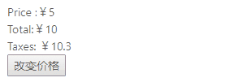
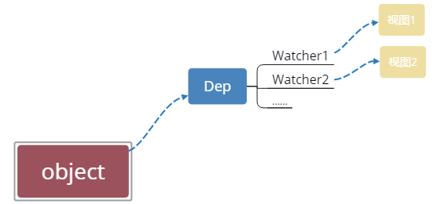
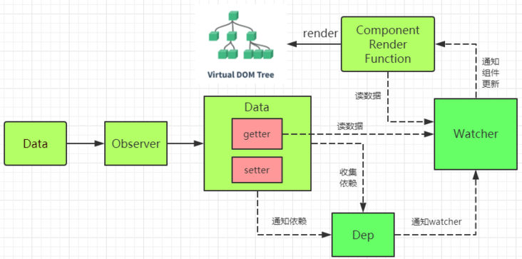

# [深入浅出Vue响应式原理](https://segmentfault.com/a/1190000019700618)

## 前言

Vue 最独特的特性之一，是其非侵入性的响应式系统。数据模型仅仅是普通的 JavaScript 对象。而当你修改它们时，视图会进行更新。这使得状态管理非常简单直接，不过理解其工作原理同样重要，这样你可以避开一些常见的问题。----官方文档
本文将针对响应式原理做一个详细介绍，并且带你实现一个基础版的响应式系统。本文的代码请猛戳[Github博客](https://github.com/ljianshu/Blog/tree/master/vue2.0学习/内部运行机制/响应式原理)

## 什么是响应式

我们先来看个例子：

```
<div id="app">
    <div>Price :￥{{ price }}</div>
    <div>Total:￥{{ price * quantity }}</div>
    <div>Taxes: ￥{{ totalPriceWithTax }}</div>
    <button @click="changePrice">改变价格</button>
</div>
var app = new Vue({
  el: '#app',
  data() {
    return {
      price: 5.0,
      quantity: 2
    };
  },
  computed: {
    totalPriceWithTax() {
      return this.price * this.quantity * 1.03;
    }
  },
  methods: {
    changePrice() {
      this.price = 10;
    }
  }
})
```



上例中当price 发生变化的时候，Vue就知道自己需要做三件事情：

- 更新页面上price的值
- 计算表达式 price*quantity 的值，更新页面
- 调用totalPriceWithTax 函数，更新页面

数据发生变化后，会重新对页面渲染，这就是Vue响应式，那么这一切是怎么做到的呢？

想完成这个过程，我们需要：

- 侦测数据的变化
- 收集视图依赖了哪些数据
- 数据变化时，自动“通知”需要更新的视图部分，并进行更新

对应专业俗语分别是：

- 数据劫持 / 数据代理
- 依赖收集
- 发布订阅模式

## 如何侦测数据的变化

首先有个问题，在Javascript中，如何侦测一个对象的变化？
其实有两种办法可以侦测到变化：使用`Object.defineProperty`和ES6的`Proxy`，这就是进行数据劫持或数据代理。这部分代码主要参考珠峰架构课。

### 方法1.Object.defineProperty实现

Vue通过设定对象属性的 setter/getter 方法来监听数据的变化，通过getter进行依赖收集，而每个setter方法就是一个观察者，在数据变更的时候通知订阅者更新视图。

```
function render () {
  console.log('模拟视图渲染')
}
let data = {
  name: '浪里行舟',
  location: { x: 100, y: 100 }
}
observe(data)
function observe (obj) { // 我们来用它使对象变成可观察的
  // 判断类型
  if (!obj || typeof obj !== 'object') {
    return
  }
  Object.keys(obj).forEach(key => {
    defineReactive(obj, key, obj[key])
  })
  function defineReactive (obj, key, value) {
    // 递归子属性
    observe(value)
    Object.defineProperty(obj, key, {
      enumerable: true, //可枚举（可以遍历）
      configurable: true, //可配置（比如可以删除）
      get: function reactiveGetter () {
        console.log('get', value) // 监听
        return value
      },
      set: function reactiveSetter (newVal) {
        observe(newVal) //如果赋值是一个对象，也要递归子属性
        if (newVal !== value) {
          console.log('set', newVal) // 监听
          render()
          value = newVal
        }
      }
    })
  }
}
data.location = {
  x: 1000,
  y: 1000
} //set {x: 1000,y: 1000} 模拟视图渲染
data.name // get 浪里行舟
```

上面这段代码的主要作用在于：`observe`这个函数传入一个 `obj`（需要被追踪变化的对象），通过遍历所有属性的方式对该对象的每一个属性都通过 `defineReactive` 处理,以此来达到实现侦测对象变化。值得注意的是，`observe` 会进行递归调用。
那我们如何侦测Vue中`data` 中的数据，其实也很简单：

```
class Vue {
    /* Vue构造类 */
    constructor(options) {
        this._data = options.data;
        observer(this._data);
    }
}
```

这样我们只要 new 一个 Vue 对象，就会将 `data` 中的数据进行追踪变化。
不过这种方式有几个注意点需补充说明：

- **无法检测到对象属性的添加或删除**(如`data.location.a=1`)。

这是因为 Vue 通过`Object.defineProperty`来将对象的key转换成`getter/setter`的形式来追踪变化，但`getter/setter`只能追踪一个数据是否被修改，无法追踪新增属性和删除属性。如果是删除属性，我们可以用`vm.$delete`实现，那如果是新增属性，该怎么办呢？
1）可以使用 `Vue.set(location, a, 1)` 方法向嵌套对象添加响应式属性;
2）也可以给这个对象重新赋值，比如`data.location = {...data.location,a:1}`

- **`Object.defineProperty` 不能监听数组的变化，需要进行数组方法的重写**，具体代码如下：

```
function render() {
  console.log('模拟视图渲染')
}
let obj = [1, 2, 3]
let methods = ['pop', 'shift', 'unshift', 'sort', 'reverse', 'splice', 'push']
// 先获取到原来的原型上的方法
let arrayProto = Array.prototype
// 创建一个自己的原型 并且重写methods这些方法
let proto = Object.create(arrayProto)
methods.forEach(method => {
  proto[method] = function() {
    // AOP
    arrayProto[method].call(this, ...arguments)
    render()
  }
})
function observer(obj) {
  // 把所有的属性定义成set/get的方式
  if (Array.isArray(obj)) {
    obj.__proto__ = proto
    return
  }
  if (typeof obj == 'object') {
    for (let key in obj) {
      defineReactive(obj, key, obj[key])
    }
  }
}
function defineReactive(data, key, value) {
  observer(value)
  Object.defineProperty(data, key, {
    get() {
      return value
    },
    set(newValue) {
      observer(newValue)
      if (newValue !== value) {
        render()
        value = newValue
      }
    }
  })
}
observer(obj)
function $set(data, key, value) {
  defineReactive(data, key, value)
}
obj.push(123, 55)
console.log(obj) //[1, 2, 3, 123,  55]
```

这种方法将数组的常用方法进行重写，进而覆盖掉原生的数组方法，重写之后的数组方法需要能够被拦截。但有些数组操作Vue时拦截不到的，当然也就没办法响应，比如：

```
obj.length-- // 不支持数组的长度变化
obj[0]=1  // 修改数组中第一个元素，也无法侦测数组的变化
```

ES6提供了元编程的能力，所以有能力拦截，Vue3.0可能会用ES6中Proxy 作为实现数据代理的主要方式。

### 方法2.Proxy实现

`Proxy` 是 JavaScript 2015 的一个新特性。**`Proxy` 的代理是针对整个对象的，而不是对象的某个属性**，因此不同于 `Object.defineProperty` 的必须遍历对象每个属性，`Proxy` 只需要做一层代理就可以监听同级结构下的所有属性变化，当然对于深层结构，递归还是需要进行的。此外**`Proxy`支持代理数组的变化。**

```
function render() {
  console.log('模拟视图的更新')
}
let obj = {
  name: '前端工匠',
  age: { age: 100 },
  arr: [1, 2, 3]
}
let handler = {
  get(target, key) {
    // 如果取的值是对象就在对这个对象进行数据劫持
    if (typeof target[key] == 'object' && target[key] !== null) {
      return new Proxy(target[key], handler)
    }
    return Reflect.get(target, key)
  },
  set(target, key, value) {
    if (key === 'length') return true
    render()
    return Reflect.set(target, key, value)
  }
}

let proxy = new Proxy(obj, handler)
proxy.age.name = '浪里行舟' // 支持新增属性
console.log(proxy.age.name) // 模拟视图的更新 浪里行舟
proxy.arr[0] = '浪里行舟' //支持数组的内容发生变化
console.log(proxy.arr) // 模拟视图的更新 ['浪里行舟', 2, 3 ]
proxy.arr.length-- // 无效
```

以上代码不仅精简，而且还是实现一套代码对对象和数组的侦测都适用。不过`Proxy`兼容性不太好！

## 为什么要收集依赖

我们之所以要观察数据，其目的在于当数据的属性发生变化时，可以通知那些曾经使用了该数据的地方。比如第一例子中，模板中使用了price 数据，当它发生变化时，要向使用了它的地方发送通知。那如果多个Vue实例中共用一个变量，如下面这个例子：

```
let globalData = {
    text: '浪里行舟'
};
let test1 = new Vue({
    template:
        `<div>
            <span>{{text}}</span> 
        <div>`,
    data: globalData
});
let test2 = new Vue({
    template:
        `<div>
            <span>{{text}}</span> 
        <div>`,
    data: globalData
});
```

如果我们执行下面这条语句：

```
globalData.text = '前端工匠';
```

此时我们需要通知 test1 以及 test2 这两个Vue实例进行视图的更新,我们只有通过收集依赖才能知道哪些地方依赖我的数据，以及数据更新时派发更新。那依赖收集是如何实现的？其中的核心思想就是“事件发布订阅模式”。接下来我们先介绍两个重要角色-- 订阅者 Dep和观察者 Watcher ，然后阐述收集依赖的如何实现的。

## 订阅者 Dep

### 1.为什么引入 Dep

收集依赖需要为依赖找一个存储依赖的地方，为此我们创建了Dep,它用来收集依赖、删除依赖和向依赖发送消息等。

于是我们先来实现一个订阅者 Dep 类，用于解耦属性的依赖收集和派发更新操作，说得具体点，它的主要作用是用来存放 Watcher 观察者对象。我们可以把**Watcher理解成一个中介的角色，数据发生变化时通知它，然后它再通知其他地方。**

### 2. Dep的简单实现

```
class Dep {
    constructor () {
        /* 用来存放Watcher对象的数组 */
        this.subs = [];
    }
    /* 在subs中添加一个Watcher对象 */
    addSub (sub) {
        this.subs.push(sub);
    }
    /* 通知所有Watcher对象更新视图 */
    notify () {
        this.subs.forEach((sub) => {
            sub.update();
        })
    }
}
```

以上代码主要做两件事情：

- 用 addSub 方法可以在目前的 Dep 对象中增加一个 Watcher 的订阅操作；
- 用 notify 方法通知目前 Dep 对象的 subs 中的所有 Watcher 对象触发更新操作。

所以当需要依赖收集的时候调用 addSub，当需要派发更新的时候调用 notify。调用也很简单：

```
let dp = new Dep()
dp.addSub(() => {
    console.log('emit here')
})
dp.notify()
```

## 观察者 Watcher

### 1.为什么引入Watcher

Vue 中定义一个 Watcher 类来表示观察订阅依赖。至于为啥引入Watcher，《深入浅出vue.js》给出了很好的解释:

当属性发生变化后，我们要通知用到数据的地方，而使用这个数据的地方有很多，而且类型还不一样，既有可能是模板，也有可能是用户写的一个watch,这时需要抽象出一个能集中处理这些情况的类。然后，我们在依赖收集阶段只收集这个封装好的类的实例进来，通知也只通知它一个，再由它负责通知其他地方。

**依赖收集的目的是将观察者 Watcher 对象存放到当前闭包中的订阅者 Dep 的 subs 中**。形成如下所示的这样一个关系（图参考《剖析 Vue.js 内部运行机制》）。



### 2.Watcher的简单实现

```
class Watcher {
  constructor(obj, key, cb) {
    // 将 Dep.target 指向自己
    // 然后触发属性的 getter 添加监听
    // 最后将 Dep.target 置空
    Dep.target = this
    this.cb = cb
    this.obj = obj
    this.key = key
    this.value = obj[key]
    Dep.target = null
  }
  update() {
    // 获得新值
    this.value = this.obj[this.key]
   // 我们定义一个 cb 函数，这个函数用来模拟视图更新，调用它即代表更新视图
    this.cb(this.value)
  }
}
```

以上就是 Watcher 的简单实现，在执行构造函数的时候将 `Dep.target` 指向自身，从而使得收集到了对应的 Watcher，在派发更新的时候取出对应的 Watcher ,然后执行 `update` 函数。

## 收集依赖

所谓的依赖，其实就是Watcher。至于如何收集依赖，总结起来就一句话，**在getter中收集依赖，在setter中触发依赖。**先收集依赖，即把用到该数据的地方收集起来，然后等属性发生变化时，把之前收集好的依赖循环触发一遍就行了。

具体来说，当外界通过Watcher读取数据时，便会触发getter从而将Watcher添加到依赖中，哪个Watcher触发了getter，就把哪个Watcher收集到Dep中。当数据发生变化时，会循环依赖列表，把所有的Watcher都通知一遍。

最后我们对 defineReactive 函数进行改造，在自定义函数中添加依赖收集和派发更新相关的代码,实现了一个简易的数据响应式。

```
function observe (obj) {
  // 判断类型
  if (!obj || typeof obj !== 'object') {
    return
  }
  Object.keys(obj).forEach(key => {
    defineReactive(obj, key, obj[key])
  })
  function defineReactive (obj, key, value) {
    observe(value)  // 递归子属性
    let dp = new Dep() //新增
    Object.defineProperty(obj, key, {
      enumerable: true, //可枚举（可以遍历）
      configurable: true, //可配置（比如可以删除）
      get: function reactiveGetter () {
        console.log('get', value) // 监听
     // 将 Watcher 添加到订阅
       if (Dep.target) {
         dp.addSub(Dep.target) // 新增
       }
        return value
      },
      set: function reactiveSetter (newVal) {
        observe(newVal) //如果赋值是一个对象，也要递归子属性
        if (newVal !== value) {
          console.log('set', newVal) // 监听
          render()
          value = newVal
     // 执行 watcher 的 update 方法
          dp.notify() //新增
        }
      }
    })
  }
}

class Vue {
    constructor(options) {
        this._data = options.data;
        observer(this._data);
        /* 新建一个Watcher观察者对象，这时候Dep.target会指向这个Watcher对象 */
        new Watcher();
        console.log('模拟视图渲染');
    }
}
```

当 render function 被渲染的时候,读取所需对象的值，会触发 reactiveGetter 函数把当前的 Watcher 对象（存放在 Dep.target 中）收集到 Dep 类中去。之后如果修改对象的值，则会触发 reactiveSetter 方法，通知 Dep 类调用 notify 来触发所有 Watcher 对象的 update 方法更新对应视图。

## 总结

最后我们依照下图（参考《深入浅出vue.js》），再来回顾下整个过程：



- 在 `new Vue()` 后， Vue 会调用` _init` 函数进行初始化，也就是init 过程，在 这个过程Data通过Observer转换成了getter/setter的形式，来对数据追踪变化，当被设置的对象被读取的时候会执行`getter` 函数，而在当被赋值的时候会执行 `setter`函数。
- 当render function 执行的时候，因为会读取所需对象的值，所以会触发getter函数从而将Watcher添加到依赖中进行依赖收集。
- 在修改对象的值的时候，会触发对应的`setter`， `setter`通知之前**依赖收集**得到的 Dep 中的每一个 Watcher，告诉它们自己的值改变了，需要重新渲染视图。这时候这些 Watcher就会开始调用 `update` 来更新视图。

## vue系列文章抄送门

- [从头开始学习Vuex](https://github.com/ljianshu/Blog/issues/36)
- [从头开始学习vue-router](https://github.com/ljianshu/Blog/issues/39)
- [vue组件三大核心概念](https://github.com/ljianshu/Blog/issues/67)
- [vue组件间通信六种方式（完整版）](https://github.com/ljianshu/Blog/issues/66)
- [vue计算属性和watch的区别](https://github.com/ljianshu/Blog/issues/68)
- [揭秘Vue中的Virtual Dom](https://github.com/ljianshu/Blog/issues/69)

**给大家推荐一个好用的BUG监控工具[Fundebug](https://www.fundebug.com/?utm_source=liao)，欢迎免费试用！**

欢迎关注公众号：**前端工匠**，你的成长我们一起见证！


## 参考文章和书籍

- [珠峰架构课(强烈推荐)](http://www.zhufengpeixun.cn/main/course/index.html)
- [剖析 Vue.js 内部运行机制](https://juejin.im/book/5a36661851882538e2259c0f)
- [深入浅出Vue.js](https://book.douban.com/subject/32581281/)
- [Vue官方文档](https://cn.vuejs.org/v2/guide/reactivity.html)
- [前端面试之道](https://juejin.im/book/5bdc715fe51d454e755f75ef)
- [前端开发核心知识进阶](https://gitbook.cn/gitchat/column/5c91c813968b1d64b1e08fde/topic/5cbbef7cbbbba80861a35c23)
- [Javascript响应式的最通俗易懂的解释(译)](https://www.alonehero.com/2018/08/22/javascript响应式的最通俗易懂的解释译/)