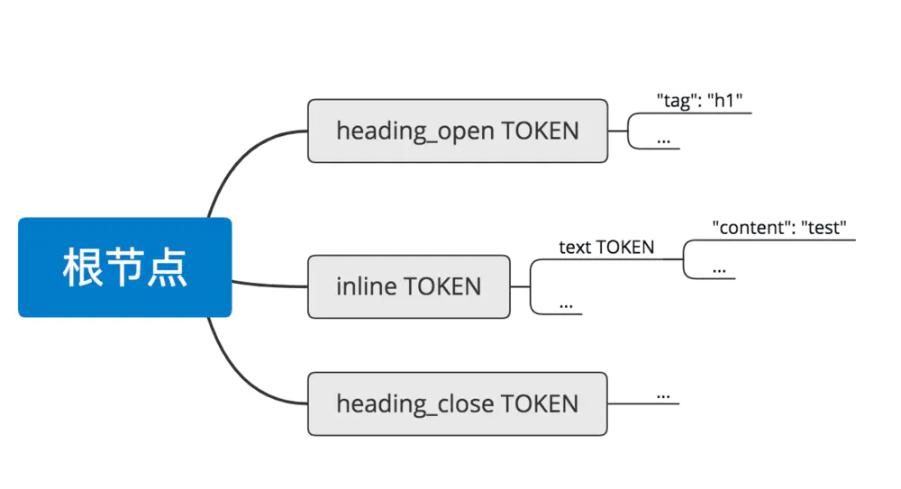

# 深入浅出 VuePress（一）：如何做到在 Markdown 中使用 Vue 语法

## 前言  [markdown-it](https://markdown-it.github.io/)

在 vuepress 刚出时，我就觉得这是个很值得追更的开源项目。果不其然，里面众多的前端编程技巧让我受益良多。

于是在周末这种日子里，人家追剧我追码。

今天，我就和大家分享下 vuepress 是如何做到[在 Markdown 中使用 Vue 语法](https://vuepress.docschina.org/guide/using-vue.html)的。

### 原理

众所周知，Markdown 是一种标记语言，类似于 HTML，它也有对应的语法和词法。而 Vue 说白了也是一种语法，关键在于，Markdown 和 Vue 代码都可以被解释成 HTML。

聪明的读者应该想到了：添加一个中间过程，让 Vue 转成 Markdown 或者让 Markdown 转成 Vue，是不是就可以实现在 Markdown 中使用 Vue 语法了呢？

让我们再考虑一下两个方案的实现难点：

1. Vue -> Markdown：template 和 style 部分还好，可 js 部分怎么办？
2. Markdown -> Vue：可以将 markdown 代码解释成 html 或者 js 混入到 vue 代码中。

很显然，第二种方案实现起来更靠谱些，所以尤雨溪也是这样选的：


vuepress 在 Markdown 中使用 Vue 语法原理

在语法之间的转换工作上，webpack  的 [loader](https://webpack.docschina.org/concepts/loaders) 可是很擅长的。所以，vuepress 自定义了一个 markdownLoader 来将 Markdown 转成 Vue，再通过 vue-loader 得到最终的 HTML。

### 代码实现

#### markdownLoader

这是一个自定义的 loader，可参考[如何编写一个 loader？](https://webpack.docschina.org/contribute/writing-a-loader/)

1. 这个 loader 接收一个参数，里面包含一个 markdown-it 实例，作者用它来把 markdown 解释成 html。
2. 得到 html 后将之包裹在 template 标签内，返回。


```xml
`<template>\n` +
    `<div class="markdown">${html}</div>\n` +
`</template>\n`
```

主要过程其实就这两步。当然，vuepress 还在 markdownLoader 里做了很多其他的事情，比如解析 yaml front matter、推断标题、获取 markdown 里提升的 style、script 等标签。

#### 自己实现一个 demo

接下来，大家可以跟我一起实现一个基本的 demo。完整代码可见 [github](https://github.com/LinFeng1997/vuepress-source-learning/tree/vue-markdown-demo)。

1. 新建一个 Vue 项目
    我们使用 vue-cli(v2.9.6) 新建一个项目：

   

   vue-cli 新建项目

2. 编写 markdownLoader

- 2.1 引入 markdown-it

  

  ```undefined
  npm install markdown-it --save
  ```

- 2.2 新建 markdownLoader 文件

  

  ```jsx
  const markdown = require('markdown-it')
  
  module.exports = function(src) {
    const html = markdown().render(src)
    return (
      `<template>\n` +
        `<div class="markdown">${html}</div>\n` +
      `</template>\n`
    )
  }
  ```

- 2.3 在 webpack 的 module rules 配置中添加 markdownLoader

  

  ```css
  {
    test: /\.md$/,
    use: [
      { loader: 'vue-loader' },
      {
        loader: require.resolve('./markdownLoader')
      }
    ]
  }
  ```

1. 在 Vue 文件里使用 markdown 文件

- 3.1 在 src/components 新建一个 markdown.md


```bash
## 我是一个 markdown 
{{1+2}}
```

- 3.2 在 src/router/index 中引入 markdown


```jsx
 const Markdown = () => import('@/components/markdown.md')
```

- 3.3 将这个组件添加进路由里去


```css
{
  path: '/md',
  name: 'Markdown',
  component: Markdown
}
```


结果

### 在 Markdown 中使用 React(JSX) 语法

既然可以在 markdown 里写 vue，那在 markdonw 里面写 react 理论上也是可以实现的：让 markdownLoader 最后返回一个 React 组件，之后使用 babel-loader 转成 js。

这一次我们是将 markdown 转 jsx 再包裹在一个 React 组件(函数或者类)里：


```bash
return (
    `import React from 'react';
    ${registerComponent}
    function R() {
        return (
        <div>
            <div className="markdown">${html}</div>
        </div>)
    }
    export default R;\n`
)
```

有兴趣的读者可以自行实现完整的 react 版本的 markdownLoader 代码。

### 结语

本文实现的 demo 只对 markdownLoader 的关键步骤做了实现，实际上还有很多问题需要解决，如[浏览器的 API 访问限制](https://vuepress.docschina.org/guide/using-vue.html#浏览器-api-访问限制)、代码块和高亮的处理等需要解决，这篇文章就不涉及了。

此系列文章还会给大家介绍 webpack 拓展、markdown-it 拓展、单元测试、插件系统等。

# 读 VuePress（三）使用 markdown-it 解析 markdown 代码

https://www.jianshu.com/p/a95c04a68d14

## 前言

在此系列文章的[第一篇](https://www.jianshu.com/p/c7b2966f9d3c)，我们介绍了 Vuepress 如何让 Markdown 支持 Vue 组件的，但没有提到非 Vue 组件的其他部分如何被解析。

今天，我们就来看看 Vuepress 是如何利用 markdown-it 来解析 markdown 代码的。

## markdown-it 简介

markdown-it 是一个辅助解析 markdown 的库，可以完成从 `# test` 到 `<h1>test</h1>` 的转换。

它同时支持浏览器环境和 Node 环境，本质上和 babel 类似，不同之处在于，babel 解析的是 JavaScript。

说到解析，实际上称为解释(interpreter)或者编译(compiler)更为令人熟悉。总归绕不开词法分析和语法分析这两个过程。

markdown-it 官方给了一个[在线示例](https://markdown-it.github.io/)，可以让我们直观地得到 markdown 经过解析后的结果。比如还是拿 `# test` 举例，会得到如下结果：

```
[


  {


    "type": "heading_open",


    "tag": "h1",


    "attrs": null,


    "map": [


      0,


      1


    ],


    "nesting": 1,


    "level": 0,


    "children": null,


    "content": "",


    "markup": "#",


    "info": "",


    "meta": null,


    "block": true,


    "hidden": false


  },


  {


    "type": "inline",


    "tag": "",


    "attrs": null,


    "map": [


      0,


      1


    ],


    "nesting": 0,


    "level": 1,


    "children": [


      {


        "type": "text",


        "tag": "",


        "attrs": null,


        "map": null,


        "nesting": 0,


        "level": 0,


        "children": null,


        "content": "test",


        "markup": "",


        "info": "",


        "meta": null,


        "block": false,


        "hidden": false


      }


    ],


    "content": "test",


    "markup": "",


    "info": "",


    "meta": null,


    "block": true,


    "hidden": false


  },


  {


    "type": "heading_close",


    "tag": "h1",


    "attrs": null,


    "map": null,


    "nesting": -1,


    "level": 0,


    "children": null,


    "content": "",


    "markup": "#",


    "info": "",


    "meta": null,


    "block": true,


    "hidden": false


  }


]
```

词法分析，说白了，就是把一段代码拆分成若干个基本单元(token)，这些基本单元又可以进一步分类。这个过程称之为 tokenizes。

语法分析，其实就是将最终要生成的代码用一颗树(ast)来表示，其中每个节点都是我们通过词法分析得到的 token 对象。显而易见，我们得到了一颗这样的 AST：

 



ast

我们也可以手动执行下面代码得到同样的结果：

```
const md = new MarkdownIt()


let tokens = md.parse('# test')


console.log(tokens)
```

### 主要 API 介绍

模式

markdown-it 提供了三种模式：[commonmark](https://commonmark.org/)、default、zero。分别对应最严格、[GFM](https://github.github.com/gfm/)、最宽松的解析模式。

解析

markdown-it 的解析规则大体上分为块(block)和内联(inline)两种。具体可体现为 `MarkdownIt.block` 对应的是解析块规则的 [ParserBlock](https://blog.csdn.net/u014357799/article/details/93784996?utm_medium=distribute.pc_relevant.none-task-blog-baidujs_title-0&spm=1001.2101.3001.4242)， `MarkdownIt.inline` 对应的是解析内联规则的 [ParserInline](https://blog.csdn.net/u014357799/article/details/93784996?utm_medium=distribute.pc_relevant.none-task-blog-baidujs_title-0&spm=1001.2101.3001.4242)，`MarkdownIt.renderer.render` 和 `MarkdownIt.renderer.renderInline` 分别对应按照块规则和内联规则生成 HTML 代码。

规则

在 `MarkdownIt.renderer` 中有一个特殊的属性：rules，它代表着对于 token 们的渲染规则，可以被使用者更新或扩展：

```
var md = require('markdown-it')();


 


md.renderer.rules.strong_open  = function () { return '<b>'; };


md.renderer.rules.strong_close = function () { return '</b>'; };


 


var result = md.renderInline(...);
```

比如这段代码就更新了渲染 strong_open 和 strong_close 这两种 token 的规则。

插件系统

markdown-it 官方说过：

> We do a markdown parser. It should keep the "markdown spirit". Other things should be kept separate, in plugins, for example. We have no clear criteria, sorry.
> Probably, you will find [CommonMark forum](http://talk.commonmark.org/) a useful read to understand us better.

一言以蔽之，就是 markdown-it 只做纯粹的 markdown 解析，想要更多的功能你得自己写插件。

所以，他们提供了一个 API：MarkdownIt.use

它可以将指定的插件加载到当前的解析器实例中：

```
var iterator = require('markdown-it-for-inline');


var md = require('markdown-it')()


            .use(iterator, 'foo_replace', 'text', function (tokens, idx) {


              tokens[idx].content = tokens[idx].content.replace(/foo/g, 'bar');


            });
```

这段示例代码就将 markdown 代码中的 foo 全部替换成了 bar。

更多信息

可以访问我国庆期间翻译的[中文文档](https://github.com/LinFeng1997/markdown-it-docs)，或者官方 [API 文档](https://markdown-it.github.io/markdown-it/)。

## vuepress 中的应用

vuepress 借助了 markdown-it 的诸多社区插件，如高亮代码、代码块包裹、emoji 等，同时也自行编写了很多 markdown-it 插件，如识别 vue 组件、内外链区分渲染等。

[相关源码](https://github.com/vuejs/vuepress/blob/5329b74c687f3b5276db72358bb8b8f4a6a0d95f/packages/@vuepress/markdown/lib/index.js)

> 本文写自 2018 年国庆期间，对应 vuepress 代码版本为 v1.0.0-alpha.4。

### 入口

[源码](https://github.com/vuejs/vuepress/blob/5329b74c687f3b5276db72358bb8b8f4a6a0d95f/packages/@vuepress/markdown/lib/index.js)
主要做了下面五件事：

1. 使用社区插件，如 emoji 识别、锚点、toc。
2. 使用自定义插件，稍后详细说明。
3. 使用 markdown-it-chain 支持链式调用 markdown-it，类似我在[第二篇文章](https://blog.csdn.net/u014357799/article/details/93784996?utm_medium=distribute.pc_relevant.none-task-blog-baidujs_title-0&spm=1001.2101.3001.4242)提到的 webpack-chain。
4. 参数可以传 beforeInstantiate 和 afterInstantiate 这两个钩子，这样方便暴露 markdown-it 实例给外部。
5. dataReturnable 自定义 render：

```
module.exports.dataReturnable = function dataReturnable (md) {


  // override render to allow custom plugins return data


  const render = md.render


  md.render = (...args) => {


    md.__data = {}


    const html = render.call(md, ...args)


    return {


      html,


      data: md.__data


    }


  }


}
```

相当于让 __data 作为一个全局变量了，存储各个插件要用到的数据。

### 识别 vue 组件

[源码](https://github.com/vuejs/vuepress/blob/5329b74c687f3b5276db72358bb8b8f4a6a0d95f/packages/@vuepress/markdown/lib/component.js)

就做了一件事：替换默认的 htmlBlock 规则，这样就可以在根级别使用自定义的 vue 组件了。

```
module.exports = md => {


  md.block.ruler.at('html_block', htmlBlock)


}
```

这个 htmlBlock 函数和原生的 markdown-it 的 [html_block](https://github.com/markdown-it/markdown-it/blob/1ad3aec2041cd2defa7e299543cc1e42184b680d/lib/rules_block/html_block.js) 关键区别在哪呢？

答案是在 HTML_SEQUENCES 这个正则数组里添加了两个元素：

```
// PascalCase Components


[/^<[A-Z]/, />/, true],


// custom elements with hyphens


[/^<\w+\-/, />/, true],
```

很明显，这就是用来匹配帕斯卡写法（如 <Button/>）和连字符（如 <button-1/>）写法的组件的。

### 内容块

[源码](https://github.com/vuejs/vuepress/blob/5329b74c687f3b5276db72358bb8b8f4a6a0d95f/packages/@vuepress/markdown/lib/container.js)

这个组件实际上是借助了社区的 markdown-it-container 插件，在此基础上定义了 tip、warning、danger、v-pre 这四种内容块的 render 函数：

```
render (tokens, idx) {


  const token = tokens[idx]


  const info = token.info.trim().slice(klass.length).trim()


  if (token.nesting === 1) {


    return `<div class="${klass} custom-block"><p class="custom-block-title">${info || defaultTitle}</p>\n`


  } else {


    return `</div>\n`


  }


}
```

这里需要说明一下的是 token 的两个属性。

1. info
   三个反引号后面跟的那个字符串。
2. nesting 属性：

- `1` 意味着标签打开。
- `0` 意味着标签是自动关闭的。
- `-1` 意味着标签正在关闭。

### 高亮代码

[源码](https://github.com/vuejs/vuepress/blob/5329b74c687f3b5276db72358bb8b8f4a6a0d95f/packages/@vuepress/markdown/lib/highlight.js)

1. 借助了 [prismjs](https://www.npmjs.com/package/prismjs) 这个库
2. 将 vue 和 html 看做是同一种语言：

```
if (lang === 'vue' || lang === 'html') {


    lang = 'markup'


}
```

1. 对语言缩写做了兼容，如 md、ts、py
2. 使用 wrap 函数对生成的高亮代码再做一层包装：

```
function wrap (code, lang) {


  if (lang === 'text') {


    code = escapeHtml(code)


  }


  return `<pre v-pre class="language-${lang}"><code>${code}</code></pre>`


}
```

### 高亮代码行

[源码](https://github.com/vuejs/vuepress/blob/5329b74c687f3b5276db72358bb8b8f4a6a0d95f/packages/@vuepress/markdown/lib/highlightLines.js)

1. 在[别人的代码](https://github.com/egoist/markdown-it-highlight-lines)基础上修改的。
2. 重写了 md.renderer.rules.fence 方法，关键是借助一个正则判断获取要高亮的代码行们：

```
const RE = /{([\d,-]+)}/


 


const lineNumbers = RE.exec(rawInfo)[1]


      .split(',')


      .map(v => v.split('-').map(v => parseInt(v, 10)))
```

然后条件渲染：

```
if (inRange) {


   return `<div class="highlighted">&nbsp;</div>`


}


return '<br>'
```

最后返回高亮行代码 + 普通代码。

### 脚本提升

[源码](https://github.com/vuejs/vuepress/blob/5329b74c687f3b5276db72358bb8b8f4a6a0d95f/packages/@vuepress/markdown/lib/hoist.js)

重写 md.renderer.rules.html_block 规则：

```
const RE = /^<(script|style)(?=(\s|>|$))/i


 


md.renderer.rules.html_block = (tokens, idx) => {


    const content = tokens[idx].content


    const hoistedTags = md.__data.hoistedTags || (md.__data.hoistedTags = [])


    if (RE.test(content.trim())) {


      hoistedTags.push(content)


      return ''


    } else {


      return content


    }


}
```

将 style 和 script 标签保存在 __data 这个伪全局变量里。这部分数据会在 markdownLoader 中用到。

### 行号

[源码](https://github.com/vuejs/vuepress/blob/5329b74c687f3b5276db72358bb8b8f4a6a0d95f/packages/@vuepress/markdown/lib/lineNumber.js)

重写 md.renderer.rules.fence 规则，通过换行符的数量来推算代码行数，并再包裹一层：

```
const lines = code.split('\n')


const lineNumbersCode = [...Array(lines.length - 1)]


  .map((line, index) => `<span class="line-number">${index + 1}</span><br>`).join('')


 


const lineNumbersWrapperCode =


  `<div class="line-numbers-wrapper">${lineNumbersCode}</div>`
```

最后再得到最终代码：

```
const finalCode = rawCode


  .replace('<!--beforeend-->', `${lineNumbersWrapperCode}<!--beforeend-->`)


  .replace('extra-class', 'line-numbers-mode')


 


return finalCode
```

### 内外链区分

[源码](https://github.com/vuejs/vuepress/blob/5329b74c687f3b5276db72358bb8b8f4a6a0d95f/packages/@vuepress/markdown/lib/link.js)

一个 a 链接，可能是跳往站内的，也有可能是跳往站外的。vuepress 将这两种链接做了一个区分，最终外链会比内链多渲染出一个图标：

 


link.png

要实现这点，vuepress 重写了 md.renderer.rules.link_open 和 md.renderer.rules.link_close 这两个规则。

先看 md.renderer.rules.link_open ：

```
if (isExternal) {


    Object.entries(externalAttrs).forEach(([key, val]) => {


      token.attrSet(key, val)


    })


    if (/_blank/i.test(externalAttrs['target'])) {


      hasOpenExternalLink = true


    }


} else if (isSourceLink) {


    hasOpenRouterLink = true


    tokens[idx] = toRouterLink(token, link)


}
```

isExternal 便是外链的标志位，这时如果它为真，则直接设置 token 的属性即可，如果 isSourceLink 为真，则代表传入了个内链，整个 token 将会被替换成 `toRouterLink(token, link)` :

```
function toRouterLink (token, link) {


    link[0] = 'to'


    let to = link[1]


 


    // convert link to filename and export it for existence check


    const links = md.__data.links || (md.__data.links = [])


    links.push(to)


 


    const indexMatch = to.match(indexRE)


    if (indexMatch) {


      const [, path, , hash] = indexMatch


      to = path + hash


    } else {


      to = to


        .replace(/\.md$/, '.html')


        .replace(/\.md(#.*)$/, '.html$1')


    }


 


    // relative path usage.


    if (!to.startsWith('/')) {


      to = ensureBeginningDotSlash(to)


    }


 


    // markdown-it encodes the uri


    link[1] = decodeURI(to)


 


    // export the router links for testing


    const routerLinks = md.__data.routerLinks || (md.__data.routerLinks = [])


    routerLinks.push(to)


 


    return Object.assign({}, token, {


      tag: 'router-link'


    })


}
```

先是 href 被替换成 to，然后 to 又被替换成 .html 结尾的有效链接。

再来看 md.renderer.rules.link_close ：

```
if (hasOpenRouterLink) {


  token.tag = 'router-link'


  hasOpenRouterLink = false


}


if (hasOpenExternalLink) {


  hasOpenExternalLink = false


  // add OutBoundLink to the beforeend of this link if it opens in _blank.


  return '<OutboundLink/>' + self.renderToken(tokens, idx, options)


}


return self.renderToken(tokens, idx, options)
```

很明显，内链渲染 router-link 标签，外链渲染 OutboundLink 标签，也就是加了那个小图标的链接组件。

### 代码块包裹

[源码](https://github.com/vuejs/vuepress/blob/5329b74c687f3b5276db72358bb8b8f4a6a0d95f/packages/@vuepress/markdown/lib/preWrapper.js)

这个插件重写了 md.renderer.rules.fence 方法，用来对 `<pre>` 标签再做一次包裹：

```
md.renderer.rules.fence = (...args) => {


    const [tokens, idx] = args


    const token = tokens[idx]


    const rawCode = fence(...args)


    return `<!--beforebegin--><div class="language-${token.info.trim()} extra-class">` +


    `<!--afterbegin-->${rawCode}<!--beforeend--></div><!--afterend-->`


}
```

将围栏代码拆成四个部分：beforebegin、afterbegin、beforeend、afterend。相当于给用户再自定义 markdown-it 插件提供了钩子。

### 锚点非 ascii 字符处理

[源码](https://github.com/vuejs/vuepress/blob/5329b74c687f3b5276db72358bb8b8f4a6a0d95f/packages/@vuepress/markdown/lib/slugify.js)

这段代码最初是为了解决锚点中带中文或特殊字符无法正确跳转的问题。

处理的非 acsii 字符依次是：变音符号 -> C0控制符 -> 特殊字符 -> 连续出现2次以上的短杠（-） -> 用作开头或结尾的短杆。

最后将开头的数字加上下划线，全部转为小写。

### 代码片段引入

[源码](https://github.com/vuejs/vuepress/blob/5329b74c687f3b5276db72358bb8b8f4a6a0d95f/packages/@vuepress/markdown/lib/snippet.js)

它在 md.block.ruler.fence 之前加入了个 snippet 规则，用作解析 `<<< @/filepath` 这样的代码：

```
const start = pos + 3
const end = state.skipSpacesBack(max, pos)
const rawPath = state.src.slice(start, end).trim().replace(/^@/, root)


const filename = rawPath.split(/[{:\s]/).shift()


const content = fs.existsSync(filename) ? fs.readFileSync(filename).toString() : 'Not found: ' + filename
```

它会把其中的文件路径拿出来和 root 路径拼起来，然后读取其中文件内容。因为还可以解析 `<<< @/test/markdown/fragments/snippet.js{2}` 这样附带行高亮的代码片段，所以需要用 split 截取真正的文件名。

## 结语

markdown 作为一门解释型语言，可以帮助人们更好地描述一件事物。同时，它又作为通往 HTML 的桥梁，最终可以生成美观简约的页面。

而 markdown-it 提供的解析器、渲染器以及插件系统，更是让开发者可以根据自己的想象力赋予 markdown 更多的魅力。[原文](https://blog.csdn.net/u/ab3cfc390b99)

<span>
<a href='#'>回到顶部</a>
</span>

