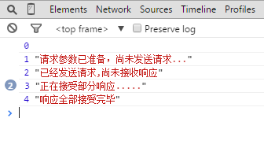
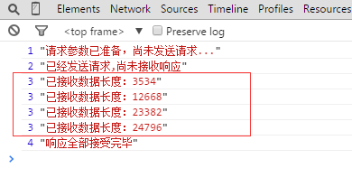
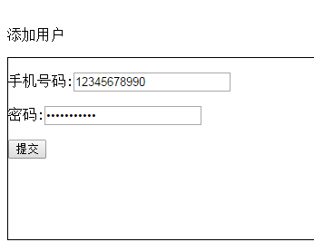
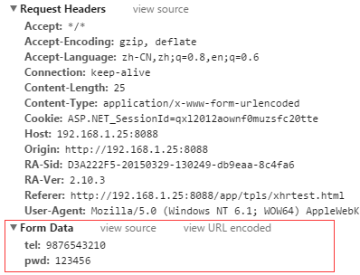

# XHR

## 一. xhr 基本知识

虽然可以像前面的例子一样发送同步请求，但多数情况下最好使用异步请求，这样可以不阻塞
JavaScript 代码继续执行。XHR 对象有一个 readyState 属性，表示当前处在请求/响应过程的哪个阶段。
这个属性有如下可能的值。

>  0：未初始化（Uninitialized）。尚未调用 open()方法。
> 
>  1：已打开（Open）。已调用 open()方法，尚未调用 send()方法。
> 
>  2：已发送（Sent）。已调用 send()方法，尚未收到响应。
> 
>  3：接收中（Receiving）。已经收到部分响应。
> 
>  4：完成（Complete）。已经收到所有响应，可以使用了。

每次 readyState 从一个值变成另一个值，都会触发 readystatechange 事件。可以借此机会检
查 readyState 的值。一般来说，我们唯一关心的 readyState 值是 4，表示数据已就绪。为保证跨浏
览器兼容，onreadystatechange 事件处理程序应该在调用 open()之前赋值。来看下面的例子：

```js
let xhr = new XMLHttpRequest(); 

xhr.onreadystatechange = function() { 
 if (xhr.readyState == 4) { 
 if ((xhr.status >= 200 && xhr.status < 300) || xhr.status == 304) { 
 alert(xhr.responseText); 
 } else { 
 alert("Request was unsuccessful: " + xhr.status); 
 } 
 } 
}; 

xhr.open("get", "example.txt", true); 

xhr.send(null); 
```
以上代码使用 DOM Level 0 风格为 XHR 对象添加了事件处理程序，因为并不是所有浏览器都支持
DOM Level 2 风格。与其他事件处理程序不同，onreadystatechange 事件处理程序不会收到 event

对象。在事件处理程序中，必须使用 XHR 对象本身来确定接下来该做什么。

注意 由于 onreadystatechange 事件处理程序的作用域问题，这个例子在 onready

statechange 事件处理程序中使用了 xhr 对象而不是 this 对象。使用 this 可能导致

功能失败或导致错误，取决于用户使用的是什么浏览器。因此还是使用保存 XHR 对象的

变量更保险一些。

在收到响应之前如果想取消异步请求，可以调用 abort()方法：
```js
xhr.abort(); 
```
调用这个方法后，XHR 对象会停止触发事件，并阻止访问这个对象上任何与响应相关的属性。中

断请求后，应该取消对 XHR 对象的引用。由于内存问题，不推荐重用 XHR 对象。

## 二. JS 进阶/Ajax 详解 (1) :XHR 对象

[**ouou**](https://segmentfault.com/u/kraaas)发布于 2015-05-20 [点击详情](https://segmentfault.com/a/1190000002782175)

> `Ajax`是一种能够向服务器请求额外的数据而无需卸载页面(无刷新)的技术，是对`Asynchronous Javascript + XML`的简写，因其良好的用户体验，现已成为web不可或缺的技术。我们所熟知的`Jquery`的封装的`ajax`方法，也是通过这种技术实现的。

## 1. 没有 XHR 对象之前我们怎么实现 Ajax

在XHR出现之前，Ajax式的通信必须借助一些hack手段来实现，大多数是使用隐藏的框架或内联框架，还可以使用script标签和img标签；

`<iframe>` : iframe元素还是挺强大的，我们首先需要把发送给web服务器的数据编码到URL中，如：pages/index.html?name='jozo'&age=22,然后设置iframe的src属性为该URL，服务器能创建一个包含响应内容的HTML文档，那么我们就可以把响应信息保存在该文档中返回web浏览器。这样实现的话，需要让iframe元素对用户不可见，可以通过CSS来隐藏它。

`<script>`: script标签的src属性也能发起HTTP GET请求，而且它可以跨域通信而不受同源策略的限制。通过这种方式交互时，服务器的响应需要采用JSON编码的数据格式，并用一个指定的回调函数名包裹需要返回的数据：callBack({"name":"jozo","age":22}),这个包裹的响应会成为script标签的里的内容来执行，就相当于执行了callBack()这个函数，所以在web端需要定义一个同名函数。这个就是JSONP跨域，详细请自行查阅。

``:img标签同样也是利用src属性发起的HTTP GET 请求，但它的功能没有上面两者的全，因为它只能实现单向的通信，只能由客户端发送数据到服务器，服务器则响应对应的图片，而我们无法轻易从图片中获取数据，而且这个图片必须不可见，比如透明的1x1PX的图片。

## 2. XHR 对象

Ajax技术的核心是`XMLHttpRequest`对象，XHR为向服务器发送请求和解析服务器响应提供了流畅的接口，能以异步的方式从服务器取得更多的信息，意味着用户单击后，可以不必刷新页面也能取得数据。这个单词包含`XML,Http,Rquest`,的确，ajax与这三者都有关系 ：

- `XML` ：可作为ajax交互数据的数据类型，当然也不仅局限于xml，像我们所知的`json,jsonp,html,script,text`都可以作为数据类型。
- `http` : 使用ajax技术其实就是通过发送HTTP请求和接收响应的来达到目的。可以通过配置发送请求头信息来使服务器做出相应的响应。
- `request` ：说宽泛一些就是request和response，请求和响应，get请求，post请求，然后操作响应信息。

下面来看下具体的XHR对象有哪些属性和方法。

## 3. XHR 对象的属性和方法

**属性：**

1. `readyState`：HTTP 请求的状态
2. `responseText`：响应体（不包括头部）
3. `responseXML`：对请求的响应，解析为 XML 并作为 Document 对象返回。
4. `status`：由服务器返回的 HTTP 状态代码，如 200 表示成功
5. `statusText`：这个属性用名称而不是数字指定了请求的 HTTP 的状态代码。也就是说，当状态为 200 的时候它是 "OK"，当状态为 404 的时候它是 "Not Found"。

**方法：**

1. `abort()` : 取消当前响应，关闭连接并且结束任何未决的网络活动。
2. `getAllResponseHeaders()`：把 HTTP 响应头部作为未解析的字符串返回。
3. `getResponseHeader()`：返回指定的 HTTP 响应头部的值。
4. `open()`：初始化 HTTP 请求参数，例如 URL 和 HTTP 方法，但是并不发送请求。
5. `send()`：发送 HTTP 请求，使用传递给 open() 方法的参数，以及传递给该方法的可选请求体。
6. `setRequestHeader()`：向一个打开但未发送的请求设置或添加一个 HTTP 请求。

标红的属性和方法都是比较常用的，偷个懒，具体的属性和方法的介绍去 [w3school](http://www.w3school.com.cn/xmldom/dom_http.asp) 看下了哈，

属性和方法都要熟悉掌握才能很好的掌握后面的内容。

## 4. 跨浏览器的 XHR 对象

IE7之前的浏览器都是不支持原生的XMLHttpRquest对象的，IE5,6中是通过MSXML库中的一个ActiveX对象实现的。《JS高级程序设计》和《JS权威指南》都是通过检测MSXML库中XMLHttp的版本来创建XHR对象的，看起来比较麻烦，我们还是用w3school的吧。

```js
let xhr = null;
function createXHR(){
  if (window.XMLHttpRequest){
    // 新浏览器
    xhr = new XMLHttpRequest();
  }else if (window.ActiveXObject){
    // IE5,IE6
    xhr = new ActiveXObject("Microsoft.XMLHTTP");
  }
}
```

## 5. 一些细节

1. Ajax技术可以用于 HTTP 和 HTTPS 请求。
2. 我们需要将ajax测试代码部署到服务器上，才能正常工作。但是，在firefox浏览器上测试则不用。
3. 请求的方式除了get,post 外还支持：delete,head,option,put.请求方式名称大小写不敏感。
4. 当我们给请求设置了onreadystatechange事件时，当readyState改变为0或1时可能没有触发这个事件，经过测试，当为0时确实没有触发，为1时触发了，我也不知道为啥 。
5. 如果你获取的表单数据只是用来读取服务器数据，而且表单数据是公开的，那么用get方式的请求吧，因为少量数据的get请求的效率比post快多了。后面可以测试来测试下。
6. HTTP请求的各部分的指定顺序是：请求方法和URL--> 请求头-->请求主体。而且在使用XHR对象的时候，当调用了send()方法才开始启动网络。而XHR API 的设计使每个方法都会写入网络流，所以在send()方法后面定义的事件或属性会被忽略。所以，调用XHR对象的方法要有一定的顺序，比如：在send()方法注册onreadystatechange()事件。

[javascript](https://segmentfault.com/t/javascript)[前端](https://segmentfault.com/t/前端)

##  三，JS 进阶Ajax 详解 (2) :XHR 实例 GET 和 POST 异步和同步

[点击详情](https://segmentfault.com/a/1190000002789203)

[上一篇文章](http://segmentfault.com/a/1190000002782175) 我们大概知道了XHR对象是什么东东，也都了解了它的一些属性和方法，那么现在具体来实现一下Ajax技术 和 了解下XHR2对象。

## 1.实现Ajax

**先来创建个XHR对象的实例：**

```js
var xhr = function(){
    if (window.XMLHttpRequest) {
        return new XMLHttpRequest();
    }else{
        return new ActiveObject('Micrsorf.XMLHttp');
    }
}();
console.log(xhr.readyState);
```

**先来看个get请**求

```js

```

这里发送了个简单的get异步请求到我本地的web服务器中，然后我们在控制台看下输出：



可以看到刚创建完XHR对象后的readyState为0，当readyState为1,2,3,4，时都触发了onreadystatechange事件，而 readyState为0没有触发，readyState为3时触发了两次，为什么这样呢？

为什么为0时没有触发，我们刚创建XHR对象后readyState为0，然后接着执行后面的代码，直到send()方法之前readyState的值都没有发生改变，所以在onreadystatechange事件中检测readyState为0是没有意义的。

readyState为3是触发了两次，其实有些请求不止两次，看你请求的数据量的大小而定，我们增大接收数据来看看：



这就好了，既然我们能在readystate为3时获取数据的相关信息，那我们就可以利用这个特性在readystate为3时做一个数据加载进度条变化的效果了，这个讲到XHR2对象的时候来试试。

还有一个就是在发送get请求时，get请求的数据会附在URL之后（就是把数据放置在HTTP协议头中），以?分割URL和传输数据，参数之间以&相连，如：`'/products/getProduct?id=1'`。如果数据是英文字母/数字，原样发送，如果是空格，转换为+，如果是中文/其他字符，则直接把字符串用BASE64加密，得出如：%E4%BD%A0%E5%A5%BD，其中％XX中的XX为该符号以16进制表示的ASCII。

POST把提交的数据则放置在是HTTP包的包体中。

**再来个post请求**

1.先来个简单的表单,注册一个用户



2.用Ajax提交数据到服务器

```html
<script>
  const xhr = new XMLHttpRequest();
  xhr.onreadystatechange = function () {
    switch (xhr.readyState) {
      case 0:
        console.log(0, '未初始化....');
        break;
      case 1:
        console.log(1, '请求参数已准备，尚未发送请求...');
        break;
      case 2:
        console.log(2, '已经发送请求,尚未接收响应');
        break;
      case 3:
        console.log(3, '正在接受部分响应.....');
        data.innerHTML = xhr.responseText;
        break;
      case 4:
        console.log(4, '响应全部接受完毕');
        if ((xhr.status >= 200 && xhr.status < 300) || xhr.status == 304) {
          console.log(xhr.responseText)
          document.write(xhr.responseText);
        } else {
          document.write('error:' + xhr.status);
        }
        break;
    }
  }
  const url1 = `https://huang-1234.github.io/Browser/HTTP/aHTTPLife.html`;
  const url2 = '/products/getProduct?id=1'
  xhr.open('get',url1);
  xhr.send(null);
</script>
```

那么post请求需要注意两个地方：

**第一：**

```
xhr.setRequestHeader('Content-Type','application/x-www-form-urlencoded')
```

表单数据编码格式有一个正式的MIME类型：`pplication/x-www-form-urlencoded`
当使用post方式提交这种顺序表单时，必须设置`Content-Type`请求头为这个值来模仿表单数据的提交。

**第二：**

```
var data =encodeFormData({
    tel : tel,
    pwd : pwd
}) ;
```

`HTTP POST`请求包含一个请求主体，它包含了客户端发送给服务器的数据，比如：



这里为了简单直接明文传输了。 这个数据比较少和简单，我们也可以直接修改上面的send()方法发送数据的方式如下：

```js
xhr.send('tel='+tel+'&pwd='+pwd);
```

但是当这个表单数据的比叫多而复杂时，再以这种字符串拼接的方式传递的话比较容易出错，不好维护，所以我们需要封装一个这样的方法帮助我们将我们的数据拼接成这样的格式：

```
function encodeFormData(data){
    if(!data) return '';
    var pairs = [];
    for(var name in data){
        if(!data.hasOwnProperty(name)) continue;
        if(typeof data[name] === 'function') continue;
        var value = data[name].toString();
        name = encodeURIComponent(name.replace('%20','+'));
        value = encodeURIComponent(value.replace('%20','+'));
        pairs.push(name+'='+value);
    }
    return pairs.join('&');
}
```

## 2.`GET` 还是 `POST`

get还是post，其实这和ajax是没有关系的了，主要还是取决于这两个请求方式的特点：

通过上面的两个ajax的实例，我们可以看出get请求和post请求的一些特点：

**get请求：**

- GET 请求可被缓存
- GET 请求保留在浏览器历史记录中
- GET 请求可被收藏为书签
- GET 请求不应在处理敏感数据时使用
- GET 请求有长度限制
- GET 请求只应当用于取回数据

**post请求：**

- POST 请求不会被缓存
- POST 请求不会保留在浏览器历史记录中
- POST 不能被收藏为书签
- POST 请求对数据长度没有要求

那，有了这个比较，你应该知道什么时候用get什么时候用post了。

## 3.异步和同步

ajax默认的都是异步的请求，我们上面的两个实例也是用的异步请求，那没什么不用同步呢？同步和异步有什么特点？

**同步请求：**

`发送器请求-->等待结果-->操作结果-->继续还行后面的代码` ，这是同步请求的大致过程，由于客服端的javascript是单线程的，也就是说我们必须等待结果完全接收完毕之后才能继续执行后面的代码，严格按照步骤一步一步来，它通常会导致整个浏览器的UI阻塞（白屏等），如果连接服务器响应很慢，那么用户浏览器将冻结，用不不能进行其他操作。
如果我们发起一个同步请求，chrome浏览器会给你这样一个警告：`Synchronous XMLHttpRequest on the main thread is deprecated because of its detrimental effects to the end user's experience. For more help, check http://xhr.spec.whatwg.org/.` 意思就是同步请求不利于用户体验。

**异步请求：**

发送器请求-->继续还行后面的代码-->响应结果接收完毕了-->操作结果，这是同步请求的大致过程。
可以看到，异步请求在发送请求之后没有等待结果的返回而是继续执行后面的代码，也就是说在结果返回之前用户可以操作其他东西或是看到其他UI，用户体验良好。但是有些情况下我们还是得用同步请求。