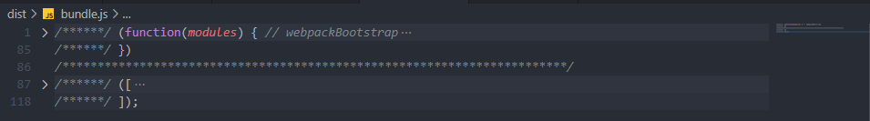
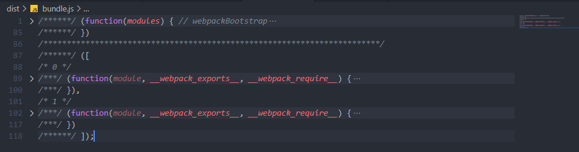
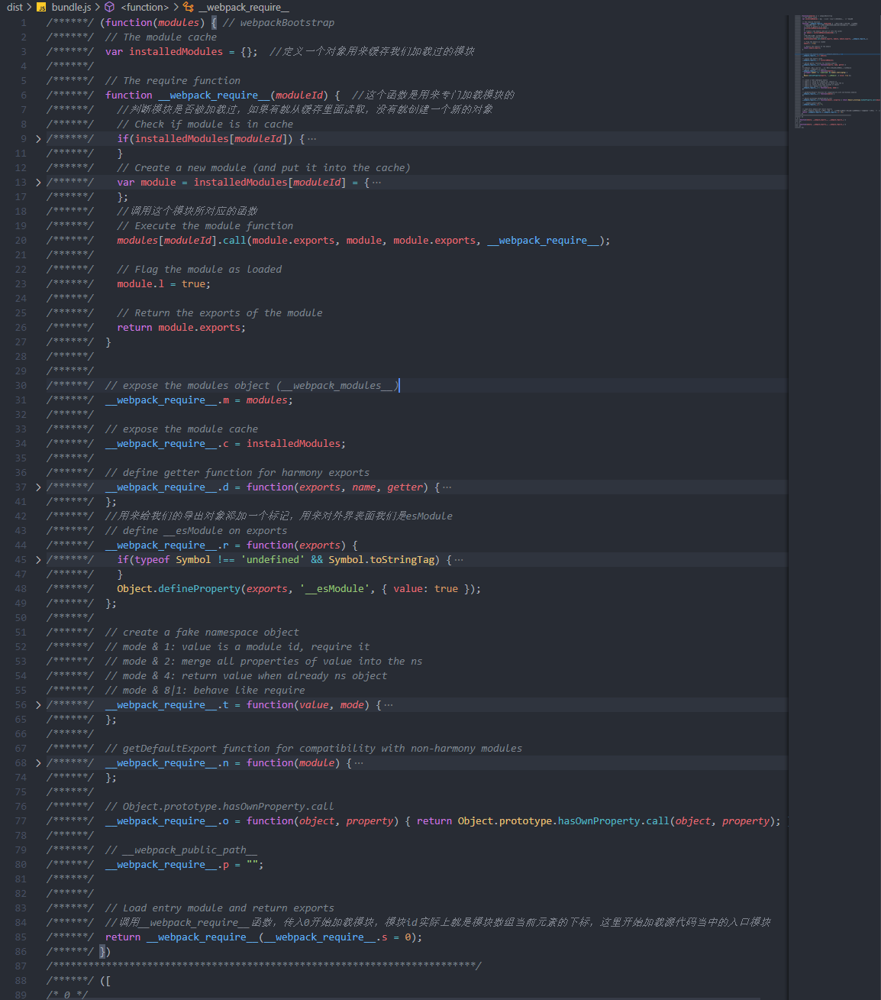
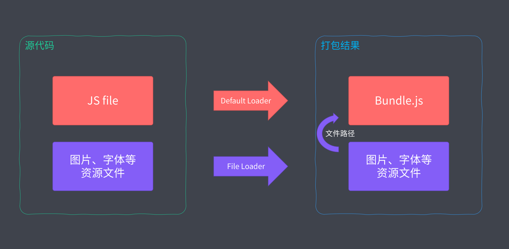
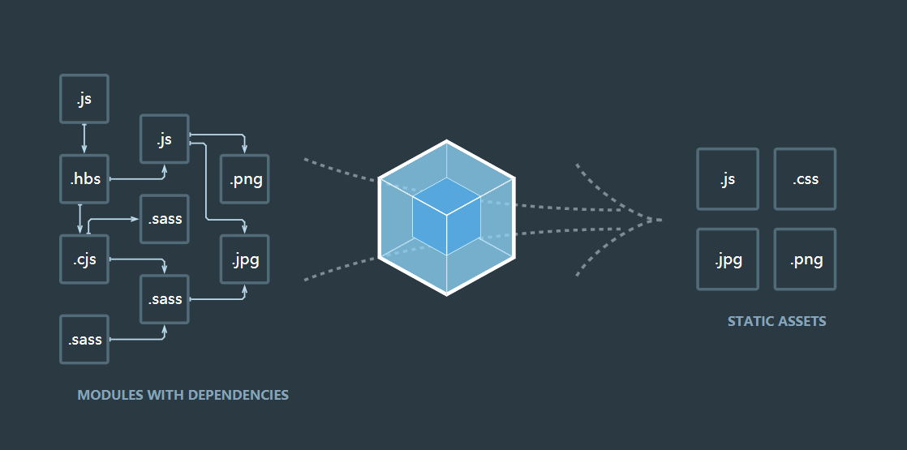

# 前端工程化

# 模块化开发

## 模块化概述

模块化是一种主流的组织方式，它通过把我们的复杂代码按照功能的不同划分为不同的模块，单独的维护这种方式，提高我们的开发效率，降低维护成本。

模块化只是思想，不包含具体的实现。

## 模块化演变过程

- Stage1-文件划分方式：基于文件划分的方式
  - 污染全局作用域
  - 命名冲突问题
  - 无法管理模块依赖关系
  - 早期模块化完全依靠约定
- Stage2-命名空间方式：每个模块只暴露一个全局对象，所以模块成员都挂载到这个对象中
  - 没有私有空间，模块成员可以被外部修改
  - 模块之间的依赖关系没有得到解决
- Stage3-IIFE：采用立即执行函数表达式为模块提供私有空间
  - 私有成员的概念：需要暴露给外部的成员通过挂载到全局对象上去实现
  - 利用自执行函数的参数作为依赖声明去使用，每个模块之间的依赖关系变得明显，利于后期维护

## 模块化规范的出现

- CommenJS规范（NodeJS中提出的一套标准，NodeJS所有的模块代码必须要遵循CommenJS规范）
  - 一个文件就是一个模块
  - 每个模块都有单独的作用域
  - 通过module.exports导出成员
  - 通过require函数载入模块
  - CommonJS是以同步模式加载模块
- AMD(异步的模块定义规范)
  - Require.js实现了AMD规范，另外它本身也是一个强大的模块加载器
  - 目前绝大多数第三方库都支持AMD规范
  - AMD使用起来相对复杂
  - 模块JS文件请求频繁
- CMD（通用的模块定义规范）
  - Sea.js+CMD

## 模块化标准规范

- CommonJS in Node.js
  - Node内置的模块系统，没有任何的环境问题
- Es Modules in Browers
  - 最主流的前端模块化规范
  - 绝大数的浏览器都支持Es Modules这个特性（原生支持意味着可以直接使用这个特性）

## ES Modules特性

- 通过给script添加type=module的熟悉，就可以以ES Module的标准执行其中的JS代码
- 自动采用严格模式，忽略use strict。
- 每个ES Module都是运行在单独的私有作用域中
- ESM是通过CORS的方式请求外部JS模块
- ESM的Script标签会延迟执行脚本，不会阻碍页面元素的显示

## ES Modules导入导出的注意事项

- 导出的成员并不是一个字面量对象，语法和字面量对象很像。导入的语法很ES6的结构很像，但是它不是一个结构。
- ES Modules模块的导出的不是成员的值，而是这个值存放的地址，在外部拿到的这个成员会受当前内部模块修改的影响
- 在外部导入一个模块的成员只是一个只读的成员，并不能去修改它们

## ES Modules导入用法和注意事项

- 不能省略.js的扩展名，和CommonJS是有区别的
- 不能像CommonJS那样载入目录的方式载入index.js，需要提供完整的路径
- 后期可以使用打包工具打包我们的模块时可以省略扩展名和省略index.js等操作
- 相对路径下的./在ESModule是不能省略的，不然会认为是在加载第三方的模块，和Common相同。
- 可以使用完整的URL加载模块
- 可以使用*号方式把所有的成员全部提取出来，可以使用as的方式把所有导出的成员放入到一个对象当中
- 不能嵌套在if和函数当中
- import函数可以动态导入模块，这个函数返回的是一个Promise，当这个模块加载完成之后会自动执行then当中所指定的回调函数，模块的对象可以通过参数去拿到

## ES Modules浏览器环境Polyfill

- IE不兼容ES Modules，可以借助编译工具将ES6的代码编译成ES5的方式才能正常工作
- Polyfile可以让浏览器直接去支持ES Modules当中绝大多少的特性
- npm的模块可以使用unpkg.com这个网站提供的cdn服务去拿到它下面所有的js文件。
  - [unpkg.com/browser-es-…](https://unpkg.com/browser-es-module-loader)
  - 工作原理：通过es-module-loader读取出来交给babel去转换，从而让我们的代码可以正常工作
- promise-polyfill可以让浏览器支持Promise（浏览器支持可以忽略）
- 支持ESM的浏览器用了polyfill会被执行两次，元素是浏览器本身支持被执行了一次，然后es-modules的polyfill也会执行一次，可以借助script标签的新属性nomodule去解决
  - nomodule标签只会在不支持esmodules的浏览器环境中工作
- 总结：
  - 这种兼容ES Modules的方式只适合我们本地测试或者开发阶段
  - 生成阶段千万不要去用，它的原理是在运行阶段动态的去解析脚本，效率过低
  - 生成阶段应该预先去把这些代码编译出来，让它们在浏览器中直接运行工作

## ES Modules in Node.js：支持情况

- Node8.5版本过后，可以原生的使用ESM去编写我们的代码，还处于实验阶段
- CommonJS规范与ESM规范差距较大，目前还是处于过渡状态
- 可以使用node --experimental-modules xxx.mjs去启用这个试验特性执行文件
- 内置模块兼容了ESM的提取成员方式
- 第三方模块都是导出默认成员

## ES Modules in Node.js：与CommonJS模块交互

- CommonJS模块始终只会导出一个默认成员，ESM不能直接提取成员，注意import不是解构导出对象
- Node环境当中不能在CommonJS模块中通过require载入ES Modules
- 总结：
  - ES Modules中可以导入CommonJS模块
  - CommonJS中不能导入ES Modules模块
  - CommonJS始终只会导出一个默认成员
  - 注意import不是解构导出对象，它只是一个固定的用法，去提取导出模块当中的命名成员

## ES Modules in Node.js：与CommonJS之间的差异

- CommonJS
  - require：加载模块函数
  - module：模块对象
  - exports：导出对象别名
  - __filename：当前文件的绝对路径
  - __dirname： 当前文件所在的目录
- ES Modules
  - import： 加载模块函数
  - export： 导出对象别名
  - import.meta.url ：当前所工作文件的文件URL地址
  - 通过url模块中的fileURLToPath方法可以得到__filename当前文件的绝对路径
  - 通过path模块中的dirname方法得到__dirname当前文件所在的目录
- ESM中没有CommonJS中的那些模块全局变量

## ES Modules in Node.js：新版本进一步支持ESM

- 可以在package.json下添加type字段，将type字段设置为module，这样我们项目下所有的js文件都会以ESM规范去工作，就不用将扩展名改成mjs了。
- 将type设置成module之后，就无法直接使用CommonJS规范了，这时候想要使用CommonJS的话需要将文件的扩展名改成.cjs

## ES Modules in Node.js：Babel兼容方案

- babel是一款主流的JavaScript编译器，它可以用来将我们使用了一些新特性的代码编译成当前环境所支持的代码

# Webpack打包

## 模块打包工具的由来

- 模块化解决了我们在代码开发当中的代码组织问题，随着我们引入模块化，我们的应用会产生新的问题。
  - ES Modules存在环境兼容问题
  - 模块文件过多，网络请求频繁
  - 所有的前端资源都需要模块化
    - 随着应用的日益复杂，html/css文件也会面临这些问题
  - 开发阶段包含新特性的代码转换为绝大多数环境支持的代码，解决环境兼容的问题
  - 将散落的模块文件打包在一起，解决模块文件过多，请求频繁的问题
  - 支持不同类型的资源模块（.js/.css/.scss/.hbs/.png/.ts）

## 模块打包工具概要

- webpack
  - 模块打包器（Module bundler）
    - 将零散的模块代码打包到同一个js文件当中
  - 模块加载器（Loader）
    - 在代码中有环境兼容问题的代码通过模块加载器进行编译转换
  - 代码拆分（Code Splitting）
    - 将应用当中所有的代码按照我们的需要去打包，不用担心把所有的代码全部打包在一起产生的文件过大的问题，可以把应用程序初次运行的时候所必须的一些模块打包在一起，其它的模块单独的进行存放，实际需要使用的时候去异步加载这些模块。
  - 资源模块（Assets Module）
    - 支持以模块化的方式去载入任意类型的资源文件
  - 打包工具解决的是前端整体的模块化，并不单指JavaScript模块化

## 快速上手

webpack作为目前最主流的前端模块打包器，提供了一整套前端项目模块化方案。

- 安装：yarn add webpack webpack-cli --dev
- 编译：yarn webpack

## 配置文件

webpack4以后的版本它支持零配置的方式直接启动打包，打包过程会按照约定`src/index.js`=>`dist/main.js`

- 在项目根目录下添加一个webpack.config.js文件，这个文件是运行在Node环境中的，我们使用CommonJS规范

```javascript
const path = require('path')

module.exports = {
    //去指定webpack打包入口文件的路径
    entry: './src/main.js',
    //设置输出文件的配置
    output: {
        //输出文件的名称
        filename: 'bundle.js',
        //输出文件的路径（绝对路径）
        path: path.join(__dirname, 'dist')
    }
}
复制代码
```

## 工作模式

webpack4新增工作模式做法，这种用法大大的简化了webpack配置的复杂程度，可以把它理解成针对于不同环境的几组预设配置

- 生产模式：yarn-webpack （默认webpack --mode production）
  - 自动启用优化插件，将我们的代码进行压缩
- 开发模式：webpack --mode development
  - 自动优化打包的速度，添加一些调试过程中需要的辅助到我们代码当中
- none模式：webpack --mode none
  - 进行最原始的打包，不会进行任何额外的处理

```javascript
module.exports = {
    //工作模式
    mode: 'development'
}
复制代码
```

## 打包结果运行原理

整体生成的代码是一个立即执行的函数，这个函数接受一个modules的参数，调用时传入了一个数组



展开这个数组，数组中的每一个元素都是一个参数列表相同的函数，这里的函数对于的是源代码当中的模块，每一个模块最终都会包裹到这些函数当中，从而实现模块的私有作用域





## 资源模块加载

Loader是Webpack的核心特性，借助于Loader就可以加载任何类型的资源。

以加载css为例，首先安装css-loader来转换css文件，在安装style-loader将css-loader转换过后的结果通过style标签的形式添加到页面上，webpack配置如下：

```javascript
    // 配置对象
    module: {
        //其他资源模块加载规则
        rules: [{
            //匹配打包过程中遇到的文件路径
            test: /.css$/,
            //匹配文件打包过程中用的loader 配置了多个loader执行顺序是从后往前执行
            use: [
                'style-loader', //把css-loader转换后的结果通过style标签的形式添加到页面上
                'css-loader' //处理css文件的加载器
            ]
        }]
    }
复制代码
```

## 导入资源模块

webpack的打包入口一般是javascript文件，一般打包入口是应用程序的运行入口，目前而言，前端应用中的业务是由JavaScript来驱动的。

```javascript
import './heading.css'

export default () => {
    const element = document.createElement('h2')

    element.textContent = 'Hello world'
    element.classList.add('heading')
    element.addEventListener('click', () => {
        alert('Hello webpack')
    })

    return element
}
复制代码
```

- 传统的做法当中我们将样式和行为单独分开和引入，webpack建议我们在js文件当中载入css，我们编写代码的过程当中根据代码需要动态导入资源文件，真正需要资源的不是应用，而是此时正在编写的代码
- JavaScript驱动整个前端应用，在实现业务功能的过程当中可能需要图片或者样式等资源文件，如果建立了这个依赖关键，逻辑合理，JS确实需要这些资源文件，确保上线资源不缺失，都是必要的
- 学习新事物不是学会它的所有用法你就能提高，因为这些东西照着文章谁都可以，要搞清楚它为什么这样设计，基本上算是出道了
  - 新事物的思想才是突破点

## 加载器

### 文件加载器

- file-loader 处理文件加载器

- 文件加载器的工作过程

  - webpack在打包时遇到我们的图片文件，根据我们配置文件当中的配置匹配到对应的文件加载器，此时文件加载器开始工作，它先将我们导入的文件拷贝到输出目录，然后将输出目录的路径作为当前模块的返回值返回，这样对于我们的应用来说所需要的资源就被发布出来了，同时我们可以通过模块的导出成员拿到我们资源的访问路径

  - ```javascript
    {
    	test: /.png$/,
    	use: 'file-loader' //文件加载器
    }
    复制代码
    ```



### URI加载器

- Data URIs是一种当前URL就能表示文件内容的方式，这种URL中的文本就已经包含了文件内容，我们在使用这种URL的时候就不会去发送任何的HTTP请求

- url-loader Data URI加载器

  - ```javascript
    {
    	test: /.png$/,
    	use: 'url-loader', //Data URLs加载器
    	//配置选项
    	options: {
    		limit: 10 * 1024 // 只将10kb以下的文件用url-loader处理
    	}
    }
    复制代码
    ```

- 最佳实践

  - 小文件使用Data URLs，减少请求次数
  - 大文件单独提前存放，提高加载速度
  - 超出10KB文件单独提取存放
  - 小于10KB文件转换为Data URLs嵌入代码

- 注意事项：对于超出大小的文件url loader会去调用file loader，所以还是要安装fileloader

### 常用分类加载器

webpack的资源加载器类似生活当中工厂里面的生产车间，它是用来处理和加工打包过程当作的资源文件

- 编译转换类
  - 这种类型的loader会把我们的模块转换成JavaScript的代码
- 文件操作类
  - 文件操作类型的加载器会把我们的资源模块拷贝到输出目录，同时将文件的访问路径向外导出
- 代码检查类
  - 对我们所加载到的资源文件进行校验，它的目的统一我们的代码风格，提高我们的代码质量

### Webpack与ES 2015

由于webpack默认就能处理我们代码当中的import/export，所以很自然的有人认为webpack会自动编译es6的代码，因为模块打包需要，所以处理import/export，除此之外并不能处理代码当中其他的es6特性，如果我们需要在打包过程当作处理其他es6特性的转换，我们需要为js文件添加一个额外的编译性loader

- babel-loader，一个编译型loader，用来处理es6特性的转换

  - ```javascript
    {
        test: /.js$/,
            use: {
                loader: 'babel-loader', //处理es6代码当作的新特性
                    options: {
                        //babel只是一个转换js代码的平台，在平台转换过程中需要额外的插件
                        presets: ['@babel/preset-env'] 
                    }
            }
    }
    复制代码
    ```

- webpack只是打包工具

- 加载器可以用来编译转换代码

### 加载资源的方式

- 遵循ES Modules标准规范的import声明
- 遵循CommonJS标准的Require函数
- 遵循AMD标准的define函数和require函数
- Loader加载非JavaScript也会触发资源加载
  - 样式代码中的@import指令和url函数
  - HTML代码中图片标签的src属性
- *样式代码中的@import指令和url函数
- *HTML代码中图片标签的src属性

```javascript
{
    test: /.html$/,
    use: {
            loader: 'html-loader', //html解析器
            options: {
            // html加载的时候对页面上的一些属性做一些额外处理
            attrs: [
                'img:src', //默认
                'a:href'
            ]
        }
    }
}
复制代码
```

### 核心工作原理



- 在我们的项目当中一般都会散落着各种各样的代码和资源文件，webpack会根据我们的配置找到其中的一个文件作为打包的入口，然后顺着为我们的入口文件当中的代码，根据我们代码中出现的import/require之内的语句解析推断出来这个文件所依赖的资源模块，分别去解析每个资源模块的资源依赖，最后会形成整个项目中所有文件之间依赖关系的依赖树，有了这个依赖树过后会递归这个依赖树，找到每个节点所对应的资源文件，根据我们配置文件当中的rules属性去找到这个模块所对应的加载器，然后交给对应的加载器去加载这个模块，最后将加载到的结果放入到bundle.js（配置的输出文件路径）当中，从而实现整个项目的打包
- Loader机制是Webpack的核心，如果没有loader就没有办法去实现各种资源文件的加载，对于webpack来说就只是一个打包或者合并代码的工具了

### 开发一个Loader

- markdown-loader 在代码当中直接导入markdown文件

  - 输入就是资源文件的内容
  - 输出是处理完成之后的结果

- 实现方式

  ```javascript
  const marked = require('marked') //markdown解析模块
  
  module.exports = source => {
      const html = marked(source)
          //返回的类型一定要是js代码
          // return 'console.log("hello ~")'
          //直接拼接html当中存在的换行符和内部的引号拼接在一起可能引起语法错误
          // return `module.exports="${html}"` 
          //CommonJS方式导出字符串
          // return `module.exports=${JSON.stringify(html)}`
          //ES Modules方式导出
          // return `export default ${JSON.stringify(html)}`
  
      //返回html字符串交给下一个loader处理
      return html
  }
  复制代码
  ```

  ```javascript
   {
       test: /.md$/,
       use: [
           'html-loader',
           './markdown-loader'
       ]
   }
  复制代码
  ```

- 工作原理

  - Loader负责资源文件从输入到输出的转换
  - Loader是一种管道的概念，我们可以将我们此次Loader的结果交给下一个Loader处理
  - 对于同一个资源可一次使用多个Loader
    - css-loader=>style-loader

## 插件机制介绍

- 插件机制是webpack另外一个核心特性，目的是为了增强webpack在项目自动化的能力
- loader专注实现资源模块的加载，从而实现整体项目的打包
- plugin解决其他自动化工作
  - 清除dist目录
  - 拷贝静态文件至输出目录
  - 压缩输出代码
- webpack+plugin实现了大多前端工程化绝大多数经常用到的部分

### 自动清除输出目录插件

- clean-webpack-plugin 自动清除输出目录

```javascript
//配置插件
plugins: [
    //清理输出目录
    new CleanWebpackPlugin()
]
复制代码
```

### 自动生成HTML插件

- html-webpack-plugin 自动生成使用bundle.js的HTML

```javascript
//配置插件
plugins: [
    //清理输出目录
    new CleanWebpackPlugin(),
    //自动生成index.html
    new HtmlWebpackPlugin({
        title: 'Webpack Plugin Sample',
        meta: {
        	viewport: 'width=device-width'
        },
        template: './index.html'
    }),
    //用于生成about.html
    new HtmlWebpackPlugin({
        filename: 'about.html'
    })
]
复制代码
```

### 插件使用总结

- copy-webpack-plugin 将文件拷贝到输出目录
- 社区当中提供了成百上千的插件，我们并不需要全部认识，当我们有特殊需求时，我们只需要提取需求当中的关键词，然后去github上搜索它们，虽然每个插件的作业不经相同，但是它们的用法上几乎类似。

### 开发一个插件

- 相比于loader，plugin拥有更宽的能力范围，loader只是加载模块的环境去工作，plugin的工作范围几乎可以触及到webpack工作的每一个环节
- plugin通过钩子机制实现
- webpack要求plugin必须是一个函数或者是一个包含apply方法的对象
- 总结
  - 插件是通过在生命周期的钩子中挂载函数实现扩展

```javascript
class MyPlugin {
    apply(compiler) {
        console.log('My Plugin 启动')
        compiler.hooks.emit.tap('MyPlugin', compilation => {
            //compilation可以理解为此次打包的上下文
            for (const name in compilation.assets) {
                // console.log(compilation.assets[name].source())
                //判断是否是js文件
                if (name.endsWith('.js')) {
                    //获取文件的内容
                    const contents = compilation.assets[name].source()
                        //将注释替换成空
                    const withoutComments = contents.replace(/\/\*\*+\*\//g, '')
                        //将最终结果覆盖原有的内容当中
                    compilation.assets[name] = {
                        //返回新的内容
                        source: () => withoutComments,
                        //返回内容大小，这个方式是webpack内部要求必须的方法
                        size: () => withoutComments.length
                    }
                }
            }
        })
    }
}
复制代码
//配置插件
plugins: [
    //自定义插件 删除生成的js文件当中的注释
    new MyPlugin()
]
复制代码
```

## 开发体验问题

- 以HTTP Server运行，而不是以文件的方式进行预览
- 自动编译+自动刷新
- 提供Source Map支持

### 自动编译

- watch工作模式
  - 监听文件变化，自动重新打包
  - yarn webpack --watch

### 自动刷新浏览器

- BrowserSync 这个工具可以帮我们实现自动刷新的功能
  - 需要同时使用两个工具
  - 开发效率上降低，开发过程当中webpack会不断写入磁盘，browserSync又从磁盘中读取出来，这个过程当中一次就会多出两步的读写操作

### Webpack Dev Server

- Webpack Dev Server是Webpack官方推出的一个开发工具
- 提供用于开发的HTTP Server
- 集成自动编译和自动刷新浏览器等功能

### 静态资源访问

- Webpack Dev Server默认会将构建结果输出的文件全部作为开发服务器的资源文件，只要通过webpack打包输出的文件都能被访问到，但如果还有一些静态资源也需要作为开发资源被访问的化，需要额外的告诉webpack dev server
- contentBase 额外为开发服务器指定查找资源目录

### 代理API

- 跨域资源共享（CORS），使用CORS的前提是API必须支持，并不是任何情况下API都应该支持

- 同源部署（域名端口协议一致）

- 开发阶段接口跨域

  - 开发服务器中配置代理服务，把接口服务代理到本地开发服务的地址

- webpack dev server支持配置代理

- 用法

  - 目标：将Github API代理到开发服务器

  ```javascript
  // webpack dev server的配置选项
  devServer: {
      //静态资源文件路径
      contentBase: ['./public'],
          //代理对象
          proxy: {
              '/api': {
                  //http://localhost:8080/api/users =>https://api.github.com/api/users
                  target: 'https://api.github.com',
                      //http://localhost:8080/api/users =>https://api.github.com/users
                      //代理路径重写
                      publicPath: {
                          '^/api': ''
                      },
                      //不能使用 localhost:8080 作为请求 github 的主机名
                      changeOrigin: true //以实际代理请求的主机名去请求
              }
          }
  }
  复制代码
  ```

### Source Map

- 运行的代码与源代码之间完全不同，如果需要调试应用，错误信息无法定位，调试和报错都是基于运行代码
- Sourece Map(源代码地图)，可以通过SourceMap文件逆向解析源代码
- Sourece Map解决了源代码与运行代码不一致所产生的问题

### 配置Source Map

```javascript
//配置开发过程中的辅助工具
devtool: 'source-map'
复制代码
```

- 截止到目前，webpack支持12种不同的方式，每种方式的效率和效果各不相同

|                                          |          |              |          |                        |
| ---------------------------------------- | -------- | ------------ | -------- | ---------------------- |
| devtool                                  | 构建速度 | 重新构建速度 | 生产环境 | 品质(quality)          |
| (none)                                   | 非常快速 | 非常快速     | yes      | 打包后的代码           |
| eval                                     | 非常快速 | 非常快速     | no       | 生成后的代码           |
| eval-cheap-source-map                    | 比较快   | 快速         | no       | 转换过的代码（仅限行） |
| eval-cheap-module-source-map             | 中等     | 快速         | no       | 原始源代码（仅限行）   |
| eval-source-map                          | 慢       | 比较快       | no       | 原始源代码             |
| eval-nosources-source-map                |          |              |          |                        |
| eval-nosources-cheap-source-map          |          |              |          |                        |
| eval-nosources-cheap-module-source-map   |          |              |          |                        |
| cheap-source-map                         | 比较快   | 中等         | yes      | 转换过的代码（仅限行） |
| cheap-module-source-map                  | 中等     | 比较慢       | yes      | 原始源代码（仅限行）   |
| inline-cheap-source-map                  | 比较快   | 中等         | no       | 转换过的代码（仅限行） |
| inline-cheap-module-source-map           | 中等     | 比较慢       | no       | 原始源代码（仅限行）   |
| inline-source-map                        | 慢       | 慢           | no       | 原始源代码             |
| inline-nosources-source-map              |          |              |          |                        |
| inline-nosources-cheap-source-map        |          |              |          |                        |
| inline-nosources-cheap-module-source-map |          |              |          |                        |
| source-map                               | 慢       | 慢           | yes      | 原始源代码             |
| hidden-source-map                        | 慢       | 慢           | yes      | 原始源代码             |
| hidden-nosources-source-map              |          |              |          |                        |
| hidden-nosources-cheap-source-map        |          |              |          |                        |
| hidden-nosources-cheap-module-source-map |          |              |          |                        |
| hidden-cheap-source-map                  |          |              |          |                        |
| hidden-cheap-module-source-map           |          |              |          |                        |
| nosources-source-map                     | 慢       | 慢           | yes      | 无源代码内容           |
| nosources-cheap-source-map               |          |              |          |                        |
| nosources-cheap-module-source-map        |          |              |          |                        |

### eval模式的Source Map

- eval是js当中的一个函数，它可以运行字符串当中的js代码，默认情况下运行在临时的虚拟机环境当中
- 不会生成source map文件，构建速度最快，只能定位源代码文件的名称，而不知道具体的行列信息

### devtool模式对比

- eval
  - 将我们的模块代码放到eval函数当中去执行，并且通过source url去标注文件的路径，这种模式下没有生成source map，它只能定位哪个文件出了错误
- eval-sourece-map
  - 同样使用eval函数去执行模块代码，它除了帮我们定位错误的文件，还能帮我们定位到行和列的信息，对比eval模式它生成了source map
- cheap-eval-sourece-map
  - 阉割版的eval-sourece-map，生成的source map只有行的信息，没有列的信息，但速度会更快
  - es6转换够后的结果
- cheap-module-eval-sourece-map
  - 和cheap-eval-sourece-map类似，不同的是它定位的源代码就是我们实际编写的源代码，没有经过转换的
- cheap-source-map
  - 没有eval意味着没有用eval的方式去执行模块代码
  - 没有module意味着是经过loader处理过后的代码
- inline-source-map
  - 和普通的source map模式一样
  - 普通模式是以物理文件地址方式存在
  - inline-source-map使用的是dataurl方式去嵌入到我们的代码当中，体积会变大很多
- hidden-source-map
  - 这种模式在构建过程当中生成了map文件，但是代码当中并没有通过注释的方式去引入这个文件
  - 开发第三方包的时候比较有用
- nosources-source-map
  - 没有源代码，但提供了行列信息，为了在生产环境当中不会暴露源代码的情况
- eval：是否使用eval执行模块代码
- cheap：Source Map是否包含行信息
- module：是否能够得到Loader处理之前的源代码

### 选择Source Map模式

- 开发模式
  - cheap-module-eval-sourece-map
    - 代码每行不会超过80个字符
    - 经过Loader转换过后的差异较大，需要调试源代码
    - 首次打包速度慢无所谓，重写打包相对较快
- 生产模式
  - none
    - Source Map会暴露源代码
    - 调试是开发阶段的事情，生成环境不建议使用source map
- 理解不同模式的差异，适配不同的环境

## 自动刷新的问题

- 问题：页面整体刷新，页面之前的操作状态会丢失
- 需求：页面不刷新的前提下，模块也可以及时刷新

### HMR体验

- Hot Module Replacement(模块热替换/热更新)
- 热拔插
  - 在一个正在运行的机器上随时插拔设备，而我们机器的运行状态不会受插拔设备的影响，而插上的设备可以立即开始工作
  - 电脑上的USB端口可以热拔插
- 模块热替换
  - 可以在应用程序运行的过程中实时替换某个模块，应用运行状态不受影响
  - 自动刷新导致页面状态丢失，热替换只将修改的模块实时替换至应用中
- HMR是Webpack中最强大的功能之一，极大程度提高了开发者的工作效率

### 开启HMR

- HMR集成在webpack-dev-server中

  - webpack-dev-server --hot开启特性
  - 也可以在配置文件当中配置开启特性

  ```javascript
  //热更新插件
  new webpack.HotModuleReplacementPlugin()
  复制代码
  ```

### HMR疑问

- Webpack中的HMR并不可以开箱即用
- Webpack中的HMR需要手动处理模块热替换逻辑
- 为什么样式文件的热更新开箱即用？
  - 样式文件是经过loader处理的，在style-loader处理样式文件的过程中就已经自动了热更新，所以不需要我们额外做手动的操作
- 凭什么样式可以自动处理，脚本文件要手动处理？
  - 样式文件处理过后只需要把css及时替换到页面当中，可以覆盖到之前的文件从而实现热更新
  - 编写的脚本文件是没有任何的规律的，webpack在面对这些毫无规律的JS模块不知道如何去处理这些更新过后的模块，没有办法帮我们实现一个通用情况的模块替换方案
  - 我的项目没有手动处理，JS照样可以热替换？
    - 使用了vue-cli/create react等脚手架工具，框架下的开发，每种文件都是有规律的，框架提供的就是一些规则
    - 通过脚手架创建的项目内部都集成了HMR方案
- 总结：我们需要手动处理JS模块热更新后的热替换

### 使用HMR API

- ```javascript
  module.hot.accept('./editor', () => {
      console.log('editor模块更新了，需要这里手动处理热更新')
  })
  复制代码
  ```

### 处理JS模块热替换

```javascript
//存储最后一次更新的值
let lastEditor = editor
module.hot.accept('./editor', () => {
    console.log('editor模块更新了，需要这里手动处理热更新', lastEditor.value)
    //拿到编辑的内容
    const value = lastEditor.value
    //移除原来的元素
    document.body.removeChild(editor)
    //创建一个新的元素
    const newEditor = createEditor()
    //将原来的只添加到新元素的值当中 避免原来的值丢失
    newEditor.value = value
    //将新元素追加到页面
    document.body.appendChild(newEditor)
    //记录最新的元素 否则下次找不到这个元素了
    lastEditor = newEditor
})
复制代码
```

- webpack根本没有办法去提供一个通用的替换方案

### 处理图片模块热替换

```javascript
//图片的热处理替换
module.hot.accept('./01.png', () => {
    img.src = background
    console.log(background)
})
复制代码
```

### HMR注意事项

- 处理HMR的代码报错会导致自动刷新，控制台错误信息就会被清除，不易察觉
- 没启用HMR的情况下，HMR API会报错
- 代码中多了一些与业务无关的代码

## 生产环境优化

- 生成环境和开发环境有很大的差异
- 生成环境注重运行效率
- 开发环境注重开发效率
- 模式（mode）
- 为不同的工作环境创建不同的配置

### 不同环境下的配置

- 配置文件根据环境不同导出不同配置
- 一个环境对应一个配置文件

```javascript
/**
 * 不同的环境返回不同的配置
 * @param {*} env CLI传递的环境名参数
 * @param {*} argv 运行CLI过程中所传递的所有参数
 */
module.exports = (env, argv) => {
    //开发环境的配置
    const config = {
        //工作模式
        mode: 'none',
        //去指定webpack打包入口文件的路径
        entry: './src/main.js',
        //设置输出文件的配置
        output: {
            //输出文件的名称
            filename: 'bundle.js',
            //输出文件的路径（绝对路径）
            path: path.join(__dirname, 'dist'),
            //打包过后的文件具体存放位置
            // publicPath: 'dist/'
        },
        // webpack dev server的配置选项
        devServer: {
            //开启热更新 报错会重新刷新浏览器，不易调试
            hot: true,
            //无论代码是否被处理了热替换，浏览器都不会自动刷新
            hotOnly: true,
            //静态资源文件路径
            contentBase: ['./public'],
            //代理对象
            proxy: {
                '/api': {
                    //http://localhost:8080/api/users =>https://api.github.com/api/users
                    target: 'https://api.github.com',
                    //http://localhost:8080/api/users =>https://api.github.com/users
                    //代理路径重写
                    publicPath: {
                        '^/api': ''
                    },
                    //不能使用 localhost:8080 作为请求 github 的主机名
                    changeOrigin: true //以实际代理请求的主机名去请求
                }
            }
        },
        //配置开发过程中的辅助工具
        devtool: 'eval',
        // 配置对象
        module: {
            //其他资源模块加载规则
            rules: [{
                    //匹配打包过程中遇到的文件路径
                    test: /.css$/,
                    //匹配文件打包过程中用的loader 配置了多个loader执行顺序是从后往前执行
                    use: [
                        'style-loader', //把css-loader转换后的结果通过style标签的形式添加到页面上
                        'css-loader' //处理css文件的加载器
                    ]
                },
                {
                    test: /.png$/,
                    use: {
                        loader: 'url-loader', //Data URLs加载器
                        //配置选项
                        options: {
                            limit: 10 * 1024 // 只将10kb以下的文件用url-loader处理
                        }
                    }
                }, {
                    test: /.html$/,
                    use: {
                        loader: 'html-loader', //html解析器
                        options: {
                            // html加载的时候对页面上的一些属性做一些额外处理
                            attrs: [
                                'img:src', //默认
                                'a:href'
                            ]
                        }
                    }
                }, {
                    test: /.md$/,
                    use: [
                        'html-loader',
                        './markdown-loader'
                    ]
                },
                // {
                //     test: /.js$/,
                //     use: {
                //         loader: 'babel-loader', //处理es6代码当中的新特性
                //         options: {
                //             presets: ['@babel/preset-env'] //babel只是一个转换js代码的平台，在平台转换过程中需要额外的插件
                //         }
                //     }
                // }
            ]
        },
        //配置插件
        plugins: [
            //清理输出目录
            //new CleanWebpackPlugin(),
            //用于拷贝文件到输出目录 开发阶段最好不要使用这个插件 影响效率
            // new CopyWebpackPlugin({
            //     patterns: [
            //         // 'public/**',
            //         'public'
            //     ]
            // }),
            //自动生成index.html
            // new HtmlWebpackPlugin({
            //     title: 'Webpack Plugin Sample',
            //     meta: {
            //         viewport: 'width=device-width'
            //     },
            //     filename: 'index.html'
            // }),
            //用于生成about.html
            new HtmlWebpackPlugin({
                filename: 'index.html'
            }),
            //自定义插件 删除生成的js文件当中的注释
            new MyPlugin(),
            //热更新插件
            new webpack.HotModuleReplacementPlugin()
        ]
    }

    if (env === 'production') {
        console.log('生成环境')
        config.mode = 'production'
        config.devtool = false
        config.plugins = [...config.plugins, new CleanWebpackPlugin()]
    } else {
        console.log('开发环境')
    }

    return config
}
复制代码
// 开发环境
yarn webpack

// 生产环境
yarn webpack --env production
复制代码
```

### 不同环境的配置文件

- 通过判断环境名参数去返回不同的配置对象这种方式只适用于中小型项目，一旦项目变得复杂，配置文件也变得复杂起来
- 对于大型项目建议使用不同环境对应不同配置文件来实现

### DefinePlugin

- 为代码注入全局成员

```javascript
//为代码注入全局成员
new webpack.DefinePlugin({
    //符合JS语法的代码
    API_BASE_URL: '"https://api.example.com"'
})
复制代码
```

### 体验Tree Shaking

- 检测代码中未引用的代码，然后移除掉它们
- 在生产模式下自动开启

### 使用Tree Shaking

- Tree Shaking不是指某个配置选项，它是一组功能搭配使用后的效果

- production模式下自动开启

- 其他模式开启

  ```javascript
  //集中配置webpack内部的一些优化功能
  optimization: {
      //在输出结果中只导出被外部使用了的成员
      usedExports: true,
      //开启代码压缩功能
      minimize: true
  }
  复制代码
  ```

### 合并模块

- concatenateModules
  - 尽可能将所有模块合并到一起输出到一个函数中，即提升了运行效率，又减少了代码的体积

### Tree Shaking与Babel

- Tree Shaking的实现前提是ES Module
  - 由Webpack打包的代码必须使用ESM
  - 为了转换代码中的ECMScript新特性，很多时候使用babel-loader去处理JS，babel转换我们的代码时有可能处理掉我们使用的ES Modules,把它们转换成了CommonJS,取决于我们有没有使用转换ESM的插件

### sideEffects

- sideEffects允许我们通过配置的方式来标识我们的代码是否有副作用,从而为Tree Shaking提供更大的压缩空间
- 副作用：模块执行时除了导出成员之外所作的事情
- sideEffects一般用于npm包标记是否有副作用

### sideEffects注意

- 确保你的代码真的没有副作用，否则webpack打包时会误删掉那些有副作用的代码

### 代码分割

webpack将我们所有的代码都打包到一起，如果我们的应用程序非常复杂，模块非常多的情况下，那么我们的打包结果就会特别的大，我们的应用程序开始工作时并不是每个模块在启动时都是必要的，比较合理的方案是分包，按需加载，这样就能大大提高我们应用程序的相应速度和运行效率

### 多入口打包

- 适用于传统的多页应用程序，一个页面对应一个打包入口，公共部分单独提取

### 提取公共模块

- 多入口打包存在一个小问题，不同的打包入口当中一定会存在一些公用的部分

  ```javascript
  //把所有的公共模块提取到单独的bundle当中
  splitChunks: {
      chunks: 'all'
  }
  复制代码
  ```

### 动态导入

- 需要用到某个模块时，在加载这个模块
- 动态导入的模块会被自动分包

### 魔法注释

- 如果需要给bundle命名的化可以使用webpack提供的魔法注释去实现
- 特有格式：/* webpackChunkName: '名称' */这样就可以给分包或者bundle起名字了
- 如果名称相同，他们会被打包在一起

### MiniCssExtractPlugin

- 可以将css代码从打包结果当中提取出来
- 通过这个插件可以实现css模块的按需加载

### OptimizeCssAssetsWebpack

- 可以压缩我们的样式文件

### 输出文件名 Hash

- 部署前端资源文件时，会开启静态资源缓存，对于用户的浏览器而言，它就可以缓存我们的静态资源文件，提高我们整体应用程序的相应速度
- 生产模式下，文件名使用Hash，一旦资源文件发生改变，文件名称也会发生变化
- hash：整个项目当中有任何一个地方发生改动，这一次打包过程当中的hash值都会发生变化
- chunkhash：在打包过程当中只要是同一路的打包，chunkhash都是相同的
- contenthash：根据输出文件的内容生成的hash值
- 可以通过占位符的方式指定生成hash的长度，例如：[contenthash:8]

# 规范化标准

## 规范化介绍

- 为什么要有规范标准
  - 软件开发需要多人协同
  - 不同开发者具有不同的编码习惯和喜好
  - 不同的喜好增加项目维护成本
  - 每个项目或者团队需要明确统一的标准
- 哪里需要规范化标准
  - 代码、文档、甚至是提交日志
  - 开发过程中人为编写的成果物
  - 代码标准化规范最为重要
- 实施规范化的方法
  - 编码前人为的标准约定
  - 通过工具实现Lint

## 常见的规范化实现方式

- ESLint工具使用
- 定制ESLint效验规则
- ESLint对TypeScript的支持
- ESLint结合自动化工具或者Webpack
- 基于ESLint的衍生工具
- Stylelint工具的使用

## ESLint介绍

- 最为主流的JavaScript Lint工具 监测JS代码质量
- ESLint很容易统一开发者的编码风格
- ESLint可以帮助开发者提升编码能力

### 安装

- 初始化项目
- 安装ESLint模块为开发依赖
- 通过CLI命令验证安装结果

### 快速上手

- ESLint检查步骤
  - 编写“问题”代码
  - 使用eslint执行检测
  - 完成eslint使用配置
- 具体使用
  - yarn add eslint --dev
  - yarn eslint init
  - yarn eslint [文件名称]
  - yarn eslint [文件名称] --fix
    - fix参数可以自动解决绝大多数代码风格的问题

### 配置文件解析

- env关键字可以使用的环境，可以同时开启多个环境

  - `browser` - 浏览器环境中的全局变量。
  - `node` - Node.js 全局变量和 Node.js 作用域。
  - `commonjs` - CommonJS 全局变量和 CommonJS 作用域 (用于 Browserify/WebPack 打包的只在浏览器中运行的代码)。
  - `shared-node-browser` - Node.js 和 Browser 通用全局变量。
  - `es6` - 启用除了 modules 以外的所有 ECMAScript 6 特性（该选项会自动设置 `ecmaVersion` 解析器选项为 6）。
  - `worker` - Web Workers 全局变量。
  - `amd` - 将 `require()` 和 `define()` 定义为像 [amd](https://github.com/amdjs/amdjs-api/wiki/AMD) 一样的全局变量。
  - `mocha` - 添加所有的 Mocha 测试全局变量。
  - `jasmine` - 添加所有的 Jasmine 版本 1.3 和 2.0 的测试全局变量。
  - `jest` - Jest 全局变量。
  - `phantomjs` - PhantomJS 全局变量。
  - `protractor` - Protractor 全局变量。
  - `qunit` - QUnit 全局变量。
  - `jquery` - jQuery 全局变量。
  - `prototypejs` - Prototype.js 全局变量。
  - `shelljs` - ShellJS 全局变量。
  - `meteor` - Meteor 全局变量。
  - `mongo` - MongoDB 全局变量。
  - `applescript` - AppleScript 全局变量。
  - `nashorn` - Java 8 Nashorn 全局变量。
  - `serviceworker` - Service Worker 全局变量。
  - `atomtest` - Atom 测试全局变量。
  - `embertest` - Ember 测试全局变量。
  - `webextensions` - WebExtensions 全局变量。
  - `greasemonkey` - GreaseMonkey 全局变量。

- extends

  - 共享配置，一个配置文件可以被基础配置中的已启用的规则继承

- parserOptions

  - ESLint 允许你指定你想要支持的 JavaScript 语言选项。默认情况下，ESLint 支持 ECMAScript 5 语法。你可以覆盖该设置，以启用对 ECMAScript 其它版本和 JSX 的支持。

  - `ecmaVersion` - 默认设置为 3，5（默认）， 你可以使用 6、7、8、9 或 10 来指定你想要使用的 ECMAScript 版本。你也可以用使用年份命名的版本号指定为 2015（同 6），2016（同 7），或 2017（同 8）或 2018（同 9）或 2019 (same as 10)

  - `sourceType` - 设置为 `"script"` (默认) 或 `"module"`（如果你的代码是 ECMAScript 模块)。

  - ```plaintext
    ecmaFeatures
    复制代码
    ```

    \- 这是个对象，表示你想使用的额外的语言特性:

    - `globalReturn` - 允许在全局作用域下使用 `return` 语句
    - `impliedStrict` - 启用全局 [strict mode](https://developer.mozilla.org/en-US/docs/Web/JavaScript/Reference/Strict_mode) (如果 `ecmaVersion` 是 5 或更高)
    - `jsx` - 启用 [JSX](http://facebook.github.io/jsx/)
    - `experimentalObjectRestSpread` - 启用实验性的 [object rest/spread properties](https://github.com/sebmarkbage/ecmascript-rest-spread) 支持。(**重要：**这是一个实验性的功能,在未来可能会有明显改变。 建议你写的规则 **不要** 依赖该功能，除非当它发生改变时你愿意承担维护成本。)

- rules

  - 配置每个校验规则的开启或者关闭

- globals

  - 额外的声明代码中可以使用的全局成员

### 配置注释

- eslint-disable-line 配置以后eslint会选择性的去忽略这些代码
- 文档地址：[eslint.cn/docs/user-g…](http://eslint.cn/docs/user-guide/configuring#configuring)

### 结合自动化工具

- 集成之后，ESLint一定会工作
- 与项目统一，管理更加方便

### Prettier的使用

- 近两年来使用较多的通用的代码格式化工具
- yarn prettier . --write

## Git Hooks介绍

- 代码提交至仓库之前未执行lint工作
- 通过Git Hooks在代码提交前强制lint
- Git Hook也称为git钩子，每个钩子都对应一个任务
- 通过shell脚本可以执行钩子任务触发时要具体执行的操作

### ESLint结合Git Hooks

- Husky可以实现GitHooks的使用需求,提交之前强制验证我们的代码
- lint-staged 验证之后可以做一些其他操作，例如提交代码

[原文](https://juejin.cn/post/6881939302666895367)

