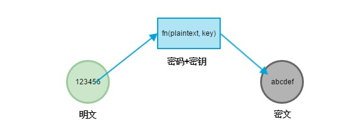
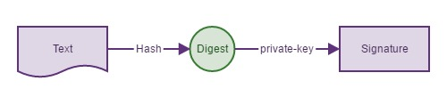
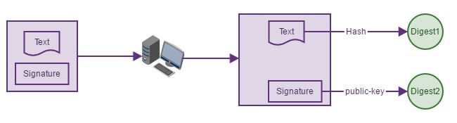

## 谈谈HTTPS中的那些算法

密码学在计算机科学中使用非常广泛，HTTPS就是建立在密码学基础之上的一种安全的通信协议。HTTPS早在1994年由网景公司首次提出，而如今在众多互联网厂商的推广之下HTTPS已经被广泛使用在各种大小网站中。在完全理解HTTPS之前，有必要弄清楚一些密码学相关的概念，比如：明文、密文、密码、密钥、对称加密、非对称加密、摘要、数字签名、数字证书。

### 密码(cipher)

密码学中的**密码（cipher）**和我们日常生活中所说的密码不太一样，计算机术语『密码 cipher』是一种用于加密或者解密的**算法**，而我们日常所使用的『密码 password』是一种口令，它是用于认证用途的一组**文本字符串**，这里我们要讨论的是前者：cipher。

### 密钥(key)

密钥是一种参数，它是在使用密码（cipher）算法过程中输入的参数。同一个明文在相同的密码算法和不同的密钥计算下会产生不同的密文。很多知名的密码算法都是公开的，密钥才是决定密文是否安全的重要参数，通常密钥越长，破解的难度越大，比如一个8位的密钥最多有256种情况，使用穷举法，能非常轻易的破解，知名的DES算法使用56位的密钥，目前已经不是一种安全的加密算法了，主要还是因为56位的密钥太短，在数小时内就可以被破解。密钥分为对称密钥与非对称密钥。

### 明文/密文

明文（plaintext）是加密之前的原始数据，密文是通过密码（cipher）运算后得到的结果成为密文（ciphertext）



### 对称密钥

对称密钥（Symmetric-key algorithm）又称为共享密钥加密，对称密钥在加密和解密的过程中使用的密钥是相同的，常见的对称加密算法有DES、3DES、AES、RC5、RC6。对称密钥的优点是计算速度快，但是他也有缺点，密钥需要在通讯的两端共享，让彼此知道密钥是什么对方才能正确解密，如果所有客户端都共享同一个密钥，那么这个密钥就像万能钥匙一样，可以凭借一个密钥破解所有人的密文了，如果每个客户端与服务端单独维护一个密钥，那么服务端需要管理的密钥将是成千上万，这会给服务端带来噩梦。下面就是一个简单的对称加密，将明文加密成ASCII。

```
# 加密的方式：在ASCII的基础上 + 密钥的值

def encipher(plain_text, key):
    # 加密
    cipher_text = []
    for c in plain_text:
        cipher_text.append(str(ord(c) + key))

    return ' '.join(cipher_text)

def decipher(cipher_text, key):
    # 解密
    plain_text = []
    for c in cipher_text.split(" "):
        plain_text.append(chr(int(c)+key))
    return "".join(plain_text)


if __name__ == '__main__':
    print "cipher_text:", encipher("abcdef", 0)
    print "plain_text:", decipher("97 98 99 100 101 102", 0)
```

### 非对称密钥

非对称密钥（public-key cryptography），又称为公开密钥加密，服务端会生成一对密钥，一个私钥保存在服务端，仅自己知道，另一个是公钥，公钥可以自由发布供任何人使用。客户端的明文通过公钥加密后的密文需要用私钥解密。非对称密钥在加密和解密的过程的使用的密钥是不同的密钥，加密和解密是不对称的，所以称之为非对称加密。与对称密钥加密相比，非对称加密无需在客户端和服务端之间共享密钥，只要私钥不发给任何用户，即使公钥在网上被截获，也无法被解密，仅有被窃取的公钥是没有任何用处的。常见的非对称加密有RSA，非对称加解密的过程：

1. 服务端生成配对的公钥和私钥
2. 私钥保存在服务端，公钥发送给客户端
3. 客户端使用公钥加密明文传输给服务端
4. 服务端使用私钥解密密文得到明文

### 数字签名（Digital Signature）

数据在浏览器和服务器之间传输时，有可能在传输过程中被冒充的盗贼把内容替换了，那么如何保证数据是真实服务器发送的而不被调包呢，同时如何保证传输的数据没有被人篡改呢，要解决这两个问题就必须用到数字签名，数字签名就如同日常生活的中的签名一样，一旦在合同书上落下了你的大名，从法律意义上就确定是你本人签的字儿，这是任何人都没法仿造的，因为这是你专有的手迹，任何人是造不出来的。那么在计算机中的数字签名怎么回事呢？数字签名就是用于验证传输的内容是不是真实服务器发送的数据，发送的数据有没有被篡改过，它就干这两件事，是非对称加密的一种应用场景。不过他是**反过来用私钥来加密，通过与之配对的公钥来解密**。

**第一步**：服务端把报文经过Hash处理后生成摘要信息Digest，摘要信息使用私钥private-key加密之后就生成签名，服务器把签名连同报文一起发送给客户端。

**第二步**：客户端接收到数据后，把签名提取出来用public-key解密，如果能正常的解密出来Digest2，那么就能确认是对方发的。
**第三步**：客户端把报文Text提取出来做同样的Hash处理，得到的摘要信息Digest1，再与之前解密出来的Digist2对比，如果两者相等，就表示内容没有被篡改，否则内容就是被人改过了。因为只要文本内容哪怕有任何一点点改动都会Hash出一个完全不一样的摘要信息出来。


### 数字证书（Certificate Authority）

数字证书简称CA，它由权威机构给某网站颁发的一种认可凭证，这个凭证是被大家（浏览器）所认可的，为什么需要用数字证书呢，难道有了数字签名还不够安全吗？有这样一种情况，就是浏览器无法确定所有的真实服务器是不是真的是真实的，举一个简单的例子：A厂家给你们家安装锁，同时把钥匙也交给你，只要钥匙能打开锁，你就可以确定钥匙和锁是配对的，如果有人把钥匙换了或者把锁换了，你是打不开门的，你就知道肯定被窃取了，但是如果有人把锁和钥匙替换成另一套表面看起来差不多的，但质量差很多的，虽然钥匙和锁配套，但是你却不能确定这是否真的是A厂家给你的，那么这时候，你可以找质检部门来检验一下，这套锁是不是真的来自于A厂家，质检部门是权威机构，他说的话是可以被公众认可的（呵呵）。

同样的， 因为如果有人（张三）用自己的公钥把真实服务器发送给浏览器的公钥替换了，于是张三用自己的私钥执行相同的步骤对文本Hash、数字签名，最后得到的结果都没什么问题，但事实上浏览器看到的东西却不是真实服务器给的，而是被张三从里到外（公钥到私钥）换了一通。那么如何保证你现在使用的公钥就是真实服务器发给你的呢？我们就用数字证书来解决这个问题。数字证书一般由数字证书认证机构（Certificate Authority）颁发，证书里面包含了真实服务器的公钥和网站的一些其他信息，数字证书机构用自己的私钥加密后发给浏览器，浏览器使用数字证书机构的公钥解密后得到真实服务器的公钥。这个过程是建立在被大家所认可的证书机构之上得到的公钥，所以这是一种安全的方式。