#  实现跨域

## react配置代理proxy(实现跨域请求)

最近有不少伙伴询问react的代理配置，自己也去试验了一下发现不少的坑，在这就将所遇到的坑和心得分享出来，希望能帮到更多的伙伴，避免踩坑。

### 1、 直接在PACKAGE.JSON中设置PROXY属性

这个是在用create-react-app脚手架搭建的react项目中的，可以直接在package.json中配置proxy：
有些文章里会提示以下方式

```javascript
  "proxy": {
    "/api/**": {
      "target": "http://172.16.136.249:8080",
      "changeOrigin": true
    }
  }
123456
```

当我们这样设置后，会报错

```
When specified, "proxy" in package.json must be a string.
Instead, the type of "proxy" was "object".
Either remove "proxy" from package.json, or make it a string.
error Command failed with exit code 1.
1234
```

**这是因为在新版本的react项目中，在package.json中的proxy只能设置成字符串，如下**

```javascript
	"proxy": "http://172.16.136.249:8080"
1
```

配置后运行项目

```bash
yarn start
或
npm run start
123
```

由于package.json中，只能给proxy设置字符串；因此，这样的方式就导致，设置的代理只能配置一个，想要配置多个代理就不行了。
想要配置多的代理，请往下看

### 2、通过MIDDLEWARE中间件的方式设置PROXY

在项目中安装middleware

```bash
yarn add http-proxy-middleware --save
或
npm install http-proxy-middleware --save
123
```

安装middleware插件后，在src目录中新建setupProxy.js文件，在文件中放入如下代码：

```javascript
const { createProxyMiddleware } = require('http-proxy-middleware')

module.exports = function (app) {
  app.use(createProxyMiddleware('/api', {
    target: 'http://172.16.136.249:8080',
    secure: false,
    changeOrigin: true,
    pathRewrite: {
      "^/api": "/api"
    }
  }))
}
123456789101112
```

然后运行项目

```bash
yarn start
或
npm run start
123
```

**注意坑点**
在有写文章会用proxy方式取值：

```javascript
const { proxy } = require('http-proxy-middleware')
// 或
// const proxy = require('http-proxy-middleware')

module.exports = function (app) {
  app.use(proxy('/api', {
    target: 'http://172.16.136.249:8080',
    secure: false,
    changeOrigin: true,
    pathRewrite: {
      "^/api": "/api"
    }
  }))
}
1234567891011121314
```

这的运行项目会报错，也是在纠结了很长时间后，在npm的网站中找到了http-proxy-middleware的设置方式：

## http-proxy-middleware实现跨域的原理

跨域
跨域是对前端而言的，是浏览器为了网络安全而作出的网络请求限制
当请求不在当前协议://host:port时，属于跨域请求，会被浏览器阻止
当项目属于前后端分离的项目时，前端代码和后端代码通常不运行在同一个端口，甚至不在同一台主机上。为了使前端能够请求后端提供的接口，需要使用跨域技术
http-proxy-middleware
跨域原理示意图

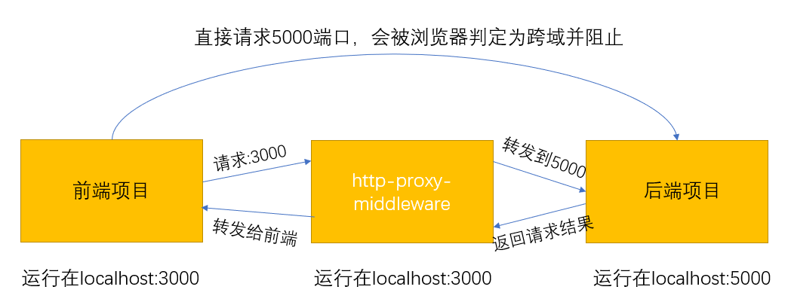

使用方法
– 创建文件夹demo, 运行npm init -y 初始化node项目(首先确保计算机中安装了node.js)
– 安装依赖 npm install http-proxy-middleware，此时版本为1.0.6
– 这里，我们通过express来使用该中间件，安装expressnpm install express
– 在demo文件夹下创建server.js文件作为代理使用
– 在demo文件夹下创建api.js文件作为接口使用
– 在demo文件夹下创建index文件夹作为前端项目。
如图：

```js
const express = require('express')
const { createProxyMiddleware  } = require('http-proxy-middleware')
let app = express()

// 对/api开头请求进行转发处理
app.use('/api', createProxyMiddleware({ 
	// 转发到5000端口
	target: 'http://localhost:5000',
	// 转发时重写路径
	pathRewrite: {'^/api' : ''},
	changeOrigin: true }));

// 将前端项目所在文件夹设置为静态资源
app.use('/', express.static('./index', {
	  cacheControl: false,
	  etag: false,
	  lastModified: false
}))

app.listen(3000)
```

在api.js中使用如下代码

```js
const express = require('express')
let app = express()

app.get('/test', (req,res)=>{
	res.send('this is a test message');	
})
// 监听在另一个端口
app.listen(5000);
```
– 在index文件夹中创建index.html，并使用如下代码
```js
<!DOCTYPE html>
<html>
  <head>
    <title>index.html</title>
		<script type="text/javascript" src="http://libs.baidu.com/jquery/2.0.0/jquery.min.js"></script>
  </head>

  <script>

  // 加载完成后就发起请求
  $(function(){
	test()
  })
  function test(){
  		// 请求的路径	
		var url = "/api/test";
		$.ajax({
     		url: url,
			type:"GET",
			dataType:"json",
});

  }
  </script>

  <body>
    This is my HTML page1321. <br>
  </body>
</html>
```

[原文](https://blog.csdn.net/TL18382950497/article/details/109037141)

## [http-proxy-middleware使用方法和实现原理（源码解读）](https://www.cnblogs.com/zhaoweikai/p/9969282.html)

本文主要讲http-proxy-middleware用法和实现原理。

### 一 简介

http-proxy-middleware用于后台将请求转发给其它服务器。

例如：我们当前主机A为[http://localhost:3000/](https://link.jianshu.com/?t=http://localhost:3000/)，现在浏览器发送一个请求，请求接口/api，这个请求的数据在另外一台服务器B上（http://10.119.168.87:4000），这时，就可通过在A主机设置代理，直接将请求发送给B主机。

简单实现代码如下：

[](javascript:void(0);)

```
1 var express = require('express');
2 var proxy = require('http-proxy-middleware');
3 
4 var app = express();
5 
6 app.use('/api', proxy({target: 'http://10.119.168.87:4000', changeOrigin: true}));
7 app.listen(3000);
```

[](javascript:void(0);)

说明：我们利用express在3000端口启动了一个小型的服务器，利用了`app.use('/api', proxy({target: 'http://10.119.168.87:4000/', changeOrigin: true}))`这句话，使发到3000端口的/api请求转发到了4000端口。即请求`http://localhost:3000/api`相当于请求http://10.119.168.87:4000`/api`。

### 二 安装

```
1 $ npm install --save-dev http-proxy-middleware
```

### 三 用法和接口说明

**proxy([context,] config)**

```
1 var proxy = require('http-proxy-middleware');
2 
3 var apiProxy = proxy('/api', {target: 'http://www.example.org'});
4 //                   \____/   \_____________________________/
5 //                     |                    |
6 //                需要转发的请求           目标服务器
```

说明：第一个参数是可以省略的。

下边示例是用Express构建的服务器中用法：

[](javascript:void(0);)

```
 1 // 引用依赖
 2 var express = require('express');
 3 var proxy = require('http-proxy-middleware');
 4 
 5 // proxy 中间件的选择项
 6 var options = {
 7         target: 'http://www.example.org', // 目标服务器 host
 8         changeOrigin: true,               // 默认false，是否需要改变原始主机头为目标URL
 9         ws: true,                         // 是否代理websockets
10         pathRewrite: {
11             '^/api/old-path' : '/api/new-path',     // 重写请求，比如我们源访问的是api/old-path，那么请求会被解析为/api/new-path
12             '^/api/remove/path' : '/path'           // 同上
13         },
14         router: {
15             // 如果请求主机 == 'dev.localhost:3000',
16             // 重写目标服务器 'http://www.example.org' 为 'http://localhost:8000'
17             'dev.localhost:3000' : 'http://localhost:8000'
18         }
19     };
20 
21 // 创建代理
22 var exampleProxy = proxy(options);
23 
24 // 使用代理
25 var app = express();
26     app.use('/api', exampleProxy);
27     app.listen(3000);
```

[](javascript:void(0);)

### 3.1 参数一**[context]**详解

下边是一个完整地址划分：

```
foo://example.com:8042/over/there?name=ferret#nose
 \_/  \______________/\_________/ \_________/ \__/
  |           |            |            |       |
协议          主机         路径          查询     碎片
```

第一个参数主要设置要代理的路径，该参数具有如下用法：

**1）可以省略**

- `proxy({...})`：匹配任何路径，所有请求将被转发；

**2）可以设置为路径字符串**

- `proxy('/', {...})` ：匹配任何路径，所有请求将被转发；
- `proxy('/api', {...})`：匹配/api开头的请求

**3）可以设置为数组**

- `proxy(['/api', '/ajax', '/someotherpath'], {...}) ：匹配多个路径`

**4）可以设置为函数（自定义配置规则）**

[](javascript:void(0);)

```
1 /**
2  * @return {Boolean}
3  */
4 var filter = function (pathname, req) {
5     return (pathname.match('^/api') && req.method === 'GET');
6 };
7 
8 var apiProxy = proxy(filter, {target: 'http://www.example.org'})
```

[](javascript:void(0);)

**5）可以设置为通配符**

细粒度的匹配可以使用通配符匹配，Glob 匹配模式由 micromatch创造，访问 [micromatch](https://link.jianshu.com/?t=https://www.npmjs.com/package/micromatch) or [glob](https://link.jianshu.com/?t=https://www.npmjs.com/package/glob) 查找更多用例。

- `proxy('**', {...})` 匹配任何路径，所有请求将被转发；
- `proxy('**/*.html', {...})` 匹配任何以.html结尾的请求；
- `proxy('/*.html', {...})` 匹配当前路径下以html结尾的请求；
- `proxy('/api/**/*.html', {...})` 匹配/api下以html为结尾的请求；
- `proxy(['/api/**', '/ajax/**'], {...})` 组合
- `proxy(['/api/**', '!**/bad.json'], {...})` 不包括`**/bad.json`

### 3.2 参数二config详解

该接口是一个对象，里边包含的参数有如下：

[](javascript:void(0);)

```
 1 // proxy 中间件的选择项
 2 var config= {
 3         target: 'http://www.example.org', // 目标服务器 host
 4         changeOrigin: true,               // 默认false，是否需要改变原始主机头为目标URL
 5         ws: true,                         // 是否代理websockets
 6         pathRewrite: {
 7             '^/api/old-path' : '/api/new-path',     // 重写请求，比如我们源访问的是api/old-path，那么请求会被解析为/api/new-path
 8             '^/api/remove/path' : '/path'           // 同上
 9         },
10         router: {
11             // 如果请求主机 == 'dev.localhost:3000',
12             // 重写目标服务器 'http://www.example.org' 为 'http://localhost:8000'
13             'dev.localhost:3000' : 'http://localhost:8000'
14         }
15     };
16 
17 // 创建代理
18 var exampleProxy = proxy(config);
```

[](javascript:void(0);)

**1）target**

用于设置目标服务器host。

**2）changeOrigin**

默认false，是否需要改变原始主机头为目标URL。

**3）ws**

设置是否代理websockets。

**4）pathRewrite**

 重写目标url路径。

[](javascript:void(0);)

```
 1 // 重写
 2 pathRewrite: {'^/old/api' : '/new/api'}
 3 
 4 // 移除
 5 pathRewrite: {'^/remove/api' : ''}
 6 
 7 // 添加
 8 pathRewrite: {'^/' : '/basepath/'}
 9 
10 // 自定义
11 pathRewrite: function (path, req) { return path.replace('/api', '/base/api') }
```

[](javascript:void(0);)

5）router

重写指定请求转发目标。

[](javascript:void(0);)

```
 1 // 使用主机或者路径进行匹配，返回最先匹配到结果
 2 // 所以配置的顺序很重要
 3 router: {
 4     'integration.localhost:3000' : 'http://localhost:8001',  // host only
 5     'staging.localhost:3000'     : 'http://localhost:8002',  // host only
 6     'localhost:3000/api'         : 'http://localhost:8003',  // host + path
 7     '/rest'                      : 'http://localhost:8004'   // path only
 8 }
 9 
10 // 自定义
11 router: function(req) {
12     return 'http://localhost:8004';
13 }
```

[](javascript:void(0);)

### 3.3 事件

http-proxy-middleware还提供了一些请求监听事件。

- option.onError:

[](javascript:void(0);)

```
1 // 监听proxy的onerr事件
2 proxy.on('error', function (err, req, res) {
3   res.writeHead(500, {
4     'Content-Type': 'text/plain'
5   });
6 
7   res.end('Something went wrong. And we are reporting a custom error message.');
8 });
```

[](javascript:void(0);)

- option.onProxyRes：监听proxy的回应事件

```
1 proxy.on('proxyRes', function (proxyRes, req, res) {
2   console.log('RAW Response from the target', JSON.stringify(proxyRes.headers, true, 2));
3 });
```

- option.onProxyReq：监听proxy的请求事件

```
1 proxy.on('proxyReq', function onProxyReq(proxyReq, req, res) {
2     proxyReq.setHeader('x-added', 'foobar');
3 });
```

- option.onProxyReqWs：

```
1 function onProxyReqWs(proxyReq, req, socket, options, head) {
2     proxyReq.setHeader('X-Special-Proxy-Header', 'foobar');
3 }
```

- option.onOpen：监听来自目标服务器的信息

```
1 proxy.on('open', function (proxySocket) {
2   proxySocket.on('data', hybiParseAndLogMessage);
3 });
```

- option.onClose：展示websocket链接分离

```
1 proxy.on('close', function (res, socket, head) {
2   console.log('Client disconnected');
3 });
```

#3# 四 实现原理和源码解读

 http-proxy-middleware实际是用http-proxy库实现代理中间件功能。

**1）proxy([context,] config)，这步是执行了源码中HttpProxyMiddleware方法，该方法核心内容是调用httpProxy.createProxyServer()方法创建一个代理服务，并且在该方法最后返回一个middleware。**

***\*httpProxy官网：https://github.com/nodejitsu/node-http-proxy#core-concept\****

**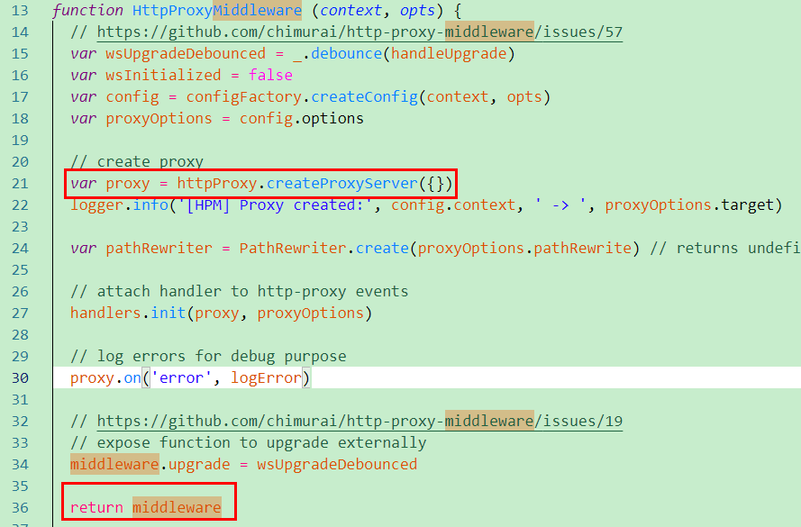**

**2）分析返回值middleware是一个函数，该函数核心是用上边创建的proxy服务返回值，调用web方法，用于转发请求。**

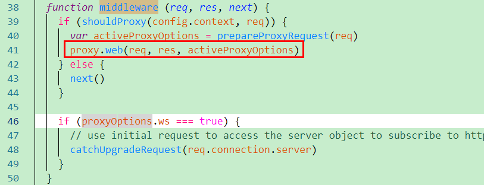

**3）app.use('/api', proxy（options）)，相当于本地服务器监听到客户端请求的‘/api’接口时，执行的回到是上边的middleware中间件函数，从上边可以看出，该函数中将请求转发到代理服务器。**

**总结：http-proxy-middleware实际就是将http-proxy封装，使用起来更加方便简单。**

 

### 参考资料&内容来源

官网：https://github.com/chimurai/http-proxy-middleware

简书：https://www.jianshu.com/p/a248b146c55a

 

分类: [NodeJS](https://www.cnblogs.com/zhaoweikai/category/1302702.html)

标签: [NodeJS](https://www.cnblogs.com/zhaoweikai/tag/NodeJS/)

## [http-proxy-middleware配置跨域](https://segmentfault.com/a/1190000038374436)

### 1. 在CRA中利用hpm实现跨域

>  首先运行命令：

```js
yarn eject
```

```shell
PS G:\Study\Code\Web\React\project-lianxi\demo> yarn eject
yarn run v1.22.10
$ react-scripts eject
NOTE: Create React App 2+ supports TypeScript, Sass, CSS Modules and more without ejecting: https://reactjs.org/blog/2018/10/01/create-react-app-v2.html

√ Are you sure you want to eject? This action is permanent. ... yes
Ejecting...

Copying files into G:\Study\Code\Web\React\project-lianxi\demo
  Adding \config\env.js to the project
  Adding \config\getHttpsConfig.js to the project
  Adding \config\modules.js to the project
  Adding \config\paths.js to the project
  Adding \config\pnpTs.js to the project
  Adding \config\webpack.config.js to the project
  Adding \config\webpackDevServer.config.js to the project
  Adding \config\jest\cssTransform.js to the project
  Adding \config\jest\fileTransform.js to the project
  Adding \scripts\build.js to the project
  Adding \scripts\start.js to the project
  Adding \scripts\test.js to the project

Updating the dependencies
  Removing react-scripts from dependencies
  Adding @babel/core to dependencies
  Adding @pmmmwh/react-refresh-webpack-plugin to dependencies
  Adding @svgr/webpack to dependencies
  Adding @typescript-eslint/eslint-plugin to dependencies
  Adding @typescript-eslint/parser to dependencies
  Adding babel-eslint to dependencies
  Adding babel-jest to dependencies
  Adding babel-loader to dependencies
  Adding babel-plugin-named-asset-import to dependencies
  Adding babel-preset-react-app to dependencies
  Adding bfj to dependencies
  Adding camelcase to dependencies
  Adding case-sensitive-paths-webpack-plugin to dependencies
  Adding css-loader to dependencies
  Adding dotenv to dependencies
  Adding dotenv-expand to dependencies
  Adding eslint to dependencies
  Adding eslint-config-react-app to dependencies
  Adding eslint-plugin-flowtype to dependencies
  Adding eslint-plugin-import to dependencies
  Adding eslint-plugin-jest to dependencies
  Adding eslint-plugin-jsx-a11y to dependencies
  Adding eslint-plugin-react to dependencies
  Adding eslint-plugin-react-hooks to dependencies
  Adding eslint-plugin-testing-library to dependencies
  Adding eslint-webpack-plugin to dependencies
  Adding file-loader to dependencies
  Adding fs-extra to dependencies
  Adding html-webpack-plugin to dependencies
  Adding identity-obj-proxy to dependencies
  Adding jest to dependencies
  Adding jest-circus to dependencies
  Adding jest-resolve to dependencies
  Adding jest-watch-typeahead to dependencies
  Adding mini-css-extract-plugin to dependencies
  Adding optimize-css-assets-webpack-plugin to dependencies
  Adding pnp-webpack-plugin to dependencies
  Adding postcss-flexbugs-fixes to dependencies
  Adding postcss-loader to dependencies
  Adding postcss-normalize to dependencies
  Adding postcss-preset-env to dependencies
  Adding postcss-safe-parser to dependencies
  Adding prompts to dependencies
  Adding react-app-polyfill to dependencies
  Adding react-dev-utils to dependencies
  Adding react-refresh to dependencies
  Adding resolve to dependencies
  Adding resolve-url-loader to dependencies
  Adding sass-loader to dependencies
  Adding semver to dependencies
  Adding style-loader to dependencies
  Adding terser-webpack-plugin to dependencies
  Adding ts-pnp to dependencies
  Adding url-loader to dependencies
  Adding webpack to dependencies
  Adding webpack-dev-server to dependencies
  Adding webpack-manifest-plugin to dependencies
  Adding workbox-webpack-plugin to dependencies

Updating the scripts

Configuring package.json
  Adding Jest configuration
  Adding Babel preset
  
  
Running yarn...
[1/4] Resolving packages...
[2/4] Fetching packages...
info fsevents@2.3.1: The platform "win32" is incompatible with this module.
info "fsevents@2.3.1" is an optional dependency and failed compatibility check. Excluding it from installation.
info fsevents@1.2.13: The platform "win32" is incompatible with this module.
info "fsevents@1.2.13" is an optional dependency and failed compatibility check. Excluding it from installation.
[3/4] Linking dependencies...
warning " > @testing-library/user-event@12.6.2" has unmet peer dependency "@testing-library/dom@>=7.21.4".
warning "@typescript-eslint/eslint-plugin > tsutils@3.20.0" has unmet peer dependency "typescript@>=2.8.0 || >= 3.2.0-dev || >= 3.3.0-dev |[4/4] Building fresh packages...
success Saved lockfile.
Ejected successfully!

fatal: not a git repository (or any of the parent directories): .git
Staged ejected files for commit.

Please consider sharing why you ejected in this survey:
  http://goo.gl/forms/Bi6CZjk1EqsdelXk1
```

### [http-proxy-middleware配置跨域](https://segmentfault.com/u/tosmile)

### http-proxy-middleware使用方法

在`src`目录下创建`setupProxy.js`文件

```
const proxy = require("http-proxy-middleware");

// app可以理解为一个express实例
module.exports = function (app) {
  app.use(
    proxy(['/mock/1241', '/mock/1105'], {
      target: "http://10.118.71.83:3000/", // 目标服务器
      changeOrigin: true // 默认false，是否需要改变原始主机头为目标URL，是否进行代理
    }),
  );
}
```

`express`结合`http-proxy-middleware`配置生成一个**反向代理服务器**，代理到与请求在同一域名上`http://localhost:3000`，`http://localhost:3000/mock/1241/xxx`就是在请求代理服务器，然后代理服务器转发到`http://10.118.71.83:3000/mock/1241/xxx`。

一些常用参数说明：

```
// proxy 中间件的选择项
var config= {
    target: 'http://www.example.org', // 需要代理的目标服务器 host
    changeOrigin: true,  // 默认false，是否需要改变原始主机头为目标URL
    ws: true, // 是否代理websockets
    pathRewrite: {
        '^/api/old-path': '/api/new-path', // 重写请求，比如我们源访问的是api/old-path，那么请求会被解析为/api/new-path
        '^/api/remove/path': '/path'  // 同上
    },
    router: { 
    // 如果请求主机 == 'dev.localhost:3000',
    // 重写目标服务器 'http://www.example.org' 为 'http://localhost:8000'
        'dev.localhost:3000' : 'http://localhost:8000'
    }
};


target：用于设置目标服务器host。
changeOrigin：默认false，是否需要改变原始主机头为目标URL。
ws：设置是否代理websockets。
pathRewrite：重写目标url路径。
router：重写指定请求转发目标
```

#### 正向代理与反向代理区别？

**正向代理：**
当客户端想要请求服务端时，客户端会将请求代理给正向代理服务器，正向代理服务器接收到请求后，会主动去请求服务端，服务端接收请求后，会将响应数据返回给正向代理服务器，最后由正向代理服务器将服务端响应的数据转发给客户端。这样就实现了客户端与服务端的请求与响应。

**正向代理的用途：**

- 加速资源访问，正向代理服务器可以缓存一些比较热的资源，当客户端请求这些热资源时，正向代理服务器就不需要再次请求服务端去获取资源了，只要取本地的缓存资源即可（可能存在缓存与服务端资源不一致的问题）。
- 对客户端访问授权，上网进行认证（是否还有流量或者话费上网）。
- 正向代理服务器可以记录用户访问记录（上网行为管理），对外隐藏用户信息。

**例子**：学校晚上断网、VPN

**反向代理：**
当客户端想要请求服务端时，客户端实际上请求的是反向代理服务器（服务端集群只需要暴露反向代理服务器即可），反向代理服务器接收到客户端的请求后，通过一定的策略，选择合适的服务端进行请求，服务端接收请求后，会将响应数据返回给反向代理服务器，最后由反向代理服务器将服务端响应的数据转发给客户端。这样就实现了客户端与服务端的请求与响应，而真正的服务端可以不暴露在外网环境下，保证了服务端的安全。

**反向代理的作用：**

- 保证各种服务在内网的安全，防止web攻击，大型网站，通常将反向代理服务器作为公网访问地址，各种服务则处于内网之中。
- 负载均衡，反向代理服务器选择合适的服务进行请求，实现流量的负载均衡。
- 限流，当流量实在过大时，机器无法负载的情况下，反向代理服务器可以限制一部分流量请求服务（让请求失败）。
- 数据预处理，处理请求的数据，让服务端能够识别，以及在服务端的响应数据中添加或者删除一些数据等。

**例子**：淘宝购物负载均衡、网关

#### http-proxy-middleware反向代理例子

**启动代理**

```
var express = require('express');
var { createProxyMiddleware } = require('http-proxy-middleware');
var app = express();
app.use('/api', createProxyMiddleware({target: 'http://localhost:3001/', changeOrigin: true}));
app.listen(3000);
```

**启动后台服务**

```
var express = require('express')
//2. 创建express服务器
var server = express()
//3. 访问服务器(get或者post)
//参数一: 请求根路径
//3.1 get请求
server.get('/api', function (request, response) {
 // console.log(request)
 response.send('get请求成功')
})
//3.2 post请求
server.post('/', function (request, response) {
 response.send('post请求成功')
})
//4. 绑定端口
server.listen(3001)
console.log('启动3001')
```

**`postman`请求结果：**
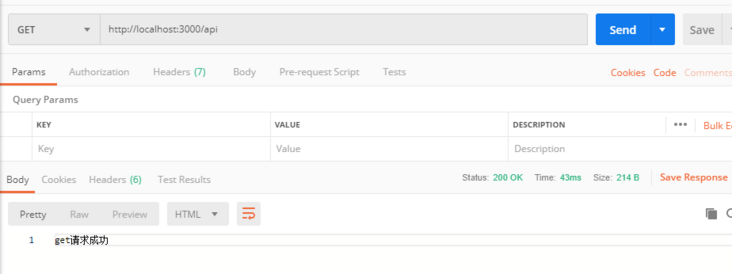

### react项目中是怎么执行setupProxy.js的？

在讲述原理之前，我们先抛出一个问题：为什么直接在`src`目录下创建`setupProxy.js`文件就可以进行跨域请求了？下面带着这个问题来探索一番。

既然在`react-scripts start`启动项目之后就可以跨域请求，肯定是在生成本地服务过程中引入某个代理中间件并根据`setupProxy.js`配置配置中间件。就相当于`express`项目中先生成`express`实例，然后再使用实例的`use`方法配置中间件：

```
const app = express();
const bodyParser = require('body-parser');

// 使用body-parser解析请求body参数
app.use(bodyParser.json())
```

`http-proxy-middleware`中间件的使用

```
const express = require('express'); 
const proxy = require('http-proxy-middleware'); 

var app = express(); 
app.use('/api', proxy({target: 'http://10.119.168.87:4000', changeOrigin: true}));
```

当运行`react-scripts start`时会执行`scripts`目录下的`start.js`脚本
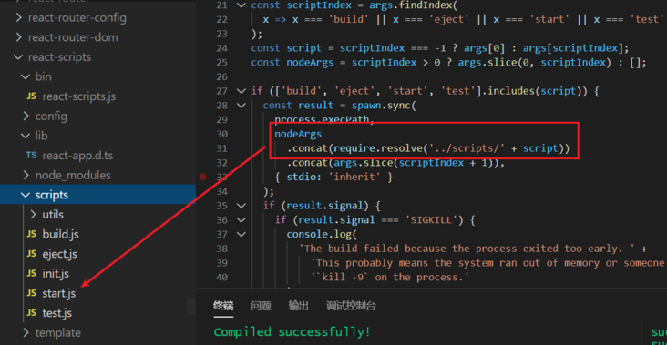
`start.js`如引入`config`目录下的`paths.js`以及基础构建脚本`webpack.config.js`和`devServer`服务配置文件`webpackDevServer.config.js`
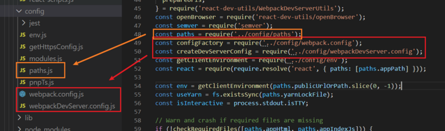
`paths.js`存放的是一些文件路径映射，比如我们的代理配置文件`setupProxy.js`的路径
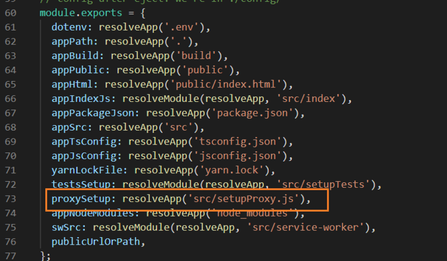
`webpack.config.js`就是基础的构建配置，比如样式加载解析、代码压缩等等。
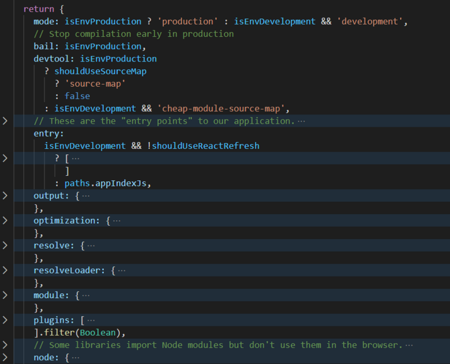
`webpackDevServer.config.js`配置的就是我们的本地服务，包括我们的跨域请求
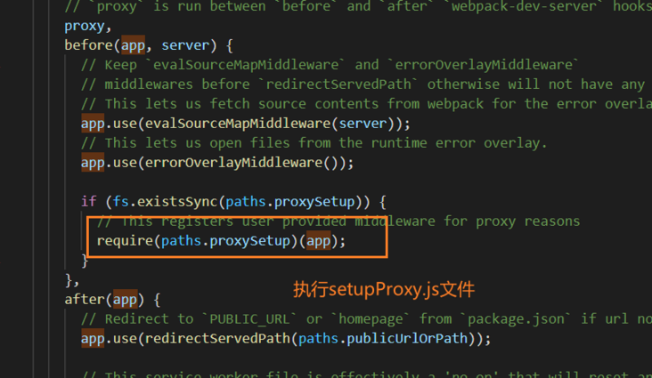
引入上述文件后，`start.js`中生成一个本地服务实例（`const app = express()`）后会根据构建、代理配置文件等配置中间件，然后启动服务
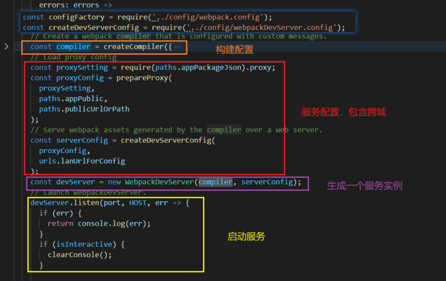

其实，创建本地服务使用的是`webpack-dev-server`包，而这个包是基于`express`实现的

```
const WebpackDevServer = require('webpack-dev-server');

const devServer = new WebpackDevServer(compiler, serverConfig);
```

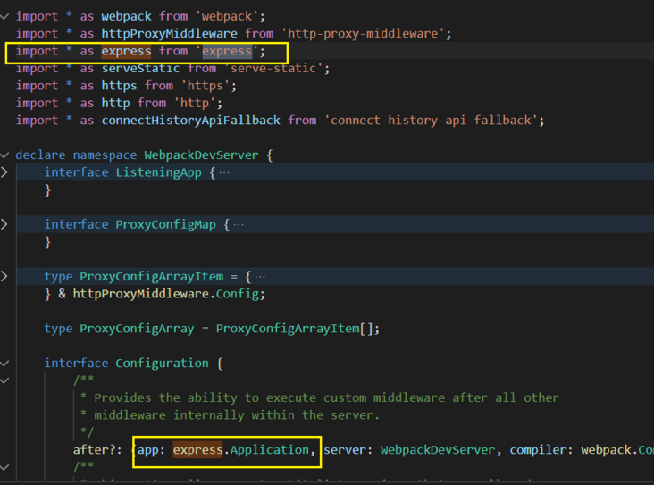

参考：[https://www.cnblogs.com/zhaow...](https://www.cnblogs.com/zhaoweikai/p/9969282.html)