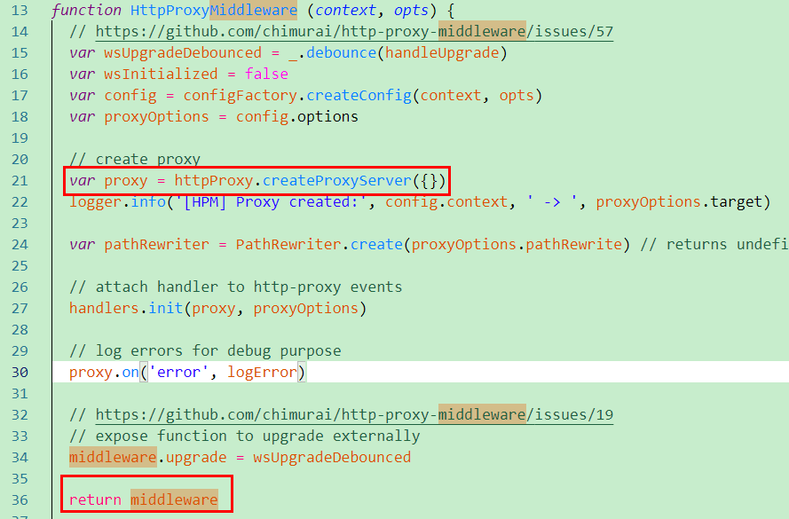
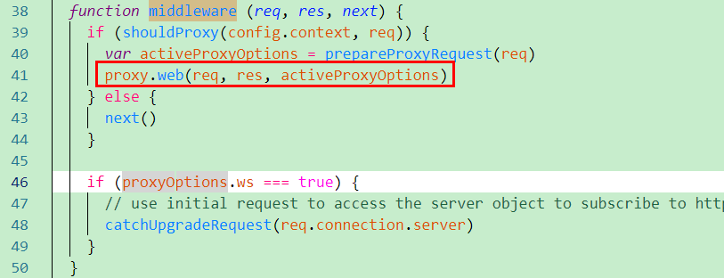

## [http-proxy-middleware使用方法和实现原理（源码解读）](https://www.cnblogs.com/zhaoweikai/p/9969282.html)

本文主要讲http-proxy-middleware用法和实现原理。

## 一 简介

http-proxy-middleware用于后台将请求转发给其它服务器。

例如：我们当前主机A为[http://localhost:3000/](https://link.jianshu.com/?t=http://localhost:3000/)，现在浏览器发送一个请求，请求接口/api，这个请求的数据在另外一台服务器B上（http://10.119.168.87:4000），这时，就可通过在A主机设置代理，直接将请求发送给B主机。

简单实现代码如下：

[](javascript:void(0);)

```
1 var express = require('express');
2 var proxy = require('http-proxy-middleware');
3 
4 var app = express();
5 
6 app.use('/api', proxy({target: 'http://10.119.168.87:4000', changeOrigin: true}));
7 app.listen(3000);
```

[](javascript:void(0);)

说明：我们利用express在3000端口启动了一个小型的服务器，利用了`app.use('/api', proxy({target: 'http://10.119.168.87:4000/', changeOrigin: true}))`这句话，使发到3000端口的/api请求转发到了4000端口。即请求`http://localhost:3000/api`相当于请求http://10.119.168.87:4000`/api`。

## 二 安装

```
1 $ npm install --save-dev http-proxy-middleware
```

## 三 用法和接口说明

**proxy([context,] config)**

```
1 var proxy = require('http-proxy-middleware');
2 
3 var apiProxy = proxy('/api', {target: 'http://www.example.org'});
4 //                   \____/   \_____________________________/
5 //                     |                    |
6 //                需要转发的请求           目标服务器
```

说明：第一个参数是可以省略的。

下边示例是用Express构建的服务器中用法：

[](javascript:void(0);)

```
 1 // 引用依赖
 2 var express = require('express');
 3 var proxy = require('http-proxy-middleware');
 4 
 5 // proxy 中间件的选择项
 6 var options = {
 7         target: 'http://www.example.org', // 目标服务器 host
 8         changeOrigin: true,               // 默认false，是否需要改变原始主机头为目标URL
 9         ws: true,                         // 是否代理websockets
10         pathRewrite: {
11             '^/api/old-path' : '/api/new-path',     // 重写请求，比如我们源访问的是api/old-path，那么请求会被解析为/api/new-path
12             '^/api/remove/path' : '/path'           // 同上
13         },
14         router: {
15             // 如果请求主机 == 'dev.localhost:3000',
16             // 重写目标服务器 'http://www.example.org' 为 'http://localhost:8000'
17             'dev.localhost:3000' : 'http://localhost:8000'
18         }
19     };
20 
21 // 创建代理
22 var exampleProxy = proxy(options);
23 
24 // 使用代理
25 var app = express();
26     app.use('/api', exampleProxy);
27     app.listen(3000);
```

[](javascript:void(0);)

### 3.1 参数一**[context]**详解

下边是一个完整地址划分：

```
foo://example.com:8042/over/there?name=ferret#nose
 \_/  \______________/\_________/ \_________/ \__/
  |           |            |            |       |
协议          主机         路径          查询     碎片
```

第一个参数主要设置要代理的路径，该参数具有如下用法：

**1）可以省略**

- `proxy({...})`：匹配任何路径，所有请求将被转发；

**2）可以设置为路径字符串**

- `proxy('/', {...})` ：匹配任何路径，所有请求将被转发；
- `proxy('/api', {...})`：匹配/api开头的请求

**3）可以设置为数组**

- `proxy(['/api', '/ajax', '/someotherpath'], {...}) ：匹配多个路径`

**4）可以设置为函数（自定义配置规则）**

[](javascript:void(0);)

```
1 /**
2  * @return {Boolean}
3  */
4 var filter = function (pathname, req) {
5     return (pathname.match('^/api') && req.method === 'GET');
6 };
7 
8 var apiProxy = proxy(filter, {target: 'http://www.example.org'})
```

[](javascript:void(0);)

**5）可以设置为通配符**

细粒度的匹配可以使用通配符匹配，Glob 匹配模式由 micromatch创造，访问 [micromatch](https://link.jianshu.com/?t=https://www.npmjs.com/package/micromatch) or [glob](https://link.jianshu.com/?t=https://www.npmjs.com/package/glob) 查找更多用例。

- `proxy('**', {...})` 匹配任何路径，所有请求将被转发；
- `proxy('**/*.html', {...})` 匹配任何以.html结尾的请求；
- `proxy('/*.html', {...})` 匹配当前路径下以html结尾的请求；
- `proxy('/api/**/*.html', {...})` 匹配/api下以html为结尾的请求；
- `proxy(['/api/**', '/ajax/**'], {...})` 组合
- `proxy(['/api/**', '!**/bad.json'], {...})` 不包括`**/bad.json`

### 3.2 参数二config详解

该接口是一个对象，里边包含的参数有如下：

[](javascript:void(0);)

```
 1 // proxy 中间件的选择项
 2 var config= {
 3         target: 'http://www.example.org', // 目标服务器 host
 4         changeOrigin: true,               // 默认false，是否需要改变原始主机头为目标URL
 5         ws: true,                         // 是否代理websockets
 6         pathRewrite: {
 7             '^/api/old-path' : '/api/new-path',     // 重写请求，比如我们源访问的是api/old-path，那么请求会被解析为/api/new-path
 8             '^/api/remove/path' : '/path'           // 同上
 9         },
10         router: {
11             // 如果请求主机 == 'dev.localhost:3000',
12             // 重写目标服务器 'http://www.example.org' 为 'http://localhost:8000'
13             'dev.localhost:3000' : 'http://localhost:8000'
14         }
15     };
16 
17 // 创建代理
18 var exampleProxy = proxy(config);
```

[](javascript:void(0);)

**1）target**

用于设置目标服务器host。

**2）changeOrigin**

默认false，是否需要改变原始主机头为目标URL。

**3）ws**

设置是否代理websockets。

**4）pathRewrite**

 重写目标url路径。

[](javascript:void(0);)

```
 1 // 重写
 2 pathRewrite: {'^/old/api' : '/new/api'}
 3 
 4 // 移除
 5 pathRewrite: {'^/remove/api' : ''}
 6 
 7 // 添加
 8 pathRewrite: {'^/' : '/basepath/'}
 9 
10 // 自定义
11 pathRewrite: function (path, req) { return path.replace('/api', '/base/api') }
```

[](javascript:void(0);)

5）router

重写指定请求转发目标。

[](javascript:void(0);)

```
 1 // 使用主机或者路径进行匹配，返回最先匹配到结果
 2 // 所以配置的顺序很重要
 3 router: {
 4     'integration.localhost:3000' : 'http://localhost:8001',  // host only
 5     'staging.localhost:3000'     : 'http://localhost:8002',  // host only
 6     'localhost:3000/api'         : 'http://localhost:8003',  // host + path
 7     '/rest'                      : 'http://localhost:8004'   // path only
 8 }
 9 
10 // 自定义
11 router: function(req) {
12     return 'http://localhost:8004';
13 }
```

[](javascript:void(0);)

### 3.3 事件

http-proxy-middleware还提供了一些请求监听事件。

- option.onError:

[](javascript:void(0);)

```
1 // 监听proxy的onerr事件
2 proxy.on('error', function (err, req, res) {
3   res.writeHead(500, {
4     'Content-Type': 'text/plain'
5   });
6 
7   res.end('Something went wrong. And we are reporting a custom error message.');
8 });
```

[](javascript:void(0);)

- option.onProxyRes：监听proxy的回应事件

```
1 proxy.on('proxyRes', function (proxyRes, req, res) {
2   console.log('RAW Response from the target', JSON.stringify(proxyRes.headers, true, 2));
3 });
```

- option.onProxyReq：监听proxy的请求事件

```
1 proxy.on('proxyReq', function onProxyReq(proxyReq, req, res) {
2     proxyReq.setHeader('x-added', 'foobar');
3 });
```

- option.onProxyReqWs：

```
1 function onProxyReqWs(proxyReq, req, socket, options, head) {
2     proxyReq.setHeader('X-Special-Proxy-Header', 'foobar');
3 }
```

- option.onOpen：监听来自目标服务器的信息

```
1 proxy.on('open', function (proxySocket) {
2   proxySocket.on('data', hybiParseAndLogMessage);
3 });
```

- option.onClose：展示websocket链接分离

```
1 proxy.on('close', function (res, socket, head) {
2   console.log('Client disconnected');
3 });
```

## 四 实现原理和源码解读

 http-proxy-middleware实际是用http-proxy库实现代理中间件功能。

**1）proxy([context,] config)，这步是执行了源码中HttpProxyMiddleware方法，该方法核心内容是调用httpProxy.createProxyServer()方法创建一个代理服务，并且在该方法最后返回一个middleware。**

***\*httpProxy官网：https://github.com/nodejitsu/node-http-proxy#core-concept\****

****

**2）分析返回值middleware是一个函数，该函数核心是用上边创建的proxy服务返回值，调用web方法，用于转发请求。**



**3）app.use('/api', proxy（options）)，相当于本地服务器监听到客户端请求的‘/api’接口时，执行的回到是上边的middleware中间件函数，从上边可以看出，该函数中将请求转发到代理服务器。**

**总结：http-proxy-middleware实际就是将http-proxy封装，使用起来更加方便简单。**

 

## 参考资料&内容来源

官网：https://github.com/chimurai/http-proxy-middleware

简书：https://www.jianshu.com/p/a248b146c55a

 

分类: [NodeJS](https://www.cnblogs.com/zhaoweikai/category/1302702.html)

标签: [NodeJS](https://www.cnblogs.com/zhaoweikai/tag/NodeJS/)