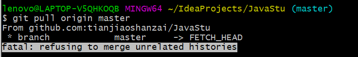

# error

## fatal: refusing to merge unrelated histories解决

Git :fatal: refusing to merge unrelated histories解决
今天本地创建了一个仓库（有README)，把本地仓库和Github上关联以后，发现git pull，git feach提醒fatal: refusing to merge unrelated histories



上网查到原因是两个分支是两个不同的版本，具有不同的提交历史


加一句

$git pull origin master --allow-unrelated-histories
1
可以允许不相关历史提，强制合并，确实解决了这个问题，感谢网友

## git 上传出现“ ! [rejected] master -> master (non-fast-forward)”

参考文章： 
[如何将本地项目上传到码云](https://blog.csdn.net/tiegenz/article/details/79551717) 
[GIT远程仓库地址变更](https://www.cnblogs.com/merray/p/5698331.html) 
[! [rejected\] master -> master (non-fast-forward)（有推荐视频）](https://blog.csdn.net/lujinjian605894472/article/details/8443403) 
在使用Git 配置公司的远程仓库时`git push origin master`，出现以下问题

```
xu:QProj xiaokai$ git push origin master
To https://gitee.com/XXXXX.git
 ! [rejected]        master -> master (non-fast-forward)
error: failed to push some refs to 'https://gitee.com/XXXXX.git'
hint: Updates were rejected because the tip of your current branch is behind
hint: its remote counterpart. Integrate the remote changes (e.g.
hint: 'git pull ...') before pushing again.
hint: See the 'Note about fast-forwards' in 'git push --help' for details.
```

从提示语中可以看出是，问题（Non-fast-forward）的出现原因在于：git仓库中已经有一部分代码，所以它不允许你直接把你的代码覆盖上去。于是你有2个选择方式：

1、强推，即利用强覆盖方式用你本地的代码替代git仓库内的内容，如果远程仓库是刚建的，没有代码，可以这样操作，尽量避免这种操作方法。

```
git push -f
```

2、先把git的东西fetch到你本地然后merge后再push

```
$ git fetch
```

```
$ git merge
```

3、在使用的时候，`git merge`，又出现了以下的问题

```
xu:QProj xiaokai$ git merge
fatal: refusing to merge unrelated histories
```

对于这个问题。使用`git pull origin master --allow-unrelated-histories `
来处理一下。

4、然后继续`git merge`,依然有问题

```
fatal: You have not concluded your merge (MERGE_HEAD exists).
Please, commit your changes before you merge.
```

这个就好处理了，是我们没有提交当前的变化， `git add .`,`git commit -am "提交信息"`

然后再来一次`git merge`,然后ok.

5、然后输入`git pull`,显示如下

```
Already up-to-date.
```

最后就可以执行`xu:QProj xiaokai$ git push origin master `
将代码上传到公司的远程仓库中。

```
xu:QProj xiaokai$ git push origin master
Counting objects: 693, done.
Delta compression using up to 4 threads.
Compressing objects: 100% (636/636), done.
Writing objects: 100% (693/693), 2.83 MiB | 570.00 KiB/s, done.
Total 693 (delta 362), reused 0 (delta 0)
remote: Resolving deltas: 100% (362/362), completed with 1 local object.
remote: Powered by Gitee.com
To https://gitee.com/XXXXX.git
   83902a5..8100890  master -> master
```

### ??Git报错解决：OpenSSL SSL_read: Connection was reset, errno 10054 错误解决

**首先，造成这个错误很有可能是网络不稳定，连接超时导致的，
如果再次尝试后依然报错，可以执行下面的命令。*

**打开Git命令页面，执行git命令脚本：修改设置，解除ssl验证**

```
git config --global http.sslVerify "false"
```

此时，再执行git操作即可。