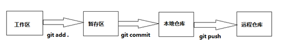
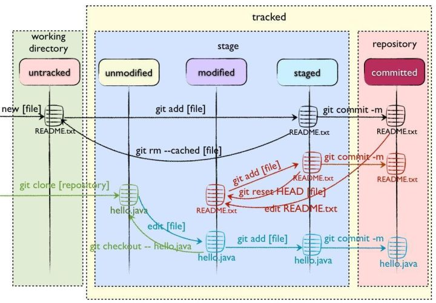

## 日常工作中常用git命令小结

### 正确理解Git四个工作区域

> Workspace**：工作区，即个人克隆项目到本地后,项目所在的文件夹目录

> Index / Stage**：暂存区，用于储存工作区中的变更(增删改等改动)的文件的地方.操作时使用git add会将本地所有的变更提交到暂存区中

> Repository**：仓库区（或版本库），用于储存工作区和暂存区中提交上来的文件,使用git commit -m '提交内容的描述'，这里面有你提交到所有版本的数据，其中HEAD指向最新放入仓库的版本

> Remote**：远程仓库，当进行到这里的时候即一个人的开发完毕的时,需要将自己开发的功能合并到主项目中去,但因为是多人开发,要保管好主项目中存储的代码和文件的话,就需要放在搭建好的远程git仓库中,即远程仓库。具体操作:git push origin 远程分支名即可。

### Git一般工作流程**

git的工作流程一般是这样的：

1、在工作目录中添加、修改文件

2、在工作目录中添加、修改文件放入暂存区域

3、将暂存区域的文件提交到本地git仓库

4、将本地仓库的代码上传到远程仓库



### 文件的四种状态**

版本控制就是对文件的版本控制，要对文件进行修改、提交等操作，首先要知道文件当前在什么状态，不然可能会提交了现在还不想提交的文件，或者要提交的文件没提交上。GIT不关心文件两个版本之间的具体差别，而是关心文件的整体是否有改变，若文件被改变，在添加提交时就生成文件新版本的快照，而判断文件整体是否改变的方法就是用**SHA-1算法计算文件的校验和**。

- > Untracked:** 未跟踪, 此文件在文件夹中, 但并没有加入到git库, 不参与版本控制。通过git add 状态变为Staged.
- > Unmodify:** 文件已经入库, 未修改, 即版本库中的文件快照内容与文件夹中完全一致. 这种类型的文件有两种去处, 如果它被修改, 而变为Modified. 如果使用git rm移出版本库, 则成为Untracked文件
- > Modified:** 文件已修改, 仅仅是修改, 并没有进行其他的操作. 这个文件也有两个去处, 通过git add可进入暂存staged状态, 使用git checkout 则丢弃修改过,返回到unmodify状态, 这个git checkout即从库中取出文件, 覆盖当前修改
- > Staged:** 暂存状态. 执行git commit则将修改同步到库中, 这时库中的文件和本地文件又变为一致, 文件为Unmodify状态. 执行git reset HEAD filename取消暂存,文件状态为Modified

这四种状态的转变流程图：



新建文件--->Untracked

使用add命令将新建的文件加入到暂存区--->Staged

使用commit命令将暂存区的文件提交到本地仓库--->Unmodified

如果对Unmodified状态的文件进行修改---> modified

如果对Unmodified状态的文件进行remove操作--->Untracked

因此，git管理的文件有三种状态：**已修改（modified）,已暂存（staged）,已提交(committed)**

### 新建仓库

```bash
# 1.建立远程库(远程库最好为空)

# 2.本地新建文件夹(最好与远程仓库同名的文件夹)
mkdir testgit
cd testgit

# 3.初始化仓库,当前目录下多了一个.git的目录，这个目录是Git来跟踪管理版本库的
git init  

# 注：上面两步可合并
# 新建一个目录，将其初始化为Git代码库
# git init [project-name] 

# 关联远程库
# git remote add origin(默认origin，可修改) branch_Name(为空时默认为master) url
git remote add origin git@github.xxx/xxx.git
# 两个地方的仓库名不需要相同，因为通过在本地仓库目录下执行这条
# 命令（命令中包含远程库的名字）已经将两者建立了联系

# 新增文件
touch README.md

# 添加文件到本地库
git add .

# 提交文件到本地库
git commit -m "msg(提交日志)"

# 注：上面两步可合并（git commit -am "msg"）

# 把本地库的所有内容推送到远程库上
git push -u origin master 
# 加上了-u参数(推送和关联)，Git不但会把本地的master分支内容推送到远程新的master分支，
# 还会把本地的master分支和远程的master分支关联起来
# 以后即可直接用git push代替git push origin master
```

### 克隆远程仓库

```bash
git clone git@github.com:xxx/xxx.git 
```

### 常用查看命令

```bash
# 查看仓库当前的状态
git status 

# 记录你的每一次命令，最先显示的是这个命令执行之后的版本的版本号的前七位
git reflog
```

> 比较文件不同-diff**

```bash
# 查看对文件做什么修改，比较工作区和暂存区
git diff 文件名

# 比较暂存区与最新本地版本库
git diff --cached  filename

# 比较工作区和最新版本
git diff HEAD filename

# 比较工作区与指定的 commit -id 的差异
git diff commit-id  filename

# 比较暂存区与指定 commit-id 的差异
git diff --cached commit-id  filename

# 看两个版本的差异的文件列表，包括被修改行数和增删图
git diff 版本号1 版本号2 --stat
# git diff bf326a16 276b4a14 --stat
# docs/v2.8.76/README.md            | 10 ----------
# docs/v2.8.76/mysql_ddl.sql        |  6 ------
# 2 files changed, 16 deletions(-)
```

### 常用修改命令

```bash
# 添加，但是不提交
git add readme.txt

# 提交，只有add后提交才有效。
# “改文件->add文件->再改->提交”，则第二次修改无效,不会被提交，只会成功提交第一次的修改。
git commit -m "提交描述"
```

### 撤销修改和版本回退

```bash
# 回退到上一个版本
# 用HEAD表示当前版本，上一个版本就是HEAD^，上上一个版本就是HEAD^^，
# 当然往上100个版本写100个^比较容易数不过来，所以写成HEAD~100
git reset --hard HEAD^

# 回退到具体commit id
git reset --hard 0b3a6dbf02c8d03969577cb7fe0e200cf8303c63

################################

# 把暂存的状态取消，工作区内容不变，但状态变为“未暂存”
git reset HEAD 文件名

# 把没暂存(即没add)的干掉，或者说，丢弃工作区，回到到暂存状态
git checkout -- 文件名
# git checkout -- pom.xml

# 简单来说，没有add过的修改，只需要git checkout -- 文件名即可撤销；
# add 过的修改，先git reset HEAD 文件名变成没add 过的修改，
# 再git checkout -- 文件名 撤销。
```


### 拉取

```bash
# 从远程分支拉取代码，
# 缺点：会拉取当前项目的所有分支的commit。这样没必要，如当前项目有很多人在参与，
# 那么就会有很多分支，那么其他分支的提交也会拉取下来
git fetch	


# pull将代码直接合并，造成冲突等无法知道
git pull
# git fetch + git merge == git pull
```


### 远程库操作-remote

```bash
# 删除该远程库
git remote remove 远程库名 
# 例：git remote remove origin(一般都是叫origin)

# 添加另外远程库
git remote add 远程库名 远程库地址
# 例：git remote add origion https://...

# 改变远程库的名字
git remote rename 旧名称 新名称（）
# 例：git rename origin origin1(把origin改成origin1)

# 查看远程库的信息
git remote 

# 查看远程库的信息地址，显示更为详细的信息，显示对应的克隆地址
git remote -v

# 更改remote地址
git remote set-url origin git@github.com:username/repository-name.git
```

## 分支管理

### 查看分支**

```bash
# 查看当前所在的分支及本地分支，git branch命令会列出所有分支，当前分支前面会标一个*号
git branch

# 查看远程所有分支
git branch -r

# 查看本地和远程的所有分支
git branch -a
```


### 删除分支**

```bash
# 删除已合并的分支。删除分支就是删除指针
git branch -d <branchname>

# Git友情提醒，dev分支还没有被合并，如果删除，将丢失掉修改，如果要强行删除, 需要加上-D
git branch -D <branchname>

# 删除远程分支，删除后还需推送到服务器
git branch -d -r <branchname>

# 删除远程分支
git push origin :<branchname>

# 删除远程分支
git push origin --delete <branchname>
```


### 创建/切换分支**

```bash
# 新建分支是新建指针,指向当前commit
git branch <branchname>

# 切换到dev分支
git checkout <branchname> 

# 创建一个新的分支：dev，并且会切换到dev分支。
# 所以这条命令有两个作用，git checkout命令加上-b参数表示创建并切换，
# 相当于以下两条命令：git branch dev和git checkout dev
git checkout -b <branchname>
```


### 重命名分支**

```bash
# 重命名本地分支
git branch -m <oldbranch> <newbranch> 

# 重命名远程分支
# 1、删除远程待修改分支
# 2、push本地新分支到远程服务器
```


### 合并分支**

```bash
# 开发分支（dev）上的代码达到上线的标准后，要合并到 master 分支
# git checkout master
# 这是在master分支上执行的命令，作用是：把dev分支上的工作成果合并到master分支上
git merge dev


# 衍合。在当前分支(如dev)下执行该命令，则相当于把当前分支和mater分支合并，和merge操作类似，
# 但提交历史不同，rebase操作的log更干净,git rebase能够将分叉的分支重新合并.
git rebase master
```


### 日志信息

```bash
# 显示从最近到最远的提交日志
git log

# 查看最近三次的提交
git log -3

# 简化日志输出的显示信息，commit id很长
git log --pretty=oneline 

# # 查看git分支合并图
git log --graph 

# 查看git分支合并图-简化
git log --graph --decorate --oneline -100
```