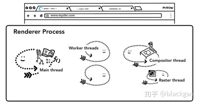

# [深入浅出Chrome浏览器架构](https://zhuanlan.zhihu.com/p/87049924)

浏览器是我们上网的一个重要工具，是我们重要的信息来源，这里以Chrome浏览器为对象，同时作为一名前端工程师，之前对于浏览器的认知还不够深入，所以借着这一系列的文章，进行浏览器的逐步分析与学习，加深自己的知识储备。同时这部分知识也是做页面性能优化，健康度监控等工具时所必须的基础知识。

## 多进程多线程的浏览器

### 首先我们先看下什么是进程和线程

- 进程是系统内存分配的一小部分内存空间
- 进程之间相互独立(不同进程之间可以相互通信（IPC），不过代价很大)
- 进程由单个或多个线程组成
- 多个线程之间是可以相互协作完成工作的
- 同一个进程中各个线程之间共享同一块内存空间

### 浏览器的多进程
chrome浏览器使用的是多进程多线程模式，因为现在的网页复杂性非常高。如果整个浏览器是单进程的，有可能某个page界面的抛错就会导致整个浏览器的crash。同时多个界面互相可以访问相同的内存和相同的执行环境，安全性也是一个大的问题，所以浏览器需要采用多进程模式。

从图中可以看到，有一个网络进程，一个浏览器主进程，一个GPU进程，多个渲染进程和多个插件进程

- 1，浏览器主进程(Browser进程)：控制chrome的地址栏，书签栏，返回和前进按钮，同时提供存储功能
- 2，第三方插件进程：每种插件一个进程，插件运行时才会创建
- 3，浏览器渲染进程（浏览器内核，内部是多线程的）：负责界面渲染，脚本执行，事件处理等
- 4，GPU进程：用于3D绘制
- 5, 网络进程：主要负责页面的网络资源加载，之前是作为一个模块运行在浏览器进程里边的，最近独立为了一个进程

同时，chrome团队也在进行浏览器架构更改，提出了面向服务的架构。将浏览器程序的每个模块作为一项服务运行，每个服务都可以在独立的进程中运行，访问服务必须使用定义好的接口，通过IPC来通信，从而构建一个更内聚，松耦合，易于维护和扩展的系统，更好实现Chrome简单，稳定，高速，安全的目标。具体的架构表现图为

但是在资源被约束的设备上，Chrome会将很多服务整合到一个进程中，从而节省内存占用。

## 多进程协作渲染界面
在上一part 中，我们已经了解了浏览器是多进程架构的，以及各个架构的作用，同时也学习了Chrome浏览器在资源充足的机器上准备使用的面向服务架构。浏览器的主要任务是展示界面给用户看，让用户操作网页，在这一part，我们会通过在地址框输入url -> 界面展示 这整个过程来看一下浏览器多个进程之间的协作。

- 首先，用户从浏览器进程里输入请求信息
- 然后，网络进程发起URL请求；
- 服务器响应URL请求以后，浏览器进程就又要开始准备渲染进程了；
- 渲染进程准备好之后，需要先向渲染进程提交页面数据，也就是提交文档阶段；
- 渲染进程接受完文档信息之后，便开始解析页面和加载子资源，完成页面的渲染；

### 浏览器导航过程
在tab网页之外的所有功能，都是由浏览器进程控制的，浏览器进程中有绘制浏览器的按钮和输入框的UI线程，网络线程来处理网络堆栈从网络中获取数据，存储线程控制文件的权限等。当输入url按下enter键后，UI线程会处理我们的输入。

### 1. 处理地址栏中的输入
用户在地址栏输入之后，浏览器进程中的UI线程回去判断用户的输入是url还是一个搜索项，因为chrome的地址栏也可以作为一个搜索输入框来使用。所以UI线程需要判断用户的的输入然后决定把用户的输入发送给搜索引擎还是发起网络请求。

### 2. URL请求过程
接下来，就是页面资源请求过程，浏览器进程会通过IPC把URL请求发送至网络进程，网络进程接收到URL请求后，会发起真正的URL请求。
首先网络进程会查找本地缓存是否有该资源，有就直接返回，没有就进入请求流程。会先经过DNS解析-》建立TCP链接-》接收返回信息-》解析响应头
其中服务端有可能给网络进程返回一个重定向的状态例如HTTP301，网络进程会从响应头的Location字段里边读取重定向的地址。

### 3. 响应数据处理
在网络请求完成之后，服务器返回数据给浏览器，但是服务器返回的类型有很多种，浏览器会根据响应头的Content-Type来判断返回值的类型，如果服务端返回的是数据是HTML，网络线程会把数据直接发送给渲染进程(浏览器内核)，但是如果是zip文件或者是其他类型的文件，这代表着这是一次下载请求，网络线程会把数据发送给下载管理器。

同时这个过程也会发生浏览器的安全检查，如果响应域和返回数据与已知的恶意站点所匹配，网络线程会告诉渲染进程展示一个警告界面，同时为了确保不会把危险的跨域数据发送给渲染进程也会进行CORB检测。
### 4. 准备渲染进程
当所有的检查都完成后，网络进程确定浏览器应该导航到对应的请求站点，网络进程告诉浏览器进程数据已经准备完毕，然后浏览器进程便开始去准备渲染进程。

不同源的界面，会有一个单独的渲染进程，如果是从同源的A界面打开B界面，则B界面的渲染进程会复用A界面的渲染进程。

由于网络请求需要几百毫秒才能得到响应返回，浏览器应用了一种用来加速这个过程的优化策略，当浏览器进程发送一个网络请求给网络进程的同时， 浏览器进程会主动尝试去查找或启动一个渲染进程，这个过程是并行执行的。使用这种方法，如果一切进展顺利的话，当网络进程接收到数据时，渲染进程已经处于待机状态了，当然如果请求被重定向的话则不会用到这个准备好的渲染进程。

渲染进程准备好之后，还不能立即进入文档解析状态，因为此时的文档数据还在网络进程中，并没有提交给渲染进程，所以下一步就进入了提交文档阶段。
### 5. 提交文档
这里的“文档”是指URL请求的响应题数据

- "提交文档"的消息是由浏览器进程发出的，渲染进程接收到"提交文档"的消息后，会和网络进程建立传输数据的"管道".
- 文档数据传输完成之后，渲染进程会返回“确认提交”的消息给浏览器进程。
- 浏览器进程在接收到“确认提交”的消息后，会更新浏览器界面状态，包括安全状态，地址栏的URL，前进后退的历史状态，并更新Web界面。

到此，浏览器的导航流程完成了，导航流程很重要，它是网络加载流程和渲染流程之间的一座桥梁，这个过程涵盖了从用户发起请求到提交文档给渲染进程中间的所有阶段。

### 浏览器渲染过程

\-------------------------------
#### 渲染进程控制页面内容
浏览器进程负责tab页中发生的所有事情，在渲染进程中，主线程处理大部分的代码，同时如果使用了web worker或者service worker，则工作线程也会处理一部分代码。合成器和光栅线程也运行在渲染进程中来高效，流畅的渲染界面。

渲染器进程的主要工作是将HTML，CSS和JavaScript转换为用户可以与之交互的网页。

#### 构造DOM
当渲染进程接收到导航过程中浏览器进程的提交文档信息并开始接收HTML数据时，主线程开始解析HTML并将其转换为DOM。
DOM是能够被浏览器理解的结构，并且通过JavaScript可以进行修改。

当HTML解析器遇到了script标签，它会暂停HTML文档的解析，并且去加载-》解析-》执行js代码，因为js中可能存在类似于document.write这样的改变DOM结构的语句。

#### 样式计算
样式计算的目的是为了计算出DOM节点中每个元素的具体样式，这个阶段大体分为三步来完成。

1. 把CSS转换为浏览器能够理解的结构，和HTML文件一样，浏览器也是无法直接理解这些纯文本的CSS样式，所以当渲染引擎接收到CSS文本，会将CSS文本转换为浏览器可以理解的结构---styleSheets。并且该结构同时具备了查询和修改功能，也就是后续的样式操作。

2. 转换样式表中的属性值，使其标准化，也就是对styleSheets的属性值进行标准化操作。

3. 计算出DOM树中每个节点的具体样式，通过CSS的继承规则和层叠规则，最终会输入每个DOM节点的样式，并被保存在ComputedStyle的结构内。

#### 布局阶段
有了DOM树和DOM树上的元素的样式后，我们还不知道DOM树上的元素在屏幕上的具体位置，接下来就是要计算DOM树中可见元素的几何位置，这个过程就是布局。

1. 创建布局树
   DOM树中display:none的元素是不可见的，所以需要根据DOM树和样式计算创建一个可见元素布局树。

2. 分层
在得到了DOM树， DOM树上元素的样式，每个元素在页面上的几何位置之后，还不能直接渲染出我们想要的界面，我们还需要知道渲染界面时元素的渲染位置。
例如当某个元素上有 z-index属性时，就不能按照元素原有的顺序进行绘制，否则就会出错，见下述例子：

在渲染界面之前，我们需要对元素进行分层，主线程会遍历布局树进行图层的划分，如果某个元素没有得到其该有的单独的图层，可以给它添加will-change属性来提醒浏览器。

3. 合成
   现在渲染进程知道了DOM结构，每个元素的样式，元素在页面上的几何位置，元素的渲染先后。渲染进程将这些信息转换为屏幕上的像素的过程被叫做栅格化。

一种最简单原始的做法就是 只对用户浏览器当前可视化的部分做栅格化，当用户滚动页面时，再通过栅格化去填补缺失的部分。但是目前现代浏览器运行着一个更复杂的过程，就是合成。

合成是一种将页面的各个部分进行分层的技术，分别对不同的图层进行栅格化，并在合成线程中作为页面进行合成。因为图层都已经被栅格化，在发生滚动的时候，只需要进行图层的移动来合成一个新的帧就行了。

4. 从上图可知，当图层的绘制列表准备好之后，主线程会把该绘制列表提交给合成线程，因为有些图层可能会很大，比如有些界面需要滚动好久才能滚动到底部，这时候，合成线程就会将图层划分为图块来优先满足 浏览器可视区域的渲染，这些图块的大小通常是256X256或者 512X512， 然后合成线程会按照 可视区域附近的图块来优先生成位图，这里生成位图的操作就是栅格化。

同时渲染进程维护了一个栅格化的线程池，所有图块栅格化都是在线程池中执行的：

栅格化的过程会使用GPU来加速生成，使用GPU生成位图的过程叫做快速栅格化，或者GPU栅格化，生成的位图都被保存在GPU内存中。

一旦所有的图块都被栅格化，合成线程就会生成一个绘制图块的命令--“Draw Quad”, 然后将该命令提交给浏览器进程。
浏览器进程接收到命令后，会将页面内容绘制到内存中，最后再将内存显示在屏幕上。

## 总结
1. 到这里，浏览器的整体进程交互和渲染过程就结束了。总结下来就是：

- 渲染进程将HTML内容转换为DOM树
- 渲染引擎将CSS样式转换为styleSheets，计算出DOM节点的样式；
- 创建布局树，并计算出布局树的布局信息(几何信息)；
- 对布局树进行分层，生成分层树；
- 每个图层生成绘制列表，提交至合成线程；
- 合成线程将图层分为图块，并在光栅化线程池中将图块转换为位图， 中间可能伴随有GPU加速；
- 合成线程发送 DrawQuad给浏览器进程。
- 浏览器进程根据命令消息生成页面，显示到显示器上。

2. 重排：
   当使用js 改变某个元素的大小，宽高，会引起重新计算布局，分层，绘制，合成等步骤。

3. 重绘：
   当使用js 改变某个元素的颜色，会引起 重新绘制，光栅化，合成等步骤，节省了布局和分层阶段，相较于重排执行效率会高一些。

4. 直接合成：
   使用cssS 的动画效果，可以避免排列和绘制阶段，直接在合成线程或光栅化线程池中进行操作，因为并没有占用主线程，所以直接合成的效率是最高的。

## 引用：

- 极客时间：浏览器工作原理与实践
- [https://developers.google.com/web/updates/2018/09/inside-browser-part1](https://link.zhihu.com/?target=https%3A//developers.google.com/web/updates/2018/09/inside-browser-part1)
- [https://developers.google.com/web/updates/2018/09/inside-browser-part2](https://link.zhihu.com/?target=https%3A//developers.google.com/web/updates/2018/09/inside-browser-part2)
- [https://developers.google.com/web/updates/2018/09/inside-browser-part3](https://link.zhihu.com/?target=https%3A//developers.google.com/web/updates/2018/09/inside-browser-part3)

发布于 2019-10-16