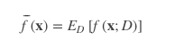

# 方差、协方差、标准差、均方差、均方根值、均方误差、均方根误差对比分析

方差（Variance)
       方差用于衡量随机变量或一组数据的离散程度，方差在在统计描述和概率分布中有不同的定义和计算公式。①概率论中方差用来度量随机变量和其数学期望（即均值）之间的偏离程度；②统计中的方差(样本方差)是每个样本值与全体样本均值之差的平方值的平均数，代表每个变量与总体均值间的离散程度。

概率论中计算公式

离散型随机变量的数学期望： 

                                                                                                             ---------求取期望值

连续型随机变量的数学期望：

                                                                                                      ----------求取期望值

其中，pi是变量，xi发生的概率，f(x)是概率密度。

                                                      ---------求取方差值

 

统计学中计算公式

 总体方差，也叫做有偏估计，其实就是我们从初高中就学到的那个标准定义的方差：

                                                                                                -----------求取总体均值

其中，n表示这组数据个数，x1、x2、x3……xn表示这组数据具体数值。

                                                    ------------求取总体方差

其中，为数据的平均数，n为数据的个数，为方差。

样本方差，无偏方差，在实际情况中，总体均值是很难得到的，往往通过抽样来计算，于是有样本方差，计算公式如下

                                                    --------------求取样本方差           

此处，为什么要将分母由n变成n-1，主要是为了实现无偏估计减小误差，请阅读《为什么样本方差的分母是 n-1》。    

协方差（Covariance）
      协方差在概率论和统计学中用于衡量两个变量的总体误差。而方差是协方差的一种特殊情况，即当两个变量是相同的情况。协方差表示的是两个变量的总体的误差，这与只表示一个变量误差的方差不同。 如果两个变量的变化趋势一致，也就是说如果其中一个大于自身的期望值，另外一个也大于自身的期望值，那么两个变量之间的协方差就是正值。 如果两个变量的变化趋势相反，即其中一个大于自身的期望值，另外一个却小于自身的期望值，那么两个变量之间的协方差就是负值。

其中，E[X]与E[Y]分别为两个实数随机变量X与Y的数学期望，Cov(X,Y)为X，Y的协方差。

 标准差（Standard Deviation)
       标准差也被称为标准偏差,在中文环境中又常称均方差，是数据偏离均值的平方和平均后的方根，用σ表示。标准差是方差的算术平方根。标准差能反映一个数据集的离散程度，只是由于方差出现了平方项造成量纲的倍数变化，无法直观反映出偏离程度，于是出现了标准差，标准偏差越小，这些值偏离平均值就越少，反之亦然。

                                                                                               ------------求取样本标准差

其中，  代表所采用的样本X1,X2,...,Xn的均值。

                                                                                                 -------------求取总体标准差

 其中， 代表总体X的均值。

例：有一组数字分别是200、50、100、200，求它们的样本标准偏差。

= (200+50+100+200)/4 = 550/4 = 137.5

= [(200-137.5)^2+(50-137.5)^2+(100-137.5)^2+(200-137.5)^2]/(4-1)

样本标准偏差 S = Sqrt(S^2)=75

均方误差（mean-square error, MSE）
       均方误差是反映估计量与被估计量之间差异程度的一种度量，换句话说，参数估计值与参数真值之差的平方的期望值。MSE可以评价数据的变化程度，MSE的值越小，说明预测模型描述实验数据具有更好的精确度。

均方根误差（root mean squared error，RMSE）
      均方根误差亦称标准误差，是均方误差的算术平方根。换句话说，是观测值与真值(或模拟值)偏差(而不是观测值与其平均值之间的偏差)的平方与观测次数n比值的平方根，在实际测量中，观测次数n总是有限的，真值只能用最可信赖（最佳）值来代替。标准误差对一组测量中的特大或特小误差反映非常敏感，所以，标准误差能够很好地反映出测量的精密度。这正是标准误差在工程测量中广泛被采用的原因。因此，标准差是用来衡量一组数自身的离散程度，而均方根误差是用来衡量观测值同真值之间的偏差。

均方根值（root-mean-square，RMES）
       均方根值也称作为方均根值或有效值，在数据统计分析中，将所有值平方求和，求其均值，再开平方，就得到均方根值。在物理学中，我们常用均方根值来分析噪声。

        比如幅度为100V而占空比为0.5的方波信号，如果按平均值计算，它的电压只有50V，而按均方根值计算则有70.71V。这是为什么呢？举一个例子，有一组100伏的电池组，每次供电10分钟之后停10分钟，也就是说占空比为一半。如果这组电池带动的是10Ω电阻，供电的10分钟产生10A 的电流和1000W的功率，停电时电流和功率为零
# 方差和偏差的区别

## 摘要

学习算法的预测误差, 或者说泛化误差(generalization error)可以分解为三个部分: 偏差(bias), 方差(variance) 和噪声(noise)。 在估计学习算法性能的过程中, 我们主要关注偏差与方差，因为噪声属于不可约减的误差 (irreducible error)。

## 0x01 偏差与方差

### 1.1 直观感受

- 偏差
  这里的偏指的是 偏离 , 那么它偏离了什么到导致了误差? 潜意识上, 当谈到这个词时, 我们可能会认为它是偏离了某个潜在的 “标准”, 而这里这个 “标准” 也就是分类任务中的真实标签 (label).
- 方差
  很多人应该都还记得在统计学中, 一个随机变量的方差描述的是它的离散程度, 也就是该随机变量在其期望值附近的 波动程度 . 取自维基百科一般化的方差定义:

> 如果 XX 是一个向量其取值范围在实数空间RnRn，并且其每个元素都是一个一维随机变量，我我们就称 XX 为随机向量。随机向量的方差是一维随机变量方差的自然推广，其定义为E[(X−μ)(X−μ)T]E[(X−μ)(X−μ)T]，其中μ=E(X)μ=E(X), XTXT是 XX 的转置.

### 1.2 推导泛化误差与偏差与方差, 噪声

- 泛化误差
  以回归任务为例, 学习算法的平方预测误差期望为:
  
- 方差
  在一个训练集 D 上模型 f 对测试样本 x 的预测输出为 f(x;D), 那么学习算法 f 对测试样本 x 的 期望预测 为:
  
  上面的期望预测也就是针对 不同 数据集 D, f 对 x 的预测值取其期望, 也被叫做 `average predicted`。

使用样本数相同的不同训练集产生的方差为:

- 噪声
  噪声为真实标记与数据集中的实际标记间的偏差:
  
- 偏差
  期望预测与真实标记的误差称为偏差(bias), 为了方便起见, 我们直接取偏差的平方:
  
- 我们回忆下刚才提到的泛化误差：
  
  现在对该期望泛化误差进行分解:
  
  不要被上面的公式吓到, 其实不复杂, 在已知结论的情况下, 了解每一项的意义, 就是一个十分简单的证明题而已, 蓝色部分是对上面对应的等价替换, 然后对其展开后, 红色部分刚好为 0.

对最终的推导结果稍作整理:

### 1.3 正式定义

至此, 继续来看一下偏差, 方差与噪声的含义 :

- 偏差.
  偏差度量了学习算法的期望预测与真实结果的偏离程度, 即刻画了学习算法本身的拟合能力。偏差平方公式：
  

- 方差.
  方差度量了同样大小的训练集的变动所导致的学习性能的变化, 即刻画了数据扰动所造成的影响 。

  f(x;D)为期望预测，也就是针对`不同`数据集 D, f 对 x 的预测值取其期望。那么使用样本数相同的不同训练集产生的方差为:
  

- 噪声.
  噪声表达了在当前任务上，任何学习算法所能达到的期望泛化误差的下界, 即刻画了学习问题本身的难度。巧妇难为无米之炊, 给一堆很差的食材, 要想做出一顿美味, 肯定是很有难度的。噪声为真实标记与数据集中的实际标记间的偏差:
  

### 1.4 小结

想当然地, 我们希望偏差与方差越小越好, 但实际并非如此. 一般来说, 偏差与方差是有冲突的, 称为偏差-方差窘境 (bias-variance dilemma).

- 给定一个学习任务, 在训练初期, 由于训练不足, 学习器的拟合能力不够强, 偏差比较大, 也是由于拟合能力不强, 数据集的扰动也无法使学习器产生显著变化, 也就是欠拟合的情况;
- 随着训练程度的加深, 学习器的拟合能力逐渐增强, 训练数据的扰动也能够渐渐被学习器学到;
- 充分训练后, 学习器的拟合能力已非常强, 训练数据的轻微扰动都会导致学习器发生显著变化, 当训练数据自身的、非全局的特性被学习器学到了, 则将发生过拟合.

## 0x02 偏差方差与射击敌人

想象你开着一架黑鹰直升机，得到命令攻击地面上一只敌军部队，于是你连打数十梭子，结果有一下几种情况:

1. 子弹基本上都打在队伍经过的一棵树上了，连在那棵树旁边等兔子的人都毫发无损，这就是方差小（子弹打得很集中），偏差大（跟目的相距甚远）。
2. 子弹打在了树上，石头上，树旁边等兔子的人身上，花花草草也都中弹，但是敌军安然无恙，这就是方差大（子弹到处都是），偏差大（同1）。
3. 子弹打死了一部分敌军，但是也打偏了些打到花花草草了，这就是方差大（子弹不集中），偏差小（已经在目标周围了）。
4. 子弹一颗没浪费，每一颗都打死一个敌军，跟抗战剧里的八路军一样，这就是方差小（子弹全部都集中在一个位置），偏差小（子弹集中的位置正是它应该射向的位置）。

- 方差，是形容数据分散程度的，算是“无监督的”，客观的指标，
- 偏差，形容数据跟我们期望的中心差得有多远，算是“有监督的”，有人的知识参与的指标。

## 0x03 偏差方差与打靶

假设红色的靶心区域是学习算法完美的正确预测值, 蓝色点为每个数据集所训练出的模型对样本的预测值, 当我们从靶心逐渐向外移动时, 预测效果逐渐变差.

- 方差
  很容易看出左边两副图中蓝色点比较集中, 而右边两幅中比较分散, 它们描述的是方差的两种情况. 比较集中的属于方差小的, 比较分散的属于方差大的情况.
- 偏差
  再看蓝色点与红色靶心区域的位置关系, 上面两幅图靠近红色靶心的属于偏差较小的情况, 下面两幅图远离靶心的属于偏差较大的情况.