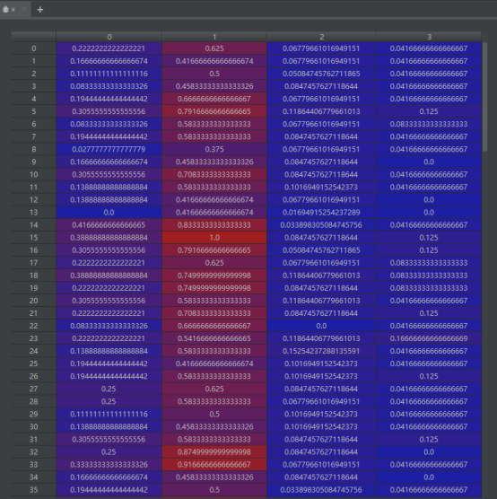

# 实验一 逻辑回归

## 一、 实验目的

1. 加深对逻辑回归算法的理解和认识。

2. 掌握基于逻辑回归的二分类算法和基于softmax的多分类算法的设计方法。

## 二、实验原理

1. 先拟合决策边界(不局限于线性，还可以是多项式)，再建立这个边界与分类的概率联系，从而得到了二分类情况下的概率。

2.极大似然估计求解的思想和理论依据。

3.逻辑回归的评价指标。

## 三、聚类步骤

1. 读入要分类的数据(数据集：iris_data)，并做一些数据格式的预处理，划分训练集和测试集;

2. 选择对鸢尾花实现多分类，可使用softmax实现;

   **下面开始训练得到模型**

   sklr = LogisticRegression(multi_class='multinomial', solver='sag', C=200, max_iter=1000000)

   **训练集和测试机拆分函数**

```python
   X_train, X_test, y_train,y_test = train_test_split(Data[0], Data[1], random_state=10)
   y_train = y_train.ravel()
   y_test = y_test.ravel()
   sklr.fit(X_train, y_train)
   y_predict = sklr.predict(X_test)
   accurcy = np.sum(y_predict == y_test) / len(y_test) # 测试准确率
   print('The accurcy is ',accurcy) 
```

 

计算实例： https://blog.csdn.net/Air_x/article/details/106290008

 

3.目标函数加上正则项。

4. 利用极大似然估计求解关于未知参数的梯度;参考梯度推导：https://zhuanlan.zhihu.com/p/53312180； 

5.利用梯度下降公式，逐步求解，直至目标函数收敛或者迭代到预设定的运行步数。

6.查阅分类正确与否的指标AUC,并画出对应的结果图。

四、代码和执行结果展示。

 源码：

首先引入机器学习以及数据处理相关的包

```python
from sklearn.linear_model import LogisticRegression
from sklearn.model_selection import train_test_split
import numpy as np
# import pandas as pd
# import matplotlib.pyplot as plt
# import seaborn as sns
# from sklearn.datasets import load_iris
# import re

def strToData(str):
    if(str == 'setosa'):
        return 0
    elif(str == 'versicolor'):
        return 1
    else:
        return 2

def loadData(filename):
    dataMat = []
    labelMat = []
    ans = []
    res = []
    fr = open(filename)
    labelMat = fr.readline().replace('"', '').strip().split()
    species = labelMat[4]
    labelMat = [labelMat[i] for i in range(0, 4)]
    while True:
        lineArr = fr.readline()
        if not lineArr:
            break
        lineArr = lineArr.strip().split()
        dataMat.append([float(lineArr[i]) for i in range(1, 5)]) # 取前面四个数据集
        ans.append([lineArr[5].replace('"', "")])                # 
        res.append([strToData(str(lineArr[5].replace('"', "")))])
    return dataMat, labelMat, res, species, ans
```


 ## 输出数据印证一下

```python
data, label, res, species, ans = loadData('./iris_data.txt')
print('dataMat-------------------------------------')
print(data)
print('labelMat----------------------------------')
print(label)
print('res------------------------------------')
print(res)
print('species--------------------------------');
print(species)
print('ans------------------------------------')
print(ans)
```

```python
runfile('G:/The_recent_study/大三下学期/机器学习/MachineLearning/first0331/LogisticRegression.py', wdir='G:/The_recent_study/大三下学期/机器学习/MachineLearning/first0331')
dataMat-------------------------------------
[[5.1, 3.5, 1.4, 0.2], [4.9, 3.0, 1.4, 0.2], [4.7, 3.2, 1.3, 0.2], [4.6, 3.1, 1.5, 0.2], [5.0, 3.6, 1.4, 0.2], [5.4, 3.9, 1.7, 0.4], [4.6, 3.4, 1.4, 0.3], [5.0, 3.4, 1.5, 0.2], [4.4, 2.9, 1.4, 0.2], [4.9, 3.1, 1.5, 0.1], [5.4, 3.7, 1.5, 0.2], [4.8, 3.4, 1.6, 0.2], [4.8, 3.0, 1.4, 0.1], [4.3, 3.0, 1.1, 0.1], [5.8, 4.0, 1.2, 0.2], [5.7, 4.4, 1.5, 0.4], [5.4, 3.9, 1.3, 0.4], [5.1, 3.5, 1.4, 0.3], [5.7, 3.8, 1.7, 0.3], [5.1, 3.8, 1.5, 0.3], [5.4, 3.4, 1.7, 0.2], [5.1, 3.7, 1.5, 0.4], [4.6, 3.6, 1.0, 0.2], [5.1, 3.3, 1.7, 0.5], [4.8, 3.4, 1.9, 0.2], [5.0, 3.0, 1.6, 0.2], [5.0, 3.4, 1.6, 0.4], [5.2, 3.5, 1.5, 0.2], [5.2, 3.4, 1.4, 0.2], [4.7, 3.2, 1.6, 0.2], [4.8, 3.1, 1.6, 0.2], [5.4, 3.4, 1.5, 0.4], [5.2, 4.1, 1.5, 0.1], [5.5, 4.2, 1.4, 0.2], [4.9, 3.1, 1.5, 0.2], [5.0, 3.2, 1.2, 0.2], [5.5, 3.5, 1.3, 0.2], [4.9, 3.6, 1.4, 0.1], [4.4, 3.0, 1.3, 0.2], [5.1, 3.4, 1.5, 0.2], [5.0, 3.5, 1.3, 0.3], [4.5, 2.3, 1.3, 0.3], [4.4, 3.2, 1.3, 0.2], [5.0, 3.5, 1.6, 0.6], [5.1, 3.8, 1.9, 0.4], [4.8, 3.0, 1.4, 0.3], [5.1, 3.8, 1.6, 0.2], [4.6, 3.2, 1.4, 0.2], [5.3, 3.7, 1.5, 0.2], [5.0, 3.3, 1.4, 0.2], [7.0, 3.2, 4.7, 1.4], [6.4, 3.2, 4.5, 1.5], [6.9, 3.1, 4.9, 1.5], [5.5, 2.3, 4.0, 1.3], [6.5, 2.8, 4.6, 1.5], [5.7, 2.8, 4.5, 1.3], [6.3, 3.3, 4.7, 1.6], [4.9, 2.4, 3.3, 1.0], [6.6, 2.9, 4.6, 1.3], [5.2, 2.7, 3.9, 1.4], [5.0, 2.0, 3.5, 1.0], [5.9, 3.0, 4.2, 1.5], [6.0, 2.2, 4.0, 1.0], [6.1, 2.9, 4.7, 1.4], [5.6, 2.9, 3.6, 1.3], [6.7, 3.1, 4.4, 1.4], [5.6, 3.0, 4.5, 1.5], [5.8, 2.7, 4.1, 1.0], [6.2, 2.2, 4.5, 1.5], [5.6, 2.5, 3.9, 1.1], [5.9, 3.2, 4.8, 1.8], [6.1, 2.8, 4.0, 1.3], [6.3, 2.5, 4.9, 1.5], [6.1, 2.8, 4.7, 1.2], [6.4, 2.9, 4.3, 1.3], [6.6, 3.0, 4.4, 1.4], [6.8, 2.8, 4.8, 1.4], [6.7, 3.0, 5.0, 1.7], [6.0, 2.9, 4.5, 1.5], [5.7, 2.6, 3.5, 1.0], [5.5, 2.4, 3.8, 1.1], [5.5, 2.4, 3.7, 1.0], [5.8, 2.7, 3.9, 1.2], [6.0, 2.7, 5.1, 1.6], [5.4, 3.0, 4.5, 1.5], [6.0, 3.4, 4.5, 1.6], [6.7, 3.1, 4.7, 1.5], [6.3, 2.3, 4.4, 1.3], [5.6, 3.0, 4.1, 1.3], [5.5, 2.5, 4.0, 1.3], [5.5, 2.6, 4.4, 1.2], [6.1, 3.0, 4.6, 1.4], [5.8, 2.6, 4.0, 1.2], [5.0, 2.3, 3.3, 1.0], [5.6, 2.7, 4.2, 1.3], [5.7, 3.0, 4.2, 1.2], [5.7, 2.9, 4.2, 1.3], [6.2, 2.9, 4.3, 1.3], [5.1, 2.5, 3.0, 1.1], [5.7, 2.8, 4.1, 1.3], [6.3, 3.3, 6.0, 2.5], [5.8, 2.7, 5.1, 1.9], [7.1, 3.0, 5.9, 2.1], [6.3, 2.9, 5.6, 1.8], [6.5, 3.0, 5.8, 2.2], [7.6, 3.0, 6.6, 2.1], [4.9, 2.5, 4.5, 1.7], [7.3, 2.9, 6.3, 1.8], [6.7, 2.5, 5.8, 1.8], [7.2, 3.6, 6.1, 2.5], [6.5, 3.2, 5.1, 2.0], [6.4, 2.7, 5.3, 1.9], [6.8, 3.0, 5.5, 2.1], [5.7, 2.5, 5.0, 2.0], [5.8, 2.8, 5.1, 2.4], [6.4, 3.2, 5.3, 2.3], [6.5, 3.0, 5.5, 1.8], [7.7, 3.8, 6.7, 2.2], [7.7, 2.6, 6.9, 2.3], [6.0, 2.2, 5.0, 1.5], [6.9, 3.2, 5.7, 2.3], [5.6, 2.8, 4.9, 2.0], [7.7, 2.8, 6.7, 2.0], [6.3, 2.7, 4.9, 1.8], [6.7, 3.3, 5.7, 2.1], [7.2, 3.2, 6.0, 1.8], [6.2, 2.8, 4.8, 1.8], [6.1, 3.0, 4.9, 1.8], [6.4, 2.8, 5.6, 2.1], [7.2, 3.0, 5.8, 1.6], [7.4, 2.8, 6.1, 1.9], [7.9, 3.8, 6.4, 2.0], [6.4, 2.8, 5.6, 2.2], [6.3, 2.8, 5.1, 1.5], [6.1, 2.6, 5.6, 1.4], [7.7, 3.0, 6.1, 2.3], [6.3, 3.4, 5.6, 2.4], [6.4, 3.1, 5.5, 1.8], [6.0, 3.0, 4.8, 1.8], [6.9, 3.1, 5.4, 2.1], [6.7, 3.1, 5.6, 2.4], [6.9, 3.1, 5.1, 2.3], [5.8, 2.7, 5.1, 1.9], [6.8, 3.2, 5.9, 2.3], [6.7, 3.3, 5.7, 2.5], [6.7, 3.0, 5.2, 2.3], [6.3, 2.5, 5.0, 1.9], [6.5, 3.0, 5.2, 2.0], [6.2, 3.4, 5.4, 2.3], [5.9, 3.0, 5.1, 1.8]]
labelMat----------------------------------
['Sepal.Length', 'Sepal.Width', 'Petal.Length', 'Petal.Width']
res------------------------------------
[[0], [0], [0], [0], [0], [0], [0], [0], [0], [0], [0], [0], [0], [0], [0], [0], [0], [0], [0], [0], [0], [0], [0], [0], [0], [0], [0], [0], [0], [0], [0], [0], [0], [0], [0], [0], [0], [0], [0], [0], [0], [0], [0], [0], [0], [0], [0], [0], [0], [0], [1], [1], [1], [1], [1], [1], [1], [1], [1], [1], [1], [1], [1], [1], [1], [1], [1], [1], [1], [1], [1], [1], [1], [1], [1], [1], [1], [1], [1], [1], [1], [1], [1], [1], [1], [1], [1], [1], [1], [1], [1], [1], [1], [1], [1], [1], [1], [1], [1], [1], [2], [2], [2], [2], [2], [2], [2], [2], [2], [2], [2], [2], [2], [2], [2], [2], [2], [2], [2], [2], [2], [2], [2], [2], [2], [2], [2], [2], [2], [2], [2], [2], [2], [2], [2], [2], [2], [2], [2], [2], [2], [2], [2], [2], [2], [2], [2], [2], [2], [2]]
species--------------------------------
Species
ans------------------------------------
[['setosa'], ['setosa'], ['setosa'], ['setosa'], ['setosa'], ['setosa'], ['setosa'], ['setosa'], ['setosa'], ['setosa'], ['setosa'], ['setosa'], ['setosa'], ['setosa'], ['setosa'], ['setosa'], ['setosa'], ['setosa'], ['setosa'], ['setosa'], ['setosa'], ['setosa'], ['setosa'], ['setosa'], ['setosa'], ['setosa'], ['setosa'], ['setosa'], ['setosa'], ['setosa'], ['setosa'], ['setosa'], ['setosa'], ['setosa'], ['setosa'], ['setosa'], ['setosa'], ['setosa'], ['setosa'], ['setosa'], ['setosa'], ['setosa'], ['setosa'], ['setosa'], ['setosa'], ['setosa'], ['setosa'], ['setosa'], ['setosa'], ['setosa'], ['versicolor'], ['versicolor'], ['versicolor'], ['versicolor'], ['versicolor'], ['versicolor'], ['versicolor'], ['versicolor'], ['versicolor'], ['versicolor'], ['versicolor'], ['versicolor'], ['versicolor'], ['versicolor'], ['versicolor'], ['versicolor'], ['versicolor'], ['versicolor'], ['versicolor'], ['versicolor'], ['versicolor'], ['versicolor'], ['versicolor'], ['versicolor'], ['versicolor'], ['versicolor'], ['versicolor'], ['versicolor'], ['versicolor'], ['versicolor'], ['versicolor'], ['versicolor'], ['versicolor'], ['versicolor'], ['versicolor'], ['versicolor'], ['versicolor'], ['versicolor'], ['versicolor'], ['versicolor'], ['versicolor'], ['versicolor'], ['versicolor'], ['versicolor'], ['versicolor'], ['versicolor'], ['versicolor'], ['versicolor'], ['versicolor'], ['versicolor'], ['virginica'], ['virginica'], ['virginica'], ['virginica'], ['virginica'], ['virginica'], ['virginica'], ['virginica'], ['virginica'], ['virginica'], ['virginica'], ['virginica'], ['virginica'], ['virginica'], ['virginica'], ['virginica'], ['virginica'], ['virginica'], ['virginica'], ['virginica'], ['virginica'], ['virginica'], ['virginica'], ['virginica'], ['virginica'], ['virginica'], ['virginica'], ['virginica'], ['virginica'], ['virginica'], ['virginica'], ['virginica'], ['virginica'], ['virginica'], ['virginica'], ['virginica'], ['virginica'], ['virginica'], ['virginica'], ['virginica'], ['virginica'], ['virginica'], ['virginica'], ['virginica'], ['virginica'], ['virginica'], ['virginica'], ['virginica'], ['virginica'], ['virginica']]
```


## 下面是利用pandas的画图库对数据进行可视化分析

```python
import pandas as pd

iris_dataframe = pd.DataFrame(X_DATA, columns = label)
pd.plotting.scatter_matrix(iris_dataframe, c=Y_DATA, figsize=(15,15), 
                           marker='0', hist_kwds={'bins':50},s=60,
                           alpha=.8)
```


## 下面对数据进行标准化

```python
X = np.array(data)
Y = np.array(res)
XData = (X - np.mean(X, axis=0)) / np.std(X, axis = 0) # 标准化
```

##  打乱数据

```python
XYData = np.hstack((XData, Y))
np.random.shuffle(XYData) #  打乱数据

X_DATA = XYData[:, :4]
Y_DATA = XYData[:, 4:]
Data = [X_DATA, Y_DATA]
print('Data:/n',Y_DATA)
```

## 下面开始训练得到模型

```python 
sklr = LogisticRegression(multi_class='multinomial', solver='sag', C=200, max_iter=1000000)
```

### 训练集和测试机拆分函数

```python
X_train, X_test, y_train,y_test = train_test_split(Data[0], Data[1], random_state=10)
y_train = y_train.ravel()
y_test = y_test.ravel()
sklr.fit(X_train, y_train)
y_predict = sklr.predict(X_test)
accurcy = np.sum(y_predict == y_test) / len(y_test) # 测试准确率
print('The accurcy is ',accurcy)
```

将得到模型去测试我们预留的25%的测试集去对模型进行测试，经过反复测试，准确率高达90%以上

```python
The accurcy is  0.9736842105263158
The accurcy is  1.0
The accurcy is  0.8947368421052632
The accurcy is  0.9210526315789473
The accurcy is  0.9473684210526315
The accurcy is  0.9473684210526315
The accurcy is  0.9473684210526315
The accurcy is  0.9736842105263158
The accurcy is  0.9736842105263158
The accurcy is  0.9736842105263158
```

# 实验二 利用PCA降维后进行人脸识别

## 一、实验目的

1. 理解和掌握PCA原理

2. 利用PCA降维，辅助完成一项实战内容。

## 二、实验原理

​	矩阵的主成分就是其协方差矩阵对应的特征向量，按照对应的特征值大小进行排序，最大的特征值就是第一主成分，其次是第二主成分，以此类推。

## 三、算法流程

> 代码

```python
# -*- coding: utf-8 -*-
"""
Created on Fri Apr 23 00:41:36 2021

@author: 13770
"""

import numpy as np
import tkinter as tk
from PIL import Image, ImageTk
from tkinter.filedialog import askopenfilename

Image_size = (40, 30)

def Database(path, n):
    ImageMatrix = []
    for i in range(1, n + 1):
        ImageXn = Image.open(path + '\\' + str(i) + '.png')
        ImageXn = ImageXn.resize(Image_size)
        grayImage = ImageXn.convert('L')
        ImageArray = list(grayImage.getdata())
        ImageMatrix.append(ImageArray)
    ImageMatrix = np.array(ImageMatrix)
    return ImageMatrix

def TrainDatabase(matrix):
    # 对样本进行中心化，也就是降维处理
    picNumber, picSize = np.shape(matrix)
    meanArray = matrix.mean(axis=0)
    diffMatrix = matrix - meanArray
    diffMatrix = np.mat(diffMatrix).T
    covariance = diffMatrix * diffMatrix.T
    eigenvalues, eigenvectors = np.linalg.eig(covariance)
    eigenvectors = list(eigenvectors)
    for i in range(0, picNumber):
        if eigenvalues[i] < 1:
            eigenvectors.pop(i)
    eigenvectors = np.array(eigenvectors)
    w = np.mat(eigenvectors)
    p = w * diffMatrix
    return p, w, meanArray


def TestDatabase(testfile, w, p, meanArray):
    ImageXn = Image.open(testfile)
    ImageXn = ImageXn.resize(Image_size)
    grayImage = ImageXn.convert('L')
    ImageArray = list(grayImage.getdata())
    ImageArray = np.array(ImageArray)
    ImageData = ImageArray - meanArray
    ImageData = np.mat(ImageData).T
    testPic = w * ImageData
    distance = p - testPic
    distance = np.array(distance)
    distance = distance ** 2
    sumDistance = np.sum(distance, axis=0)
    minDistance = np.min(sumDistance)
    index = np.where(sumDistance == minDistance)
    print('similar:', minDistance / 10000)
    return (index[0][0] + 1)


def resetpic(leftfilename, rightfilename=None):
    img = Image.open(leftfilename)
    photo = ImageTk.PhotoImage(img)
    label.config(image=photo)
    label.image = photo
    testImage = rightfilename;
    if rightfilename == None:
        name = TestDatabase(leftfilename, w, p, meanArray)
        testImage = 'G:\\The_recent_study\\大三下学期\\机器学习\\实验报告\\实验二\\train_set\\' + str(name) + '.png'
    img_1 = Image.open(testImage)
    photo_1 = ImageTk.PhotoImage(img_1)
    label_1.config(image=photo_1)
    label_1.image = photo_1


def go():
    path = askopenfilename()
    resetpic(path)


if __name__ == "__main__":
    trainNumber = 15
    path = 'G:\\The_recent_study\\大三下学期\\机器学习\\实验报告\\实验二\\train_set'
    Matrix = Database(path, trainNumber)
    global w, p, meanArray
    p, w, meanArray = TrainDatabase(Matrix)
    Windows = tk.Tk()
    Windows.title('Face Recognition')
    Windows.geometry('800x400')
    button = tk.Button(Windows, text='请选择图片', width=15, height=1, command=go, bg='yellow')
    label = tk.Label(Windows)
    label_1 = tk.Label(Windows)
    label_2 = tk.Label(Windows, text="最相近的图片")
    label.pack()
    label.place(relx=0, rely=0)
    label_1.pack()
    label_1.place(relx=0.55, rely=0)
    label_2.pack()
    label_2.place(relx=0.7, rely=0.9)
    button.pack()
    button.place(relx=0.1, rely=0.9)
Windows.mainloop()
```

> 训练集


>  测试集


>  运行程序得到一个画布


在测试集上选择一张照片：


```python
similar: (443.36210499637326+8.611985579870455j)
similar: (237.03915558462177-8.84858468210033j)
similar: (286.34152807265417-0.19701814795535644j)
similar: (437.1576763055534-11.432899781337504j)
similar: (78.43047965676934+3.392913550692841j)
similar: (239.05901100292664-9.232295273473163j)
similar: (241.40420791733942+5.057446642331202j)
similar: (192.1189016827882-7.508620973013059j)
```

# 实验三 聚类算法

## 一、实验目的

1. 加深对非监督学习的理解和认识。

2. 掌握基于距离的和基于密度的动态聚类算法的设计方法。

## 二、实验原理

1.非监督学习的理论基础。

2.动态聚类分析的思想和理论依据。

3.聚类算法的评价指标。

## 三、聚类步骤

1.选择一种聚类算法对鸢尾花做聚类;

2.读入要分类的数据;

3.设置初始聚类中心;

4.根据不同的聚类算法实现聚类。

5.显示聚类结果。

6.按照同样步骤实现学过的所有聚类算法。

## 四、代码和执行结果展示。

### （一）基于距离的聚类方法

（1）K-means、K-means++：下列代码分别展示了对样本点被分类前的分布图、K-means分类后、K-means++分类后的数据分布图。可以看出K-means与K-means++结果几乎一致，因为K-means算法是随机选取数据集中K个点作为质心，而K-means++算法可以解决K-means对初始质心比较敏感的问题，算法的区别主要在于选择的初始k个质心的之间的相互距离要尽可能的远。可见K-means++只是K-means基础上对于选取质心的优化。

>  代码：

```python
# -*- coding: utf-8 -*-
"""
Created on Fri Apr 23 01:21:19 2021

@author: 13770
"""

import numpy as np
from matplotlib import pyplot as plt
from sklearn.cluster import KMeans, DBSCAN
from sklearn.datasets import load_iris
from sklearn import metrics

def dataSet():
    iris = load_iris()
    X = iris.data[:, :4]  #表示我们取特征空间中的4个维度
    print(X)
    return X

def function_origin(X):
    plt.scatter(X[:, 0], X[:, 1], c="red", marker='.', label='see')  
    plt.title('origin')
    plt.show() 

def function_Kmeans(X):
    estimator = KMeans(n_clusters=3,init ='random')  # 构造聚类器
    estimator.fit(X)  # 聚类
    label_pred = estimator.labels_  # 获取聚类标签
    plt.title('Kmeans')
    return label_pred

def function_Kmeans_pp(X):
    estimator = KMeans(n_clusters=3,init='k-means++')  # 构造聚类器
    estimator.fit(X)  # 聚类
    label_pred = estimator.labels_  # 获取聚类标签
    plt.title('Kmeans++')
    return label_pred

def results(X,label_pred):
    x0 = X[label_pred == 0]
    x1 = X[label_pred == 1]
    x2 = X[label_pred == 2]
    plt.figure(1)
    plt.scatter(x0[:, 0], x0[:, 1], c="pink", marker='.', label='label0')  
    plt.scatter(x1[:, 0], x1[:, 1], c="orange", marker='*', label='label1')  
    plt.scatter(x2[:, 0], x2[:, 1], c="purple", marker='+', label='label2')  
    plt.xlabel('sepal length')  
    plt.ylabel('sepal width') 
    plt.show()

if __name__ == "__main__":
    x = dataSet()
    function_origin(x)
    results(x,function_Kmeans(x))
    results(x,function_Kmeans_pp(x))
```


> 【结果展示】

```text
[[5.1 3.5 1.4 0.2],[4.9 3.  1.4 0.2],[4.7 3.2 1.3 0.2],[4.6 3.1 1.5 0.2]
 [5.  3.6 1.4 0.2],[5.4 3.9 1.7 0.4],[4.6 3.4 1.4 0.3],[5.  3.4 1.5 0.2]
 [4.4 2.9 1.4 0.2],[4.9 3.1 1.5 0.1],[5.4 3.7 1.5 0.2],[4.8 3.4 1.6 0.2]
 [4.8 3.  1.4 0.1],[4.3 3.  1.1 0.1], [5.8 4.  1.2 0.2],[5.7 4.4 1.5 0.4]
 [5.4 3.9 1.3 0.4],[5.1 3.5 1.4 0.3],[5.7 3.8 1.7 0.3],[5.1 3.8 1.5 0.3]
 [5.4 3.4 1.7 0.2],[5.1 3.7 1.5 0.4],[4.6 3.6 1.  0.2],[5.1 3.3 1.7 0.5]
 [4.8 3.4 1.9 0.2],[5.  3.  1.6 0.2],[5.  3.4 1.6 0.4],[5.2 3.5 1.5 0.2]
 [5.2 3.4 1.4 0.2], [4.7 3.2 1.6 0.2],[4.8 3.1 1.6 0.2],[5.4 3.4 1.5 0.4]
 [5.2 4.1 1.5 0.1],[5.5 4.2 1.4 0.2],[4.9 3.1 1.5 0.2],[5.  3.2 1.2 0.2]
 [5.5 3.5 1.3 0.2],[4.9 3.6 1.4 0.1],[4.4 3.  1.3 0.2],[5.1 3.4 1.5 0.2]
 [5.  3.5 1.3 0.3],[4.5 2.3 1.3 0.3],[4.4 3.2 1.3 0.2],[5.  3.5 1.6 0.6]
 [5.1 3.8 1.9 0.4],[4.8 3.  1.4 0.3],[5.1 3.8 1.6 0.2],[4.6 3.2 1.4 0.2]
 [5.3 3.7 1.5 0.2],[5.  3.3 1.4 0.2],[7.  3.2 4.7 1.4],[6.4 3.2 4.5 1.5]
 [6.9 3.1 4.9 1.5],[5.5 2.3 4.  1.3],[6.5 2.8 4.6 1.5],[5.7 2.8 4.5 1.3]
 [6.3 3.3 4.7 1.6],[4.9 2.4 3.3 1. ],[6.6 2.9 4.6 1.3],[5.2 2.7 3.9 1.4]
 [5.  2.  3.5 1. ],[5.9 3.  4.2 1.5],[6.  2.2 4.  1. ],[6.1 2.9 4.7 1.4]]

Figures now render in the Plots pane by default. To make them also appear inline in the Console, uncheck "Mute Inline Plotting" under the Plots pane options menu. 
```

# 实验四 SVM

## 一、实验目的

1. 加深对监督学习的理解和认识。

2. 掌握SVM分类器的设计方法。

3. 通过鸢尾花的花萼（sepal）和花瓣（petal）的长和宽，建立SVM分类器来判断样本属于山鸢尾（Iris Setosa）、变色鸢尾（Iris Versicolor）还是维吉尼亚鸢尾（Iris Virginica）。

## 二、实验原理

支持向量机旨在求一个分离超平面。这个超平面使得离它最近的点能够最远。

## 三、聚类步骤

1. 导入鸢尾花数据集;

2. 数据归一化

3. 训练集和测试数据集划分;

4. 评价分类结果TP、FN、FP、TN以及精确率和召回率;

5. 加入松弛因子后，与未加松弛因子之前效果做对比。

## **四、** 代码和执行结果展示

代码：

```python
import numpy as np
import pandas as pd
import matplotlib as mpl
import matplotlib.pyplot as plt
import warnings
from sklearn import svm #svm导入
from sklearn.preprocessing import MinMaxScaler
from sklearn.svm import SVC
from sklearn.model_selection import train_test_split
from sklearn.metrics import accuracy_score
from sklearn.metrics import precision_score
from sklearn.exceptions import ChangedBehaviorWarning
from sklearn.metrics import confusion_matrix
from sklearn.metrics import recall_score
from sklearn.metrics import classification_report

def getData(iris_feature, path = 'Iris.data'):
    #读取数据
    data = pd.read_csv(path, header=None)
    #print(data)
    x, y = data[list(range(4))], data[4]
    x = pd.DataFrame(MinMaxScaler().fit_transform(x))
    y = pd.Categorical(y).codes #把文本数据进行编码

    x = x[[0, 1]]
    '''数据分割'''
    x_train, x_test, y_train, y_test = train_test_split(x, y, random_state=0, train_size=0.8)
    return x, y, x_train, x_test, y_train, y_test

def train(x_train, y_train):
    #使用SVM分类器进行模型构建
    #C是误差项的惩罚系数，kernel是指定SVM内部函数的类型，gamma为核函数的系数值
    clf_0 = SVC(C=0.1,kernel='rbf',gamma=0.1)
    clf_1 = SVC(C=1,kernel='rbf',gamma=0.1)
    clf_2 = SVC(C=10,kernel='rbf',gamma=0.1)
    clf_3 = SVC(C=100,kernel='rbf',gamma=0.1)
    clf_4 = SVC(C=1000,kernel='rbf',gamma=0.1)
    clf_5 = SVC(C=5000,kernel='rbf',gamma=0.1)
    clf_6 = SVC(C=10000,kernel='rbf',gamma=0.1)
    clf_7 = SVC(C=100000,kernel='rbf',gamma=0.1)

    #训练模型
    clf_0.fit(x_train, y_train)
    clf_1.fit(x_train, y_train)
    clf_2.fit(x_train, y_train)
    clf_3.fit(x_train, y_train)
    clf_4.fit(x_train, y_train)
    clf_5.fit(x_train, y_train)
    clf_6.fit(x_train, y_train)
    clf_7.fit(x_train, y_train)

    return [clf_0, clf_1, clf_2, clf_3, clf_4, clf_5, clf_6, clf_7]

def judge(clfs, x_train, x_test, y_train, y_test):
    i = 0
    for clf in clfs:
        train_predict = clf.predict(x_train)
        test_predict = clf.predict(x_test)
        print("*******************************************************")
        #模型评估
        print('clf_' + str(i) + ': ')
        print('训练集准确率：', accuracy_score(y_train, train_predict))
        print('测试集准确率：', accuracy_score(y_test, test_predict))
        print('训练集精确率：', precision_score(y_train, train_predict, average=None))
        print('测试集精确率：', precision_score(y_test, test_predict, average=None))
        print('训练集召回率：', recall_score(y_train, train_predict, average='weighted'))
        print('测试集召回率：', recall_score(y_test, test_predict, average='weighted'))

        # Iris-setosa
        setosa_train_true = y_train == 0
        setosa_train_pre = train_predict == 0
        setosa_test_true = y_test == 0
        setosa_test_pre = test_predict == 0
        setosa_train_tn, setosa_train_fp, setosa_train_fn, setosa_train_tp = confusion_matrix(setosa_train_true,
                                                                                              setosa_train_pre).ravel()
        setosa_test_tn, setosa_test_fp, setosa_test_fn, setosa_test_tp = confusion_matrix(setosa_test_true,
                                                                                          setosa_test_pre).ravel()
        print("Iris-setosa:")
        print("Train: ")
        print("TN: %d, FP: %d, FN: %d, TP: %d;" % (setosa_train_tn, setosa_train_fp, setosa_train_fn, setosa_train_tp))
        print("Test: ")
        print("TN: %d, FP: %d, FN: %d, TP: %d;" % (setosa_test_tn, setosa_test_fp, setosa_test_fn, setosa_test_tp))
        print("\n")

        # Iris-versicolor
        versicolor_train_true = y_train == 1
        versicolor_train_pre = train_predict == 1
        versicolor_test_true = y_test == 1
        versicolor_test_pre = test_predict == 1
        versicolor_train_tn, versicolor_train_fp, versicolor_train_fn, versicolor_train_tp = \
            confusion_matrix(versicolor_train_true, versicolor_train_pre).ravel()
        versicolor_test_tn, versicolor_test_fp, versicolor_test_fn, versicolor_test_tp = \
            confusion_matrix(versicolor_test_true, versicolor_test_pre).ravel()
        print("Iris-versicolor:")
        print("Train: ")
        print("TN: %d, FP: %d, FN: %d, TP: %d;" % (versicolor_train_tn, versicolor_train_fp, versicolor_train_fn,
              versicolor_train_tp))

        print("Test: ")
        print("TN: %d, FP: %d, FN: %d, TP: %d;" % (versicolor_test_tn, versicolor_test_fp, versicolor_test_fn,
              versicolor_test_tp))

        print("\n")

        # Iris-virginica
        virginica_train_true = y_train == 2
        virginica_train_pre = train_predict == 2
        virginica_test_true = y_test == 2
        virginica_test_pre = test_predict == 2
        virginica_train_tn, virginica_train_fp, virginica_train_fn, virginica_train_tp = \
            confusion_matrix(virginica_train_true, virginica_train_pre).ravel()
        virginica_test_tn, virginica_test_fp, virginica_test_fn, virginica_test_tp = \
            confusion_matrix(virginica_test_true, virginica_test_pre).ravel()
        print("Iris-virginica:")
        print("Train: ")
        print("TN: %d, FP: %d, FN: %d, TP: %d;" % (virginica_train_tn, virginica_train_fp, virginica_train_fn,
              virginica_train_tp))
        print("Test: ")
        print("TN: %d, FP: %d, FN: %d, TP: %d;" % (virginica_test_tn, virginica_test_fp, virginica_test_fn,
              virginica_test_tp))

        print("\n")

        i = i + 1
    
def draw(x, y, clfs, iris_feature):
    i = 0
    '''画图'''
    for clf in clfs:
        N = 500
        # x1_min, x2_min, x3_min, x4_min = x.min()
        # x1_max, x2_max, x3_max, x4_max = x.max()
        x1_min, x2_min = x.min()
        x1_max, x2_max = x.max()
        t1 = np.linspace(x1_min, x1_max, N)
        t2 = np.linspace(x2_min, x2_max, N)
        # t3 = np.linspace(x3_min, x3_max, N)
        # t4 = np.linspace(x4_min, x4_max, N)
        x1, x2 = np.meshgrid(t1, t2)  # 生成网格采样点
        grid_show = np.dstack((x1.flat, x2.flat))[0] # 测试点
        grid_hat = clf.predict(grid_show)       # 预测分类值
        grid_hat = grid_hat.reshape(x1.shape)  # 使之与输入的形状相同
        cm_light = mpl.colors.ListedColormap(['#00FFCC', '#FFA0A0', '#A0A0FF'])
        cm_dark = mpl.colors.ListedColormap(['g', 'r', 'b'])
        plt.figure(facecolor='w')
        #区域图
        plt.pcolormesh(x1, x2, grid_hat, cmap=cm_light)
        #所有样本点
        plt.scatter(x[0], x[1], c=y, edgecolors='k', s=50, cmap=cm_dark) # 样本
        #测试数据集
        plt.scatter(x_test[0], x_test[1], s=120, facecolors='none', zorder=10) # 圈中测试集样本

        '''lable列表'''
        plt.xlabel(iris_feature[0], fontsize=13)
        plt.ylabel(iris_feature[1], fontsize=13)
        plt.xlim(x1_min, x1_max)
        plt.ylim(x2_min, x2_max)
        plt.title(u'鸢尾花SVM特征分类', fontsize=16)
        plt.grid(b=True, ls='')
        plt.tight_layout(pad=1.5)
        plt.savefig('clf_' + str(i))
        # plt.show()
        i = i + 1

if __name__ == "__main__":
    #设置属性防止中文乱码
    mpl.rcParams['font.sans-serif'] = [u'SimHei']
    mpl.rcParams['axes.unicode_minus'] = False
    warnings.filterwarnings('ignore', category=ChangedBehaviorWarning)
    #读取数据
    iris_feature = u'花萼长度', u'花萼宽度', u'花瓣长度', u'花瓣宽度'
    x, y, x_train, x_test, y_train, y_test = getData(iris_feature=iris_feature)
    clfs = train(x_train, y_train)
    judge(clfs, x_train, x_test, y_train, y_test)
    draw(x, y, clfs, iris_feature)
```


1、导入鸢尾花数据集：

data = pd.read_csv(path, header=None)
x, y = data[list(range(4))], data[4]

 

部分x数据：


部分y数据：

 

2、 数据归一化

x = pd.DataFrame(MinMaxScaler().fit_transform(x))

归一化之后的x：



2、 训练集和测试数据集划分; 


```python
x_train, x_test, y_train, y_test = train_test_split(x, y, random_state=0, train_size=0.8)
```

 

2、 评价分类结果TP、FN、FP、TN以及精确率和召回率;

使用不同的参数训练多个SVM模型：

clf_0 = SVC(C=0.1,kernel='rbf',gamma=0.1)
clf_1 = SVC(C=1,kernel='rbf',gamma=0.1)
clf_2 = SVC(C=10,kernel='rbf',gamma=0.1)
clf_3 = SVC(C=100,kernel='rbf',gamma=0.1)
clf_4 = SVC(C=1000,kernel='rbf',gamma=0.1)
clf_5 = SVC(C=5000, kernel='rbf', gamma=0.1)
clf_6 = SVC(C=10000, kernel='rbf', gamma=0.1)
clf_7 = SVC(C=100000, kernel='rbf', gamma=0.1)

 

计算它们各自的TP、FN、FP、TN以及精确率和召回率：

```python
for clf in clfs:
  train_predict = clf.predict(x_train)
  test_predict = clf.predict(x_test)
  print("*******************************************************")
  #模型评估
  print('clf_' + str(i) + ': ')
  print('训练集准确率：', accuracy_score(y_train, train_predict))
  print('测试集准确率：', accuracy_score(y_test, test_predict))
  print('训练集精确率：', precision_score(y_train, train_predict, average=None))
  print('测试集精确率：', precision_score(y_test, test_predict, average=None))
  print('训练集召回率：', recall_score(y_train, train_predict, average='weighted'))
  print('测试集召回率：', recall_score(y_test, test_predict, average='weighted'))
  print("\n")

  # Iris-setosa
  setosa_train_true = y_train == 0
  setosa_train_pre = train_predict == 0
  setosa_test_true = y_test == 0
  setosa_test_pre = test_predict == 0
  setosa_train_tn, setosa_train_fp, setosa_train_fn, setosa_train_tp = confusion_matrix(setosa_train_true,
                                             setosa_train_pre).ravel()
  setosa_test_tn, setosa_test_fp, setosa_test_fn, setosa_test_tp = confusion_matrix(setosa_test_true,
                                           setosa_test_pre).ravel()
  print("Iris-setosa:")
  print("Train: ")
  print("TN: %d, FP: %d, FN: %d, TP: %d;" % (setosa_train_tn, setosa_train_fp, setosa_train_fn, setosa_train_tp))
  print("Test: ")
  print("TN: %d, FP: %d, FN: %d, TP: %d;" % (setosa_test_tn, setosa_test_fp, setosa_test_fn, setosa_test_tp))
  print("\n")

  # Iris-versicolor
  versicolor_train_true = y_train == 1
  versicolor_train_pre = train_predict == 1
  versicolor_test_true = y_test == 1
  versicolor_test_pre = test_predict == 1
  versicolor_train_tn, versicolor_train_fp, versicolor_train_fn, versicolor_train_tp = \
    confusion_matrix(versicolor_train_true, versicolor_train_pre).ravel()
  versicolor_test_tn, versicolor_test_fp, versicolor_test_fn, versicolor_test_tp = \
    confusion_matrix(versicolor_test_true, versicolor_test_pre).ravel()
  print("Iris-versicolor:")
  print("Train: ")
  print("TN: %d, FP: %d, FN: %d, TP: %d;" % (versicolor_train_tn, versicolor_train_fp, versicolor_train_fn,
     versicolor_train_tp))

  print("Test: ")
  print("TN: %d, FP: %d, FN: %d, TP: %d;" % (versicolor_test_tn, versicolor_test_fp, versicolor_test_fn,
     versicolor_test_tp))

  print("\n")

  # Iris-virginica
  virginica_train_true = y_train == 2
  virginica_train_pre = train_predict == 2
  virginica_test_true = y_test == 2
  virginica_test_pre = test_predict == 2
  virginica_train_tn, virginica_train_fp, virginica_train_fn, virginica_train_tp = \
    confusion_matrix(virginica_train_true, virginica_train_pre).ravel()
  virginica_test_tn, virginica_test_fp, virginica_test_fn, virginica_test_tp = \
    confusion_matrix(virginica_test_true, virginica_test_pre).ravel()
  print("Iris-virginica:")
  print("Train: ")
  print("TN: %d, FP: %d, FN: %d, TP: %d;" % (virginica_train_tn, virginica_train_fp, virginica_train_fn,
     virginica_train_tp))
  print("Test: ")
  print("TN: %d, FP: %d, FN: %d, TP: %d;" % (virginica_test_tn, virginica_test_fp, virginica_test_fn,
     virginica_test_tp))

  print("\n\n")
```

得到结果：

*******************************************************

clf_0: 

训练集准确率： 0.36666666666666664

测试集准确率： 0.2

训练集精确率： [0.     0.     0.36666667]

测试集精确率： [0.  0.  0.2]

训练集召回率： 0.36666666666666664

测试集召回率： 0.2

Iris-setosa:

Train: 

TN: 81, FP: 0, FN: 39, TP: 0;

Test: 

TN: 19, FP: 0, FN: 11, TP: 0;

Iris-versicolor:

Train: 

TN: 83, FP: 0, FN: 37, TP: 0;

Test: 

TN: 17, FP: 0, FN: 13, TP: 0;

Iris-virginica:

Train: 

TN: 0, FP: 76, FN: 0, TP: 44;

Test: 

TN: 0, FP: 24, FN: 0, TP: 6;

*******************************************************

clf_1: 

训练集准确率： 0.6833333333333333

测试集准确率： 0.5333333333333333

训练集精确率： [0.79591837 0.     0.6056338 ]

测试集精确率： [0.78571429 0.     0.3125   ]

训练集召回率： 0.6833333333333333

测试集召回率： 0.5333333333333333

Iris-setosa:

Train: 

TN: 71, FP: 10, FN: 0, TP: 39;

Test: 

TN: 16, FP: 3, FN: 0, TP: 11;

Iris-versicolor:

Train: 

TN: 83, FP: 0, FN: 37, TP: 0;

Test: 

TN: 17, FP: 0, FN: 13, TP: 0;

Iris-virginica:

Train: 

TN: 48, FP: 28, FN: 1, TP: 43;

Test: 

TN: 13, FP: 11, FN: 1, TP: 5;

*******************************************************

clf_2: 

训练集准确率： 0.85

测试集准确率： 0.7333333333333333

训练集精确率： [1.     0.77142857 0.7826087 ]

测试集精确率： [1.     0.72727273 0.375   ]

训练集召回率： 0.85

测试集召回率： 0.7333333333333333

Iris-setosa:

Train: 

TN: 81, FP: 0, FN: 0, TP: 39;

Test: 

TN: 19, FP: 0, FN: 0, TP: 11;

Iris-versicolor:

Train: 

TN: 75, FP: 8, FN: 10, TP: 27;

Test: 

TN: 14, FP: 3, FN: 5, TP: 8;

Iris-virginica:

Train: 

TN: 66, FP: 10, FN: 8, TP: 36;

Test: 

TN: 19, FP: 5, FN: 3, TP: 3;

*******************************************************

clf_3: 

训练集准确率： 0.8333333333333334

测试集准确率： 0.7333333333333333

训练集精确率： [1.     0.74285714 0.76595745]

测试集精确率： [1.     0.72727273 0.375   ]

训练集召回率： 0.8333333333333334

测试集召回率： 0.7333333333333333

Iris-setosa:

Train: 

TN: 81, FP: 0, FN: 1, TP: 38;

Test: 

TN: 19, FP: 0, FN: 0, TP: 11;

Iris-versicolor:

Train: 

TN: 74, FP: 9, FN: 11, TP: 26;

Test: 

TN: 14, FP: 3, FN: 5, TP: 8;

Iris-virginica:

Train: 

TN: 65, FP: 11, FN: 8, TP: 36;

Test: 

TN: 19, FP: 5, FN: 3, TP: 3;

*******************************************************

clf_4: 

训练集准确率： 0.85

测试集准确率： 0.7333333333333333

训练集精确率： [1.     0.77142857 0.7826087 ]

测试集精确率： [1.     0.72727273 0.375   ]

训练集召回率： 0.85

测试集召回率： 0.7333333333333333

Iris-setosa:

Train: 

TN: 81, FP: 0, FN: 0, TP: 39;

Test: 

TN: 19, FP: 0, FN: 0, TP: 11;

Iris-versicolor:

Train: 

TN: 75, FP: 8, FN: 10, TP: 27;

Test: 

TN: 14, FP: 3, FN: 5, TP: 8;

Iris-virginica:

Train: 

TN: 66, FP: 10, FN: 8, TP: 36;

Test: 

TN: 19, FP: 5, FN: 3, TP: 3;


