# [K-Means聚类算法原理](https://www.cnblogs.com/pinard/p/6164214.html)

[python代码:](https://blog.csdn.net/ten_sory/article/details/81016748)

```python
# K-means Algorithm is a clustering algorithm
import numpy as np
import matplotlib.pyplot as plt
import random
 
 
def get_distance(p1, p2):
    diff = [x-y for x, y in zip(p1, p2)]
    distance = np.sqrt(sum(map(lambda x: x**2, diff)))
    return distance
 
 
# 计算多个点的中心
# cluster = [[1,2,3], [-2,1,2], [9, 0 ,4], [2,10,4]]
def calc_center_point(cluster):
    N = len(cluster)
    m = np.matrix(cluster).transpose().tolist()
    center_point = [sum(x)/N for x in m]
    return center_point
 
 
# 检查两个点是否有差别
def check_center_diff(center, new_center):
    n = len(center)
    for c, nc in zip(center, new_center):
        if c != nc:
            return False
    return True
 
 
# K-means算法的实现
def K_means(points, center_points):
 
    N = len(points)         # 样本个数
    n = len(points[0])      # 单个样本的维度
    k = len(center_points)  # k值大小
 
    tot = 0
    while True:             # 迭代
        temp_center_points = [] # 记录中心点
 
        clusters = []       # 记录聚类的结果
        for c in range(0, k):
            clusters.append([]) # 初始化
 
        # 针对每个点，寻找距离其最近的中心点（寻找组织）
        for i, data in enumerate(points):
            distances = []
            for center_point in center_points:
                distances.append(get_distance(data, center_point))
            index = distances.index(min(distances)) # 找到最小的距离的那个中心点的索引，
 
            clusters[index].append(data)    # 那么这个中心点代表的簇，里面增加一个样本
 
        tot += 1
        print(tot, '次迭代   ', clusters)
        k = len(clusters)
        colors = ['r.', 'g.', 'b.', 'k.', 'y.']  # 颜色和点的样式
        for i, cluster in enumerate(clusters):
            data = np.array(cluster)
            data_x = [x[0] for x in data]
            data_y = [x[1] for x in data]
            plt.subplot(2, 3, tot)
            plt.plot(data_x, data_y, colors[i])
            plt.axis([0, 1000, 0, 1000])
 
        # 重新计算中心点（该步骤可以与下面判断中心点是否发生变化这个步骤，调换顺序）
        for cluster in clusters:
            temp_center_points.append(calc_center_point(cluster))
 
        # 在计算中心点的时候，需要将原来的中心点算进去
        for j in range(0, k):
            if len(clusters[j]) == 0:
                temp_center_points[j] = center_points[j]
 
        # 判断中心点是否发生变化：即，判断聚类前后样本的类别是否发生变化
        for c, nc in zip(center_points, temp_center_points):
            if not check_center_diff(c, nc):
                center_points = temp_center_points[:]   # 复制一份
                break
        else:   # 如果没有变化，那么退出迭代，聚类结束
            break
 
    plt.show()
    return clusters # 返回聚类的结果
 
 

# 随机获取一个样本集，用于测试K-means算法
def get_test_data():
 
    N = 1000
 
    # 产生点的区域
    area_1 = [0, N / 4, N / 4, N / 2]
    area_2 = [N / 2, 3 * N / 4, 0, N / 4]
    area_3 = [N / 4, N / 2, N / 2, 3 * N / 4]
    area_4 = [3 * N / 4, N, 3 * N / 4, N]
    area_5 = [3 * N / 4, N, N / 4, N / 2]
 
    areas = [area_1, area_2, area_3, area_4, area_5]
    k = len(areas)
 
    # 在各个区域内，随机产生一些点
    points = []
    for area in areas:
        rnd_num_of_points = random.randint(50, 200)
        for r in range(0, rnd_num_of_points):
            rnd_add = random.randint(0, 100)
            rnd_x = random.randint(area[0] + rnd_add, area[1] - rnd_add)
            rnd_y = random.randint(area[2], area[3] - rnd_add)
            points.append([rnd_x, rnd_y])
 
    # 自定义中心点，目标聚类个数为5，因此选定5个中心点
    center_points = [[0, 250], [500, 500], [500, 250], [500, 250], [500, 750]]
 
    return points, center_points
 
 
if __name__ == '__main__':
 
    points, center_points = get_test_data()
    clusters = K_means(points, center_points)
    print('#######最终结果##########')
    for i, cluster in enumerate(clusters):
        print('cluster ', i, ' ', cluster)
```

## [常见的六大聚类算法](https://blog.csdn.net/weixin_42056745/article/details/101287231)

# **1. K-Means(K均值)聚类**


算法步骤：
(1) 首先我们选择一些类/组，并随机初始化它们各自的中心点。中心点是与每个数据点向量长度相同的位置。这需要我们提前预知类的数量(即中心点的数量)。
(2) 计算每个数据点到中心点的距离，数据点距离哪个中心点最近就划分到哪一类中。
(3) 计算每一类中中心点作为新的中心点。
(4) 重复以上步骤，直到每一类中心在每次迭代后变化不大为止。也可以多次随机初始化中心点，然后选择运行结果最好的一个。
下图演示了K-Means进行分类的过程：

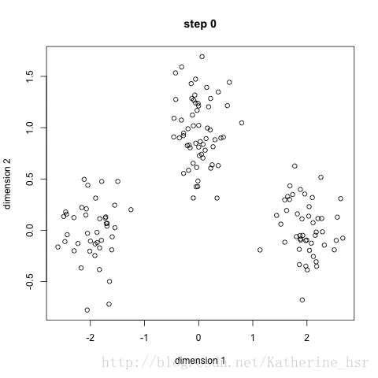

优点：
速度快，计算简便
缺点：
我们必须提前知道数据有多少类/组。
K-Medians是K-Means的一种变体，是用数据集的中位数而不是均值来计算数据的中心点。
K-Medians的优势是使用中位数来计算中心点不受异常值的影响；缺点是计算中位数时需要对数据集中的数据进行排序，速度相对于K-Means较慢。

 

# 2. 均值漂移聚类


均值漂移聚类是基于滑动窗口的算法，来找到数据点的密集区域。这是一个基于质心的算法，通过将中心点的候选点更新为滑动窗口内点的均值来完成，来定位每个组/类的中心点。然后对这些候选窗口进行相似窗口进行去除，最终形成中心点集及相应的分组。
具体步骤：
\1. 确定滑动窗口半径r，以随机选取的中心点C半径为r的圆形滑动窗口开始滑动。均值漂移类似一种爬山算法，在每一次迭代中向密度更高的区域移动，直到收敛。
\2. 每一次滑动到新的区域，计算滑动窗口内的均值来作为中心点，滑动窗口内的点的数量为窗口内的密度。在每一次移动中，窗口会想密度更高的区域移动。
\3. 移动窗口，计算窗口内的中心点以及窗口内的密度，知道没有方向在窗口内可以容纳更多的点，即一直移动到圆内密度不再增加为止。
\4. 步骤一到三会产生很多个滑动窗口，当多个滑动窗口重叠时，保留包含最多点的窗口，然后根据数据点所在的滑动窗口进行聚类。
下图演示了均值漂移聚类的计算步骤：

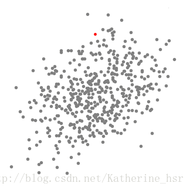

下面显示了所有滑动窗口从头到尾的整个过程。每个黑点代表滑动窗口的质心，每个灰点代表一个数据点。

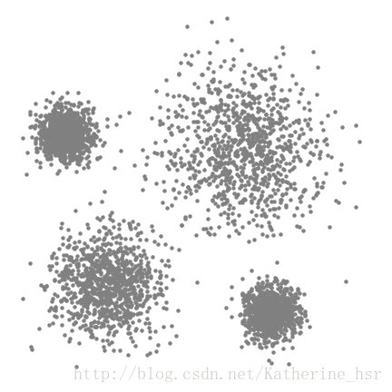

优点：（1）不同于K-Means算法，均值漂移聚类算法不需要我们知道有多少类/组。
（2）基于密度的算法相比于K-Means受均值影响较小。
缺点：（1）窗口半径r的选择可能是不重要的。

### 3. 基于密度的聚类方法(DBSCAN)


与均值漂移聚类类似，DBSCAN也是基于密度的聚类算法。
具体步骤：
\1. 首先确定半径r和minPoints. 从一个没有被访问过的任意数据点开始，以这个点为中心，r为半径的圆内包含的点的数量是否大于或等于minPoints，如果大于或等于minPoints则改点被标记为central point,反之则会被标记为noise point。
\2. 重复1的步骤，如果一个noise point存在于某个central point为半径的圆内，则这个点被标记为边缘点，反之仍为noise point。重复步骤1，知道所有的点都被访问过。
优点：不需要知道簇的数量
缺点：需要确定距离r和minPoints

### 4. 用高斯混合模型（GMM）的最大期望（EM）聚类


K-Means的缺点在于对聚类中心均值的简单使用。下面的图中的两个圆如果使用K-Means则不能作出正确的类的判断。同样的，如果数据集中的点类似下图中曲线的情况也是不能正确分类的。

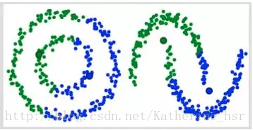

使用高斯混合模型（GMM）做聚类首先假设数据点是呈高斯分布的，相对应K-Means假设数据点是圆形的，高斯分布（椭圆形）给出了更多的可能性。我们有两个参数来描述簇的形状：均值和标准差。所以这些簇可以采取任何形状的椭圆形，因为在x，y方向上都有标准差。因此，每个高斯分布被分配给单个簇。
所以要做聚类首先应该找到数据集的均值和标准差，我们将采用一个叫做最大期望(EM)的优化算法。下图演示了使用GMMs进行最大期望的聚类过程。

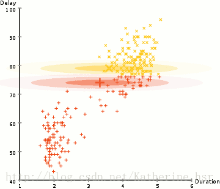

具体步骤：
\1. 选择簇的数量（与K-Means类似）并随机初始化每个簇的高斯分布参数（均值和方差）。也可以先观察数据给出一个相对精确的均值和方差。
\2. 给定每个簇的高斯分布，计算每个数据点属于每个簇的概率。一个点越靠近高斯分布的中心就越可能属于该簇。
\3. 基于这些概率我们计算高斯分布参数使得数据点的概率最大化，可以使用数据点概率的加权来计算这些新的参数，权重就是数据点属于该簇的概率。
\4. 重复迭代2和3直到在迭代中的变化不大。
GMMs的优点：（1）GMMs使用均值和标准差，簇可以呈现出椭圆形而不是仅仅限制于圆形。K-Means是GMMs的一个特殊情况，是方差在所有维度上都接近于0时簇就会呈现出圆形。
（2）GMMs是使用概率，所有一个数据点可以属于多个簇。例如数据点X可以有百分之20的概率属于A簇，百分之80的概率属于B簇。也就是说GMMs可以支持混合资格。

### 5. 凝聚层次聚类


层次聚类算法分为两类：自上而下和自下而上。凝聚层级聚类(HAC)是自下而上的一种聚类算法。HAC首先将每个数据点视为一个单一的簇，然后计算所有簇之间的距离来合并簇，知道所有的簇聚合成为一个簇为止。
下图为凝聚层级聚类的一个实例：

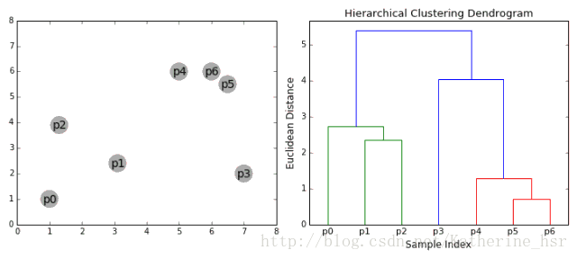

具体步骤：
\1. 首先我们将每个数据点视为一个单一的簇，然后选择一个测量两个簇之间距离的度量标准。例如我们使用average linkage作为标准，它将两个簇之间的距离定义为第一个簇中的数据点与第二个簇中的数据点之间的平均距离。
\2. 在每次迭代中，我们将两个具有最小average linkage的簇合并成为一个簇。
\3. 重复步骤2知道所有的数据点合并成一个簇，然后选择我们需要多少个簇。
层次聚类优点：（1）不需要知道有多少个簇
（2）对于距离度量标准的选择并不敏感
缺点：效率低

### 6. 图团体检测(Graph Community Detection)


当我们的数据可以被表示为网络或图是，可以使用图团体检测方法完成聚类。在这个算法中图团体（graph community）通常被定义为一种顶点(vertice)的子集，其中的顶点相对于网络的其他部分要连接的更加紧密。下图展示了一个简单的图，展示了最近浏览过的8个网站，根据他们的维基百科页面中的链接进行了连接。

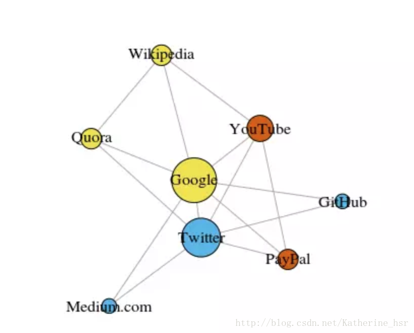

模块性可以使用以下公式进行计算：

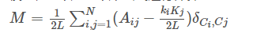
其中L代表网络中边的数量，Aij代表真实的顶点i和j之间的边数, ki,kj代表每个顶点的degree，可以通过将每一行每一列的项相加起来而得到。两者相乘再除以2L表示该网络是随机分配的时候顶点i和j之间的预期边数。所以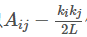代表了该网络的真实结构和随机组合时的预期结构之间的差。当Aij为1时，且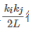很小的时候，其返回值最高。也就是说，当在定点i和j之间存在一个非预期边是得到的值更高。
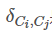是克罗内克δ函数(Kronecker-delta function). 下面是其Python解释：

```python
def Kronecker_Delta(ci,cj):


    if ci==cj:


        return 1


    else:


        return 0
```


通过上述公式可以计算图的模块性，且模块性越高，该网络聚类成不同团体的程度越好，因此通过最优化方法寻找最大模块性就能发现聚类该网络的最佳方法。
组合学告诉我们对于一个仅有8个顶点的网络，就存在4140种不同的聚类方式，16个顶点的网络的聚类方式将超过100亿种。32个顶点的网络的可能聚类方式更是将超过10^21种。因此，我们必须寻找一种启发式的方法使其不需要尝试每一种可能性。这种方法叫做Fast-Greedy Modularity-Maximization(快速贪婪模块性最大化)的算法，这种算法在一定程度上类似于上面描述的集聚层次聚类算法。只是这种算法不根据距离来融合团体，而是根据模块性的改变来对团体进行融合。
具体步骤：
\1. 首先初始分配每个顶点到其自己的团体，然后计算整个网络的模块性 M。
\2. 第 1 步要求每个团体对（community pair）至少被一条单边链接，如果有两个团体融合到了一起，该算法就计算由此造成的模块性改变 ΔM。
\3. 第 2 步是取 ΔM 出现了最大增长的团体对，然后融合。然后为这个聚类计算新的模块性 M，并记录下来。
\4. 重复第 1 步和 第 2 步——每一次都融合团体对，这样最后得到 ΔM 的最大增益，然后记录新的聚类模式及其相应的模块性分数 M。
\5. 重复第 1 步和 第 2 步——每一次都融合团体对，这样最后得到 ΔM 的最大增益，然后记录新的聚类模式及其相应的模块性分数 M。