# 黄水清20182681人工智能

写出 BP

使用曼哈顿距离写出 open 表和 close 表

模糊关系的

矩阵相乘：对应相乘再相加

关系合成：对应取小再取大

带书，5 道简答题，50 分，在书上还有 5 道题是平时例题，50 分

## 1.BP 神经网络权值训练，权值修改，可以带计算器

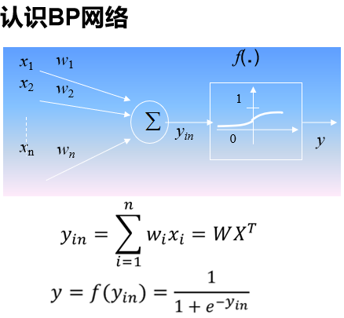

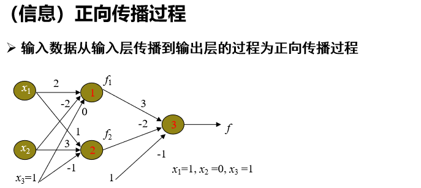

​	f1=s(1×2+0 ×(-2)+1 ×0)=s(2)=1/(1+e-2)=0.881
​			f2=s(1×1+0 ×3+1 ×(-1))=s(0)=1/(1+e0)=0.5
​			f=s(0.881×3+0.5 ×(-2)+1 ×(-1))=s(0.643)=0.655

求导的链式法则

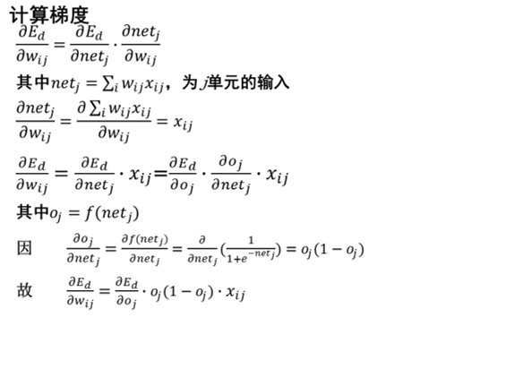

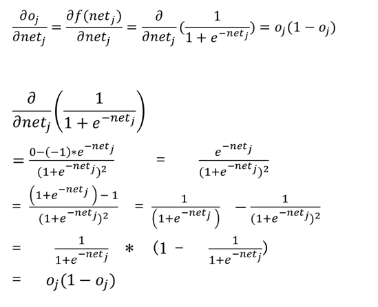

> BP网络应用举例


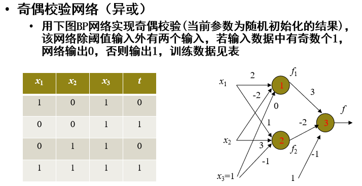

#### BP网络应用举例

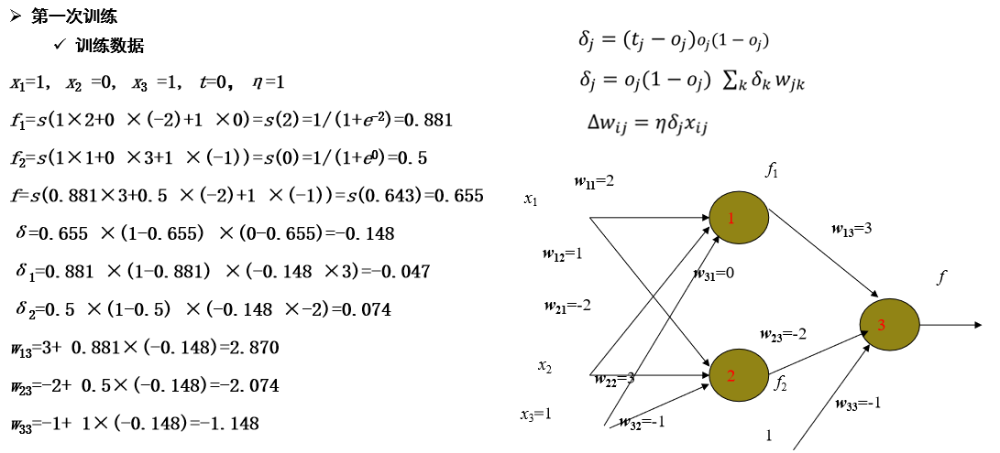

#### BP神经网络优化

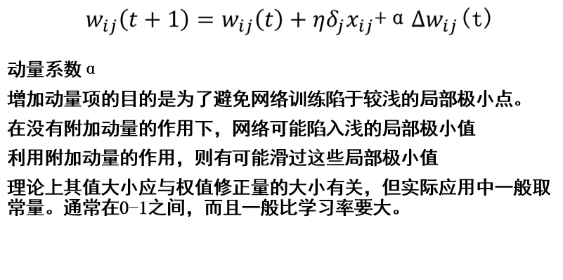


## 2.可信度计算

### 5. 可信度方法 C-F (Certain Factor) Method

肖特里菲(E.Shortliffe) 和 B.Buchanan 在 MYCIN 系统研制过程中产生了可信度方法，在确定性理论基础上结合概率论等理论提出的一种不精确推理模型。
根据经验对一个事物或现象为真 (相信)的程度称为可信度。每条规则和每个证据都具有一个可信度。
推理规则的一般形式：
If E then H (CF(H , E))

推理规则的一般形式：
If E then H (CF(H,E ))
其中 CF(H , E) 是该规则的可信度，称为可信度因 子或规则强度。
CF(H , E) >0 表示该证据增加了结论为真的程度， 且 CF(H , E) 的值越大则结论 H 越真；若 CF(H , E) =1，则表示该证据使结论为真。
CF(H , E) <0 表示该证据增加了结论为假的程度， 且 CF(H , E)的值越小则结论 H 越假；若 CF(H , E) =﹣1, 则表示该证据使结论为假。
CF(H , E) =0 表示证据 E 和结论 H 没有关系。

-1 ≤ CF(H, E) ≤ 1
CF(H, E)的特殊值：
当 CF(H, E) = 1 时，有 P(H|E)=1,前提 E 真，结论 H 必真
当 CF(H, E) = -1 时，有 P(H|E)=0 前提 E 真，结论 H 必假
当 CF(H, E) = 0 时 ，有 P(H|E)=P(H)， 前提 E 真假与结论 H 无关,即 H 与 E 独立

（1） 前提证据事实总 CF 值计算
CF(E1∧E2∧…∧En)＝ min{CF(E1)，CF(E2)，CF(En)}
CF(E1∨E2∨…∨En)＝ max{CF(E1)，CF(E2)，…，CF(En)}
其中 E1，E2，…，En 是与规则前提各条件匹配的事实。

（2）推理结论 CF 值计算
CF(H)＝ CF(H，E)·max{0，CF(E)}
其中 E 是与规则前提对应的各事实，CF(H，E)是规则中结论的可信度，即规则强度。

### 可信度方法---CF 模型的计算

（3）重复结论的 CF 值计算
若同一结论 H 分别被不同的多条规则推出，但可信度不同，则可用合成算法求出综合可信度。
多条知识的综合可通过两两的合成实现。
当两条规则推出同一结论 H 时， CF(H)的计算：
CF(H)1 ＋ CF(H)2－CF(H)1·CF(H)2 ， 当 CF(H)1≥0，且 CF(H)2≥0
CF(H)= CF(H)1 ＋ CF(H)2 ＋ CF(H)1·CF(H)2 ， 当 CF(H)1 ＜ 0，且 CF(H)2 ＜ 0
CF(H)1 ＋ CF(H)2 ， 否则

### 可信度方法举例—例 1

已知 R:IF (E1 or E2) and E3 THEN H (0.8) ，
CF(E1) = 0.4、 CF(E2) = 0.6、 CF(E3) = 0.7 ，求 CF（H）。
解 ：
设 E = (E1 or E2) and E3
CF(E1 or E2)= max(CF(E1),CF2(E2) )=0.6
CF(E)= min(CF(E1 or E2)，CF(E3))= 0.6
CF(H)= CF(E)·CF(H,E) = 0.6×0.8 =0.48

### 可信度方法举例—例 2

R1:IF E1 THEN H CF(H，E1) =(0.8)
R2:IF E2 THEN H CF(H，E2) =(0.7)
CF(E1) = 0.4、CF(E2) = 0.6 ，求 CF(H)。
解 ：
CF1(H)= CF(E1)·CF(H，E1) =0.4 ×0.8 =0.32
CF2(H)= CF(E2)·CF(H，E2) =0.6 ×0.7 =0.42
CF(H)= 0.32+0.42 - 0.32×0.42 = 0.6

### 基于论据的方法：

在知识库中，如果发现某个知识错了，那么就得撤消此错误知识，同时还得撤消依赖于此知识成立的知识。而要做到这一点，就必须研究知识间的依赖关系。

真值维护系统（TMS）完成类似的任务。Doyle 实现了一个基于论据的真值维护系统（JTMS）。在 JTMS 中，知识用节点表示，节点包含节点编号、节点内容（该节点对应的命题）以及该节点的论据集。在 JTMS 中，记录所有可信的节点。节点之间的依赖关系可以用与或树技术来解决。Kleer 克服了 JTMS 的一些不足，实现了一个基于假设的真值维护系统（ATMS）。给定规则，ATMS 可以根据该规则更新命题间的依赖关系。

## 3.图搜索策略求八数码问题，f(n) = d(n)+ g(n)，写出 open 表和 close 表

### 图的搜索过程

```js
必须记住下一步还可以走哪些点;
OPEN表(记录还没有扩展的点);
必须记住哪些点走过了;
CLOSED表(记录已经扩展的点);
必须记住从目标返回的路径;
每个表示状态的节点结构中必须有指向父节点的指针;
```

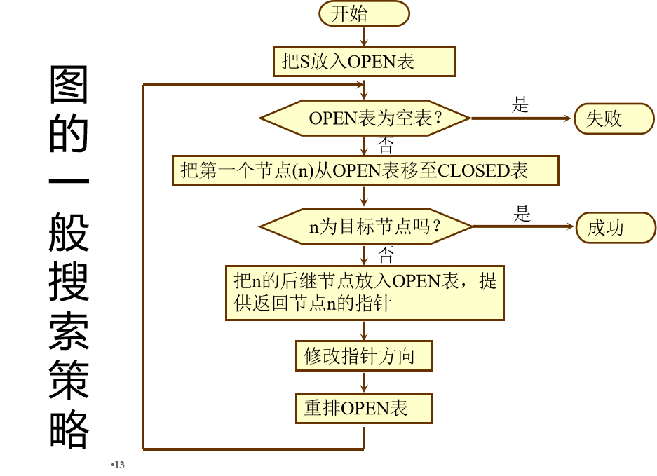


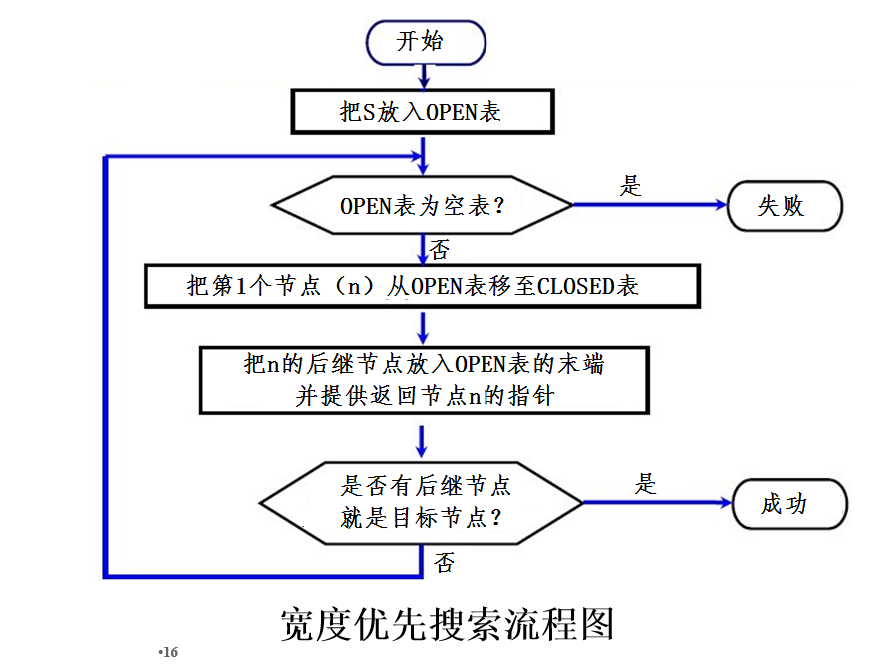

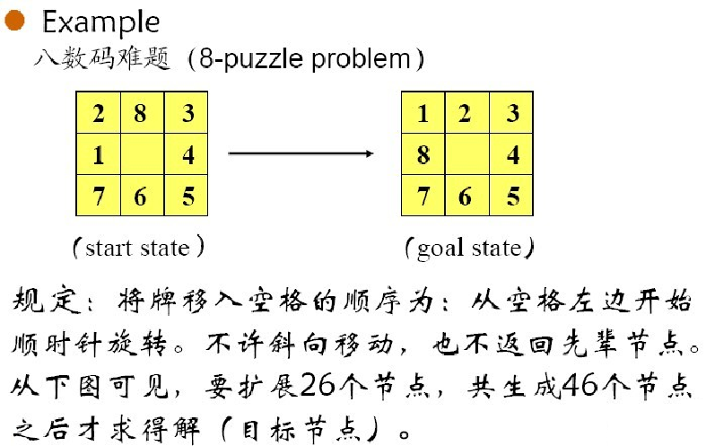


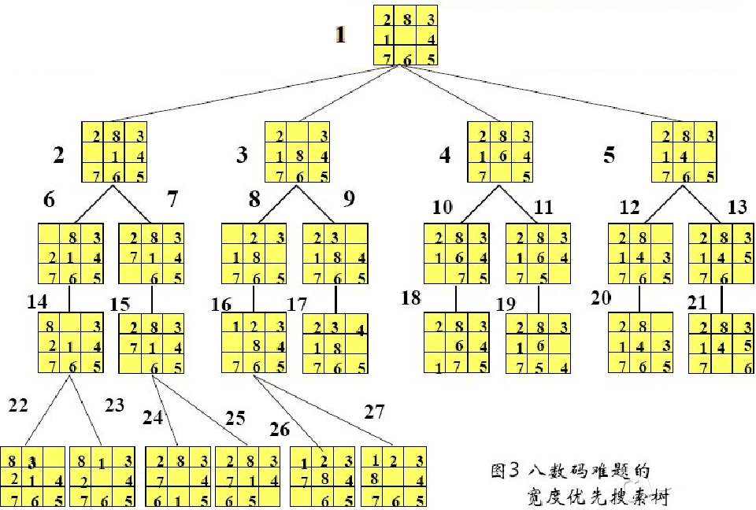


### 启发式搜索

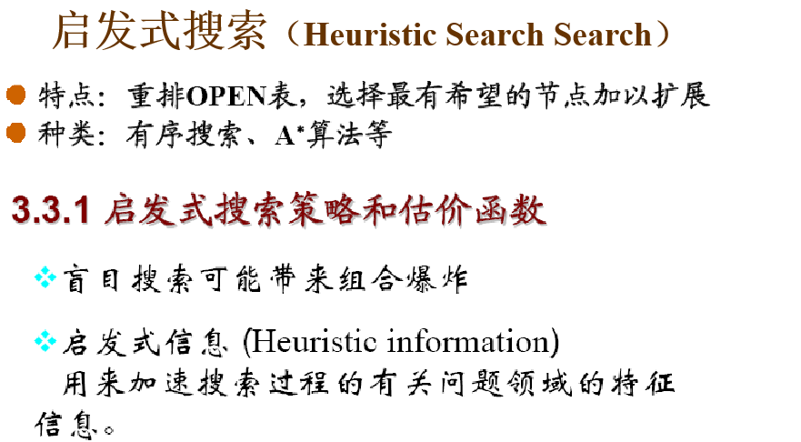


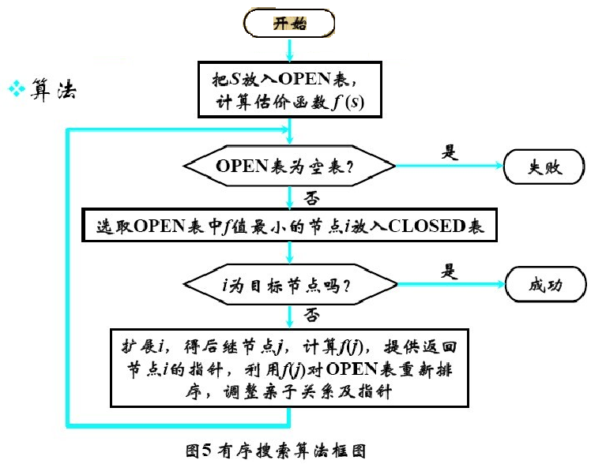

​    我们采用简单的估价函数 
​			f(n)=d(n)+W(n) 
  其中：

d(n)是搜索树中节点n的深度(0,1,2,…)；

W(n)用来计算对应于节点n的数据库中错放的棋子个数。因此，起始节点棋局

|  2   |  8   |  3   |
| :--: | :--: | :--: |
|  1   |  6   |  4   |
|  7   |      |  5   |

的f值等于0+4=4。

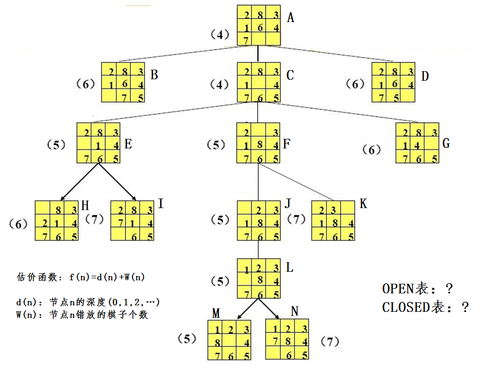

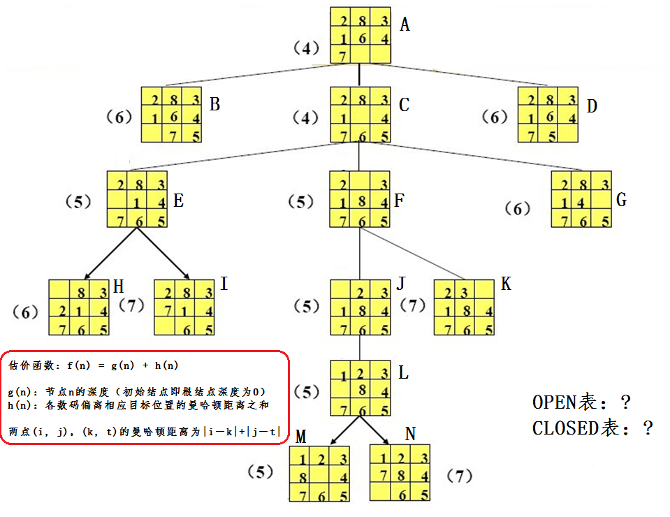

### A*算法

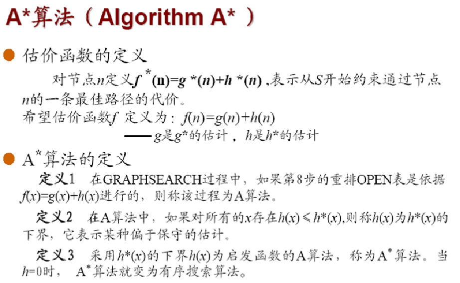

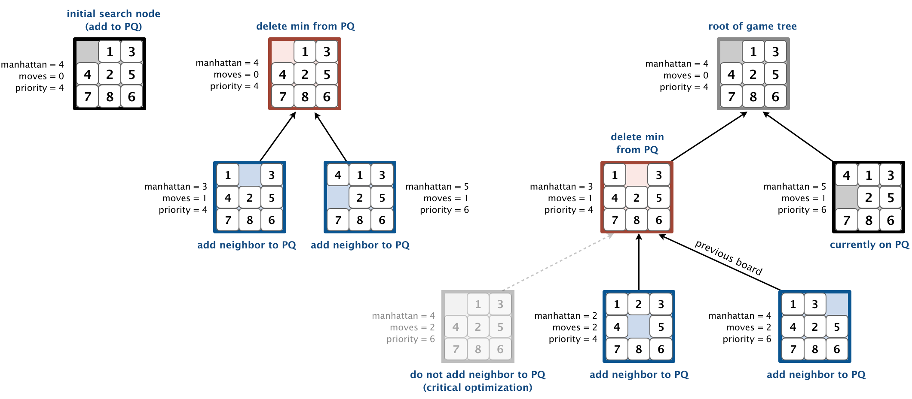


练习

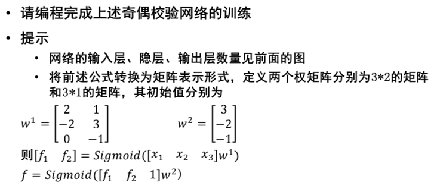


学习率η
大的学习率可能使网络权值每一次的修正量过大，甚至会导致权值在修正过程中超出某个误差的极小值呈不规则跳跃而不收敛；但过小的学习率导致学习时间过长，不过能保证收敛于某个极小值。所以，一般倾向选取较小的学习率以保证学习过程的收敛性（稳定性），通常在0.01-0.8之间。

BP神经网络优化

## 4.你跟爷爷奶奶像不像=>模糊关系的合成:对应取小再取大，类似矩阵相"乘"法:对应相乘再相加

> and 取小，or 取大

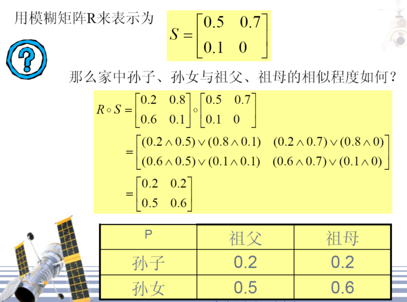

## 5.传教士过河的状态序列

### 1.问题重述

在河的左岸有N个传教士、N个野人和一条船，传教士们想用这条船把所有人都运过河去，但有以下条件限制：

（1）修道士和野人都会划船，但船每次最多只能运K个人；

（2）在任何岸边野人数目都不能超过修道士，否则修道士会被野人吃掉。

假定野人会服从任何一种过河安排，请规划出一个确保修道士安全过河的计划。

### 2.问题分析

2.1约束条件：
① M≧C 任何时刻两岸、船上都必须满足传教士人数不少于野人数（M=0时除外，既没有传教士）
② M+C≦K 船上人数限制在K以内

2.2求解：

传教士与野人全部安全渡到对岸的解决方案

### 3.求解过程

#### 3.1变量假设：
设N=3，K=2（三个M和三个C，每次渡河二人以下）
L：左岸，R：右岸，
B：是否有船（0：无船，1：有船）

#### 3.2状态表示
定义：用三元组（ML，CL，BL）表示左岸状态，其中：
0≦ML,CL≦3，BL∈｛0,1｝
如：（0，3，1）表示左岸有三个野人，船在左岸。
从（3，3，1）到（0，0，0）的状态转换
状态空间：32 种状态，其中：
12种不合理状态：如（1，0，1）说明右岸有2个M，3个C；
4种不可能状态：如（3，3，0）说明所有M和C都在左岸，而船在右岸
∴可用的状态共16种，组成合理的状态空间

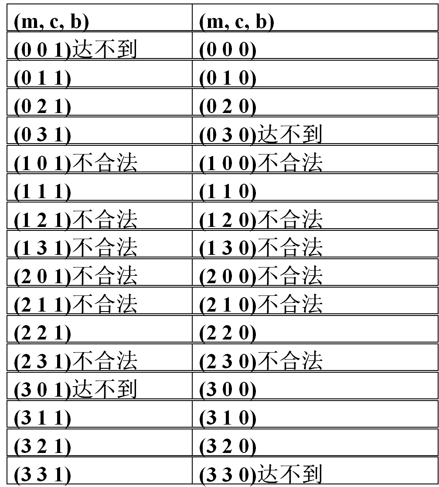

> 状态空间具体描述

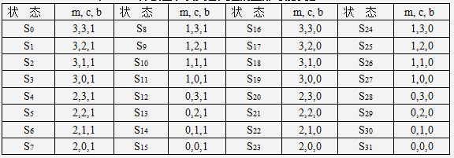

#### 3.2操作集
定义：Pmc操作：从左岸划向右岸

Qmc操作：从右岸划向左岸

船上人数组合（m，c）共5种（1，0）,（1，1）,（2，0）,（0，1）,（0，2）

∵每一种船上的人数组合同时对应P，Q二种操作

∴系统共有5×2＝10种操作（规则）

如：P10：if （ML，CL，BL=1） then （ML-1，CL，BL-1）

如果船在左岸，那么一个传教士划船到右岸

Q01：if （ML，CL，BL=0） then （ML，CL+1，BL+1）

如果船在右岸，那么一个野人划船回到左岸

总共有10种操作

F={P10,P20, P11, P01, P02, Q 10, Q 20, Q 11, Q 01, Q 02}
P10 if( ML ,CL , BL=1 ) then ( ML–1 , CL , BL–1 )
P01 if( ML ,CL , BL=1 ) then ( ML , CL–1 , BL–1 )
P11 if( ML ,CL , BL=1 ) then ( ML–1 , CL–1 ,BL –1 )
P20 if( ML ,CL , BL=1 ) then ( ML–2 , CL , BL–1 )
P02 if( ML ,CL , BL=1 ) then ( ML , CL–2 , BL–1 )
Q10 if( ML ,CL , BL=0 ) then ( ML+1 , CL ,BL+1 )
Q01 if( ML ,CL , BL=0 ) then ( ML , CL+1 , BL+1 )
Q11 if( ML ,CL , BL=0 ) then ( ML+1 , CL +1,BL +1 )
Q20 if( ML ,CL , BL=0 ) then ( ML+2 , CL +2,BL +1 )
Q02 if( ML ,CL , BL=0 ) then ( ML , CL +2, BL+1 )

#### 3.3控制策略

最短路径有4条，由11次操作构成。

(P11、Q10、P02、Q01、P20、Q11、P20、Q01、P02、Q01、P02)
(P11、Q10、P02、Q01、P20、Q11、P20、Q01、P02、Q10、P11)
(P02、Q01、P02、Q01、P20、Q11、P20、Q01、P02、Q01、P02)
(P02、Q01、P02、Q01、P20、Q11、P20、Q01、P02、Q10、P11)
#### 3.4状态空间图
状态空间图是一个有向图，图中的节点代表状态，节点之间的连线代表操作，箭头代表状态的转换方向。

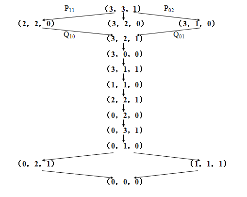

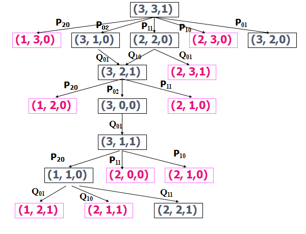

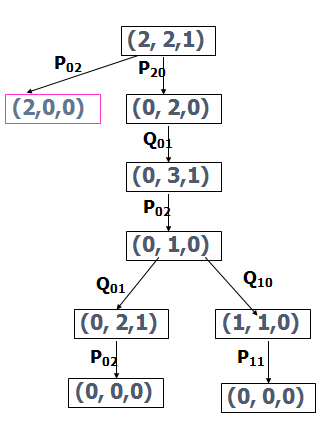

#### 3.5状态空间的一般搜索过程
OPEN表：用于存放刚生成的节点
CLOSE表：用于存放将要扩展或已扩展的节点
1) 把初始节点S0放入OPEN表,并建立只含S0的图,记为G
OPEN：=S0,G：=G0（G0=S0）
2) 检查OPEN表是否为空,若为空则问题无解,退出
LOOP：IF（OPEN）=（） THEN EXIT（FAIL）
3) 把OPEN表的第一个节点取出放入CLOSE表,记该节点为节点n
N：=FIRST（OPEN）,REMOVE（n,OPEN）,ADD（n,CLOSE）
4) 观察节点n是否为目标节点,若是,则求得问题的解,退出
IF GOAL（n） THEN EXIT（SUCCESS）
5) 扩展节点n,生成一组子节点.把其中不是节点n先辈的那些子节点记作集合M,并把这些节点作为节点n的子节点加入G中.
EXPAND（n）-->M（mi）,G：=ADD（mi,G）
针对M中子节点的不同情况,分别进行如下处理
对于那些未曾在G中出现过的M成员设置一个指向父节点（n）的指针,并把它放入OPEN表
对于那些先前已在G中出现过的M成员,确定是否要修改指向父节点的指针
对于那些先前已在G中出现,并且已经扩展了的M成员,确定是否需要修改其后继结点指向父节点的指针
6) 按某种搜索策略对OPEN表中的节点进行排序
7) 转第2步

针对本题，设置OPEN、CLOSED两个队列分别存放待扩展节点和已扩展节点；
对每个生成的新节点，要检查上述两表中是否已存在，是否是非法节点；
(合法节点满足：
ML=0||ML=3||ML=CL)

每扩展一个节点应记录产生合法后继节点的操作，以便最后给出操作序列；