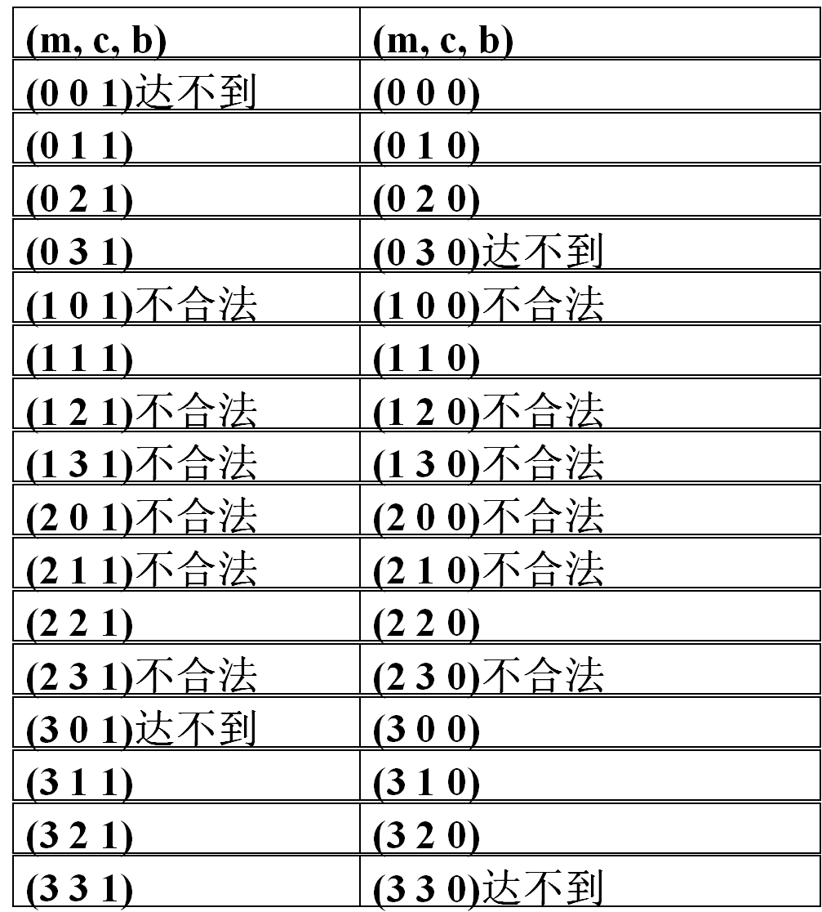
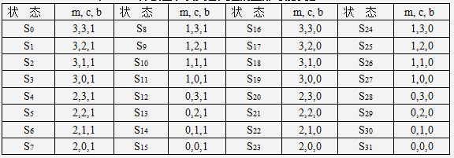
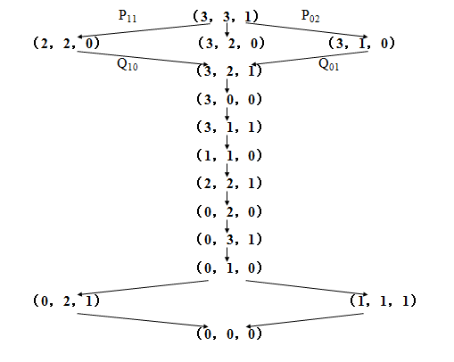
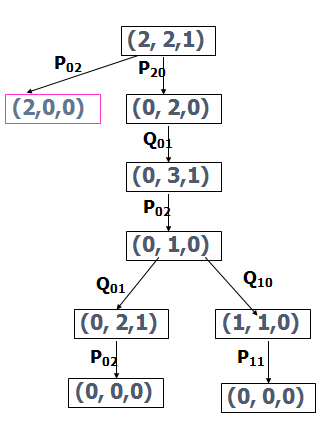

# 野人传教士过河问题

随着又一次的人工智能与人类智能的世纪大战，我们不禁要思索，人工智能，是在呼唤上帝还是在召唤恶魔？此时正是时候研究一下人工智能相关理论，而本文主要论述计算机科学与技术专业大三下专业课《人工智能》第一个实验算法。


关键字：人工智能，搜索问题，树的深度优先搜索

The Missionaries and Cannibals Problem

Abstract: Beijing time on March 12 in the afternoon, Google AlphaGo and artificial intelligence, the third field of the south Korean chess player lee se-dol today, finally beat lee se-dol AlphaGo, won three consecutive victory.

Again, as the century of artificial intelligence and human intelligence war, we can not help but to think, artificial intelligence, in calling upon god or summon demons? Now is the time to study the related theory, artificial intelligence, this paper mainly discusses the computer science and technology under the junior in professional class "artificial intelligence" in the first experiment algorithm。

Keywords: artificial intelligence, search, depth first search tree

1.问题重述
在河的左岸有N个传教士、N个野人和一条船，传教士们想用这条船把所有人都运过河去，但有以下条件限制：

（1）修道士和野人都会划船，但船每次最多只能运K个人；
（2）在任何岸边野人数目都不能超过修道士，否则修道士会被野人吃掉。

假定野人会服从任何一种过河安排，请规划出一个确保修道士安全过河的计划。

2.问题分析
2.1约束条件：
① M≧C 任何时刻两岸、船上都必须满足传教士人数不少于野人数（M=0时除外，既没有传教士）
② M+C≦K 船上人数限制在K以内

2.2求解：
传教士与野人全部安全渡到对岸的解决方案
3.求解过程
3.1变量假设：
设N=3，K=2（三个M和三个C，每次渡河二人以下）
L：左岸，R：右岸，
B：是否有船（0：无船，1：有船）
3.2状态表示
定义：用三元组（ML，CL，BL）表示左岸状态，其中：
0≦ML,CL≦3，BL∈｛0,1｝
如：（0，3，1）表示左岸有三个野人，船在左岸。
从（3，3，1）到（0，0，0）的状态转换
状态空间：32 种状态，其中：
12种不合理状态：如（1，0，1）说明右岸有2个M，3个C；
4种不可能状态：如（3，3，0）说明所有M和C都在左岸，而船在右岸
∴可用的状态共16种，组成合理的状态空间



状态空间具体描述



3.2操作集
定义：Pmc操作：从左岸划向右岸

Qmc操作：从右岸划向左岸

船上人数组合（m，c）共5种（1，0）,（1，1）,（2，0）,（0，1）,（0，2）

∵每一种船上的人数组合同时对应P，Q二种操作

∴系统共有5×2＝10种操作（规则）

如：P10：if （ML，CL，BL=1） then （ML-1，CL，BL-1）

如果船在左岸，那么一个传教士划船到右岸

Q01：if （ML，CL，BL=0） then （ML，CL+1，BL+1）

如果船在右岸，那么一个野人划船回到左岸

总共有10种操作

F={P10,P20, P11, P01, P02, Q 10, Q 20, Q 11, Q 01, Q 02}
P10 if( ML ,CL , BL=1 ) then ( ML–1 , CL , BL–1 )
P01 if( ML ,CL , BL=1 ) then ( ML , CL–1 , BL–1 )
P11 if( ML ,CL , BL=1 ) then ( ML–1 , CL–1 ,BL –1 )
P20 if( ML ,CL , BL=1 ) then ( ML–2 , CL , BL–1 )
P02 if( ML ,CL , BL=1 ) then ( ML , CL–2 , BL–1 )
Q10 if( ML ,CL , BL=0 ) then ( ML+1 , CL ,BL+1 )
Q01 if( ML ,CL , BL=0 ) then ( ML , CL+1 , BL+1 )
Q11 if( ML ,CL , BL=0 ) then ( ML+1 , CL +1,BL +1 )
Q20 if( ML ,CL , BL=0 ) then ( ML+2 , CL +2,BL +1 )
Q02 if( ML ,CL , BL=0 ) then ( ML , CL +2, BL+1 )
3.3控制策略
最短路径有4条，由11次操作构成。

(P11、Q10、P02、Q01、P20、Q11、P20、Q01、P02、Q01、P02)
(P11、Q10、P02、Q01、P20、Q11、P20、Q01、P02、Q10、P11)
(P02、Q01、P02、Q01、P20、Q11、P20、Q01、P02、Q01、P02)
(P02、Q01、P02、Q01、P20、Q11、P20、Q01、P02、Q10、P11)
3.4状态空间图
状态空间图是一个有向图，图中的节点代表状态，节点之间的连线代表操作，箭头代表状态的转换方向。






3.5状态空间的一般搜索过程
OPEN表：用于存放刚生成的节点
CLOSE表：用于存放将要扩展或已扩展的节点
1) 把初始节点S0放入OPEN表,并建立只含S0的图,记为G
OPEN：=S0,G：=G0（G0=S0）
2) 检查OPEN表是否为空,若为空则问题无解,退出
LOOP：IF（OPEN）=（） THEN EXIT（FAIL）
3) 把OPEN表的第一个节点取出放入CLOSE表,记该节点为节点n
N：=FIRST（OPEN）,REMOVE（n,OPEN）,ADD（n,CLOSE）
4) 观察节点n是否为目标节点,若是,则求得问题的解,退出
IF GOAL（n） THEN EXIT（SUCCESS）
5) 扩展节点n,生成一组子节点.把其中不是节点n先辈的那些子节点记作集合M,并把这些节点作为节点n的子节点加入G中.
EXPAND（n）-->M（mi）,G：=ADD（mi,G）
针对M中子节点的不同情况,分别进行如下处理
对于那些未曾在G中出现过的M成员设置一个指向父节点（n）的指针,并把它放入OPEN表
对于那些先前已在G中出现过的M成员,确定是否要修改指向父节点的指针
对于那些先前已在G中出现,并且已经扩展了的M成员,确定是否需要修改其后继结点指向父节点的指针
6) 按某种搜索策略对OPEN表中的节点进行排序
7) 转第2步

针对本题，设置OPEN、CLOSED两个队列分别存放待扩展节点和已扩展节点；
对每个生成的新节点，要检查上述两表中是否已存在，是否是非法节点；
(合法节点满足：
ML=0||ML=3||ML=CL)

每扩展一个节点应记录产生合法后继节点的操作，以便最后给出操作序列；
4.程序设计
4.1数据结构
节点状态用列表(m，c，b)表示，其中m表示传教士在左岸的人数； c表示野人在左岸的人数；b表示船是否在左岸，当b=1时，表示船在左岸，当b=0时，表式船在右岸。

初始状态： (3，3，1)
目标状态： (0，0，0）
操作算子： 船上人数组合（m，c）共5种 （1，0），（1，1），（2，0），（0，1），（0，2）
因此算法有10种
1) 从右岸向左岸过1个传教士，0个野人
2) 从右岸向左岸过1个传教士，1个野人
3) 从右岸向左岸过2个传教士，0个野人
4) 从右岸向左岸过0个传教士，1个野人
5) 从右岸向左岸过0个传教士，2个野人
6) 从左岸向右岸过1个传教士，0个野人
7) 从左岸向右岸过1个传教士，1个野人
8) 从左岸向右岸过2个传教士，0个野人
9) 从左岸向右岸过0个传教士，1个野人
10) 从左岸向右岸过0个传教士，2个野人

状态节点：
typedef struct st
{
int m； //传教士
int c； //野人
int b； //船左
}state； //状态

将有效的状态节点存储在树中

Tree 中的节点

typedef struct hnode
{
state s；
struct hnode *left；
struct hnode *right；
}node；

Open表，closed表 用队列存储

//定义队列中的节点
typedef structQueuenode
{
node * np；
struct Queuenode*next；
}Qnode； //队列中节点

//定义队列
typedef structQueue
{
Qnode *front；
Qnode *rear；
}queue；

4.2代码设计

4.2.1面向对象的迭代方法

```c
 include <iostream>
using namespace std;

typedef struct MCNode
{
    int m;
    int c;
    int b;
    int num;
    struct MCNode *next;
    struct MCNode *last;
}MCNode;

class List
{
private:
    MCNode *head;
    MCNode *rear;
    MCNode *current;
public:
    List();
    friend bool operator==(MCNode &node1,MCNode &node2);
    void push_front(MCNode cNode);
    void push_back(MCNode cNode);
    void pop_front();
    void pop_back();
    MCNode &front();
    MCNode &back();
    void print_list();
    bool hit_target(MCNode &cNode);
    bool legal(MCNode &cNode);
    bool empty();
    bool exist(MCNode &cNode);
};

List::List()
{
    head=new MCNode();
    rear=head;
    head->m=3;
    head->c=3;
    head->b=1;
    head->num=0;
    head->last=NULL;
    head->next=NULL;
}

bool operator==(MCNode &node1,MCNode &node2)
{
    if(node1.m==node2.m&&node1.c==node2.c&&node1.b==node2.b)
        return true;
    else
        return false;
}

void List::push_front(MCNode cNode)
{
    (*head).last=new MCNode();
    head->last->next=head;
    head=head->last;
    head->m=cNode.m;
    head->c=cNode.c;
    head->b=cNode.b;
    head->num=cNode.num;
    head->last=NULL;
}

void List::push_back(MCNode cNode)
{
    (*rear).next=new MCNode();
    rear->next->last=rear;
    rear=rear->next;
    rear->m=cNode.m;
    rear->c=cNode.c;
    rear->b=cNode.b;
    rear->num=cNode.num;
    rear->next=NULL;
}

void List::pop_front()
{
    if(head->next!=NULL)
    {
        head=head->next;
        head->last=NULL;
    }
    else
    {
        head=NULL;
        rear=NULL;
    }
}

void List::pop_back()
{
    if(rear->last!=NULL)
    {
        rear=rear->last;
        rear->next=NULL;
    }
    else
    {
        head=NULL;
        rear=NULL;
    }
}

MCNode &List::front()
{
    return *head;
}

MCNode &List::back()
{
    return *rear;
}

void List::print_list()
{
    MCNode current;
    current=*head;
    while(true)
    {
        cout<<current.num<<","<<current.m<<","<<current.c<<","<<current.b<<endl;
        if(current.next==NULL)
            break;
        else
        {
            current.c=current.next->c;
            current.m=current.next->m;
            current.b=current.next->b;
            current.num=current.next->num;
            current.next=current.next->next;
        }
    }system("pause");
}

bool List::hit_target(MCNode &cNode)
{
    MCNode goalNode;
    goalNode.m=0;
    goalNode.c=0;
    goalNode.b=0;
    if(cNode==goalNode)
        return true;
    else
        return false;
}

bool List::legal(MCNode &cNode)
{
    if(cNode.m>=0&&cNode.m<=3&&cNode.c>=0&&cNode.c<=3)
    {
        if((cNode.m==cNode.c)||(cNode.m==3)||(cNode.m==0))
            return true;
        else
            return false;
    }
    else
        return false;
}

bool List::empty()
{
    if(head==NULL)
        return true;
    else
        return false;
}

bool List::exist(MCNode &cNode)
{
    MCNode *current;
    current=head;
    while(current!=NULL)
    {
        if(cNode.b==current->b&&
            cNode.c==current->c&&cNode.m==current->m)
            return true;
        else
            current=current->next;
    }
    return false;
}

void print(MCNode &cNode)
{
    cout<<"节点输出："<<endl;
    cout<<cNode.num<<" "<<cNode.m<<","<<cNode.c<<","<<cNode.b<<endl;
    system("pause");
}

void expandNode(List &opend,List &closed)
{
    int ii;
    MCNode cNode=opend.front();
    MCNode node[5];
    if(cNode.b==1)
    {
        for(ii=0;ii<5;ii++)
        {
            node[ii].b=0;
        }
        node[0].m=cNode.m-1;
        node[0].c=cNode.c;
        node[1].m=cNode.m;
        node[1].c=cNode.c-1;
        node[2].m=cNode.m-1;
        node[2].c=cNode.c-1;
        node[3].m=cNode.m-2;
        node[3].c=cNode.c;
        node[4].m=cNode.m;
        node[4].c=cNode.c-2;
    }
    else
    {
        for(ii=0;ii<5;ii++)
        {
            node[ii].b=1;
        }
        node[0].m=cNode.m+1;
        node[0].c=cNode.c;
        node[1].m=cNode.m;
        node[1].c=cNode.c+1;
        node[2].m=cNode.m+1;
        node[2].c=cNode.c+1;
        node[3].m=cNode.m+2;
        node[3].c=cNode.c;
        node[4].m=cNode.m;
        node[4].c=cNode.c+2;
    }
    for(ii=opend.front().num;ii!=5;ii++)
    {
        opend.front().num++;
        if(opend.legal(node[ii])&&!opend.exist(node[ii]))
        {
            opend.push_front(node[ii]);
            opend.front().num=0;
            closed.push_back(opend.front());
            return;
        }
    }
}

void proceeding(List &opend,List &closed)
{
    int ii;
    int NUM=0;
    while(!opend.empty())
    {
        //opend.print_list();
        if(opend.hit_target(opend.front()))
        {
            NUM++;
            cout<<"The "<<NUM<<"st route is found!"<<endl;
            closed.print_list();
            cout<<endl;
            opend.pop_front();
            closed.pop_front();
        }
        else if(opend.front().num!=5)
        {
            expandNode(opend,closed);
        }
        else
        {
            opend.pop_front();
            closed.pop_back();
        }
    }
}

int main(int argc,char** argv)
{
    List opend,closed;
    proceeding(opend,closed);
    system("pause");
    return 0;
}
```

4.2.2单函递归法

```c
 include<iostream>
using namespace std;
   
#define MAX 1024
                    
typedef struct rule
{    
    int missionary;
    int savage;
}Rule;

typedef struct node
{
    int missionary;
    int savage;    
    int boat;      
    int direct;
}Node;
                               
typedef struct sequenceStack
{
    Node data[MAX];
    int top;
}SequenceStack;        

int NUM=0;

bool stack_empty(SequenceStack &stack)
{
    if(stack.top==-1)      
    {
        return true;
    }
    return false;
}

bool stack_full(SequenceStack &stack)
{
    if(stack.top==MAX-1)      
    {
        return true;
    }
    return false;
}

bool stack_push(SequenceStack &stack,Node &node)
{
    if(stack_full(stack))
    {
        cout<<"The stack is full,pushing failed!"<<endl;
        return false;
    }
    stack.top++; 
    stack.data[stack.top].missionary=node.missionary;
    stack.data[stack.top].savage=node.savage;  
    stack.data[stack.top].boat=node.boat;  
    stack.data[stack.top].direct=node.direct;
    return true;      
}

bool stack_pop(SequenceStack &stack)         
{
    if(stack_empty(stack))
    {
        cout<<"The stack is empty,poping failed!"<<endl;
        return false;
    }
    stack.top--; 
    return true; 
}

bool node_reach(Node &node)
{
    if(node.missionary==0&&node.savage==0&&node.boat==0)
    {
        return true;
    }
    return false;
}

bool node_equal(Node &node1,Node &node2)
{
    if(node1.missionary==node2.missionary&&
        node1.savage==node2.savage&&
        node1.boat==node2.boat)
    {
        return true;
    }
    return false;
}

bool node_visited(SequenceStack &stack,Node &node)
{
    int ii;
    for(ii=0;ii<=stack.top;ii++)
    {
        if(node_equal(stack.data[ii],node))             
        {
            return true;
        }
    }        
    return false;             
}

void stack_print(SequenceStack &stack)
{
    int ii;
    cout<<"The "<<++NUM<<"st method is:"<<endl;
    for(ii=0;ii<=stack.top;ii++)
    {
        cout<<"("<<stack.data[ii].missionary;
        cout<<","<<stack.data[ii].savage;
        cout<<","<<stack.data[ii].boat<<")"<<endl;
    }
    cout<<endl;
    system("pause");
}

void rule_print(int ruleset_num,Rule *rule)
{
    int ii;
    for(ii=0;ii<ruleset_num;ii++)
    {
        cout<<"("<<rule[ii].missionary<<","<<rule[ii].savage<<")"<<endl;
    }
    cout<<endl;
    system("pause");
}

void rule_set(int &sample,int &capacity,Rule *rule) 
{
    int ii,ij,ik=0;
    for(ii=0;ii<sample;ii++)
    {
        for(ij=0;ij<sample;ij++)
        {
            if(ii==0&&ij==0)
            {
                continue;
            }
            if(ii+ij<=capacity)
            {
                rule[ik].missionary=ii;
                rule[ik++].savage=ij;
            }
        }
    }    
}

int ruleset_num_get(int &sample,int &capacity)   
{
    int ii,ij,num=0;
    for(ii=0;ii<sample;ii++) 
    {
        for(ij=0;ij<sample;ij++)
        {
            if(ii==0&&ij==0)
            {
                continue;
            }
            if(ii+ij<=capacity)
            {
                num++;
            }
        }
    }
    return num;    
}

void init(SequenceStack &stack,int &ruleset_num,int &sample,int &capacity)
{
    cout<<"Please enter the initial number of savages and missionaries:"<<endl;
    cin>>sample;
    cout<<"Please enter the ship's carrying capacity:"<<endl;
    cin>>capacity;
    ruleset_num=ruleset_num_get(sample,capacity);
    cout<<"\nThere is a total of "<<ruleset_num<<" sets of rules:"<<endl;
    stack.top=0;
    stack.data[stack.top].missionary=sample;
    stack.data[stack.top].savage=sample;
    stack.data[stack.top].boat=1;
    stack.data[stack.top].direct=0;
}

void processing(SequenceStack &stack,Rule *rule,int &ruleset_num,int &sample)
{
    Node cNode;
    if(node_reach(stack.data[stack.top]))
    {
        stack_print(stack);
    }
    else
    {
        while(stack.data[stack.top].direct<ruleset_num)
        {
            if(stack.data[stack.top].boat==1)   
            {   
                cNode.missionary=stack.data[stack.top].missionary-
                    rule[stack.data[stack.top].direct].missionary;
                cNode.savage=stack.data[stack.top].savage-
                    rule[stack.data[stack.top].direct].savage;
                cNode.boat=0;
                cNode.direct=0;
                if(node_visited(stack,cNode)==false&&
                    (cNode.missionary==cNode.savage||
                    cNode.missionary==0||cNode.missionary==sample)&&
                    (cNode.missionary>=0)&&(cNode.missionary<=sample)&&
                    (cNode.savage>=0)&&(cNode.savage<=sample))
                {
                    stack_push(stack,cNode);   
                    processing(stack,rule,ruleset_num,sample);
                    stack_pop(stack);
                }
            }
            else                           
            {
                cNode.missionary=stack.data[stack.top].missionary+
                    rule[stack.data[stack.top].direct].missionary;
                cNode.savage=stack.data[stack.top].savage+
                    rule[stack.data[stack.top].direct].savage;
                cNode.boat=1;
                cNode.direct=0;
                if(node_visited(stack,cNode)==false&&
                    (cNode.missionary==cNode.savage||
                    cNode.missionary==0||cNode.missionary==sample)&&
                    (cNode.missionary>=0)&&(cNode.missionary<=sample)&&
                    (cNode.savage>=0)&&(cNode.savage<=sample))
                {
                    stack_push(stack,cNode);   
                    processing(stack,rule,ruleset_num,sample);
                    stack_pop(stack);
                }
            }
            stack.data[stack.top].direct++;
        }
    }
}

int main(int argc,char **argv)
{
    SequenceStack stack;
    Rule *rule;
    int ruleset_num,sample,capacity;
    init(stack,ruleset_num,sample,capacity);
    rule=new Rule[ruleset_num];
    rule_set(sample,capacity,rule);
    rule_print(ruleset_num,rule);
    processing(stack,rule,ruleset_num,sample);
    system("pause");
    return 0;
}
```

4.2.3双函递归法

```c
 include<stdio.h>
#include<stdlib.h>
#define MAXSIZE 1024

typedef struct Rule
{
    int mm;
    int cc;
}Rule;
Rule rule[5]={{1,0},{0,1},{1,1},{2,0},{0,2}};

typedef struct Node  
{
    int m;
    int c;
    int b; 
}Node;

typedef Node elemtype;

typedef struct SequenStack 
{
    elemtype data[MAXSIZE];
    int top;
}SequenStack;

int NUM=0;

int visited(SequenStack *open,Node newnode) 
{
    int ii=0;
    if(open->top!=-1)
    {
        for(ii=0;ii!=open->top;ii++)
        {
            if(newnode.m==open->data[ii].m&&
            newnode.c==open->data[ii].c&&
            newnode.b==open->data[ii].b) 
            {
                return 1;
            }    
        }
    }
    return 0;
}

int legal(SequenStack *open,Node newnode) 
{ 
    int i=visited(open,newnode);
    if(i==0) 
    {
        if(newnode.m>=0&&newnode.m<=3&&newnode.c>=0&&newnode.c<=3) 
        {
            if(newnode.m==0||newnode.m==3||newnode.m==newnode.c) 
            {
                return 1;
            }
        }
    }
    return 0;
}

int Pop_SequenStack(SequenStack *S) 
{    
    if(S->top==-1) 
    {
        printf("The linear list is empty,poping to stack failed！\n");
        return 0;
    }
    else
    {
        S->top--;
        return 1;    
    }
}

int Push_SequenStack(SequenStack *S,Node node) 
{    
    if(S->top>=MAXSIZE-1) 
    {
        printf("The linear list is full,pushing to stack failed！\n");
        return 0;
    }
    S->top++;
    S->data[S->top]=node;
    return 1;
}

void print_result(SequenStack *open) 
{
    int ii;
    printf("第%d种:\n",++NUM );
    if(open->top!=-1)
    {
        for(ii=0;ii<=open->top;ii++)
        {
            printf("(%d,%d,%d)\n",open->data[ii].m,
                open->data[ii].c,open->data[ii].b);
        }
    }
    printf("\n");
    system("pause");
}

void print(SequenStack *open) 
{
    int ii;
    if(open->top!=-1)
    {
        for(ii=0;ii<=open->top;ii++)
        {
            printf("(%d,%d,%d)-->",open->data[ii].m,
                open->data[ii].c,open->data[ii].b);
        }
    }
    printf("\n");
    system("pause");
}
void DFS(SequenStack *open,Node newnode);

void processing(SequenStack *open,Node newnode) 
{
    int ii,flag;
    Node node;
    node.m=newnode.m;
    node.c=newnode.c;
    node.b=newnode.b;
    if(node.b==1) 
    {
        for(ii=0;ii<5;ii++) 
        {
            node.m=newnode.m-rule[ii].mm;
            node.c=newnode.c-rule[ii].cc;
            node.b=0;
            flag=legal(open,node);
            if(flag==1) 
            {
                Push_SequenStack(open,node);
                DFS(open,node);
                Pop_SequenStack(open);
            }
        }
    }
    else 
    {
        for(ii=0;ii<5;ii++) 
        {
            node.m=newnode.m+rule[ii].mm;
            node.c=newnode.c+rule[ii].cc;
            node.b=1;
            flag=legal(open,node);
            if(flag==1) 
            {
                Push_SequenStack(open,node);
                DFS(open,node);
                Pop_SequenStack(open);
            }
        }
    }
}

void DFS(SequenStack *open,Node node) 
{
    if(node.m==0&&node.c==0&&node.b==0) 
    {
        print_result(open);
    }
    else 
    {
        processing(open,node);
    }
}

Node init_node()
{
    Node node;
    node.m=3;
    node.c=3;
    node.b=1;
    return node;
}

SequenStack * Init_open() 
{
    SequenStack *open;
    open=(SequenStack * )malloc(sizeof(SequenStack));
    open->top=-1;
    return open;
}

int main(int argc,char **argv) 
{
    SequenStack *open=Init_open();
    Node node=init_node();
    Push_SequenStack(open,node);
    DFS(open,node);
    system("pause");
    return 0;
}
```

4.2.4类集框架迭代版

```c
  include <iostream>
#include <vector>
#include <list>
using namespace std;

typedef struct MCNode
{
    int m;
    int c;
    int b;
    int num;
}MCNode;

int NUM=0;

bool operator==(MCNode &m1,MCNode &m2)
{
    if(m1.m==m2.m&&m1.c==m2.c&&m1.b==m2.b)
        return true;
    else
        return false;
}

bool goal(MCNode &cNode)
{
    MCNode goalNode;
    goalNode.m=0;
    goalNode.c=0;
    goalNode.b=0;
    if(cNode==goalNode)
        return true;
    else
        return false;
}

bool legal(MCNode &cNode)
{
    if(cNode.m>=0&&cNode.m<=3&&cNode.c>=0&&cNode.c<=3)
    {
        if((cNode.m==cNode.c)||(cNode.m==3)||(cNode.m==0))
            return true;
        else
            return false;
    }
    else
        return false;
}

bool visited(MCNode cNode,list<MCNode> &opend)
{
    list<MCNode>::iterator it;
    for(it=opend.begin();it!=opend.end();it++)
    {
        if(it->m==cNode.m&&it->c==cNode.c&&it->b==cNode.b)
            return true;
    }
    return false;
}

void print_list(list<MCNode> &opend)
{
    list<MCNode>::iterator it;
    for(it=opend.begin();it!=opend.end();it++)
    {
        cout<<it->num<<","<<it->m<<","<<it->c<<","<<it->b<<endl;
    }
    system("pause");
}

void print_result(vector<MCNode> &closed)
{
    vector<MCNode>::iterator it;
    for(it=closed.begin();it!=closed.end();it++)
    {
        cout<<it->num<<","<<it->m<<","<<it->c<<","<<it->b<<endl;
    }
    cout<<endl;
    system("pause");
}

void expandNode(list<MCNode> &opend,vector<MCNode> &closed)
{
    int ii;
    MCNode cNode=opend.front();
    MCNode node[5];
    if(cNode.b==1)
    {
        for(ii=0;ii<5;ii++)
        {
            node[ii].b=0;
        }
        node[0].m=cNode.m-1;
        node[0].c=cNode.c;
        node[1].m=cNode.m;
        node[1].c=cNode.c-1;
        node[2].m=cNode.m-1;
        node[2].c=cNode.c-1;
        node[3].m=cNode.m-2;
        node[3].c=cNode.c;
        node[4].m=cNode.m;
        node[4].c=cNode.c-2;
    }
    else
    {
        for(ii=0;ii<5;ii++)
        {
            node[ii].b=1;
        }
        node[0].m=cNode.m+1;
        node[0].c=cNode.c;
        node[1].m=cNode.m;
        node[1].c=cNode.c+1;
        node[2].m=cNode.m+1;
        node[2].c=cNode.c+1;
        node[3].m=cNode.m+2;
        node[3].c=cNode.c;
        node[4].m=cNode.m;
        node[4].c=cNode.c+2;
    }
    for(ii=opend.front().num;ii!=5;ii++)
    {
        opend.front().num++;
        if(legal(node[ii])&&!visited(node[ii],opend))
        {
            opend.push_front(node[ii]);
            opend.front().num=0;
            closed.push_back(opend.front());
            return;
        }
    }
}

void proceeding(list<MCNode> &opend,vector<MCNode> &closed)
{
    int ii;
    while(!opend.empty())
    {
        //print_list(opend);
        if(goal(opend.front()))
        {
            NUM++;
            cout<<"The "<<NUM<<"st route is found!"<<endl;
            print_result(closed);
            opend.pop_front();
            closed.pop_back();
        }
        else if(opend.front().num!=5)
        {
            expandNode(opend,closed);
        }
        else
        {
            opend.pop_front();
            closed.pop_back();
        }
    }
}

MCNode initNode()
{
    MCNode cNode;
    cNode.m=3;
    cNode.c=3;
    cNode.b=1;
    cNode.num=0;
    return cNode;
}

int main(int argc,char** argv)
{
    list<MCNode> opend;
    vector<MCNode> closed;
    opend.push_front(initNode());
    proceeding(opend,closed);
    system("pause");
    return 0;
}
```