# 

[第1章 计算机系统结构的基本概念	](#_Toc297530978)

[第2章 指令集结构的分类	](#_Toc297530979)

[第3章 流水线技术	](#_Toc297530980)

[第4章 指令级并行	](#_Toc297530981)

[第5章 存储层次	](#_Toc297530982)

[第6章输入输出系统	](#_Toc297530983)

第7章互连网络	41

第8章多处理机	45

第9章机群	45

 

# ***\*第1章 计算机系统结构的基本概念\****

 

1.1 解释下列术语

层次机构：按照计算机语言从低级到高级的次序，把计算机系统按功能划分成多级层次结构，每一层以一种不同的语言为特征。这些层次依次为：微程序机器级，传统机器语言机器级，汇编语言机器级，高级语言机器级，应用语言机器级等。

 

虚拟机：用软件实现的机器。

 

翻译：先用转换程序把高一级机器上的程序转换为低一级机器上等效的程序，然后再在这低一级机器上运行，实现程序的功能。

 

解释：对于高一级机器上的程序中的每一条语句或指令，都是转去执行低一级机器上的一段等效程序。执行完后，再去高一级机器取下一条语句或指令，再进行解释执行，如此反复，直到解释执行完整个程序。

 

计算机系统结构：传统机器程序员所看到的计算机属性，即概念性结构与功能特性。

 

在计算机技术中，把这种本来存在的事物或属性，但从某种角度看又好像不存在的概念称为透明性。

 

计算机组成：计算机系统结构的逻辑实现，包含物理机器级中的数据流和控制流的组成以及逻辑设计等。

 

计算机实现：计算机组成的物理实现，包括处理机、主存等部件的物理结构，器件的集成度和速度，模块、插件、底板的划分与连接，信号传输，电源、冷却及整机装配技术等。

 

系统加速比：对系统中某部分进行改进时，改进后系统性能提高的倍数。

 

Amdahl定律：当对一个系统中的某个部件进行改进后，所能获得的整个系统性能的提高，受限于该部件的执行时间占总执行时间的百分比。

 

程序的局部性原理：程序执行时所访问的存储器地址不是随机分布的，而是相对地簇聚。包括时间局部性和空间局部性。

 

CPI：每条指令执行的平均时钟周期数。

 

测试程序套件：由各种不同的真实应用程序构成的一组测试程序，用来测试计算机在各个方面的处理性能。

 

存储程序计算机：冯·诺依曼结构计算机。其基本点是指令驱动。程序预先存放在计算机存储器中，机器一旦启动，就能按照程序指定的逻辑顺序执行这些程序，自动完成由程序所描述的处理工作。

 

系列机：由同一厂家生产的具有相同系统结构、但具有不同组成和实现的一系列不同型号的计算机。

 

软件兼容：一个软件可以不经修改或者只需少量修改就可以由一台计算机移植到另一台计算机上运行。差别只是执行时间的不同。

 

向上（下）兼容：按某档计算机编制的程序，不加修改就能运行于比它高（低）档的计算机。

 

向后（前）兼容：按某个时期投入市场的某种型号计算机编制的程序，不加修改地就能运行于在它之后（前）投入市场的计算机。

 

兼容机：由不同公司厂家生产的具有相同系统结构的计算机。

 

模拟：用软件的方法在一台现有的计算机（称为宿主机）上实现另一台计算机（称为虚拟机）的指令系统。

 

仿真：用一台现有计算机（称为宿主机）上的微程序去解释实现另一台计算机（称为目标机）的指令系统。

 

并行性：计算机系统在同一时刻或者同一时间间隔内进行多种运算或操作。只要在时间上相互重叠，就存在并行性。它包括同时性与并发性两种含义。

 

时间重叠：在并行性概念中引入时间因素，让多个处理过程在时间上相互错开，轮流重叠地使用同一套硬件设备的各个部分，以加快硬件周转而赢得速度。

 

资源重复：在并行性概念中引入空间因素，以数量取胜。通过重复设置硬件资源，大幅度地提高计算机系统的性能。

 

资源共享：这是一种软件方法，它使多个任务按一定时间顺序轮流使用同一套硬件设备。

 

耦合度：反映多机系统中各计算机之间物理连接的紧密程度和交互作用能力的强弱。

 

紧密耦合系统：又称直接耦合系统。在这种系统中，计算机之间的物理连接的频带较高，一般是通过总线或高速开关互连，可以共享主存。

 

松散耦合系统：又称间接耦合系统，一般是通过通道或通信线路实现计算机之间的互连，可以共享外存设备（磁盘、磁带等）。计算机之间的相互作用是在文件或数据集一级上进行。

 

异构型多处理机系统：由多个不同类型、至少担负不同功能的处理机组成，它们按照作业要求的顺序，利用时间重叠原理，依次对它们的多个任务进行加工，各自完成规定的功能动作。

 

同构型多处理机系统：由多个同类型或至少担负同等功能的处理机组成，它们同时处理同一作业中能并行执行的多个任务。

 

 

1.2 试用实例说明计算机系统结构、计算机组成与计算机实现之间的相互关系。

答：如在设计主存系统时，确定主存容量、编址方式、寻址范围等属于计算机系统结构。确定主存周期、逻辑上是否采用并行主存、逻辑设计等属于计算机组成。选择存储芯片类型、微组装技术、线路设计等属于计算机实现。

计算机组成是计算机系统结构的逻辑实现。计算机实现是计算机组成的物理实现。一种体系结构可以有多种组成。一种组成可以有多种实现。

 

1.3 计算机系统结构的Flynn分类法是按什么来分类的？共分为哪几类？

答：Flynn分类法是按照指令流和数据流的多倍性进行分类。把计算机系统的结构分为：

（1） 单指令流单数据流SISD

（2） 单指令流多数据流SIMD

（3） 多指令流单数据流MISD

（4） 多指令流多数据流MIMD

 

1.4 计算机系统设计中经常使用的4个定量原理是什么？并说出它们的含义。

答：（1）以经常性事件为重点。在计算机系统的设计中，对经常发生的情况，赋予它优先的处理权和资源使用权，以得到更多的总体上的改进。（2）Amdahl定律。加快某部件执行速度所获得的系统性能加速比，受限于该部件在系统中所占的重要性。（3）CPU性能公式。执行一个程序所需的CPU时间 = *IC* ×*CPI* ×时钟周期时间。（4）程序的局部性原理。程序在执行时所访问地址的分布不是随机的，而是相对地簇聚。

 

1.5 分别从执行程序的角度和处理数据的角度来看，计算机系统中并行性等级从低到高可分为哪几级？ 

答：从处理数据的角度来看，并行性等级从低到高可分为：

（1）字串位串：每次只对一个字的一位进行处理。这是最基本的串行处理方式，不存在并行性；

（2）字串位并：同时对一个字的全部位进行处理，不同字之间是串行的。已开始出现并行性；

（3）字并位串：同时对许多字的同一位（称为位片）进行处理。这种方式具有较高的并行性；

（4）全并行：同时对许多字的全部位或部分位进行处理。这是最高一级的并行。

从执行程序的角度来看，并行性等级从低到高可分为：

（1）指令内部并行：单条指令中各微操作之间的并行；

（2）指令级并行：并行执行两条或两条以上的指令；

（3）线程级并行：并行执行两个或两个以上的线程，通常是以一个进程内派生的多个线程为调度单位；

（4）任务级或过程级并行：并行执行两个或两个以上的过程或任务（程序段），以子程序或进程为调度单元；

（5）作业或程序级并行：并行执行两个或两个以上的作业或程序。

 

1.6 某台主频为400MHz的计算机执行标准测试程序，程序中指令类型、执行数量和平均时钟周期数如下：

| 指令类型 | 指令执行数量 | 平均时钟周期数 |
| -------- | ------------ | -------------- |
| 整数     | 45000        | 1              |
| 数据传送 | 75000        | 2              |
| 浮点     | 8000         | 4              |
| 分支     | 1500         | 2              |

求该计算机的有效CPI、MIPS和程序执行时间。

解：（1）CPI ＝(45000×1＋75000×2＋8000×4＋1500×2) / 129500＝1.776

（2）MIPS速率＝f/ CPI ＝400/1.776 ＝225.225MIPS

（3）程序执行时间= (45000×1＋75000×2＋8000×4＋1500×2)／400=575s

 

1.7 将计算机系统中某一功能的处理速度加快10倍，但该功能的处理时间仅为整个系统运行时间的40%，则采用此增强功能方法后，能使整个系统的性能提高多少？

**解** 由题可知：  可改进比例 = 40% = 0.4    部件加速比 = 10

根据Amdahl定律可知：

采用此增强功能方法后，能使整个系统的性能提高到原来的1.5625倍。

 

1.8 计算机系统中有三个部件可以改进，这三个部件的部件加速比为：

部件加速比1=30；  部件加速比2=20；  部件加速比3=10

（1） 如果部件1和部件2的可改进比例均为30%，那么当部件3的可改进比例为多少时，系统加速比才可以达到10？

（2） 如果三个部件的可改进比例分别为30%、30%和20%，三个部件同时改进，那么系统中不可加速部分的执行时间在总执行时间中占的比例是多少？

解：（1）在多个部件可改进情况下，Amdahl定理的扩展：

已知S1＝30，S2＝20，S3＝10，Sn＝10，F1＝0.3，F2＝0.3，得：

得F3＝0.36，即部件3的可改进比例为36%。

（2）设系统改进前的执行时间为T，则3个部件改进前的执行时间为：（0.3+0.3+0.2）T = 0.8T，不可改进部分的执行时间为0.2T。

已知3个部件改进后的加速比分别为S1＝30，S2＝20，S3＝10，因此3个部件改进后的执行时间为：

  改进后整个系统的执行时间为：Tn = 0.045T+0.2T = 0.245T

那么系统中不可改进部分的执行时间在总执行时间中占的比例是：

 

1.9 假设某应用程序中有4类操作，通过改进，各操作获得不同的性能提高。具体数据如下表所示：

| 操作类型 | 程序中的数量（百万条指令） | 改进前的执行时间（周期） | 改进后的执行时间（周期） |
| -------- | -------------------------- | ------------------------ | ------------------------ |
| 操作1    | 10                         | 2                        | 1                        |
| 操作2    | 30                         | 20                       | 15                       |
| 操作3    | 35                         | 10                       | 3                        |
| 操作4    | 15                         | 4                        | 1                        |

（1）改进后，各类操作的加速比分别是多少？

（2）各类操作单独改进后，程序获得的加速比分别是多少？

（3）4类操作均改进后，整个程序的加速比是多少？

解：根据Amdahl定律可得

 

| 操作类型 | 各类操作的指令条数在程序中所占的比例Fi | 各类操作的加速比Si | 各类操作单独改进后，程序获得的加速比 |
| -------- | -------------------------------------- | ------------------ | ------------------------------------ |
| 操作1    | 11.1%                                  | 2                  | 1.06                                 |
| 操作2    | 33.3%                                  | 1.33               | 1.09                                 |
| 操作3    | 38.9%                                  | 3.33               | 1.37                                 |
| 操作4    | 16.7%                                  | 4                  | 1.14                                 |

 

4类操作均改进后，整个程序的加速比：

 

 

# ***\*第2章 指令集结构的分类\****

 

2.1 解释下列术语

堆栈型机器：CPU 中存储操作数的单元是堆栈的机器。

 

累加器型机器：CPU 中存储操作数的单元是累加器的机器。

 

通用寄存器型机器：CPU 中存储操作数的单元是通用寄存器的机器。

 

CISC：复杂指令集计算机

 

RISC：精简指令集计算机

 

寻址方式：指令系统中如何形成所要访问的数据的地址。一般来说，寻址方式可以指明指令中的操作数是一个常数、一个寄存器操作数或者是一个存储器操作数。

 

数据表示：硬件结构能够识别、指令系统可以直接调用的那些数据结构。

​		

2.2 区别不同指令集结构的主要因素是什么？根据这个主要因素可将指令集结构分为哪3类？

答：区别不同指令集结构的主要因素是CPU中用来存储操作数的存储单元。据此可将指令系统结构分为堆栈结构、累加器结构和通用寄存器结构。

 

2.3 常见的3种通用寄存器型指令集结构的优缺点有哪些？

答：

| 指令系统结构类型                  | 优  点                                                       | 缺  点                                                       |
| --------------------------------- | ------------------------------------------------------------ | ------------------------------------------------------------ |
| 寄存器-寄存器型（0，3）           | 指令字长固定，指令结构简洁，是一种简单的代码生成模型，各种指令的执行时钟周期数相近。 | 与指令中含存储器操作数的指令系统结构相比，指令条数多，目标代码不够紧凑，因而程序占用的空间比较大。 |
| 寄存器-存储器型（1，2）           | 可以在ALU指令中直接对存储器操作数进行引用，而不必先用load指令进行加载。容易对指令进行编码，目标代码比较紧凑。 | 由于有一个操作数的内容将被破坏，所以指令中的两个操作数不对称。在一条指令中同时对寄存器操作数和存储器操作数进行编码，有可能限制指令所能够表示的寄存器个数。指令的执行时钟周期数因操作数的来源（寄存器或存储器）不同而差别比较大。 |
| 存储器-存储器型（2，2）或（3，3） | 目标代码最紧凑，不需要设置寄存器来保存变量。                 | 指令字长变化很大，特别是3操作数指令。而且每条指令完成的工作也差别很大。对存储器的频繁访问会使存储器成为瓶颈。这种类型的指令系统现在已不用了。 |

 

2.4 指令集应满足哪几个基本要求？

答：对指令集的基本要求是：完整性、规整性、高效率和兼容性。

完整性是指在一个有限可用的存储空间内，对于任何可解的问题，编制计算程序时，指令集所提供的指令足够使用。

规整性主要包括对称性和均匀性。对称性是指所有与指令集有关的存储单元的使用、操作码的设置等都是对称的。均匀性是指对于各种不同的操作数类型、字长、操作种类和数据存储单元，指令的设置都要同等对待。

高效率是指指令的执行速度快、使用频度高。

 

2.5 指令集结构设计所涉及的内容有哪些？

答： (1) 指令集功能设计：主要有RISC和CISC两种技术发展方向； (2) 寻址方式的设计：设置寻址方式可以通过对基准程序进行测试统计，察看各种寻址方式的使用频率，根据适用频率设置必要的寻址方式。 (3) 操作数表示和操作数类型：主要的操作数类型和操作数表示的选择有：浮点数据类型、整型数据类型、字符型、十进制数据类型等等。 (4) 寻址方式的表示：可以将寻址方式编码于操作码中，也可以将寻址方式作为一个单独的域来表示。 (5) 指令集格式的设计：有变长编码格式、固定长度编码格式和混合型编码格式3种。

 

2.6 简述CISC指令集结构功能设计的主要目标。从当前的计算机技术观点来看，CISC指令集结构的计算机有什么缺点？

答：主要目标是增强指令功能，把越来越多的功能交由硬件来实现，并且指令的数量也是越来越多。

缺点： (1) CISC结构的指令集中，各种指令的使用频率相差悬殊。（2）CISC结构指令的复杂性带来了计算机体系结构的复杂性，这不仅增加了研制时间和成本，而且还容易造成设计错误。（3）CISC结构指令集的复杂性给VLSI设计增加了很大负担，不利于单片集成。（4）CISC结构的指令集中，许多复杂指令需要很复杂的操作，因而运行速度慢。 (5) 在CISC结构的指令集中，由于各条指令的功能不均衡性，不利于采用先进的计算机体系结构技术（如流水技术）来提高系统的性能。

 

2.7 简述RISC指令集结构的设计原则。

答（1） 选取使用频率最高的指令，并补充一些最有用的指令；（2）每条指令的功能应尽可能简单，并在一个机器周期内完成；（3）所有指令长度均相同；（4）只有Load和Store操作指令才访问存储器，其它指令操作均在寄存器之间进行； (5) 以简单有效的方式支持高级语言。

 

2.8 指令中表示操作数类型的方法有哪几种？

答：操作数类型有两种表示方法：（1）操作数的类型由操作码的编码指定，这是最常见的一种方法；（2）数据可以附上由硬件解释的标记，由这些标记指定操作数的类型，从而选择适当的运算。

 

2.9 表示寻址方式的主要方法有哪些？简述这些方法的优缺点。

答：表示寻址方式有两种常用的方法：（1）将寻址方式编于操作码中，由操作码在描述指令的同时也描述了相应的寻址方式。这种方式译码快，但操作码和寻址方式的结合不仅增加了指令的条数，导致了指令的多样性，而且增加了CPU对指令译码的难度。（2）为每个操作数设置一个地址描述符，由该地址描述符表示相应操作数的寻址方式。这种方式译码较慢，但操作码和寻址独立，易于指令扩展。

 

2.10 通常有哪几种指令格式，请简述其适用范围。

答： (1) 变长编码格式。如果系统结构设计者感兴趣的是程序的目标代码大小，而不是性能，就可以采用变长编码格式。（2）固定长度编码格式。如果感兴趣的是性能，而不是程序的目标代码大小，则可以选择固定长度编码格式。 (3) 混合型编码格式。需要兼顾降低目标代码长度和降低译码复杂度时，可以采用混合型编码格式。

 

2.11 根据CPU性能公式简述RISC指令集结构计算机和CISC指令集结构计算机的性能特点。

答：CPU性能公式：CPU时间＝IC×CPI×T

其中，IC为目标程序被执行的指令条数，CPI为指令平均执行周期数，T是时钟周期的时间。

相同功能的CISC目标程序的指令条数ICCISC 少于RISC的ICRISC，但是CISC的CPICISC和TCISC都大于RISC的CPIRISC和TRISC，因此，CISC目标程序的执行时间比RISC的更长。

 

 

# ***\*第3章 流水线技术\****

3.1解释下列术语

流水线：将一个重复的时序过程，分解成为若干个子过程，而每一个子过程都可有效地在其专用功能段上与其它子过程同时执行。

 

单功能流水线：指流水线的各段之间的连接固定不变、只能完成一种固定功能的流水线。

 

多功能流水线：指各段可以进行不同的连接，以实现不同的功能的流水线。

 

静态流水线：指在同一时间内，多功能流水线中的各段只能按同一种功能的连接方式工作的流水线。当流水线要切换到另一种功能时，必须等前面的任务都流出流水线之后，才能改变连接。

 

动态流水线：指在同一时间内，多功能流水线中的各段可以按照不同的方式连接，同时执行多种功能的流水线。它允许在某些段正在实现某种运算时，另一些段却在实现另一种运算。

 

部件级流水线：把处理机中的部件进行分段，再把这些部件分段相互连接而成。它使得运算操作能够按流水方式进行。这种流水线也称为运算操作流水线。

 

处理机级流水线：又称指令流水线。它是把指令的执行过程按照流水方式进行处理，即把一条指令的执行过程分解为若干个子过程，每个子过程在独立的功能部件中执行。

 

处理机间流水线：又称为宏流水线。它是把多个处理机串行连接起来，对同一数据流进行处理，每个处理机完成整个任务中的一部分。前一个处理机的输出结果存入存储器中，作为后一个处理机的输入。

 

线性流水线：指各段串行连接、没有反馈回路的流水线。数据通过流水线中的各段时，每一个段最多只流过一次。

 

非线性流水线：指各段除了有串行的连接外，还有反馈回路的流水线。

 

顺序流水线：流水线输出端任务流出的顺序与输入端任务流入的顺序完全相同。

 

乱序流水线：流水线输出端任务流出的顺序与输入端任务流入的顺序可以不同，允许后进入流水线的任务先完成。这种流水线又称为无序流水线、错序流水线、异步流水线。

 

吞吐率：在单位时间内流水线所完成的任务数量或输出结果的数量。

 

流水线的加速比：使用顺序处理方式处理一批任务所用的时间与按流水处理方式处理同一批任务所用的时间之比。

 

流水线的效率：即流水线设备的利用率，它是指流水线中的设备实际使用时间与整个运行时间的比值。

 

数据相关***\*：\****考虑两条指令*i*和*j*，*i*在*j*的前面，如果下述条件之一成立，则称指令*j*与指令*i*数据相关： 

（1）指令*j*使用指令*i*产生的结果；

（2）指令*j*与指令*k*数据相关，而指令*k*又与指令*i*数据相关。

 

名相关：如果两条指令使用了相同的名，但是它们之间并没有数据流动，则称这两条指令存在名相关。

 

控制相关：是指由分支指令引起的相关。它需要根据分支指令的执行结果来确定后面该执行哪个分支上的指令。

 

反相关：考虑两条指令*i*和*j*，*i*在*j*的前面，如果指令*j*所写的名与指令*i*所读的名相同，则称指令*i*和*j*发生了反相关。

 

输出相关：考虑两条指令*i*和*j*，*i*在*j*的前面，如果指令*j*和指令*i*所写的名相同，则称指令*i*和*j*发生了输出相关。

 

换名技术：名相关的两条指令之间并没有数据的传送，只是使用了相同的名。可以把其中一条指令所使用的名换成别的，以此来消除名相关。

 

结构冲突：因硬件资源满足不了指令重叠执行的要求而发生的冲突。

 

数据冲突：当指令在流水线中重叠执行时，因需要用到前面指令的执行结果而发生的冲突。

 

控制冲突：流水线遇到分支指令或其它会改变PC值的指令所引起的冲突。

 

定向：用来解决写后读冲突的。在发生写后读相关的情况下，在计算结果尚未出来之前，后面等待使用该结果的指令并不见得是马上就要用该结果。如果能够将该计算结果从其产生的地方直接送到其它指令需要它的地方，那么就可以避免停顿。

 

写后读冲突：考虑两条指令i和j，且i在j之前进入流水线，指令j用到指令i的计算结果，而且在i将结果写入寄存器之前就去读该寄存器，因而得到的是旧值。

 

读后写冲突：考虑两条指令i和j，且i在j之前进入流水线，指令j的目的寄存器和指令i的源操作数寄存器相同，而且j在i读取该寄存器之前就先对它进行了写操作，导致i读到的值是错误的。

 

写后写冲突：考虑两条指令i和j，且i在j之前进入流水线，，指令j和指令i的结果单元（寄存器或存储器单元）相同，而且j在i写入之前就先对该单元进行了写入操作，从而导致写入顺序错误。这时在结果单元中留下的是i写入的值，而不是j写入的。

 

链接技术：具有先写后读相关的两条指令，在不出现功能部件冲突和Vi冲突的情况下，可以把功能部件链接起来进行流水处理，以达到加快执行的目的。

 

分段开采：当向量的长度大于向量寄存器的长度时，必须把长向量分成长度固定的段，然后循环分段处理，每一次循环只处理一个向量段。

 

半性能向量长度：向量处理机的性能为其最大性能的一半时所需的向量长度。

 

向量长度临界值：向量流水方式的处理速度优于标量串行方式的处理速度时所需的向量长度的最小值。

 

3.2 指令的执行可采用顺序执行、重叠执行和流水线三种方式，它们的主要区别是什么？各有何优缺点。

答：（1）指令的顺序执行是指指令与指令之间顺序串行。即上一条指令全部执行完后，才能开始执行下一条指令。

优点：控制简单，节省设备。缺点：执行指令的速度慢，功能部件的利用率低。

（2）指令的重叠指令是在相邻的指令之间，让第k条指令与取第k+l条指令同时进行。重叠执行不能加快单条指令的执行速度，但在硬件增加不多的情况下，可以加快相邻两条指令以及整段程序的执行速度。与顺序方式相比，功能部件的利用率提高了，控制变复杂了。

（3）指令的流水执行是把一个指令的执行过程分解为若干个子过程，每个子过程由专门的功能部件来实现。把多个处理过程在时间上错开，依次通过各功能段，每个子过程与其它的子过程并行进行。依靠提高吞吐率来提高系统性能。流水线中各段的时间应尽可能相等

 

3.3 简述先行控制的基本思想。

答：先行控制技术是把缓冲技术和预处理技术相结合。缓冲技术是在工作速度不固定的两个功能部件之间设置缓冲器，用以平滑它们的工作。预处理技术是指预取指令、对指令进行加工以及预取操作数等。

采用先行控制方式的处理机内部设置多个缓冲站，用于平滑主存、指令分析部件、运算器三者之间的工作。这样不仅使它们都能独立地工作，充分忙碌而不用相互等待，而且使指令分析部件和运算器分别能快速地取得指令和操作数，大幅度地提高指令的执行速度和部件的效率。这些缓冲站都按先进先出的方式工作，而且都是由一组若干个能快速访问的存储单元和相关的控制逻辑组成。

采用先行控制技术可以实现多条指令的重叠解释执行。 

 

3.4 设一条指令的执行过程分成取指令、分析指令和执行指令三个阶段，每个阶段所需的时间分别为△t、△t和2△t 。分别求出下列各种情况下，连续执行N条指令所需的时间。

（1）顺序执行方式；

（2）只有“取指令”与“执行指令”重叠；

（3）“取指令”、“分析指令”与“执行指令”重叠。

解：（1）每条指令的执行时间为：△t＋△t＋2△t＝4△t

连续执行N条指令所需的时间为：4N△t

（2）连续执行N条指令所需的时间为：4△t＋3（N-1）△t＝（3N＋1）△t

（3）连续执行N条指令所需的时间为：4△t＋2（N-1）△t＝（2N＋2）△t

 

3.5 简述流水线技术的特点。

答：流水技术有以下特点：

（1） 流水线把一个处理过程分解为若干个子过程，每个子过程由一个专门的功能部件来实现。因此，流水线实际上是把一个大的处理功能部件分解为多个独立的功能部件，并依靠它们的并行工作来提高吞吐率。

（2） 流水线中各段的时间应尽可能相等，否则将引起流水线堵塞和断流。

（3） 流水线每一个功能部件的前面都要有一个缓冲寄存器，称为流水寄存器。

（4） 流水技术适合于大量重复的时序过程，只有在输入端不断地提供任务，才能充分发挥流水线的效率。

（5） 流水线需要有通过时间和排空时间。在这两个时间段中，流水线都不是满负荷工作。

 

3.6 解决流水线瓶颈问题有哪两种常用方法？

答：细分瓶颈段与重复设置瓶颈段

 

3.7 减少流水线分支延迟的静态方法有哪些？

答：（1）预测分支失败：沿失败的分支继续处理指令，就好象什么都没发生似的。当确定分支是失败时，说明预测正确，流水线正常流动；当确定分支是成功时，流水线就把在分支指令之后取出的指令转化为空操作，并按分支目标地址重新取指令执行。

（2）预测分支成功***\*：\****当流水线ID段检测到分支指令后，一旦计算出了分支目标地址，就开始从该目标地址取指令执行。

（3）延迟分支：主要思想是从逻辑上“延长”分支指令的执行时间。把延迟分支看成是由原来的分支指令和若干个延迟槽构成。不管分支是否成功，都要按顺序执行延迟槽中的指令。

3种方法的共同特点：它们对分支的处理方法在程序的执行过程中始终是不变的。它们要么总是预测分支成功，要么总是预测分支失败。

 

3.8 简述延迟分支方法中的三种调度策略的优缺点。

| 调度策略     | 对调度的要求                                                 | 对流水线性能改善的影响                                       |
| ------------ | ------------------------------------------------------------ | ------------------------------------------------------------ |
| 从前调度     | 分支必须不依赖于被调度的指令                                 | 总是可以有效提高流水线性能                                   |
| 从目标处调度 | 如果分支转移失败，必须保证被调度的指令对程序的执行没有影响，可能需要复制被调度指令 | 分支转移成功时，可以提高流水线性能。但由于复制指令，可能加大程序空间 |
| 从失败处调度 | 如果分支转移成功，必须保证被调度的指令对程序的执行没有影响   | 分支转移失败时，可以提高流水线性能                           |

 

 

3.9列举出下面循环中的所有相关，包括输出相关、反相关、真相关。

for (i=2; i<100; i=i+1)

​	a[i]=b[i]+a[i]			;/* s1 */	

​	c[i+1]=a[i]+d[i]	; /* s2 */	

​	a[i-1]=2*b[i]		; /* s3 */		

b[i+1]=2*b[i]	;/* s4 */				

解：展开循环两次：

a[i] = b[i] + a[i]	; /* s1 */

c[i+1] = a[i] + d[i]	; /* s2 */

a[i-1] = 2 * b[i]	; /* s3 */

b[i+1] = 2 * b[i]	; /* s4 */

a[i+1] = b[i+1] + a[i+1]	; /* s1’ */

c[i+2] = a[i+1] + d[i+1]	; /* s2 ‘*/

a[i] = 2 * b[i+1]	; /* s3 ‘*/

b[i+2] = 2 * b[i+1]	; /* s4 ‘*/

 

输出相关：无

反相关：无

真相关：S1&S2

由于循环引入的相关：S4&S4’（真相关）、S1’&S4（真相关）、S3’&S4（真相关）、S1&S3’（输出相关、反相关）、S2&S3’（反相关）。

 

3.10 简述三种向量处理方式，它们对向量处理机的结构要求有何不同？

答 (1)横向处理方式：若向量长度为N，则水平处理方式相当于执行N次循环。若使用流水线，在每次循环中可能出现数据相关和功能转换，不适合对向量进行流水处理。 (2)纵向处理方式：将整个向量按相同的运算处理完毕之后，再去执行其他运算。适合对向量进行流水处理，向量运算指令的源/目向量都放在存储器内，使得流水线运算部件的输入、输出端直接与存储器相联，构成M-M型的运算流水线。 (3)纵横处理方式：把长度为N的向量分为若干组，每组长度为n，组内按纵向方式处理，依次处理各组，组数为「N/n」，适合流水处理。可设长度为n的向量寄存器，使每组向量运算的源/目向量都在向量寄存器中，流水线的运算部件输入、输出端与向量寄存器相联，构成R-R型运算流水线。

 

3.11 可采用哪些方法来提高向量处理机的性能？

答：可采用多种方法：

（1） 设置多个功能部件，使它们并行工作；

（2） 采用链接技术，加快一串向量指令的执行；

（3） 采用循环开采技术，加快循环的处理；

（4） 采用多处理机系统，进一步提高性能。

 

3.12 有一指令流水线如下所示

 

（1） 求连续输入10条指令，该流水线的实际吞吐率和效率；

（2） 该流水线的“瓶颈”在哪一段？请采取两种不同的措施消除此“瓶颈”。对于你所给出的两种新的流水线，连续输入10条指令时，其实际吞吐率和效率各是多少？

解：（1）

（2）瓶颈在3、4段。

n 变成八级流水线（细分）

|      |                                   |
| ---- | --------------------------------- |
|      | 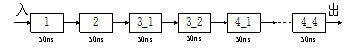 |

 

n 重复设置部件

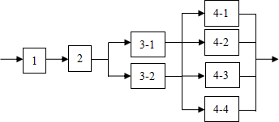 

 

 

|      |                                   |
| ---- | --------------------------------- |
|      | 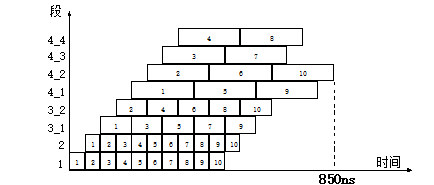 |

 

 

**3.13**有一个流水线由4段组成，其中每当流经第3段时，总要在该段循环一次，然后才能流到第4段。如果每段经过一次所需要的时间都是，问：

（1） 当在流水线的输入端连续地每时间输入任务时，该流水线会发生什么情况？

（2） 此流水线的最大吞吐率为多少？如果每输入一个任务，连续处理10个任务时的实际吞吐率和效率是多少？

（3） 当每段时间不变时，如何提高该流水线的吞吐率？仍连续处理10个任务时，其吞吐率提高多少？

解：（1）会发生流水线阻塞情况。

| 第1个任务 | S1   | S2   | S3   | S3    | S4   |       |      |       |      |      |      |
| --------- | ---- | ---- | ---- | ----- | ---- | ----- | ---- | ----- | ---- | ---- | ---- |
| 第2个任务 |      | S1   | S2   | stall | S3   | S3    | S4   |       |      |      |      |
| 第3个任务 |      |      | S1   | stall | S2   | stall | S3   | S3    | S4   |      |      |
| 第4个任务 |      |      |      |       | S1   | stall | S2   | stall | S3   | S3   | S4   |

 

（2）

|      |                                   |
| ---- | --------------------------------- |
|      |  |

 

 

 

（3）重复设置部件

|      |                                   |
| ---- | --------------------------------- |
|      |  |

 

|      |                                   |
| ---- | --------------------------------- |
|      |  |

 

吞吐率提高倍数＝＝1.64

 

3.14 有一条静态多功能流水线由5段组成，加法用1、3、4、5段，乘法用1、2、5段，第3段的时间为2△t，其余各段的时间均为△t，而且流水线的输出可以直接返回输入端或

 

|      |                                   |
| ---- | --------------------------------- |
|      | 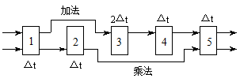 |

暂存于相应的流水寄存器中。现要在该流水线上计算       ，画出其时空图，并计算其吞吐率、加速比和效率。

 

解：首先，应选择适合于流水线工作的算法。对于本题，应先计算A1＋B1、A2＋B2、A3＋B3和A4＋B4；再计算(A1＋B1) ×(A2＋B2)和(A3＋B3) ×(A4＋B4)；然后求总的结果。

|      |                                   |
| ---- | --------------------------------- |
|      | 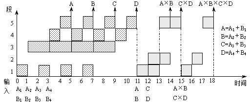 |

其次，画出完成该计算的时空图，如图所示，图中阴影部分表示该段在工作。

 

 

由图可见，它在18个△*t*时间中，给出了7个结果。所以吞吐率为：

​		                            

如果不用流水线，由于一次求积需3△*t*，一次求和需5△*t*，则产生上述7个结果共需（4×5+3×3）△*t* =29△*t*。所以加速比为：

		                                

 

该流水线的效率可由阴影区的面积和5个段总时空区的面积的比值求得：

		                                  

 

 

3.15 动态多功能流水线由6个功能段组成，如下图：

|      |                                   |
| ---- | --------------------------------- |
|      | 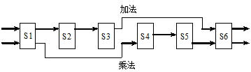 |

 

 

其中，S1、S4、S5、S6组成乘法流水线，S1、S2、S3、S6组成加法流水线，各个功能段时间均为50ns，假设该流水线的输出结果可以直接返回输入端，而且设置有足够的缓冲寄存器，若以最快的方式用该流水计算：

（1） 画出时空图；

（2） 计算实际的吞吐率、加速比和效率。

解：机器一共要做10次乘法，4次加法。

 

|      |                                   |
| ---- | --------------------------------- |
|      | 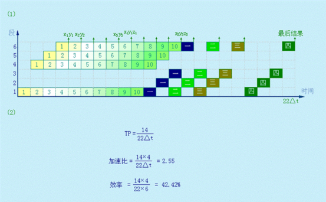 |

 

3.16 在MIPS流水线上运行如下代码序列：

LOOP： LW    	R1，0（R2）

​       DADDIU  R1，R1，#1

​        SW    	R1， 0（R2）

​        DADDIU  R2，R2，#4

​        DSUB    R4，R3，R2

​        BNEZ    R4，LOOP

   其中：R3的初值是R2+396。假设：在整个代码序列的运行过程中，所有的存储器访问都是命中的，并且在一个时钟周期中对同一个寄存器的读操作和写操作可以通过寄存器文件“定向”。问：

（1） 在没有任何其它定向（或旁路）硬件的支持下，请画出该指令序列执行的流水线时空图。假设采用排空流水线的策略处理分支指令，且所有的存储器访问都命中Cache，那么执行上述循环需要多少个时钟周期？

（2） 假设该流水线有正常的定向路径，请画出该指令序列执行的流水线时空图。假设采用预测分支失败的策略处理分支指令，且所有的存储器访问都命中Cache，那么执行上述循环需要多少个时钟周期？

（3） 假设该流水线有正常的定向路径和一个单周期延迟分支，请对该循环中的指令进行调度，你可以重新组织指令的顺序，也可以修改指令的操作数，但是注意不能增加指令的条数。请画出该指令序列执行的流水线时空图，并计算执行上述循环所需要的时钟周期数。

解：

寄存器读写可以定向，无其他旁路硬件支持。排空流水线。

第i次迭代（i＝0..98）开始周期：1＋（i×17）

总的时钟周期数：（98×17）＋18＝1684

有正常定向路径，预测分支失败。

 

第i次迭代（i＝0..98）开始周期：1＋（i×10）

总的时钟周期数：（98×10）＋11＝991

有正常定向路径。单周期延迟分支。

LOOP:  LW    R1，0(R2)

DADDIU R2，R2，#4

DADDIU R1，R1，#1

DSUB   R4，R3，R2

BNEZ  R4，LOOP

SW   R1，-4(R2)

 

第i次迭代（i ＝0..98）开始周期：1＋（i ×6 ）

总的时钟周期数：（98×6）＋10＝598

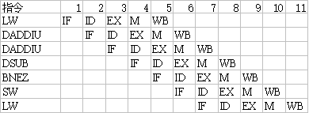

 

3.17 假设各种分支指令数占所有指令数的百分比如下：

 

| 条件分支   | 20%（其中的60%是分支成功的） |
| ---------- | ---------------------------- |
| 跳转和调用 | 5%                           |

现有一条段数为4的流水线，无条件分支在第二个时钟周期结束时就被解析出来，而条件分支要到第三个时钟周期结束时才能够被解析出来。第一个流水段是完全独立于指令类型的，即所有类型的指令都必须经过第一个流水段的处理。请问在没有任何控制相关的情况下，该流水线相对于存在上述控制相关情况下的加速比是多少？

解：没有控制相关时流水线的平均CPI＝1

存在控制相关时：由于无条件分支在第二个时钟周期结束时就被解析出来，而条件分支

要到第3个时钟周期结束时才能被解析出来。所以：

（1）若使用排空流水线的策略，则对于条件分支，有两个额外的stall，对无条件分支，有一个额外的stall：

CPI = 1+20%*2+5%*1 = 1.45 

加速比S=CPI/1 = 1.45

（2） 若使用预测分支成功策略，则对于不成功的条件分支，有两个额外的stall，对无条件分支和成功的条件分支，有一个额外的stall 1：

CPI = 1+20%*(60%*1+40%*2) +5%*1 = 1.33 

加速比S=CPI/1 = 1.33

（3）若使用预测分支失败策略，则对于成功的条件分支，有两个额外的stall；对无条件分支，有一个额外的stall；对不成功的条件分支，其目标地址已经由PC 值给出，不必等待，所以无延迟：

CPI = 1+20%*(60%*2 + 40%*0) +5%*1 = 1.29 

加速比S=CPI/1 = 1.29

 

**3.18** 在CRAY-1机器上，按照链接方式执行下述4条向量指令（括号中给出了相应功能部件的执行时间），如果向量寄存器和功能部件之间的数据传送需要1拍，试求此链接流水线的通过时间是多少拍？如果向量长度为64，则需多少拍才能得到全部结果？

​     V0←存储器      （从存储器中取数：7拍）

​     V2←V0+V1       （向量加：3拍）

​     V3←V2<A3       （按（A3）左移：4拍）

​     V5←V3∧V4      （向量逻辑乘：2拍）

解：通过时间就是每条向量指令的第一个操作数执行完毕需要的时间，也就是各功能流水线由空到满的时间，具体过程如下图所示。要得到全部结果，在流水线充满之后，向量中后继操作数继续以流水方式执行，直到整组向量执行完毕。

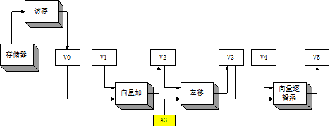

|      |                                   |
| ---- | --------------------------------- |
|      |  |

 

 

3.19 某向量处理机有16个向量寄存器，其中V0~V5中分别放有向量A、B、C、D、E、F，向量长度均为8，向量各元素均为浮点数；处理部件采用两条单功能流水线，加法功能部件时间为2拍，乘法功能部件时间为3拍。采用类似于CARY-1的链接技术，先计算（A+B）*C，在流水线不停流的情况下，接着计算（D+E）*F。

（1） 求此链接流水线的通过时间？（设寄存器入、出各需1拍）

（2） 假如每拍时间为50ns，完成这些计算并把结果存进相应寄存器，此处理部件的实际吞吐率为多少MFLOPS？

解：（1）我们在这里假设A＋B的中间结果放在V6中，（A＋B）×C地最后结果放在V7中，D＋E地中间结果放在V8中，（D＋E）×F的最后结果放在V9中。具体实现参考下图：

 

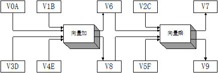

 

通过时间应该为前者（（A＋B）×C）通过的时间：

T通过= (1+2+1)+(1+3+1) =9（拍）

（2）在做完（A＋B）×C之后，作（C＋D）×E就不需要通过时间了。

V6←A＋B       

​     V7←V6×C       

​     V8←D＋E      

|      |                                   |
| ---- | --------------------------------- |
|      |  |

V9←V8×F

 

 

# ***\*第4章 指令级并行\****

4.1解释下列术语		

指令级并行：简称ILP。是指指令之间存在的一种并行性，利用它，计算机可以并行执行两条或两条以上的指令。

 

指令调度：通过在编译时让编译器重新组织指令顺序或通过硬件在执行时调整指令顺序来消除冲突。

 

指令的动态调度：是指在保持数据流和异常行为的情况下，通过硬件对指令执行顺序进行重新安排，以提高流水线的利用率且减少停顿现象。是由硬件在程序实际运行时实施的。

 

指令的静态调度：是指依靠编译器对代码进行静态调度，以减少相关和冲突。它不是在程序执行的过程中、而是在编译期间进行代码调度和优化的。

 

保留站：在采用Tomasulo算法的MIPS处理器浮点部件中，在运算部件的入口设置的用来保存一条已经流出并等待到本功能部件执行的指令（相关信息）。

 

CDB：公共数据总线。

 

动态分支预测技术：是用硬件动态地进行分支处理的方法。在程序运行时，根据分支指令过去的表现来预测其将来的行为。如果分支行为发生了变化，预测结果也跟着改变。

 

BHT：分支历史表。用来记录相关分支指令最近一次或几次的执行情况是成功还是失败，并据此进行预测。

 

分支目标缓冲：是一种动态分支预测技术。将执行过的成功分支指令的地址以及预测的分支目标地址记录在一张硬件表中。在每次取指令的同时，用该指令的地址与表中所有项目的相应字段进行比较，以便尽早知道分支是否成功，尽早知道分支目标地址，达到减少分支开销的目的。

 

前瞻执行：解决控制相关的方法，它对分支指令的结果进行猜测，然后按这个猜测结果继续取指、流出和执行后续的指令。只是指令执行的结果不是写回到寄存器或存储器，而是放到一个称为ROB的缓冲器中。等到相应的指令得到“确认”（即确实是应该执行的）后，才将结果写入寄存器或存储器。

 

ROB：ReOrder Buffer。前瞻执行缓冲器。

 

超标量：一种多指令流出技术。它在每个时钟周期流出的指令条数不固定，依代码的具体情况而定，但有个上限。

 

超流水：在一个时钟周期内分时流出多条指令。

 

超长指令字：一种多指令流出技术。VLIW处理机在每个时钟周期流出的指令条数是固定的，这些指令构成一条长指令或者一个指令包，在这个指令包中，指令之间的并行性是通过指令显式地表示出来的。

 

循环展开：是一种增加指令间并行性最简单和最常用的方法。它将循环展开若干遍后，通过重命名和指令调度来开发更多的并行性。

 

4.2 简述Tomasulo算法的基本思想。

答：核心思想是：① 记录和检测指令相关，操作数一旦就绪就立即执行，把发生RAW冲突的可能性减小到最少；② 通过寄存器换名来消除WAR冲突和WAW冲突。寄存器换名是通过保留站来实现，它保存等待流出和正在流出指令所需要的操作数。

基本思想：只要操作数有效，就将其取到保留站，避免指令流出时才到寄存器中取数据，这就使得即将执行的指令从相应的保留站中取得操作数，而不是从寄存器中。指令的执行结果也是直接送到等待数据的其它保留站中去。因而，对于连续的寄存器写，只有最后一个才真正更新寄存器中的内容。一条指令流出时，存放操作数的寄存器名被换成为对应于该寄存器保留站的名称（编号）。

 

4.3 根据需要展开下面的循环并进行指令调度，直到没有任何延迟。指令的延迟如表4.4。

LOOP:	L.D	F0,0(R1)

​	MUL.D	F0,F0,F2

​	L.D	F4,0(R2)

​	ADD.D	F0,F0,F4

​	S.D	F0,0(R2)

​	DSUBI	R1,R1,#8

​	DSUBI	R2,R2,#8

​	BNEZ	R1,LOOP

解：将循环展开两次，进行指令调度，即可以消除延迟，代码如下：

LOOP： L.D 	F0，0（R1）

L.D F10，-8（R1）

MUL.D 	F0，F0，F2

MUL.D 	F10，F10，F2

L.D 	F4，0（R2）

L.D	F14，-8（R2）

ADD.D 	F0，F0，F4

ADD.D	F10，F10，F14

DSUBI 	R1，R1，16

S.D 	0（R2），F0

DSUBI 	R2，R2，16

BNEZ 	R1，LOOP

S.D 	8（R2），F10

 

4.4 假设有一条长流水线，仅仅对条件转移指令使用分支目标缓冲。假设分支预测错误的开销为4个时钟周期，缓冲不命中的开销为3个时钟周期。假设：命中率为90%，预测精度为90%，分支频率为15%，没有分支的基本CPI为1。

（1） 求程序执行的CPI。

（2） 相对于采用固定的2个时钟周期延迟的分支处理，哪种方法程序执行速度更快？

解：（1）程序执行的CPI = 没有分支的基本CPI（1） + 分支带来的额外开销

分支带来的额外开销是指在分支指令中，缓冲命中但预测错误带来的开销与缓冲没有命中带来的开销之和。

分支带来的额外开销= 15% * (90%命中×10%预测错误×4 + 10％没命中×3)= 0.099

所以，程序执行的CPI ＝ 1 ＋ 0.099 = 1.099

（2）采用固定的2 个时钟周期延迟的分支处理CPI = 1 + 15%×2 = 1.3

由（1）（2）可知分支目标缓冲方法执行速度快。

 

4.5 假设分支目标缓冲的命中率为90%，程序中无条件转移指令的比例为5%，没有无条件转移指令的程序CPI值为1。假设分支目标缓冲中包含分支目标指令，允许无条件转移指令进入分支目标缓冲，则程序的CPI值为多少？

解：设每条无条件转移指令的延迟为x，则有：

1＋5%×x＝1.1 

x＝2

当分支目标缓冲命中时，无条件转移指令的延迟为0。

所以 程序的CPI ＝ 1 ＋ 2 × 5% ×(1 －90%) ＝1.01

 

4.6 下面的一段MIPS汇编程序是计算高斯消去法中的关键一步，用于完成下面公式的计算：

Y = a ´ X + Y

其浮点指令延迟如表4.3所示，整数指令均为1个时钟周期完成，浮点和整数部件均采用流水。整数操作之间以及与其它所有浮点操作之间的延迟为0，转移指令的延迟为0。X中的最后一个元素存放在存储器中的地址为DONE。

FOO:	L.D	F2,0(R1)	

​	MUT.D	F4,F2,F0	

​	L.D	F6,0(R2)	

​	ADD.D	F6,F4,F6	

​	S.D	F6,0[R2]	

​	DADDIU	R1,R1,#8	

​	DADDIU	R2,R2,#8	

DSUBIU	R3,R1,#DONE     

​	BNEZ	R3, FOO	

(1) 对于标准的MIPS单流水线，上述循环计算一个Y值需要多少时间？其中有多少空转周期？

(2) 对于标准的MIPS单流水线，将上述循环顺序展开4次，不进行任何指令调度，计算一个Y值平均需要多少时间？加速比是多少？其加速是如何获得的？

(3) 对于标准的MIPS单流水线，将上述循环顺序展开4次，优化和调度指令，使循环处理时间达到最优，计算一个Y值平均需要多少时间？加速比是多少？

(1) 对于采用如图4.8前瞻执行机制的MIPS处理器（只有一个整数部件）。当循环第二次执行到

BNEZ	R3,FOO

时，写出前面所有指令的状态，包括指令使用的保留站、指令起始节拍、执行节拍和写结果节拍，并写出处理器当前的状态。

(2) 对于2路超标量的MIPS流水线，设有两个指令流出部件，可以流出任意组合的指令，系统中的功能部件数量不受限制。将上述循环展开4次，优化和调度指令，使循环处理时间达到最优。计算一个Y值平均需要多少时间？加速比是多少？

(3) 对于如图4.13结构的超长指令字MIPS处理器，将上述循环展开4次，优化和调度指令，使循环处理时间达到最优。计算一个Y值平均需要多少时间？加速比是多少？

 

解：（1）

​	L.D	F2, 0(R1)		1

​	Stall      

​	MUT.D	F4, F2, F0		2

​	L.D	F6, 0(R2)		3

​	Stall      

​	Stall      

​	ADD.D	F6, F4, F6		4

​	Stall     

​	Stall

S.D	F6, 0[R2]		5 

​	DADDIU	R1, R1, #8		6

​	DADDIU	R2, R2, #8		7

DSUBIU	R3, R1, #DONE  	8

​	BNEZ	R3, FOO		9

所以，共有14 个时钟周期，其中有5 个空转周期。

（2）循环顺序展开4 次，不进行任何指令调度，则指令1～5 及其间的stall 都是必要的，只是指令6～9 只需执行一次，因此，共有 10 × 4 ＋ 4 ＝ 44 个时钟周期，计算出4 个Y 值，所以计算一个Y 值需要11 个时钟周期，加速比为：14/11 = 1.27 。加速主要是来自减少控制开销，即减少对R1、R2 的整数操作以及比较、分支指令而来的。

（3）循环顺序展开4 次，优化和调度指令，如下：

 

​	L.D	F2, 0(R1)		

​	L.D	F8, 8(R1)

​    L.D	F14, 16(R1)

​	L.D	F20, 24(R1)

​	MUT.D	F4, F2, F0

​	MUT.D	F10, F8, F0

​	MUT.D	F16, F14, F0

​	MUT.D	F22, F20, F0		

​	L.D	F6, 0(R2)

​	L.D	F12, 8(R2)

​	L.D	F18, 16(R2)

​	L.D	F24, 24(R2)		 

​	ADD.D	F6, F4, F6

​	ADD.D	F12, F10, F12

​	ADD.D	F18, F16, F18

​	ADD.D	F24, F22, F24		

​	S.D	F6, 0[R2]		

 S.D	F12, 8[R2]

​	S.D	F18, 16[R2]

​	S.D	F24, 24[R2]

​	DADDIU	R1, R1, #32		

​	DADDIU	R2, R2, #32		

DSUBIU	R3, R1, #DONE  	

​	BNEZ	R3, FOO		

共用了24 个时钟周期，则计算一个Y 值平均需要 24/4 = 6 个时钟周期，

加速比：14/6 = 2.33

（4）

| 指令                   | 指令执行时钟 |        |      |      |
| ---------------------- | ------------ | ------ | ---- | ---- |
| 流出                   | 执行         | 写结果 | 确认 |      |
| L.D		F2, 0（R1） | 1            | 2      | 3    | 4    |
| MUL.D	F4, F2, F0    | 2            | 4      | 5    | 6    |
| L.D		F6, 0（R2） | 3            | 4      | 6    | 7    |
| ADD.D	F6, F4, F6    | 4            | 8      | 9    | 10   |
| S.D	   F6, 0（R2）  | 5            | 11     | 12   | 13   |
| DADDIU	 R1, R1, #8  | 6            | 7      | 8    |      |
| DADDIU	 R2, R2, #8  | 7            | 8      | 9    |      |
| DSUBIU	 R3,R1,#DONE | 8            | 9      | 10   |      |
| BNEZ	 R3, FOO       | 9            | 10     |      |      |
| L.D		F2, 0（R1） | 10           | 11     | 13   | 14   |
| MUL.D	F4, F2, F0    | 11           | 13     | 14   | 15   |
| L.D		F6, 0（R2） | 12           | 13     | 15   | 16   |
| ADD.D	F6, F4, F6    | 13           | 17     | 18   | 19   |
| S.D	   F6, 0（R2）  | 14           | 20     | 21   | 22   |
| DADDIU	 R1, R1, #8  | 15           | 16     | 17   |      |
| DADDIU	 R2, R2, #8  | 16           | 17     | 18   |      |
| DSUBIU	 R3,R1,#DONE | 17           | 18     | 19   |      |
| BNEZ	 R3, FOO       | 18           |        |      |      |

 

| 名称  | 保留站 |       |          |           |      |      |      |      |
| ----- | ------ | ----- | -------- | --------- | ---- | ---- | ---- | ---- |
| Busy  | Op     | Vj    | Vk       | Qj        | Qk   | Dest | A    |      |
| Add1  | yes    | ADD.D | Regs[F4] | Regs[F6 ] |      |      |      |      |
| Add2  | no     |       |          |           |      |      |      |      |
| Add3  | no     |       |          |           |      |      |      |      |
| Mult1 | yes    |       |          |           |      |      |      |      |
| Mult2 | no     |       |          |           |      |      |      |      |

 

| 项号 | ROB  |       |             |       |                 |                    |
| ---- | ---- | ----- | ----------- | ----- | --------------- | ------------------ |
| Busy | 指令 | 状态  | 目的        | Value |                 |                    |
| 1    | yes  | ADD.D | F6, F4, F6  | 执行  | F6              | Regs[F4]＋Regs[F6] |
| 2    | yes  | S.D   | F6, 0（R2） | 流出  | Mem[0+Regs[R2]] | #2                 |

 

| 字段      | 浮点寄存器状态 |      |      |      |      |      |      |      |
| --------- | -------------- | ---- | ---- | ---- | ---- | ---- | ---- | ---- |
| F0        | F2             | F4   | F6   | F8   | F10  | …    | F30  |      |
| ROB项编号 |                |      |      | 1    |      |      |      |      |
| Busy      |                |      |      | yes  |      |      | …    |      |

 

（5）

| 整数指令                 | 浮点指令               | 时钟周期数 |
| ------------------------ | ---------------------- | ---------- |
| L.D	F2, 0(R1)         |                        | 1          |
| L.D	F8, 8(R1)         |                        | 2          |
| L.D	F14, 16(R1)       | MUT.D	F4, F2, F0    | 3          |
| L.D	F20, 24(R1)       | MUT.D	F10, F8, F0   | 4          |
| L.D	F6, 0(R2)         | MUT.D	F16, F14, F0  | 5          |
| L.D	F12, 8(R2)        | MUT.D	F22, F20, F0  | 6          |
| L.D	F18, 16(R2)       | ADD.D	F6, F4, F6    | 7          |
| L.D	F24, 24(R2)       | ADD.D	F12, F10, F12 | 8          |
| DADDIU R1, R1, #32       | ADD.D	F18, F16, F18 | 9          |
| S.D	F6, 0(R2)         | ADD.D	F24, F22, F24 | 10         |
| S.D	F12, 8(R2)        |                        | 11         |
| S.D	F18,16(R2)        |                        | 12         |
| S.D	F24, 24(R2)       |                        | 13         |
| DADDIU R2, R2, #32       |                        | 14         |
| DSUBIU	 R3, R1, #DONE |                        | 15         |
| BNEZ	R3, FOO          |                        | 16         |

 

计算一个Y值需要 16/4 = 4 个时钟周期，加速比 = 14/4 = 3.5

（6）

| 访存1          | 访存2            | 浮点指令1          | 浮点指令2          | 整数指令            | 时钟周期 |
| -------------- | ---------------- | ------------------ | ------------------ | ------------------- | -------- |
| L.DF2, 0(R1)   | L.D	F8, 8(R1) |                    |                    |                     | 1        |
| L.DF14, 16(R1) | L.DF20, 24(R1)   |                    |                    |                     |          |
| L.DF6, 0(R2)   | L.DF12, 8(R2)    | MUT.DF4, F2, F0    | MUT.DF10, F8, F0   |                     | 3        |
| L.DF18, 16(R2) | L.DF24, 24(R2)   | MUT.DF16, F14, F0  | MUT.DF22, F20, F0  |                     | 4        |
|                |                  | ADD.DF6, F4, F6    | ADD.DF12, F10, F12 |                     | 5        |
|                |                  | ADD.DF18, F16, F18 | ADD.DF24, F22, F24 | DADDIU R1, R1, #32  | 6        |
|                |                  |                    |                    | DADDIU R2, R2, #32  | 7        |
|                |                  |                    |                    | DSUBIUR3, R1, #DONE | 8        |
|                |                  |                    |                    | BNEZ	R3, FOO     | 9        |
| S.DF6, -32(R2) | S.DF12, -24(R2)  |                    |                    |                     | 10       |
| S.DF18,-16(R2) | S.DF24, -8(R2)   |                    |                    |                     | 11       |

 

计算一个Y值需要 11/4 个时钟周期，加速比 = 14/(11/4) = 56/11

 

4.7 对于两路超标量处理器，从存储器取数据有两拍附加延迟，其它操作均有1拍附加延迟，对于下列代码，请按要求进行指令调度。

LW	R4,(R5)

LW	R7,(R8)

DADD	R9,R4,R7

LD	R10,(R11)

DMUL	R12,R13,R14

DSUB	R2,R3,R1

SW	R15,(R2)

DMUL	R21,R4,R7

SW	R23,(R22)

SW	R21,(R24)

（1） 假设两路功能部件中同时最多只有一路可以是访问存储器的操作，同时也最多只有一路可以是运算操作，指令顺序不变。

（2） 假设两路功能部件均可以执行任何操作，指令顺序不变。

（3） 假设指令窗口足够大，指令可以乱序（out-of-order）流出，两路功能部件均可以执行任何操作。

解：（1）

| 第一路                | 第二路           |
| --------------------- | ---------------- |
| LW	R4, (R5)        |                  |
| LW	R7, (R8)        |                  |
|                       |                  |
|                       |                  |
| DADD	R9, R4, R7    | LD	R10, (R11) |
| DMUL	R12, R13, R14 |                  |
| DSUB	R2, R3, R1    | SW	R15, (R2)  |
| DMUL	R21, R4, R7   | SW	R23, (R22) |
|                       |                  |
| SW	R21, (R24)      |                  |

（2）

| 第一路                | 第二路              |
| --------------------- | ------------------- |
| LW	R4, (R5)        | LW	R7, (R8)      |
|                       |                     |
|                       |                     |
| DADD	R9, R4, R7    | LD	R10, (R11)    |
| DMUL	R12, R13, R14 | DSUB	 R2, R3, R1 |
| SW	R15, (R2)       | DMUL	R21, R4, R7 |
| SW	R23, (R22)      |                     |
| SW	R21, (R24)      |                     |

（3）

 

| 第一路             | 第二路                |
| ------------------ | --------------------- |
| LW	R4, (R5)     | LW	R7, (R8)        |
| DSUB	R2, R3, R1 | LD	   R10, (R11)   |
| SW	R23, (R22)   | DMUL	R12, R13, R14 |
| DADD	R9, R4, R7 | DMUL	R21, R4, R7   |
| SW	  R15, (R2)  |                       |
| SW	  R21, (R24) |                       |

 

4.8 对于例4.5，在相同的条件下，如果展开7遍循环，求：

（1） 每遍循环的平均时钟周期；

（2） 每个时钟周期流出指令数；

（3） 操作槽（功能部件）的使用效率；

（4） 如果展开10遍，会出现哪些问题？

解：展开7遍循环

| 访存指令1 | 访存指令2     | 浮点指令1 | 浮点指令2     | 整数/转移指令 |            |       |            |        |             |
| --------- | ------------- | --------- | ------------- | ------------- | ---------- | ----- | ---------- | ------ | ----------- |
| L.D       | F0,0（R1）    | L.D       | F6,-8（R1）   |               |            |       |            |        |             |
| L.D       | F10,-16（R1） | L.D       | F14,-24（R1） |               |            |       |            |        |             |
| L.D       | F18,-32（R1） | L.D       | F22,-40（R1） | ADD.D         | F4,F0,F2   | ADD.D | F8,F6,F2   |        |             |
| L.D       | F26,-48（R1） |           |               | ADD.D         | F12,F10,F2 | ADD.D | F16,F14,F2 |        |             |
|           |               |           |               | ADD.D         | F20,F18,F2 | ADD.D | F24,F22,F2 |        |             |
| S.D       | F4,0（R1）    | S.D       | F8,-8（R1）   | ADD.D         | F28,F26,F2 |       |            |        |             |
| S.D       | F12,-16（R1） | S.D       | F16,–24（R1） |               |            |       |            |        |             |
| S.D       | F20,-32（R1） | S.D       | F24,–40（R1） |               |            |       |            | DADDIU | R1,R1,# -56 |
| S.D       | F28,8（R1）   |           |               |               |            |       |            | BNE    | R1,Loop     |

 

这段程序的运行时间为9个时钟周期，每遍循环平均约1.28个时钟周期。9个时钟周期内流出了23条指令，每个时钟周期2.55条。9个时钟周期共有操作槽9´5=45个，有效槽的比例为51.1%。

 

4.9 设指令流水线由取指令、分析指令和执行指令3个部件构成，每个部件经过的时间为△t，连续流入12条指令。分别画出标量流水处理机以及ILP均为4的超标量处理机、超长指令字处理机、超流水处理机的时空图，并分别计算它们相对于标量流水处理机的加速比。

解：标量流水处理机的时空图：

|      |                                   |
| ---- | --------------------------------- |
|      |  |

 

执行完12条指令需T1＝14△t。

超标量流水处理机与超长指令字处理机的时空图：

|      |                                   |
| ---- | --------------------------------- |
|      |  |

 

 

超标量流水处理机中，每一个时钟周期同时启动4条指令。执行完12条指令需T2＝5△t，相对于标量流水处理机的加速比为：

超长指令字处理机中，每4条指令组成一条长指令，共形成3条长指令。执行完12条指令需T3＝5△t，相对于标量流水处理机的加速比为：

超流水处理机的时空图：

|      |                                   |
| ---- | --------------------------------- |
|      |  |

 

超流水处理机中，每1/4个时钟周期启动一条指令。执行完12条指令需T4＝5.75△t，相对于标量流水处理机的加速比为：

 

 

# ***\*第5章 存储层次\****

 

5.1解释下列术语

多级存储层次：采用不同的技术实现的存储器，处在离CPU不同距离的层次上，各存储器之间一般满足包容关系，即任何一层存储器中的内容都是其下一层（离CPU更远的一层）存储器中内容的子集。目标是达到离CPU最近的存储器的速度，最远的存储器的容量。

 

全相联映象：主存中的任一块可以被放置到Cache中任意一个地方。

 

直接映象：主存中的每一块只能被放置到Cache中唯一的一个地方。

 

组相联映象：主存中的每一块可以放置到Cache中唯一的一组中任何一个地方（Cache分成若干组，每组由若干块构成）。

 

替换算法：由于主存中的块比Cache中的块多，所以当要从主存中调一个块到Cache中时，会出现该块所映象到的一组（或一个）Cache块已全部被占用的情况。这时，需要被迫腾出其中的某一块，以接纳新调入的块。

 

LRU：选择最近最少被访问的块作为被替换的块。实际实现都是选择最久没有被访问的块作为被替换的块。

 

写直达法：在执行写操作时，不仅把信息写入Cache中相应的块，而且也写入下一级存储器中相应的块。

 

写回法：只把信息写入Cache中相应块，该块只有被替换时，才被写回主存。

 

按写分配法：写失效时，先把所写单元所在的块调入Cache，然后再进行写入。

 

不按写分配法：写失效时，直接写入下一级存储器中，而不把相应的块调入Cache。

 

命中时间：访问Cache命中时所用的时间。

 

失效率：CPU访存时，在一级存储器中找不到所需信息的概率。

 

失效开销：CPU向二级存储器发出访问请求到把这个数据调入一级存储器所需的时间。

 

强制性失效：当第一次访问一个块时，该块不在Cache中，需要从下一级存储器中调入Cache，这就是强制性失效。

 

容量失效：如果程序在执行时，所需要的块不能全部调入Cache中，则当某些块被替换后又重新被访问，就会产生失效，这种失效就称作容量失效。

 

冲突失效：在组相联或直接映象Cache中，若太多的块映象到同一组（块）中，则会出现该组中某个块被别的块替换（即使别的组或块有空闲位置），然后又被重新访问的情况。

 

2：1Cache经验规则：大小为N的直接映象Cache的失效率约等于大小为N /2的两路组相联Cache的实效率。

 

相联度：在组相联中，每组Cache中的块数。

 

Victim Cache：位于Cache和存储器之间的又一级Cache，容量小，采用全相联策略。用于存放由于失效而被丢弃（替换）的那些块。每当失效发生时，在访问下一级存储器之前，先检查Victim Cache中是否含有所需块。

 

故障性预取：在预取时，若出现虚地址故障或违反保护权限，就会发生异常。

 

非故障性预取：在预取时，若出现虚地址故障或违反保护权限，不发生异常。

 

非阻塞Cache：Cache在等待预取数据返回时，还能继续提供指令和数据。

 

尽早重启动：在请求字没有到达时，CPU处于等待状态。一旦请求字到达，就立即发送给CPU，让等待的CPU尽早重启动，继续执行。

 

请求字优先：调块时，首先向存储器请求CPU所要的请求字。请求字一旦到达，就立即送往CPU，让CPU继续执行，同时从存储器调入该块的其余部分。

 

虚拟Cache：地址使用虚地址的Cache。

 

多体交叉存储器：具有多个存储体，各体之间按字交叉的存储技术。

 

存储体冲突：多个请求要访问同一个体。

 

TLB：一个专用高速存储器，用于存放近期经常使用的页表项，其内容是页表部分内容的一个副本。

 

5.2 简述“Cache—主存”层次与“主存—辅存”层次的区别。

答：

| 存储层次比较项目                 | “Cache—主存”层次       | “主存—辅存”层次        |
| -------------------------------- | ---------------------- | ---------------------- |
| 目的                             | 为了弥补主存速度的不足 | 为了弥补主存容量的不足 |
| 存储管理的实现                   | 全部由专用硬件实现     | 主要由软件实现         |
| 访问速度的比值（第一级比第二级） | 几比一                 | 几万比一               |
| 典型的块（页）大小               | 几十个字节             | 几百到几千个字节       |
| CPU对第二级的访问方式            | 可直接访问             | 均通过第一级           |
| 不命中时CPU是否切换              | 不切换                 | 切换到其它进程         |

 

5.3 地址映象方法有哪几种？它们各有什么优缺点？

答：(1) 全相联映象。实现查找的机制复杂，代价高，速度慢。Cache空间的利用率较高，块冲突概率较低，因而Cache的失效率也低。（2）直接映象。实现查找的机制简单，速度快。Cache空间的利用率较低，块冲突概率较高，因而Cache的失效率也高。（3）组相联映象。组相联是直接映象和全相联的一种折衷。

 

5.4 降低Cache失效率有哪几种方法？简述其基本思想。

答：常用的降低Cache失效率的方法有下面几种：

（1） 增加Cache块大小。增加块大小利用了程序的空间局部性。

（2） 增加Cache的容量。

（3） 提高相联度，降低冲突失效。

（4） 伪相联Cache，降低冲突失效。当对伪相联Cache进行访问时，首先是按与直接映象相同的方式进行访问。如果命中，则从相应的块中取出所访问的数据，送给CPU，访问结束。如果不命中，就将索引字段的最高位取反，然后按照新索引去寻找“伪相联组”中的对应块。如果这一块的标识匹配，则称发生了“伪命中”。否则，就访问下一级存储器。

（5） 硬件预取技术。在处理器提出访问请求前预取指令和数据。

（6） 由编译器控制的预取，硬件预取的替代方法，在编译时加入预取的指令，在数据被用到之前发出预取请求。

（7） 编译器优化，通过对软件的优化来降低失效率。

（8） “牺牲”Cache。在Cache和其下一级存储器的数据通路之间增设一个全相联的小Cache，存放因冲突而被替换出去的那些块。每当发生不命中时，在访问下一级存储器之前，先检查“牺牲”Cache中是否含有所需的块。如果有，就将该块与Cache中某个块做交换，把所需的块从“牺牲”Cache 调入Cache。

 

5.5 简述减小Cache失效开销的几种方法。

答：让读失效优先于写、写缓冲合并、请求字处理技术、非阻塞Cache或非锁定Cache技术、采用二级Cache。

 

5.6 通过编译器对程序优化来改进Cache性能的方法有哪几种？简述其基本思想。

答：（1）数组合并。通过提高空间局部性来减少失效次数。有些程序同时用相同的索引来访问若干个数组的同一维，这些访问可能会相互干扰，导致冲突失效，可以将这些相互独立的数组合并成一个复合数组，使得一个Cache块中能包含全部所需元素。（2）内外循环交换。循环嵌套时，程序没有按数据在存储器中的顺序访问。只要简单地交换内外循环，就能使程序按数据在存储器中的存储顺序进行访问。（3）循环融合。有些程序含有几部分独立的程序段，它们用相同的循环访问同样的数组，对相同的数据作不同的运算。通过将它们融合成一个单一循环，能使读入Cache的数据被替换出去之前得到反复的使用。（4）分块。通过改进时间局部性来减少失效。分块不是对数组的整行或整列进行访问，而是对子矩阵或块进行操作。

 

5.7 在“Cache—主存”层次中，主存的更新算法有哪两种？它们各有什么特点？

答：（1）写直达法。易于实现，而且下一级存储器中的数据总是最新的。

（2）写回法。速度快，“写”操作能以Cache存储器的速度进行。而且对于同一单元的多个写最后只需一次写回下一级存储器，有些“写”只到达Cache，不到达主存，因而所使用的存储器频带较低。

 

5.8 组相联Cache的失效率比相同容量直接映象Cache的失效率低。由此能否得出结论：采用组相联一定能带来性能上的提高？为什么？

答：不一定。因为组相联命中率的提高是以增加命中时间为代价的，组相联需要增加多路选择开关。

 

5.9 写出三级Cache的平均访问时间的公式。

解：平均访存时间 ＝ 命中时间＋失效率×失效开销

只有第I层失效时才会访问第I＋1。

设三级Cache的命中率分别为HL1、 Hl2、 HL3，失效率分别为Ml1、Ml2、ML3，第三级Cache的失效开销为PL3。

 平均访问时间TA ＝HL1＋Ml1{Hl2＋Ml2(HL3＋ML3×PL3)}

 

5.10 假设对指令Cache的访问占全部访问的75%；而对数据Cache的访问占全部访问的25%。Cache的命中时间为1个时钟周期，失效开销为50 个时钟周期，在混合Cache中一次load或store操作访问Cache的命中时间都要增加一个时钟周期，32KB的指令Cache的失效率为0.39%，32KB的数据Cache的失效率为4.82%，64KB的混合Cache的失效率为1.35%。又假设采用写直达策略，且有一个写缓冲器，并且忽略写缓冲器引起的等待。试问指令Cache和数据Cache容量均为32KB的分离Cache和容量为64KB的混合Cache相比，哪种Cache的失效率更低？两种情况下平均访存时间各是多少？

解：（1）根据题意，约75%的访存为取指令。

因此，分离Cache的总体失效率为：（75%×0.15%）＋（25%×3.77%）＝1.055%；   

容量为128KB的混合Cache的失效率略低一些，只有0.95%。  

（2）平均访存时间公式可以分为指令访问和数据访问两部分：   

 平均访存时间＝指令所占的百分比×（读命中时间＋读失效率×失效开销）＋         数据所占的百分比×（数据命中时间＋数据失效率×失效开销）   

所以，两种结构的平均访存时间分别为：  

分离Cache的平均访存时间＝75%×（1＋0.15%×50）＋25%×（1＋3.77%×50）

＝（75%×1.075）＋（25%×2.885）＝1.5275   

混合Cache的平均访存时间＝75%×（1＋0.95%×50）＋25%×（1＋1＋0.95%×50）

＝（75%×1.475）＋（25%×2.475）＝1.725

因此，尽管分离Cache的实际失效率比混合Cache的高，但其平均访存时间反而较低。分离Cache提供了两个端口，消除了结构相关。

 

5.11 给定以下的假设，试计算直接映象Cache和两路组相联Cache的平均访问时间以及CPU的性能。由计算结果能得出什么结论？

（1） 理想Cache情况下的CPI为2.0，时钟周期为2ns，平均每条指令访存1.2次；

（2） 两者Cache容量均为64KB，块大小都是32字节；

（3） 组相联Cache中的多路选择器使CPU的时钟周期增加了10％；

（4） 这两种Cache的失效开销都是80ns；

（5） 命中时间为1个时钟周期；

（6） 64KB直接映象Cache的失效率为1.4％，64KB两路组相联Cache的失效率为1.0％。

解： 平均访问时间＝命中时间＋失效率×失效开销

平均访问时间1-路=2.0+1.4% *80=3.12ns

平均访问时间2-路=2.0*(1+10%)+1.0% *80=3.0ns

两路组相联的平均访问时间比较低

CPUtime=（CPU执行+存储等待周期）*时钟周期

CPU time=IC（CPI执行+总失效次数/指令总数*失效开销） *时钟周期

=IC（（CPI执行*时钟周期）+（每条指令的访存次数*失效率*失效开销*时钟周期））

CPU time 1-way=IC(2.0*2+1.2*0.014*80)＝5.344IC

CPU time 2-way=IC(2.2*2+1.2*0.01*80)＝5.36IC

相对性能比：5.36/5.344=1.003

直接映象cache的访问速度比两路组相联cache要快1.04倍，而两路组相联Cache的平均性能比直接映象cache要高1.003倍。因此这里选择两路组相联。

 

5.12 假设一台计算机具有以下特性：

（1） 95％的访存在Cache中命中；

（2） 块大小为两个字，且失效时整个块被调入；

（3） CPU发出访存请求的速率为109字/s；

（4） 25％的访存为写访问；

（5） 存储器的最大流量为109字/s（包括读和写）；

（6） 主存每次只能读或写一个字；

（7） 在任何时候，Cache中有30％的块被修改过；

（8） 写失效时，Cache采用按写分配法。

现欲给该计算机增添一台外设，为此首先想知道主存的频带已用了多少。试对于以下两种情况计算主存频带的平均使用比例。

（1） 写直达Cache；

（2） 写回法Cache。

解：采用按写分配

（1）写直达cache访问命中，有两种情况：

读命中，不访问主存；

写命中，更新cache和主存，访问主存一次。

访问失效，有两种情况：

读失效，将主存中的块调入cache中，访问主存两次；

写失效，将要写的块调入cache，访问主存两次，再将修改的数据写入cache和主存，访问主存一次，共三次。上述分析如下表所示。

| 访问命中 | 访问类型 | 频率          | 访存次数 |
| -------- | -------- | ------------- | -------- |
| Y        | 读       | 95%*75%=71.3% | 0        |
| Y        | 写       | 95%*25%=23.8% | 1        |
| N        | 读       | 5%*75%=3.8%   | 2        |
| N        | 写       | 5%*25%=1.3%   | 3        |

 

一次访存请求最后真正的平均访存次数=(71.3%*0)+(23.8%*1)+(3.8%*2)+(1.3%*3)＝0.35

已用带宽=0.35×109/10 9 =35.0%

（2）写回法cache访问命中,有两种情况：

读命中，不访问主存；

写命中，不访问主存。采用写回法，只有当修改的cache块被换出时，才写入主存；

访问失效,有一个块将被换出，这也有两种情况：

如果被替换的块没有修改过，将主存中的块调入cache块中，访问主存两次；

如果被替换的块修改过，则首先将修改的块写入主存，需要访问主存两次；然后将主存中的块调入cache块中，需要访问主存两次，共四次访问主存。

| 访问命中 | 块为脏 | 频率          | 访存次数 |
| -------- | ------ | ------------- | -------- |
| Y        | N      | 95%*70%=66.5% | 0        |
| Y        | Y      | 95%*30%=28.5% | 0        |
| N        | N      | 5%*70%=3.5%   | 2        |
| N        | Y      | 5%*30%=1.5%   | 4        |

 

所以：

一次访存请求最后真正的平均访存次数=66.5％*0＋28.5%*0+3.5%*2+1.5%*4=0.13

已用带宽＝0.13×10 9/10 9＝13%

 

 

5.13 在伪相联中，假设在直接映象位置没有发现匹配，而在另一个位置才找到数据（伪命中）时，不对这两个位置的数据进行交换。这时只需要1个额外的周期。假设失效开销为50个时钟周期，2KB直接映象Cache的失效率为9.8%，2路组相联的失效率为7.6%；128KB直接映象Cache的失效率为1.0%，2路组相联的失效率为0.7%。

（1） 推导出平均访存时间的公式。

（2） 利用（1）中得到的公式，对于2KBCache和128KBCache，计算伪相联的平均访存时间。

 

解：

不管作了何种改进，失效开销相同。不管是否交换内容，在同一“伪相联”组中的两块都是用同一个索引得到的，因此失效率相同，即：失效率伪相联＝失效率2路。

伪相联cache的命中时间等于直接映象cache的命中时间加上伪相联查找过程中的命中时间*该命中所需的额外开销。

命中时间伪相联＝命中时间1路＋伪命中率伪相联×1

交换或不交换内容，伪相联的命中率都是由于在第一次失效时，将地址取反，再在第二次查找带来的。

因此 伪命中率伪相联＝命中率2路－命中率1路＝（1－失效率2路）－（1－失效率1路）

＝失效率1路－失效率2路。交换内容需要增加伪相联的额外开销。

平均访存时间伪相联＝命中时间1路＋（失效率1路－失效率2路）×1

＋失效率2路×失效开销1路

将题设中的数据带入计算，得到：

平均访存时间2Kb=1+(0.098-0.076)*1+(0.076 *50 ) =4.822

平均访存时间128Kb=1+(0.010-0.007)*1+(0.007 *50 ) =1.353

显然是128KB的伪相联Cache要快一些。

 

5.14 假设采用理想存储器系统时的基本CPI是1.5，主存延迟是40个时钟周期；传输速率为4字节/时钟周期，且Cache中50%的块是修改过的。每个块中有32字节，20%的指令是数据传送指令。并假设没有写缓存，在TLB失效的情况下需要20时钟周期，TLB不会降低Cache命中率。CPU产生指令地址或Cache失效时产生的地址有0.2%没有在TLB中找到。

（1） 在理想TLB情况下，计算均采用写回法16KB直接映象统一Cache、16KB两路组相联统一Cache和32KB直接映象统一Cache机器的实际CPI；

（2） 在实际TLB情况下，用（1）的结果，计算均采用写回法16KB直接映象统一Cache、16KB两路组相联统一Cache和32KB直接映象统一Cache机器的实际CPI；

其中假设16KB直接映象统一Cache、16KB两路组相联统一Cache和32KB直接映象统一Cache的失效率分别为2.9%、2.2%和2.0%；25%的访存为写访问。

解： CPI=CPI 执行+存储停顿周期数/指令数

存储停顿由下列原因引起：

l 从主存中取指令

l load和store指令访问数据

l 由TLB引起

（1）对于理想TLB，TLB失效开销为0。而对于统一Cache，R指令=R数据

P指令=主存延迟＋传输一个块需要使用的时间＝40＋32/4＝48（拍）

若为读失效，P数据＝主存延迟＋传输一个块需要使用的时间＝40＋32/4＝48（拍）

若为写失效，且块是干净的，

P数据＝主存延迟＋传输一个块需要使用的时间＝40＋32/4＝48（拍）

若为写失效，且块是脏的，

P数据＝主存延迟＋传输两个块需要使用的时间＝40＋64/4＝56（拍）

CPI=1.5+[RP+(RP*20%)+0 ]

指令访存全是读，而数据传输指令Load或Store指令，

f数据*P数据＝读百分比*（f数据*P数据）＋写百分比*（f数据*P干净数据*其对应的百分比

＋f数据*P脏数据*其对应的百分比）

＝20%*（75％×48＋25％*（50％*48+50％*（48＋16）））=50（拍）

代入上述公式计算出结果为：

 

| 配置              | 失效率 | CPI  |
| ----------------- | ------ | ---- |
| 16KB 直接统一映象 | 0.029  | 4.4  |
| 16KB两路统一映象  | 0.022  | 3.4  |
| 32KB直接统一映象  | 0.020  | 3.2  |

 

（2） 

将f数据（数据访问指令频率），Rt和Pt（分别是TLB的失效率和失效开销），Rc和Pw（分别是Cache的失效率和写回的频率）代入公式得：

TLB停顿/指令数={[1+f数据]*[Rc(1+Rw)]}RtPt

其中，1+f数据：每条指令的访问内存次数；Rc(1+Rw)：每次内存访问需要的TLB访问次数。

由条件得：TLB停顿/指令数={[1+20%]*[Rc(1+25%)]}0.2%×20

 

| 配置              | 失效率 | 理想TLB的CPI |
| ----------------- | ------ | ------------ |
| 16KB 直接统一映象 | 0.029  | 4.0          |
| 16KB两路统一映象  | 0.022  | 3.4          |
| 32KB直接统一映象  | 0.020  | 3.2          |

 

 

 

# ***\*第6章输入输出系统\****

 

6.1 解释以下术语

响应时间：从用户键入命令开始，到得到结果所花的时间。

 

可靠性：指系统从某个初始参考点开始一直连续提供服务的能力，它通常用平均无故障时间来衡量。

 

可用性：指系统正常工作的时间在连续两次正常服务间隔时间中所占的比率。

 

可信性：指服务的质量，即在多大程度上可以合理地认为服务是可靠的。

 

RAID：廉价磁盘冗余阵列或独立磁盘冗余阵列。

 

分离事务总线：将总线事务分成请求和应答两部分。在请求和应答之间的空闲时间内，总线可以供给其它的I/O使用。采用这种技术的总线称为分离事务总线。

 

通道：专门负责整个计算机系统输入/输出工作的专用处理机，能执行有限的一组输入输出指令。

 

通道流量：指一个通道在数据传送期间，单位时间内能够传送的数据量。

 

虚拟DMA：它允许DMA设备直接使用虚拟地址，并在DMA传送的过程中由硬件将虚拟地址转换为物理地址。

 

异步I/O：允许进程在发出I/O请求后继续执行，直到该进程真正访问这些数据而它们又尚未就绪时，才被挂起。

 

6.2 假设一台计算机的I/O处理时间占10%，当其CPU性能改进为原来的100倍，而I/O性能仅改进为原来的2倍时，系统总体性能会有什么样的变化？

解：

 

6.3 RAID有哪些分级？各有何特点？

答：(1)RAID0。亦称数据分块，即把数据分布在多个盘上，实际上是非冗余阵列，无冗余信息。(2)RAID1。亦称镜像盘，使用双备份磁盘。每当数据写入一个磁盘时，将该数据也写到另一个冗余盘，这样形成信息的两份复制品。如果一个磁盘失效，系统可以到镜像盘中获得所需要的信息。镜像是最昂贵的解决方法。特点是系统可靠性很高，但效率很低。(3)RAID2。位交叉式海明编码阵列。即数据以位或字节交叉的方式存于各盘，采用海明编码。原理上比较优越，但冗余信息的开销太大，因此未被广泛应用。(4)RAID3。位交叉奇偶校验盘阵列，是单盘容错并行传输的阵列。即数据以位或字节交叉的方式存于各盘，冗余的奇偶校验信息存储在一台专用盘上。(5)RAID4。专用奇偶校验独立存取盘阵列。即数据以块(块大小可变)交叉的方式存于各盘，冗余的奇偶校验信息存在一台专用盘上。(6)RAID5。块交叉分布式奇偶校验盘阵列，是旋转奇偶校验独立存取的阵列。即数据以块交叉的方式存于各盘，但无专用的校验盘，而是把冗余的奇偶校验信息均匀地分布在所有磁盘上。(7)RAID6。双维奇偶校验独立存取盘阵列。即数据以块(块大小可变)交叉的方式存于各盘，冗余的检、纠错信息均匀地分布在所有磁盘上。并且，每次写入数据都要访问一个数据盘和两个校验盘，可容忍双盘出错。

 

6.4 同步总线和异步总线各有什么优缺点？

答：(1) 同步总线。同步总线上所有设备通过统一的总线系统时钟进行同步。同步总线成本低，因为它不需要设备之间互相确定时序的逻辑。但是其缺点是总线操作必须以相同的速度运行。 (2) 异步总线。异步总线上的设备之间没有统一的系统时钟，设备自己内部定时。设备之间的信息传送用总线发送器和接收器控制。异步总线容易适应更广泛的设备类型，扩充总线时不用担心时钟时序和时钟同步问题。但在传输时，异步总线需要额外的同步开销。

 

6.5计算机系统字长32位，包含两个选择通道和一个多路通道，每个选择通道上连接了两台磁盘机和两台磁带机，多路通道上连接了了两台行式打印机，两台读卡机，10台终端，假定各设备的传输率如下：

磁盘机：800KBps

磁带机：200KBps

行打机：6.6KBps

读卡机：1.2KBps

终  端：1KBps

计算该计算机系统的最大I/O数据传输率。

解：本题要求计算通道的吞吐率，而且机器有一个多路通道，这就有两种可能：字节多路通道和数组多路通道。因为如果将多路通道组织成数组多路通道，某个时刻通道只能为一台设备传送数据，所以它的传输率是所有设备的传输率的最大值，而如果将它组织成字节多路通道，该通道的最大传输率就是所有设备的传输率之和。

所以在本题中，从性能上考虑，应组织成字节多路通道形式。

所以此类通道的最大传输率为：

（1）fBYTE＝∑fi＝f打印机传输率×2＋f读卡机传输率×2＋f终端传输率×10＝25.6KBps （i＝1..14）

（2）两个选择通道连接的设备相同，所以只要计算其中一个通道的传输率既可。因为磁盘机的传输率大于磁带机。所以此类通道的传输率为： 

max{800，200}＝800KBps

所以本系统的最大数据传输率为： f系统＝2×800＋25.6＝1625.6KBps。

 

6.6 简述通道完成一次数据传输的主要过程。

答：（1）在用户程序中使用访管指令进入管理程序，由CPU通过管理程序组织一个通道程序，并启动通道。 (2) 通道处理机执行CPU为它组织的通道程序，完成指定的数据I/O工作。 (3) 通道程序结束后向CPU发中断请求。CPU响应这个中断请求后，第二次进入操作系统，调用管理程序对I/O中断请求进行处理。

 

6.7 试比较三种通道的优缺点及适用场合。

答：（1）字节多路通道。一种简单的共享通道，主要为多台低速或中速的外围设备服务。（2）数组多路通道。适于为高速设备服务。（3）选择通道。为多台高速外围设备（如磁盘存储器等）服务的。

 

6.8 一个字节多路通道连接有6台设备，它们的数据传输率如下表所示。

 

| 设备名称             | D1   | D2   | D3   | D4   | D5   | D6   |
| -------------------- | ---- | ---- | ---- | ---- | ---- | ---- |
| 数据传输速率（B/ms） | 50   | 50   | 40   | 25   | 25   | 10   |

（1） 计算该通道的实际工作流量。

（2） 若通道的最大流量等于实际工作流量，求通道的工作周期Ts+TD。

解：（1）通道实际流量为

（2）由于通道的最大流量等于实际工作流量，即有

可得，通道的工作周期Ts+TD = 5μs。

 

6.9 设某个字节多路通道的设备选择时间Ts为9.8μs，传送一个字节的数据所需的时间TD为0.2μs。若某种低速外设每隔500μs发出一次传送请求，那么，该通道最多可连接多少台这种外设？  

解：字节多路通道的最大流量为：

字节多路通道的实际流量为：

其中，p为通道连接的外设台数，fi为外设i的数据传输速率。因为连接的是同样的外设，所以f1=f2=…=fp=f，故有fbyte=pf。

通道流量匹配的要求有：fmax-byte≥fbyte

即有：；可得：

已知Ts = 9.8μs，TD = 0.2μs，1/f = 500μs，可求出通道最多可连接的设备台数为：

 

6.10 在有Cache的计算机系统中，进行I/O操作时，会产生哪些数据不一致问题？如何克服？

答：（1）存储器中可能不是CPU产生的最新数据 ，所以I/O系统从存储器中取出来的是陈旧数据。

（2）I/O系统与存储器交换数据之后，在Cache中，被CPU使用的可能就会是陈旧数据。

第一个问题可以用写直达Cache解决。

第二个问题操作系统可以保证I/O操作的数据不在cache中。如果不能，就作废Cache中相应的数据。

 

6.11 假设在一个计算机系统中：

（1） 每页为32KB，Cache块大小为128字节；

（2） 对应新页的地址不在Cache中，CPU不访问新页中的任何数据；

（3） Cache中95%的被替换块将再次被读取，并引起一次失效；

（4） Cache使用写回方法，平均60%的块被修改过；

（5） I/O系统缓冲能够存储一个完整的Cache块；

（6） 访问或失效在所有Cache块中均匀分布；

（7） 在CPU和I/O之间，没有其它访问Cache的干扰；

（8） 无I/O时，每100万个时钟周期内有18000次失效；

（9） 失效开销是40个时钟周期。如果被替换的块被修改过，则再加上30个周期用于写回主存；

（10） 假设计算机平均每200万个周期处理一页。

试分析I/O对于性能的影响有多大？

解：每个主存页有32K/128＝256块。

因为是按块传输，所以I/O传输本身并不引起Cache失效。但是它可能要替换Cache中的有效块。如果这些被替换块中有60％是被修改过的，将需要（256×60％）×30＝4608个时钟周期将这些被修改过的块写回主存。

这些被替换出去的块中，有95％的后继需要访问，从而产生95％×256＝244次失效，将再次发生替换。由于这次被替换的244块中数据是从I/O直接写入Cache的，因此所有块都为被修改块，需要写回主存（因为CPU不会直接访问从I/O来的新页中的数据，所以它们不会立即从主存中调入Cache），需要时间是244×（40＋30）＝17080个时钟周期。

没有I/O时，每一页平均使用200万个时钟周期，Cache失效36000次，其中60％被修改过，所需的处理时间为：

（36000×40％）×40＋（36000×60％）×（40＋30）＝2088000（时钟周期）

时钟I/O造成的额外性能损失比例为

（4608＋17080）÷（2000000＋2088000）＝0.53％

即大约产生0.53％的性能损失。

 

# ***\*7章 互连网络\****

7.1 解释以下术语

线路交换：在线路交换中，源结点和目的结点之间的物理通路在整个数据传送期间一直保持连接。

 

分组交换：把信息分割成许多组（又称为包），将它们分别送入互连网络。这些数据包可以通过不同的路径传送，到目的结点后再拼合出原来的数据，结点之间不存在固定连接的物理通路。

 

静态互连网络：各结点之间有固定的连接通路、且在运行中不能改变的网络。

 

动态互连网络：由交换开关构成、可按运行程序的要求动态地改变连接状态的网络。

 

互连网络：一种由开关元件按照一定的拓扑结构和控制方式构成的网络，用来实现计算机系统中结点之间的相互连接。在拓扑上，互连网络是输入结点到输出结点之间的一组互连或映象。

 

互连函数：用变量x表示输入，用函数f(x)表示输出。则f(x)表示：在互连函数f的作用下，输入端x连接到输出端f(x)。它反映了网络输入端数组和输出端数组之间对应的置换关系或排列关系，所以互连函数有时也称为置换函数或排列函数。

 

网络直径：指互连网络中任意两个结点之间距离的最大值。

 

结点度：指互连网络中结点所连接的边数（通道数）。

 

等分带宽：把由N个结点构成的网络切成结点数相同（N/2）的两半，在各种切法中，沿切口边数的最小值。

 

对称网络：从任意结点来看，网络的结构都是相同的。

 

7.2 试比较可用于动态互连的总线、交叉开关和多级互连网络的硬件复杂度和带宽。

答：总线互连的复杂性最低，成本也是最低。其缺点是每台处理机可用的带宽较窄。

交叉开关是最昂贵的，因为其硬件复杂性以n2上升，所以其成本最高。但是交叉开关的带宽和寻径性能最好。当网络的规模较小时，它是一种理想的选择。

多级互连网络的复杂度和带宽介于总线和交叉开关之间，是一种折中方案。其主要优点是采用模块化结构，可扩展性较好。不过，其时延随网络级数的增加而上升。另外，由于其硬件复杂度比总线高很多，其成本也不低。

 

7.3 设E为交换函数，S为均匀洗牌函数，B为蝶式函数，PM2I为移数函数，函数的自变量是十进制数表示的处理机编号。现有32台处理机，其编号为0，1，2，…，31。

（1）分别计算下列互连函数

E2（12）  S（8）  B（9）  PM2I+3（28）  E0（S（4））  S（E0（18））

（2）用E0和S构成均匀洗牌交换网（每步只能使用E0和S一次），网络直径是多少？从5号处理机发送数据到7号处理机，最短路径要经过几步？请列出经过的处理机编号。

（3）采用移数网络构成互连网，网络直径是多少？结点度是多少？与2号处理机距离最远的是几号处理机？

解：（1）共有32个处理机，表示处理机号的二进制地址应为5位。

E2（12）＝E2（01100）＝01000（8）

S（8）＝S（01000）＝10000（16）

B（9）＝B（01001）＝11000（24）

PM2I+3（28）＝28＋23 mod32 ＝4

E0（S（4））＝E0（S（00100））＝01001（9）

S（E0（18））＝S（E0（10010））＝S（10011）＝00111（7）

（2）2n个结点的均匀洗牌交换网的网络直径为2n-1，32个结点的均匀洗牌交换网的网络直径为9。

从5号处理机发送数据到7号处理机，最短路径要经过6步：

00101→00100→01000→01001→10010→10011→00111

（3）网络直径是3，结点度是9，与2号处理机距离最远的是13、15、21、23号处理机。

 

7.7 具有N=2n 个输入端的Omega网络，采用单元控制。

（1）N个输入总共应有多少种不同的排列？

（2）该Omega网络通过一次可以实现的置换总共可有多少种是不同的？

（3）若N=8，计算一次通过能实现的置换数占全部排列的百分比。

解：（1）N个输入的不同排列数为N！。

（2）N个输入端、输出端的Omega网络有n＝log2N级开关级，每级开关级有N/2个2×2的4功能开关，总共有（N/2）log2N个开关。置换连接是指网络的输入端与输出端的一对一连接，故只考虑2×2开关的2个功能状态，即直送与交叉。网络采用单元控制，因此，每个开关都根据连接要求处于2个功能状态中的一种状态，所以，由（N/2）log2N个开关组成的Omega网络的开关状态的种树为：

  一种网络开关状态实现Omega网络的一种无冲突的置换连接，所以，一次使用Omega网络可以实现的无冲突的置换连接有NN/2种。

（3）若N=8，则一次通过能实现的置换数占全部排列的百分比为：

 

7.8 用一个N=8的三级Omega网络连接8个处理机（P0~P7），8个处理机的输出端分别依序连接Omega网络的8个输入端0~7，8个处理机的输入端分别依序连接Omega网络的8个输出端0~7。如果处理机P6要把数据播送给处理机P0~P4，处理机P3要把数据播送给处理机P5~P7，那么，Omega网络能否同时为它们的播送要求实现连接？画出实现播送的Omega网络的开关状态图。

解：Omega网络使用的2×2开关有4种状态：直送、交叉、上播、下播。置换连接只使用直送和交叉状态，播送连接还需要使用上播和下播状态。分别画出实现处理机P6和P3的播送连接要求使用的开关状态，如果没有开关状态和开关输出端争用冲突，就可以使用播送连接。实际上，它们的播送要求没有冲突，因此，可以同时实现，同时实现的Omega网络开关状态图如下所示。

|      |                                   |
| ---- | --------------------------------- |
|      | 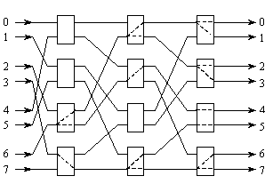 |

 

7.9试证明多级Omega网络采用不同大小构造块构造时所具有的下列特性：

（1） 一个k×k开关模块的合法状态（连接）数目等于kk。

（2） 试计算用2×2开关模块构造的64个输入端的Omega网络一次通过所能实现置换的百分比。

（3） 采用8×8开关模块构造64个输入端的Omega网络，重复（2）。

（4） 采用8×8开关模块构造512个输入端的Omega网络，重复（2）。

解：（1）一个k×k开关的合法状态或合法连接有：① 一个输入端连接一个输出端，即一对一的置换连接；② 一个输入端连接多个或全部输出端，即一对多的选播连接或一对全体的广播连接。

两个或两个以上的输入端连接一个输出端是非法连接。因此，某个输出端可被连接到任意一个输入端的连接有k种，无论这个输出端是被置换连接还是被播送连接。

|      |                                   |
| ---- | --------------------------------- |
|      |  |

k个输出端被连接到输入端的合法连接的数量为：

（2）用k×k开关模块构造N个输入端的Omega网络时，开关级数为n＝logkN，每级开关模块数为N/k，网络的开关模块总数为（N/k）logkN。

一个k×k开关一对一连接的合法状态只有k种，所有开关都是一对一连接的合法状态才能实现一种一次使用网络的无冲突置换连接。因此，由（N/k）logkN个k×k开关组成的Omega网络一次使用的无冲突置换连接函数为：

网络可以实现的置换连接数即为N个输出端的不同排序的排序数，即为N！，所以，Omega网使用一次实现的无冲突置换连接数占可以实现的置换连接数的比例为：

若采用2×2开关模块构造的64个输入端的Omega网络，即有k=2，N=64，则Omega网使用一次实现置换连接的比例为：

（3）若采用8×8开关模块构造64个输入端的Omega网络，即有k=8，N=64，则Omega网使用一次实现置换连接的比例为：

（4）若采用8×8开关模块构造512个输入端的Omega网络，即有k=8，N=512，则Omega网使用一次实现置换连接的比例为：

 

 

# ***\*第8章 多处理机\****

8.1 解释以下术语

集中式共享多处理机：也称为对称式共享存储器多处理SMP。它一般由几十个处理器构成，各处理器共享一个集中式的物理存储器，这个主存相对于各处理器的关系是对称的，

 

分布式共享多处理机：它的共享存储器分布在各台处理机中，每台处理机都带有自己的本地存储器，组成一个“处理机-存储器”单元。但是这些分布在各台处理机中的实际存储器又合在一起统一编址， 在逻辑上组成一个共享存储器。这些处理机存储器单元通过互连网络连接在一起 ，每台处理机除了能访问本地存储器外，还能通过互连网络直接访问在其他处理机存储器单元中的 “远程存储器”。

 

通信延迟：通信延迟＝发送开销＋跨越时间＋传输时间＋接收开销。

 

计算/通信比：反映并行程序性能的一个重要的度量。在并行计算中，每次数据通信要进行的计算与通信开销的比值。

 

多Cache一致性：多处理机中，当共享数据进入Cache，就可能出现多个处理器的Cache中都有同一存储器块的副本，要保证多个副本数据是一致的。

 

监听协议：每个Cache除了包含物理存储器中块的数据拷贝之外，也保存着各个块的共享状态信息。Cache通常连在共享存储器的总线上，各个Cache控制器通过监听总线来判断它们是否有总线上请求的数据块。

 

目录协议：用一种专用的存储器所记录的数据结构。它记录着可以进入Cache的每个数据块的访问状态、该块在各个处理器的共享状态以及是否修改过等信息。

 

写作废协议：在处理器对某个数据项进行写入之前，它拥有对该数据项的唯一的访问权。

 

写更新协议：当一个处理器对某数据项进行写入时，它把该新数据广播给所有其它Cache。这些Cache用该新数据对其中的副本进行更新。

 

栅栏同步：栅栏强制所有到达该栅栏的进程进行等待。直到全部的进程到达栅栏，然后释放全部进程，从而形成同步。

 

旋转锁：处理机环绕一个锁不停地旋转而请求获得该锁。

 

同时多线程：是一种在多流出、动态调度的处理器上同时开发线程级并行和指令级并行的技术，它是多线程技术的一种改进。

 

细粒度多线程技术：是一种实现多线程的技术。它在每条指令之间都能进行线程的切换，从而使得多个线程可以交替执行。通常以时间片轮转的方法实现这样的交替执行，在轮转的过程中跳过处于停顿的线程。

 

粗粒度多线程技术：是一种实现多线程的技术。只有线程发生较长时间的停顿时才切换到其他线程。

 

SMP：对称式共享存储器多处理

 

MPP ：即大规模并行处理，按照当前的标准，具有几百台～几千台处理机的任何机器都是大规模并行处理系统。

 

8.2 一个具有32台处理机的系统，对远程存储器访问时间是2000ns。除了通信以外，假设计算中的访问均命中局部存储器。当发出一个远程请求时，本地处理机挂起。处理机的时钟周期时间是10ns，假设指令基本的CPI为1.0（设所有访存均命中Cache）。对于下述两种情况：

（1） 没有远程访问；

（2） 0.5%的指令需要远程访问。

试问前者比后者快多少？

解：已知远程访问率 p = 0.5%，远程访问时间 t = 2000ns，时钟周期 T = 10ns

远程访问开销 C = t/T = 2000ns/10ns = 200（时钟周期数）

有 0.5%远程访问的机器的实际 CPI2 为：

  CPI2 = CPI1 + p×C = 1.0 + 0.5%×200 = 2.0

只有局部访问的机器的基本 CPI1 = 1.0

  CPI2/ CPI1 = 2.0/1.0 = 2（倍）

因此，没有远程访问状态下的机器速度是有0.5% 远程访问的机器速度的2 倍。

 

8.3 什么是多处理机的一致性？给出解决一致性的监听协议和目录协议的工作原理。

答：（1） 对多个处理器维护一致性的协议称为Cache一致性协议。   

（2）目录协议的工作原理：采用一个集中的数据结构——目录。对于存储器中的每一个可以调入Cache的数据块，在目录中设置一条目录项，用于记录该块的状态以及哪些Cache中有副本等相关信息。目录协议根据该项目中的信息以及当前要进行的访问操作，依次对相应的Cache发送控制消息，并完成对目录项信息的修改。此外，还要向请求处理器发送响应信息。

（3）监听协议的工作原理：每个Cache除了包含物理存储器中块的数据拷贝之外，也保存着各个块的共享状态信息。Cache通常连在共享存储器的总线上，当某个Cache需要访问存储器时，它会把请求放到总线上广播出去，其他各个Cache控制器通过监听总线来判断它们是否有总线上请求的数据块。如果有，就进行相应的操作。

 

8.4 在标准的栅栏同步中，设单个处理器的通过时间（包括更新计数和释放锁）为C，求N个处理器一起进行一次同步所需要的时间。

解：我们忽略读写锁的时间。N个处理器中的每一个都需要C个时钟周期来锁住与栅栏相关的计数器，修改它的值，然后释放锁。考虑最坏情况，所有N个处理器都要对计数器加锁并修改它的值，由于锁只能顺序访问计数器，在同一时间，只能有一个处理器修改计数器的数据。所以，总共要花NC个时钟周期使得所有的处理器都到达数据栅栏。

 

8.6 采用排队锁和fetch-and-increment重新实现栅栏同步，并将它们分别与采用旋转锁实现的栅栏同步进行性能比较。

解：fetch-and-increment(count)；

if (count=total){	//进程全部到达

count=0；	//重置计数器

release=1；	//释放进程

}

else{	//还有进程未到达

spin(release=1)；	//等待信号

}

当有N个处理器时，上述代码执行fetch-and-increment操作N次，当访问释放操作的时候，有N个Cache未命中。当最后一个处理器到达栅栏条件后，release被置为“1”，此时有N-1个Cache未命中（对于最后一个到达栅栏的处理器，当它读release的时候，将在主存中命中）。所以，共有3N-1次总线传输操作。如果有10个处理器，则共有29次总线传输操作，总共需要2900个时钟周期。

 

8.7 有些机器实现了专门的锁广播一致性协议，实现上可能使用不同的总线。假设使用写广播协议，重新给出例8.3旋转锁的时间计算。

解：当实现了专门的锁广播一致性协议后，每当一把锁被释放的时候，和锁相关的值将被广播到所有处理器，这意味着在处理器对锁变量进行读操作的时候，未命中的情况永远不会发生。

假定每个Cache都有一个数据块保留锁变量的初值。通过下表可以知道，10次上锁/释放锁的平均时间是550个时钟周期，总时间是5500个时钟周期。

| 事件                                        | 持续时间 |
| ------------------------------------------- | -------- |
| 所有处理器都读（命中）锁                    | 0        |
| 释放锁的处理器进行写（不命中）广播          | 100      |
| 读（命中）锁（处理器认为锁是空闲的）        | 0        |
| 一个处理器进行写交换广播，同时还有9个写广播 | 1000     |
| 一个处理器得到并释放锁的总时间              | 1100     |

 

 

 

# ***\*第9章 机群\****

9.1 解释下列术语

机群：是一种价格低廉、易于构建、可扩放性极强的并行计算机系统。它由多台同构或异构的独立计算机通过高性能网络或局域网互连在一起，协同完成特定的并行计算任务。从用户的角度来看，机群就是一个单一、集中的计算资源。

 

单一系统映象：包含四重含义。（1）单一系统。尽管系统中有多个处理器，用户仍然把整个机群视为一个单一的计算系统来使用。（2）单一控制。逻辑上，最终用户或系统用户使用的服务都来自机群中唯一一个位置。（3）对称性。用户可以从任一个结点上获得机群服务，也就是说，对于所有结点和所有用户，除了那些具有特定访问权限的服务与功能外，所有机群服务与功能都是对称的。（4）位置透明。用户不必了解真正提供服务的物理设备的具体位置。

 

高可用性机群：当系统中某些结点出现故障的情况下，仍能继续对外提供服务。它采用冗余机制，当系统中某个结点由于软、硬件故障而失效时，该结点上的任务将在最短的时间内被迁移到机群内另一个具有相同功能与结构的结点上继续执行。

 

负载均衡机群：机群能够根据系统中各个结点的负载情况实时地进行任务分配。它专门设置了一个重要的监控结点，负责监控其余每个工作结点的负载和状态，并根据监控结果将任务分派到不同的结点上。

 

高性能计算机群：通过高速的商用互连网络，将数十台乃至上千台PC机或工作站连接在一起，可以提供接近甚至超过传统并行计算机系统的计算能力，但其价格却仅是具有相同计算能力的传统并行计算机系统的几十分之一。

 

Beowulf机群：使用普通的硬件加上Linux操作系统、再加上GNU开发环境以及PVM/MPI共享库所构建的机群。它一方面集中了那些相对较小的机器的计算能力，能够以很高的性能价格比提供与大型机相当的性能，另一方面也保证了软件环境的稳定性。

 

9.2 机群系统有什么特点？

答：（1）系统开发周期短。由于机群系统大多采用商品化的PC机、工作站作为结点，并通过商用网络连接在一起，系统开发的重点在于通信子系统和并行编程环境上，这大大节省了研制时间。

（2）可靠性高。机群中的每个结点都是独立的PC机或工作站，某个结点的失效并不会影响其它结点的正常工作，而且它的任务还可以传递给其它结点完成，从而有效地避免由于单结点失效引起的系统可靠性降低的问题。

（3）可扩放性强。机群的计算能力随着结点数量的增加而增大。这主要是得益于机群结构的灵活性，由于结点之间以松耦合方式连接，机群的结点数量可以增加到成百上千。另外，机群系统的硬件容易扩充和替换，可以灵活配置。

（4）性能价格比高。由于生产批量小，传统并行计算机系统的价格均比较昂贵，往往要几百万到上千万美元。而机群的结点和网络都是商品化的计算机产品，能够大批量生产，成本相对较低，因而机群系统的性能价格比更好。与相同性能的传统并行计算机系统相比，机群的价格要低1～2个数量级。

（5） 用户编程方便。机群系统中，程序的并行化只是在原有的C、C++或Fortran串行程序中插入相应的通信原语，对原有串行程序的改动有限。用户仍然使用熟悉的编程环境，无需适用新的环境。

 

9.3 说明IBM SP2的体系结构特点。

答：SP2机群是异步的MIMD，具有分布式存储器系统结构。它的每个结点都是一台RS/6000工作站，带有自己的存储器和本地磁盘。结点中采用的处理器是一台6流出的超标量处理机，每个时钟周期可以执行6条指令。

SP2的结点数可以从2个到512个不等，每个结点配有一套完整的AIX操作系统（IBM的UNIX），结点间的互连网络接口是松散耦合的，通过结点本身的I/O微通道（MCC）接到网络上。

SP2的结点都有1个指令Cache，1个数据Cache，1个分支指令和转移控制部件，2个整数部件和2个浮点部件，但它们在存储器容量、数据宽度和I/O总线插槽个数上有所不同。

系统采用标准的工作站部件，仅在标准技术不能满足性能要求时才使用专用软件和硬件。

SP2的I/O系统基本上是围绕着HPS建立的，并可以用一个LAN网关同SP2系统外的其他计算机连接。

SP2中设置了一个专门的系统控制台用以管理整个系统，系统管理人员可以通过这个系统控制台从单一地点对整个系统进行管理。

 