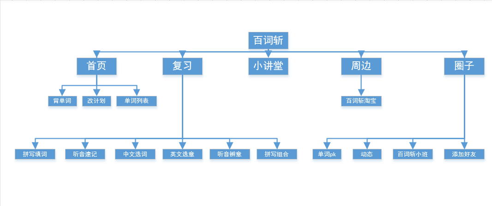

# baicizhan

> 图背单词

利用图形建立单词与真实环境的联系，摆脱死记硬背，让学习的过程更科学，更高效

>  海量词表

从小学到出国，从教材到高频词汇，满足你的不同需求；自定义词数，合理安排每日任务，让学习计划更加得心应手

> 单词全解

单词释义取自柯林斯、朗文等权威词典，有权威，更专业；地道的发音配合场景化的例句，真人讲解的单词TV，应有尽有，真正做到对单词的全方位记忆

> xin增加

单词讲解视频播放：比如杨亮讲英文

## 一、调研

### 1.第一次上手

####   第一次使用，可以使用微信和qq登录感觉挺不错的不然又要注册有点麻烦，在功能上，用户可以针对自身选择不同水平的英语背单词，然后有多钟方式对自己的听力和单词翻译进行提升。在ui设计上，界面较为简洁，功能显示也较为清晰。

### 2.bug查找

####    暂无发现bug，只发现了功能上的不足。

### 3.采访使用者感受、背景、需求

####   采访的使用者是软件工程专业的大四学生，正在准备考研，通过百词斩来记忆单词。他需求是能在快速记住单词，且软件要有足够多的生词，包括四六级，考研级别单词。在用过一段时间后他觉得百词斩这个软件挺好用的，他也在这个软件上背了很多单词。

### 4.用户的使用过程，是否解决了自身的问题

####   用户利用课余时间，睡前时间和读英语时间使用百词斩背单词记下了很多单词，解决了单词量问题。

### 5.软件在数据量/界面/功能/准确度上的优缺点

- 数据量：包括小学、初高中、四六级、英专、考研，以及出国的雅思托福的等单词。
- 界面：界面简洁干净，各个功能一览无余，易操作。
- 功能：可以对考级英语做出相应的计划，对单词的背诵有英文选意，中文选词，听音辨意等各种形式。可以进行单词pk。缺点：虽然说可以相互加为好友，但是却不能聊天。
- 准确度：单词的准确度不是很好，感觉有些单词的翻译没有全部显现出来，而且没有分为英式和美式的发音。

### 6.用户体验是否有什么问题

- 对于背诵过的单词我们可以在复习的功能里对他进行再次背诵加深，感觉挺不错的。   
- 那些在背单词过程中的错词系统会继续出现让您背诵，知道您正确为止。
- 对于单词pk这块，pk的单词都是从双方最近的背诵单词抽出来的，如果有一个人最近没背单词就只从另一个人那里抽，感觉pk不出真实水平，这点需要改进。
- 虽然说可以相互加为好友，但是却不能聊天。

### 7.用户对产品的改进意见

- 希望可以加个聊天功能，这样软件就更加有趣了。
- 没有往年的四六级考卷真题训练功能，我觉得单单背单词有点单调，应该要把单词结合到课文中来，那记忆更加深刻。

### 8.评价软件

####   总的来说，用起来的感觉还是不错的。单词的重复出现和各种背诵方式，有助于记忆单词，记得还是比较牢固的，但是功能不是很全。

　　**推荐度：一般。**

## 二、分析

### 1.百词斩单词的所有功能

- 首页：背单词，查询单词，单次列表（已学，未学，收藏，已斩），下载离线包，单词TV，单词电台。
- 复习：评测英语单词量，英文选意，中文选词，听音辨意，听音速记，拼写填空，拼写组合，全拼练习。
- 小讲堂：英语对话。
- 周边：百词斩旗舰店（淘宝）。
- 圈子：百词斩小班，单词pk，添加好友，动态，排行榜，兴趣圈，斩家活动

### 2.对比至少2款软件，分析这个软件目前的优劣

 

|          | **背单词功能**                           | **查询功能**                           | **界面功能**               | **特色功能**                           |
| -------- | ---------------------------------------- | -------------------------------------- | -------------------------- | -------------------------------------- |
| 百词斩   | 单词有配图更生动，计划容易改，听力背单词 | 简单的单词查询，不支持句子的查询和翻译 | 界面简洁，但是切换时间较长 | 有好友功能，单词都有配图，生动有趣     |
| 扇贝词典 | 单词背记的针对性更强                     | 简单的单词查询，不支持句子的查询和翻译 | 界面直接，直观，容易上手   | 生词会出现多天，能够有效的反复强化记忆 |
| 必应词典 | 该功能也较强，但是针对性较差             | 支持各种查询翻译，以及图片识别查询     | 界面内容丰富，结构清晰     | 功能多而强大，但是针对性相对较差       |

 

 

### 3.功能的逻辑框图

 

 

### 4.对用户体验、UI、核心功能打分

| 功能     | 评分（每项总分10分）                              |
| -------- | ------------------------------------------------- |
| 用户体验 | 单词量足，单词好记。 8分                          |
| UI界面   | 界面简洁。8分                                     |
| 核心功能 | 能满足背记单词的功能要求，但是功能不是很齐全；7分 |

## 三、建议和规划

### 1.如果你是项目经理，如何提高从而在竞争中胜出

####   做个市场调查，更具用户的对背单词app的期望写出相应的用户需求，用户的感受很重要。

#### 　　对于百词斩的建议：保持自身图文结合等多种背单词的功能的优势，添加自己所不足的功能，取长补短，增加四六级等考卷真题，在单词翻译的基础上增加句子翻译，增加听力训练部分（许多人在英语听力部分很差），增加添加附近好友和好友聊天功能（丰富用户生活，认识更多有兴趣学英语的人），

### 2.目前市场上有什么样的产品了

####   目前市场上的类似产品有乐词、扇贝、不背单词、开心词场等背单词软件，可以说是竞争力很大。

### 3.你要设计什么样的功能

1. 增加句子翻译功能。
2. 听力专门训练功能。
3. 添加陌生人功能，好友聊天功能

### 4.为何要做这些功能，而不是其他功能

　　前两个功能是用户比较需要的功能，后一个功能可以使这个软件更加有趣，总体来说让用户觉得我们软件的强大性，且更加有趣。

### 5.为什么用户会用你的产品/功能

####   让用户把背单词看成是一种兴趣游戏而不是当成一种责任，不要把被单词感受成是一种单调无味的事情。

#### 　　考虑到用户如何快速的记下单词，软件中的图文结合背诵等一系列背诵方式让你有多种选择，选择一种你认为可以快速背下单词的方法。

#### 　　在背诵一段时间后测一测你的词汇量让你更加有成就感。

　　**增加听力训练功能，句子翻译等功能，使软件有更多的功能，让用户只需要下载一个软件就具有多个软件的功能。**

 

### 6.你的创新在哪里? 请使用 NABCD 分析

- N（Needx 需求）

  ####   1、软件缺乏句子翻译功能；2、软件缺乏听力训练功能，且在单词读音上加个英式和美式读音；3、软件加个聊天功能会使软件更加有趣。

- A（Approach 做法）

  ####   针对各个需求，在软件上添加相应的功能。

- B（Benefit 好处）

  ####   使用户觉得这个让软件具有几个软件的功能。

- C（Competitors 竞争）

  ####   在保持自己原本优势的基础上，增加了几个功能，让自己的软件丰富多彩，让用户觉得软件的强大性。

- D（Delivery 支付）

  ####   在刚进入的那个页面上做一些广告推广。APP内部有自己的商城和收费视频教程，

### 7.如果你来领导这个团队，会有什么不一样

####   作为大学生，也是背单词软件的一个主要群体，我们可以更加清楚APP的需求，但是可能在功能的实现上和团队的配合上会比较艰难。

### 8.如果你的团队有5个人, 4个月的时间，你作为项目经理，应该如何配置角色（开发，测试，美工等等）

####   一个组长（总体架构，让组员可以合理分工，得具备前后台知识，收集用户需求）

　　**一个前端（界面的优化，提取用户输入的数据到后台，把后台发送的内容经处理显示在界面）**

　　**一个测试（对软件进行功能测试，时间上的测试，找出各种的bug，对界面也进行一系列的评价）**

　　**两个后台（在后台上对数据的处理，对功能进行完善，对数据库的设计）**